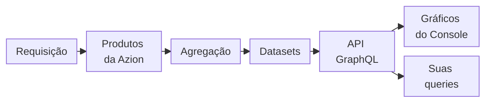

import DocButton from '~/components/webkit/DocButton.vue'
import DocCardGroup from '@aziontech/webkit/doc-card-group'
import DocCard from '@aziontech/webkit/doc-card'

Uma métrica é um número calculado a partir de muitas requisições em uma fatia de tempo, como uma contagem de requisições, uma soma de bytes ou a parcela do conteúdo servida do cache. Um dashboard de métricas plota esses números como gráficos, um ponto por minuto, hora ou dia, para que você veja como o tráfego muda sem ler cada requisição. Um log é a visão oposta: um registro por requisição, com os detalhes dela.

**Real-Time Metrics** agrega as métricas que os produtos da Azion que servem o seu tráfego geram e as mostra como gráficos no [Azion Console](https://console.azion.com/) e pela [API GraphQL](/pt-br/documentacao/devtools/graphql/). É um produto de Observe que não cria nada na sua conta e não precisa ser ativado: ele está ativo em todas as contas, e os gráficos dele acompanham o seu tráfego em poucos minutos. Use Real-Time Metrics para quantificar requisições e dados transferidos, ver a banda que o cache economiza e verificar a disponibilidade e a performance do seu conteúdo por meio de status codes e tempos de requisição. Use-o também para encontrar ameaças de segurança e bots, contar invocações de funções e consultas DNS, investigar uma queda ou um pico e comparar um período com outro.

<DocButton href="/pt-br/documentacao/plataforma/real-time-metrics/primeiros-passos/" label="Primeiros passos" size="medium" />
<DocButton href="/pt-br/documentacao/plataforma/real-time-metrics/dashboards-build/" label="Dashboards de Build" kind="secondary" size="medium" />

---

## Query de métricas

Todo gráfico é a resposta a uma query GraphQL. Esta query lê o total de requisições e o total de dados transferidos de todas as aplicações da conta:

```graphql
query TrafficLast24Hours($begin: DateTime!, $end: DateTime!) {
  httpMetrics(
    limit: 1
    filter: { tsRange: { begin: $begin, end: $end } }
  ) {
    requestsTotal
    dataTransferredTotal
  }
}
```

- `httpMetrics` é o dataset, as métricas agregadas das requisições que as suas aplicações servem. Cada tipo de tráfego tem o próprio dataset.
- `tsRange` define o período com `begin` e `end`. Toda query precisa carregar um intervalo de tempo, ou a API responde `400`.
- `requestsTotal` e `dataTransferredTotal` são campos calculados: cada um guarda um total para o intervalo inteiro. `dataTransferredTotal` está em bytes, a soma dos dados transferidos na entrada e na saída.
- A query não agrupa por nenhum campo, então a API retorna uma linha que guarda os totais.

Enviada a `https://api.azion.com/v4/metrics/graphql` com um personal token e as variáveis `{"begin": "2026-01-01T12:00:00", "end": "2026-01-02T12:00:00"}`, a query responde `200`:

```json
{
  "data": {
    "httpMetrics": [
      {
        "requestsTotal": 1985,
        "dataTransferredTotal": 149684815.0
      }
    ]
  }
}
```

A linha traz os totais de todas as aplicações da conta nessas 24 horas. Se você conhece GraphQL, você conhece o modelo de query: qualquer cliente GraphQL que envia uma requisição `POST` com um token lê os mesmos números que os gráficos do Console. Para enviar esta query com `curl` e restringi-la a um host, consulte [Primeiros passos com Real-Time Metrics](/pt-br/documentacao/plataforma/real-time-metrics/primeiros-passos/). Para todos os campos de cada dataset, consulte [Campos da API GraphQL do Real-Time Metrics](/pt-br/documentacao/devtools/graphql/campos-gql-real-time-metrics/).

---

## Do tráfego ao gráfico

Real-Time Metrics não coleta nada que você configura. Ele lê o que os produtos que servem o seu tráfego já registram, depois que a Azion agrega esses registros.



1. Um cliente envia uma requisição, e o produto que a processa, como uma aplicação ou o WAF, a registra como um evento.
2. A Azion agrega os eventos em métricas por bucket de tempo, como uma contagem de requisições ou uma soma de bytes. A agregação leva até 10 minutos, então os pontos mais recentes de um gráfico ainda podem subir.
3. As métricas são armazenadas em datasets, um por tipo de tráfego, como `httpMetrics` para as requisições das suas aplicações.
4. A API GraphQL em `https://api.azion.com/v4/metrics/graphql` responde a queries sobre esses datasets.
5. Cada gráfico no Azion Console envia uma query a essa mesma API, então um gráfico e uma query que você escreve leem os mesmos números.
6. As suas próprias queries, e os dashboards do Grafana, leem os mesmos datasets pela API.

Para o caminho de uma requisição, o tamanho de cada ponto e como a contagem difere da de Billing, consulte [Como Real-Time Metrics funciona](/pt-br/documentacao/plataforma/real-time-metrics/como-funciona/).

---

## Seus próprios gráficos

A API GraphQL que todo gráfico do Console consulta também é o caminho para gráficos próprios. Você pode agrupar, filtrar ou estender a query de um gráfico para um intervalo que o gráfico não desenha, e plotar o resultado onde escolher.

- **A partir de um gráfico**: **Copy query**, no menu de um gráfico, copia a query e as variáveis exatas que o gráfico envia. Para executar o texto copiado, consulte [Copy query](/pt-br/documentacao/plataforma/real-time-metrics/filtros-e-intervalo-de-tempo/#copy-query).
- **A partir de um guia**: queries completas para [detalhar requisições por status code](/pt-br/documentacao/guias/plataforma/observabilidade/detalhar-requisicoes-por-status-code/), [medir o offload de cache de um domínio](/pt-br/documentacao/guias/plataforma/observabilidade/medir-offload-de-cache/), [encontrar as principais origens de ameaças do WAF](/pt-br/documentacao/guias/plataforma/observabilidade/encontrar-principais-origens-de-ameacas-waf/) e [consultar o dataset httpBreakdownMetrics](/pt-br/documentacao/guias/plataforma/observabilidade/consultar-dados-httpbreakdownmetrics-com-graphql/). Offload de cache é a parcela do conteúdo que a Azion entrega sem buscá-lo na sua origem.
- **No Grafana**: o plugin de data source da Azion consulta Real-Time Metrics a partir de uma instância local do Grafana que permite plugins não assinados. Para configurá-lo, consulte [Instale o plugin da Azion para Grafana](/pt-br/documentacao/guias/plataforma/observabilidade/integrar-grafana/). Depois, [importe o dashboard pré-configurado do Grafana](/pt-br/documentacao/guias/plataforma/observabilidade/azion-plugin-grafana-dash-pre-configurado/) ou [crie um dashboard personalizado no Grafana](/pt-br/documentacao/guias/plataforma/observabilidade/azion-plugin-grafana/). Dois dashboards também são distribuídos como JSON: [Importe o dashboard Data Transferred](/pt-br/documentacao/guias/plataforma/observabilidade/data-transferred-dash/) e [Importe o dashboard Real-Time Metrics](/pt-br/documentacao/guias/plataforma/observabilidade/metrics-dash/).

---

## Escopo e limites

- **Interfaces**: você lê Real-Time Metrics na página **Real-Time Metrics** do Azion Console, no grupo **Observe** do menu, e pela API GraphQL com um [personal token](/pt-br/documentacao/guias/plataforma/conta-e-billing/personal-tokens/). Para a estrutura da API, consulte a [visão geral da API GraphQL](/pt-br/documentacao/devtools/graphql/visao-geral/). Grafana lê os dados pelo plugin da Azion. Azion CLI não tem comando de métricas, e Terraform não tem nada para gerenciar, porque Real-Time Metrics não cria nenhum objeto.
- **Dashboards**: Azion Console agrupa os dashboards em três categorias, **Build**, **Secure** e **Observe**, cada uma com uma aba por produto. **Build** reúne [Applications](/pt-br/documentacao/plataforma/applications/), [Tiered Cache](/pt-br/documentacao/plataforma/applications/cache/tiered-cache/), [Functions](/pt-br/documentacao/plataforma/functions/) e [Image Processor](/pt-br/documentacao/plataforma/applications/#image-processor), descritos em [Dashboards de Build](/pt-br/documentacao/plataforma/real-time-metrics/dashboards-build/). **Secure** reúne [WAF](/pt-br/documentacao/plataforma/firewall/#waf), [Edge DNS](/pt-br/documentacao/plataforma/edge-dns/), [Bot Manager](/pt-br/documentacao/plataforma/firewall/#bot-manager) e **Threats Breakdown**, descritos em [Dashboards de Secure](/pt-br/documentacao/plataforma/real-time-metrics/dashboards-secure/). **Observe** reúne [Data Stream](/pt-br/documentacao/plataforma/data-stream/), descrito em [Dashboards de Observe](/pt-br/documentacao/plataforma/real-time-metrics/dashboards-observe/). O dashboard de um produto mostra dados somente depois que esse produto está ativo na sua conta.
- **Controles**: um intervalo de tempo e um conjunto de filtros se aplicam a todos os gráficos de um dashboard. O intervalo começa em **Last 5 minutes** e alcança no máximo 730 dias para trás, sem datas futuras. Os filtros restringem os gráficos por um campo, como um host, ou por uma query digitada. O menu de um gráfico copia a query dele ou exporta os pontos dele como um arquivo CSV. Para todos os controles, consulte [Filtros e intervalo de tempo](/pt-br/documentacao/plataforma/real-time-metrics/filtros-e-intervalo-de-tempo/), e para as tarefas, consulte [Filtre um dashboard de Real-Time Metrics](/pt-br/documentacao/guias/plataforma/observabilidade/adicionar-filtros-metrics/) e [Exporte os dados e a query de um gráfico](/pt-br/documentacao/guias/plataforma/observabilidade/analisar-metricas/).
- **Dados**: todo valor é agregado, nunca uma única requisição, e uma métrica leva até 10 minutos para ser agregada. Cada ponto cobre um minuto, uma hora ou um dia, conforme a duração do intervalo. Para o intervalo em que cada tamanho se aplica, consulte [Resolução](/pt-br/documentacao/plataforma/real-time-metrics/como-funciona/#resolucao).
- **Retenção e limites**: a maioria dos datasets guarda 2 anos de dados. Uma query retorna no máximo 10.000 linhas e seleciona no máximo 37 campos. Para cada limite e a resposta quando ele é ultrapassado, consulte [Limites de Real-Time Metrics](/pt-br/documentacao/plataforma/real-time-metrics/limites/).
- **Cobrança**: Real-Time Metrics está incluído na plataforma sem custo adicional, como informa [Preços](/pt-br/documentacao/fundamentos/precos/#real-time-metrics). Ele conta cada evento uma vez ou nenhuma, então os totais dele podem diferir dos de Billing, em média por menos de 1%. Quando os dois diferem, Billing é a referência. Para as duas abordagens de contagem, consulte [Contagem e Billing](/pt-br/documentacao/plataforma/real-time-metrics/como-funciona/#contagem-e-billing).
- **Logs e experiência do usuário**: Real-Time Metrics mostra totais, não as requisições por trás deles. As requisições individuais, os logs, estão em [Real-Time Events](/pt-br/documentacao/plataforma/real-time-events/). Para enviar os logs a um destino fora da Azion, use Data Stream. Para medir a experiência dos seus usuários reais, use [Edge Pulse](/pt-br/documentacao/plataforma/edge-pulse/), um produto de Real User Monitoring (RUM).
- **Ajuda**: [Boas práticas para Real-Time Metrics](/pt-br/documentacao/plataforma/real-time-metrics/boas-praticas/) mostra qual intervalo escolher e em qual fonte confiar para um número. [Solucionar problemas de Real-Time Metrics](/pt-br/documentacao/plataforma/real-time-metrics/solucao-de-problemas/) cobre um gráfico vazio, um último ponto que cai ou totais que diferem dos de Billing. O [glossário](/pt-br/documentacao/plataforma/real-time-metrics/glossario/) define termos como offload, dataset e resolução.

---

## Próximos passos

<DocCardGroup cols={2}>
  <DocCard title="Primeiros passos" href="/pt-br/documentacao/plataforma/real-time-metrics/primeiros-passos/" label="Leia as requisições e os dados transferidos das suas aplicações no Console ou com uma query." />
  <DocCard title="Dashboards de Build" href="/pt-br/documentacao/plataforma/real-time-metrics/dashboards-build/" label="Descubra o que cada gráfico de Applications mede e o campo que o retorna." />
  <DocCard title="Como funciona" href="/pt-br/documentacao/plataforma/real-time-metrics/como-funciona/" label="Acompanhe uma requisição até ela virar um ponto em um gráfico." />
  <DocCard title="Guias e tutoriais" href="/pt-br/documentacao/plataforma/real-time-metrics/guias/" label="Conclua uma tarefa específica, de uma divisão por status code a um dashboard do Grafana." />
</DocCardGroup>
