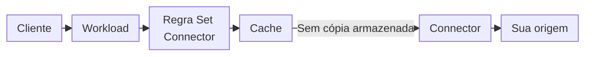

import DocButton from '~/components/webkit/DocButton.vue'
import DocCardGroup from '@aziontech/webkit/doc-card-group'
import DocCard from '@aziontech/webkit/doc-card'

Um proxy reverso responde aos clientes em nome de um servidor que você opera, chamado de origem. Quando o proxy não consegue responder com o que já guarda, ele abre a própria conexão com a origem e encaminha a requisição. Nessa conexão, ele decide como endereçar a origem: o hostname no header `Host`, o caminho, o protocolo e a porta. Os clientes nunca se conectam à origem, então você pode mover ou proteger a origem sem nenhuma mudança do lado do cliente.

**Connectors** é o recurso da plataforma que guarda essas decisões na Azion. Um connector é um objeto próprio: ele armazena o endereço da sua origem e as configurações que moldam cada requisição a ela, e uma regra em uma [aplicação](/pt-br/documentacao/plataforma/applications/) envia requisições a ele com o behavior _Set Connector_. Várias aplicações podem reutilizar um connector, então as configurações de conexão de uma origem ficam em um só lugar. Use Connectors para enviar tráfego a um servidor em cloud ou a um servidor no seu data center, servir objetos de um bucket do Object Storage, distribuir requisições entre vários servidores, impedir que os clientes alcancem a sua origem diretamente ou entregar uma transmissão ao vivo.

<DocButton href="/pt-br/documentacao/plataforma/connectors/primeiros-passos/" label="Primeiros passos" size="medium" />
<DocButton href="/pt-br/documentacao/plataforma/connectors/configuracoes/" label="Configurações de connector" kind="secondary" size="medium" />

---

## Objeto connector

Um connector é um objeto JSON. Este corpo cria um connector do tipo `http` que envia requisições a `httpbin.org` por HTTPS:

```json
{
  "name": "my-connector",
  "type": "http",
  "attributes": {
    "addresses": [{ "address": "httpbin.org" }],
    "connection_options": {
      "transport_policy": "force_https",
      "host": "httpbin.org"
    }
  }
}
```

- `type` define o que o connector alcança: `http` para um servidor que você opera, `storage` para um bucket do Object Storage ou `live_ingest` para uma transmissão ao vivo.
- `addresses` lista os servidores de origem, cada um deles um hostname ou um endereço IP, sem protocolo e sem porta. Todo endereço usa as portas `80` e `443`, a menos que você defina outras.
- `connection_options` molda cada requisição à origem. Aqui, `force_https` conecta somente por HTTPS, e `host` envia à origem o próprio nome dela em vez do hostname que o cliente requisitou, que é o padrão `${host}`.
- Toda chave omitida recebe o seu padrão, e Load Balancer e Origin Shield ficam desativados.

Enviado a `POST /v4/workspace/connectors`, este corpo responde `202` com `"state": "pending"` e o objeto completo, com todos os padrões preenchidos. Se você conhece um upstream de outro proxy, um connector é esse objeto, armazenado separado das regras que enviam tráfego a ele. Para cada campo e o padrão dele, consulte [Configurações de connector](/pt-br/documentacao/plataforma/connectors/configuracoes/#objeto-connector).

---

## Caminho da requisição

Criar um connector não envia tráfego a ele. Um connector recebe requisições somente de uma regra de aplicação que o nomeia, e a própria aplicação serve somente os hostnames de um [workload](/pt-br/documentacao/plataforma/workloads/) cujo deployment nomeia essa aplicação.



1. Um cliente requisita um hostname de um workload, e o deployment do workload entrega a requisição à aplicação.
2. A aplicação executa as regras da Request Phase dela em ordem. Uma regra correspondente com o behavior _Set Connector_ nomeia um connector.
3. Quando uma configuração de cache se aplica e há uma cópia válida armazenada, a Azion responde do cache, e a requisição nunca chega ao connector.
4. Caso contrário, o connector abre uma conexão com o endereço dele e envia a requisição com o header `Host`, o prefixo de caminho e o protocolo dele.
5. A origem responde ao connector, a aplicação executa as regras da Response Phase dela e o cliente recebe a resposta.

Uma regra nomeia o connector pelo ID dele, então toda regra que o nomeia, em qualquer aplicação, acompanha uma mudança no connector sem uma edição própria. A dependência também vale no sentido inverso: a API recusa excluir um connector que uma regra ainda nomeia. Para cada etapa do caminho, consulte [Como Connectors funciona](/pt-br/documentacao/plataforma/connectors/como-funciona/). Para uma requisição que falha ao longo dele, consulte [Solucionar problemas de Connectors](/pt-br/documentacao/plataforma/connectors/solucao-de-problemas/).

---

## Recursos

Load Balancer e Origin Shield agem sobre um connector do tipo `http` quando você os ativa no connector. Live Ingest age por meio de um connector de tipo próprio, `live_ingest`.

### Load Balancer

Load Balancer distribui as requisições de um connector entre até 15 endereços, para que o seu conteúdo continue disponível quando um servidor de origem falha e nenhum servidor sozinho carregue toda a carga. Um método de balanceamento, _Round Robin_, _Least Connections_ ou _IP Hash_, escolhe o endereço de cada requisição, e o peso e a função do servidor de cada endereço moldam essa escolha. As regras que nomeiam o connector continuam decidindo quais requisições são balanceadas.

Para saber como cada método escolhe um endereço, consulte [Métodos de balanceamento](/pt-br/documentacao/plataforma/connectors/load-balancer/metodos-de-balanceamento/), e para ativá-lo no seu primeiro connector, consulte [Primeiros passos com Load Balancer](/pt-br/documentacao/plataforma/connectors/load-balancer/primeiros-passos/).

### Origin Shield

Origin Shield protege a origem de um connector do tipo `http` de duas formas. Com Origin IP ACL, o firewall da sua origem aceita somente os prefixos IPv4 e IPv6 da network list `Azion Origin Shield`, um perímetro nas camadas 3 e 4 que recusa toda conexão de outra fonte. Com HMAC, o connector assina cada requisição com as credenciais de um provedor de armazenamento compatível com S3, para que um bucket privado a responda. Ative-o quando os clientes não devem alcançar a sua origem diretamente ou quando a origem serve somente requisições assinadas.

Para saber como cada defesa funciona e como a lista é atualizada, consulte [Origin IP ACL e HMAC](/pt-br/documentacao/plataforma/connectors/origin-shield/origin-ip-acl-e-hmac/). Para servir um bucket privado por meio de um connector assinado, consulte [Assine requisições de origem com HMAC](/pt-br/documentacao/guias/desenvolvimento-de-aplicacoes/primeiros-passos/assine-requisicoes-de-origem-com-hmac/).

### Live Ingest

Live Ingest recebe uma transmissão ao vivo que o seu encoder envia por RTMP, na região de um connector do tipo `live_ingest`, e a converte para HLS. Uma aplicação então entrega a transmissão aos espectadores por meio desse connector. Use-o para eventos ao vivo, partidas de e-sports e transmissões educacionais.

Para saber como a transmissão chega à Azion e aos espectadores, consulte [Ingestão e entrega](/pt-br/documentacao/plataforma/connectors/live-ingest/ingestao-e-entrega/).

---

## Escopo e limites

- **Tipos de connector**: um connector do tipo `http` alcança servidores que você opera por hostname ou endereço IP, como um servidor em cloud, um servidor no seu data center ou um endpoint compatível com S3. Ele é o único tipo com endereços, opções de conexão, Load Balancer e Origin Shield. Um connector do tipo `storage` lê um bucket do [Object Storage](/pt-br/documentacao/plataforma/object-storage/) na sua conta, restrito a um prefixo, e um connector do tipo `live_ingest` recebe uma transmissão ao vivo em uma de cinco regiões. Azion Console oferece os três como os cards de **Connector Type** _HTTP_, _Object Storage_ e _Live Ingest_. Para os campos de cada um, consulte [Configurações de connector](/pt-br/documentacao/plataforma/connectors/configuracoes/#geral).
- **Interfaces**: você cria e gerencia connectors na página **Connectors** do [Azion Console](https://console.azion.com/), pela [Azion API](https://api.azion.com/) em `/v4/workspace/connectors` e com o recurso `azion_connector` do [Terraform](/pt-br/documentacao/devtools/terraform/connectors/). [Azion CLI](/pt-br/documentacao/devtools/cli/) não recebe uma flag por configuração: `azion create connector --type http --file my-connector.json` lê o corpo JSON de um arquivo e imprime `Created Connector with ID <connector-id>`.
- **Limites**: um connector guarda um endereço, ou até 15 com Load Balancer ativado, e o `name` dele aceita de 1 a 255 caracteres. Para cada limite e o erro quando ele é ultrapassado, consulte [Limites de Connectors](/pt-br/documentacao/plataforma/connectors/limites/).
- **Timeouts**: um connector sem Load Balancer não tem timeout configurável e segue os padrões da plataforma listados em [Como Connectors funciona](/pt-br/documentacao/plataforma/connectors/como-funciona/#reutilizacao-de-conexoes-e-timeouts). Com Load Balancer ativado, o timeout de conexão, o timeout de leitura e escrita e as novas tentativas em uma falha de conexão passam a ser configurações.
- **Precedência de regras**: quando várias regras correspondentes carregam o behavior _Set Connector_, somente a última é executada. Uma aplicação pode, portanto, enviar `/images/` a um connector do tipo `storage` e todos os outros caminhos a um connector do tipo `http`. Para escrever as regras, consulte [Rules Engine para Applications](/pt-br/documentacao/plataforma/applications/rules-engine/).
- **Propagação**: uma mudança em um connector entra em vigor sem outro deployment e chega à infraestrutura distribuída da Azion em vários minutos, com os data centers aplicando-a em momentos diferentes. Até lá, as requisições podem encontrar as configurações antigas ou as novas. Para saber como planejar uma mudança levando isso em conta, consulte [Boas práticas de Connectors](/pt-br/documentacao/plataforma/connectors/boas-praticas/).
- **Testes**: um connector recebe somente as requisições das regras que o nomeiam. Uma regra que corresponde a um caminho envia somente esse caminho ao connector que você está testando, enquanto todos os outros caminhos mantêm a origem atual, como mostra [Primeiros passos com Connectors](/pt-br/documentacao/plataforma/connectors/primeiros-passos/).
- **Balanceamento no DNS**: Load Balancer escolhe entre os endereços de um connector depois que a requisição chega à Azion. Registros DNS ponderados que dividem o tráfego entre endereços IP no momento da resolução pertencem ao [Edge DNS](/pt-br/documentacao/plataforma/edge-dns/), como mostra [Faça balanceamento de carga entre registros DNS](/pt-br/documentacao/guias/seguranca-de-aplicacoes/dns/balanceamento-de-carga-dns/).
- **Redução de carga na origem**: Origin Shield protege a origem com uma allowlist e com a assinatura de requisições. Uma segunda camada de cache entre o cache da Azion e a sua origem, que reduz as requisições que chegam a ela, é o [Tiered Cache](/pt-br/documentacao/plataforma/applications/cache/tiered-cache/), ativado por configuração de cache da aplicação.
- **SNI Check**: em uma requisição HTTPS, a Azion compara o hostname que o cliente requisita com os nomes que o certificado do workload cobre e responde `421 Misdirected Request` quando o certificado não consegue cobri-lo. Para as etapas da decisão, consulte [SNI Check](/pt-br/documentacao/plataforma/connectors/sni-check/).
- **API v4**: na API v3, as origens de uma aplicação cumpriam o papel de um connector, e Connectors as substitui na API v4. Para uma conta que ainda roda a API v3, consulte [Origins](/pt-br/documentacao/plataforma/connectors/origins/), e para o mapeamento entre os dois modelos, consulte [Migração para API v4](/pt-br/documentacao/fundamentos/api-v4-migration/).
- **Observabilidade**: [Data Stream](/pt-br/documentacao/plataforma/data-stream/) registra o trecho de origem de cada requisição nas variáveis `$upstream_*`, como `$upstream_status`, o status code HTTP da origem, e `$upstream_response_time`, o tempo para receber a resposta da origem. Uma resposta servida do cache carrega `-` nas duas.
- **Cobrança**: todo plano inclui Single Origin, um connector com um endereço. Load Balancer é cobrado por Data Transfer, Origin Shield por Shielded Connectors e Live Ingest por Data Ingestion. Para as quantidades que cada plano inclui, consulte [Limites de Connectors](/pt-br/documentacao/plataforma/connectors/limites/), e para as tarifas, consulte [Preços](/pt-br/documentacao/fundamentos/precos/).
- **Termos**: o [glossário de Connectors](/pt-br/documentacao/plataforma/connectors/glossario/) define as palavras às quais estas páginas dão um significado específico, como endereço, função do servidor, prefixo de caminho e Single Origin.

---

## Próximos passos

<DocCardGroup cols={2}>
  <DocCard title="Primeiros passos" href="/pt-br/documentacao/plataforma/connectors/primeiros-passos/" label="Crie um connector, envie um caminho a ele com uma regra e verifique a resposta." />
  <DocCard title="Como funciona" href="/pt-br/documentacao/plataforma/connectors/como-funciona/" label="Acompanhe uma requisição de uma regra pelo connector até a sua origem." />
  <DocCard title="Configurações de connector" href="/pt-br/documentacao/plataforma/connectors/configuracoes/" label="Consulte um campo, o padrão dele ou os valores que ele aceita." />
  <DocCard title="Guias e tutoriais" href="/pt-br/documentacao/plataforma/connectors/guias/" label="Conclua uma tarefa específica, de um bucket como origem ao header Host." />
</DocCardGroup>
