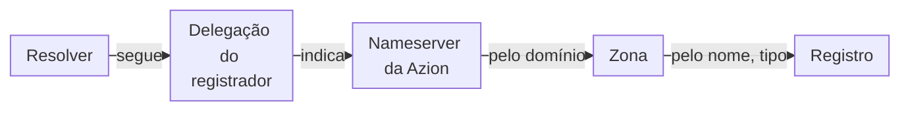

import DocButton from '~/components/webkit/DocButton.vue';
import DocCardGroup from '@aziontech/webkit/doc-card-group'
import DocCard from '@aziontech/webkit/doc-card'

Todo domínio na internet depende de um serviço [DNS](https://www.azion.com/pt-br/learning/dns/o-que-e-dns/) autoritativo: os nameservers que guardam os registros do domínio e dão a resposta final sobre eles. Um navegador ou um servidor de e-mail não pergunta diretamente a esses nameservers. O resolver dele, o servidor DNS que faz as consultas por ele, segue a delegação do domínio a partir do registry e pergunta a um deles. Com um serviço hospedado, você escreve os registros, e o provedor opera os nameservers que respondem.

**Edge DNS** hospeda uma zona para cada um dos seus domínios e responde às consultas pelos registros da zona a partir da infraestrutura distribuída da Azion. Três nameservers, `ns1.aziondns.net`, `ns2.aziondns.com` e `ns3.aziondns.org`, servem todas as zonas, e um domínio chega a eles assim que o registrador do domínio o delega aos três. Edge DNS é apenas autoritativo, não um resolver, então seus usuários mantêm os próprios resolvers enquanto você gerencia registros em vez de um software de nameserver. Use Edge DNS para apontar domínios e subdomínios para os seus servidores, receber e-mails, verificar a propriedade de um domínio, restringir os emissores de certificados ou dividir o tráfego por peso.

<DocButton href="/pt-br/documentacao/plataforma/edge-dns/primeiros-passos/" label="Primeiros passos" size="medium" />
<DocButton href="/pt-br/documentacao/plataforma/edge-dns/guias/" label="Guias de Edge DNS" kind="secondary" size="medium" />

---

## Zonas e registros

Uma zona contém um domínio, como `example.com`, e todos os registros que o Edge DNS responde por ele. Um registro associa um nome dentro da zona a um tipo e a um ou mais valores. Este corpo de requisição, enviado como um `POST` para `/v4/workspace/dns/zones/<zone-id>/records`, adiciona um registro que responde `192.0.2.1` para `www.example.com`:

```json
{
  "name": "www",
  "type": "A",
  "rdata": ["192.0.2.1"],
  "ttl": 3600
}
```

- `name` é escrito em relação à zona. `www` responde por `www.example.com`, `@` nomeia o apex, o domínio raiz `example.com`, e um rótulo `*` cria um wildcard.
- `type` é um dos 11 tipos de registro que o Edge DNS hospeda. `A` associa o nome a um endereço IPv4.
- `rdata` carrega as respostas, chamadas de **Value** no Azion Console. Um registro A guarda até 10 endereços.
- `ttl` define por quantos segundos um resolver pode manter a resposta em cache. Um registro enviado sem TTL recebe `3600`.

O drawer **Create Record** do Console e `azion create dns-record` recebem os mesmos quatro campos. Um registro carrega o que uma linha de um arquivo de zona padrão carrega, então, se você já editou um arquivo de zona, já conhece o modelo de registro. Cada campo e o valor padrão dele estão em [Zonas e registros](/pt-br/documentacao/plataforma/edge-dns/zonas-e-registros/), e o vocabulário da seção está no [Glossário](/pt-br/documentacao/plataforma/edge-dns/glossario/). Para criar uma zona em qualquer interface, consulte [Crie, edite ou exclua uma zona](/pt-br/documentacao/guias/seguranca-de-aplicacoes/dns/edge-dns-definir-main-settings/).

---

## Caminho da resolução

Criar uma zona não faz a internet perguntar à Azion sobre o domínio. As consultas só chegam a uma zona pela delegação que o registrador do domínio publica.



1. No registrador, você delega o domínio aos três nameservers do Edge DNS. Até a delegação ser publicada, os resolvers públicos não encontram nenhum caminho até a Azion.
2. Um resolver que procura `www.example.com` segue a delegação e envia a consulta a um dos três nameservers.
3. O nameserver seleciona a zona cujo domínio corresponde à consulta e, em seguida, o registro cujo nome e cujo tipo correspondem.
4. O nameserver retorna os valores do registro como uma resposta autoritativa, e o resolver mantém essa resposta em cache pelo TTL do registro.

Você pode criar e verificar uma zona antes da etapa 1. Uma consulta enviada diretamente a `ns1.aziondns.net` retorna o que a zona responde, enquanto os resolvers públicos ainda seguem a delegação atual do domínio. Para enviar essa consulta, consulte [Consulte uma zona com o dig](/pt-br/documentacao/guias/seguranca-de-aplicacoes/dns/executar-o-comando-dig/). Para saber como o cache atrasa uma alteração, como os registros com política *Weighted* e os registros ANAME respondem e como o DNSSEC assina uma zona, consulte [Como o Edge DNS funciona](/pt-br/documentacao/plataforma/edge-dns/como-funciona/).

---

## Escopo e limites

- **Tipos de registro**: uma zona contém 11 tipos: A, AAAA, ANAME, CAA, CNAME, DS, MX, NS, PTR, SRV e TXT. A API recusa qualquer outro tipo, como `SOA`. Cada tipo, o formato do valor dele e a RFC dele estão em [Tipos de registro](/pt-br/documentacao/plataforma/edge-dns/tipos-de-registro/).
- **Políticas**: um registro *Simple* responde com todos os seus valores. Registros *Weighted* compartilham um nome e um tipo, e cada um é respondido em proporção ao seu peso, de 0 a 255. Consulte [Políticas de registro](/pt-br/documentacao/plataforma/edge-dns/como-funciona/#politicas-de-registro).
- **Apex**: um CNAME é recusado em `@`. Um registro ANAME aponta o apex para um hostname sob `azioncdn.net`, `azionedge.net` ou `azionedge.com`, com um TTL de `20`. Consulte [Aponte um domínio raiz com ANAME](/pt-br/documentacao/guias/seguranca-de-aplicacoes/dns/acessar-root-domain/).
- **DNSSEC**: você mesmo ativa o DNSSEC em uma zona, no Console, na CLI ou na API. A Azion assina a zona e gera os valores DS que você adiciona no seu registrador. Consulte [DNSSEC](/pt-br/documentacao/plataforma/edge-dns/dnssec/).
- **Nameservers**: os mesmos três nameservers servem todas as zonas e são somente leitura. Delegue o domínio aos três. Consulte [Nameservers e SOA](/pt-br/documentacao/plataforma/edge-dns/zonas-e-registros/#nameservers-e-soa).
- **Propagação**: um registro salvo não precisa de nenhuma etapa de deployment, e um nome novo que ninguém consultou antes de ele existir responde em segundos. Uma alteração em um registro existente pode levar alguns minutos para chegar a todos os nameservers. Um nome consultado antes de existir recebe a resposta `NXDOMAIN` por até uma hora, o mínimo do SOA. Consulte [Cache e propagação](/pt-br/documentacao/plataforma/edge-dns/como-funciona/#cache-e-propagacao) e [Boas práticas para Edge DNS](/pt-br/documentacao/plataforma/edge-dns/boas-praticas/).
- **Interfaces**: você gerencia zonas e registros pelo [Azion Console](https://console.azion.com/), pela [Azion CLI](/pt-br/documentacao/devtools/cli/), pela [Azion API](https://api.azion.com/) e pelo [provider Terraform da Azion](/pt-br/documentacao/devtools/terraform/dns/).
- **Observabilidade**: o gráfico **Total Queries** do [dashboard Edge DNS do Real-Time Metrics](/pt-br/documentacao/plataforma/real-time-metrics/dashboards-secure/#edge-dns) conta as consultas que as suas zonas recebem. [Real-Time Events](/pt-br/documentacao/plataforma/real-time-events/fontes-de-dados/#edge-dns) mantém uma entrada por consulta, e a [API GraphQL](/pt-br/documentacao/devtools/graphql/recursos/#datasets) retorna os dados agregados ou brutos.
- **Limites**: o nome de uma zona tem de 1 a 50 caracteres, e um valor TXT, até 1.000. Um registro A, AAAA ou MX guarda até 10 valores. Todos os limites estão em [Limites de Edge DNS](/pt-br/documentacao/plataforma/edge-dns/limites/).
- **Cobrança**: o Edge DNS é cobrado por duas métricas: Zones, a média diária de zonas ativas em um ciclo mensal, e Queries, as consultas DNS que ele processa. As quantidades que cada plano inclui estão em [Uso incluído por plano](/pt-br/documentacao/plataforma/edge-dns/limites/#uso-incluido-por-plano), e os preços em [Preços](/pt-br/documentacao/fundamentos/precos/#edge-dns).
- **Segurança**: o serviço de DNS também é protegido pelo [DDoS Protection](/pt-br/documentacao/plataforma/workloads/ddos-protection/ddos-mitigation/) da Azion, e os ataques que ele mitiga incluem DNS flood, mesmo de consultas bem formadas.
- **Termos**: o domínio continua registrado no seu registrador, onde você altera os nameservers dele e o renova, e você mantém corretos as zonas e os registros dele. A Azion pode remover zonas que não estão em uso. Consulte os [Termos de Serviço](/pt-br/documentacao/contratos/tds/).

Quando uma zona não responde como esperado, consulte [Solucionar problemas de Edge DNS](/pt-br/documentacao/plataforma/edge-dns/solucao-de-problemas/).

---

## Próximos passos

<DocCardGroup cols={2}>
  <DocCard title="Primeiros passos" href="/pt-br/documentacao/plataforma/edge-dns/primeiros-passos/" label="Hospede uma zona e consulte o primeiro registro dela." />
  <DocCard title="Como o Edge DNS funciona" href="/pt-br/documentacao/plataforma/edge-dns/como-funciona/" label="Siga uma consulta e veja por que uma alteração demora a ser respondida." />
  <DocCard title="Migre nameservers para a Azion" href="/pt-br/documentacao/guias/plataforma/migracao/migrar-ns-para-a-azion/" label="Mova o DNS de um domínio que está em outro provedor." />
  <DocCard title="Guias de Edge DNS" href="/pt-br/documentacao/plataforma/edge-dns/guias/" label="Conclua uma tarefa, como adicionar registros MX, TXT ou CAA." />
</DocCardGroup>
