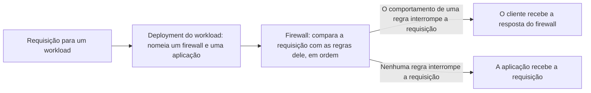

import DocButton from '~/components/webkit/DocButton.vue'
import DocCardGroup from '@aziontech/webkit/doc-card-group'
import DocCard from '@aziontech/webkit/doc-card'

Um firewall para tráfego web é um ponto de controle entre os clientes na internet e uma aplicação. Ele lê cada requisição antes da aplicação: o endereço de onde ela vem, o caminho que ela pede e os headers que ela envia. Ele compara o que lê com condições que você escreve, e uma requisição que atende a uma delas recebe a ação associada a essa condição, como uma recusa. Todas as outras requisições chegam à aplicação sem alteração, então a aplicação nunca processa o tráfego que o ponto de controle recusa.

**Firewall** é o recurso da plataforma que executa esse ponto de controle na infraestrutura distribuída da Azion, perto do cliente, na frente de cada [workload](/pt-br/documentacao/plataforma/workloads/) que o vincula. Um firewall guarda uma lista ordenada de regras, e uma requisição que uma regra interrompe nunca chega à sua [aplicação](/pt-br/documentacao/plataforma/applications/) nem à origem dela. Use Firewall para negar um caminho, bloquear endereços ou países, aplicar um rate limit a um cliente, recusar requisições que carregam um ataque ou distinguir scripts de pessoas.

<DocButton href="/pt-br/documentacao/plataforma/firewall/primeiros-passos/" label="Primeiros passos" size="medium" />
<DocButton href="/pt-br/documentacao/plataforma/firewall/rules-engine/" label="Referência do Firewall" kind="secondary" size="medium" />

---

## Estrutura da regra

Um firewall age por meio das regras dele. Cada regra combina critérios, que selecionam requisições, com comportamentos, que agem sobre as requisições selecionadas. Esta regra nega toda requisição cujo caminho começa com `/deny-test`, enviada como corpo de `POST /v4/workspace/firewalls/<firewall-id>/request_rules`:

```json
{
  "name": "Deny the test path",
  "active": true,
  "criteria": [
    [
      {
        "variable": "${request_uri}",
        "conditional": "if",
        "operator": "starts_with",
        "argument": "/deny-test"
      }
    ]
  ],
  "behaviors": [
    { "type": "deny" }
  ]
}
```

- `criteria` guarda blocos de condições. O primeiro critério de um bloco abre com `if`, e cada critério seguinte se junta a ele com `and` ou `or`. Aqui, `${request_uri}` com `starts_with` corresponde a `/deny-test` e a todo caminho que começa com ele, como `/deny-test/page`.
- `behaviors` lista o que a regra faz com uma requisição que corresponde a ela. `deny` responde `403` com a página de erro padrão da Azion, e nenhuma regra posterior é executada para essa requisição.
- `name` e `active` são campos da própria regra. A API acrescenta `order`, a posição da regra na lista do firewall, na ordem em que as regras são criadas.
- Azion Console monta a mesma regra na aba **Rules Engine** do firewall, a partir de _Request Uri_, _starts with_ e _Deny (403 Forbidden)_.

Se você já escreveu regras de firewall como uma condição e uma ação, o modelo se mantém: os critérios são a condição, e os comportamentos são a ação.

---

## Caminho da requisição

Criar um firewall não protege nada. Um firewall não tem domínio próprio: ele inspeciona as requisições de cada workload cujo deployment o nomeia, e nenhuma requisição enquanto nenhum deployment o nomear.



1. Um workload responde no domínio dele, e o deployment dele nomeia um firewall e uma aplicação. No Azion Console, o vínculo é o campo **Firewall** de **Deployment Settings**. A API o carrega como `strategy.attributes.firewall`, e `azion create workload-deployment` o recebe como `--firewall-id`.
2. Cada requisição para o workload chega ao firewall antes da aplicação.
3. O firewall compara os critérios de cada regra com a requisição, em ordem. Uma regra cujos critérios não correspondem não executa nada.
4. Uma regra cujos critérios correspondem executa os comportamentos dela. Um comportamento que interrompe a requisição, como uma negação, responde ao cliente, e nenhuma regra posterior é executada.
5. Uma requisição que nenhuma regra interrompe chega à aplicação, que nunca vê uma requisição que uma regra interrompeu.

Um firewall pode atender aos deployments de vários workloads, e uma mudança nas regras dele chega a todos eles. Nenhum tempo de propagação é garantido. Uma regra nova alcança o tráfego de 6 min 29 s a 9 min 18 s depois de salva. Um workload recém-vinculado a um firewall aplica a primeira regra de 5 min 12 s a 22 minutos depois do vínculo. Até uma mudança se estabilizar, as respostas alternam entre o estado anterior e o novo, então envie a requisição de novo até ela responder como esperado. Para a ordem das regras, o que cada comportamento retorna e todos os tempos de propagação, consulte [Como Firewall funciona](/pt-br/documentacao/plataforma/firewall/como-funciona/).

---

## Recursos

Um firewall pode executar três produtos, e cada um age somente sobre as requisições que uma regra entrega a ele.

### WAF

Web Application Firewall (WAF) é o [firewall de aplicação web](https://www.azion.com/pt-br/learning/websec/o-que-e-firewall-aplicacao-web/) que um firewall executa: na camada 7, a camada de aplicação, ele pontua cada requisição que um comportamento _Set WAF_ entrega a ele contra oito famílias de ameaças. Ative-o para recusar requisições que carregam ameaças do [OWASP Top 10](https://www.azion.com/pt-br/learning/websec/o-que-e-a-lista-owasp-top-10-de-ataques-ciberneticos-em-aplicacoes-web/) e outras, como SQL injection, cross-site scripting e remote file inclusion. WAF vem desativado em um firewall novo, e você o ativa em **Main Settings** › **Modules**.

Para saber como WAF pontua uma requisição e quais campos o ajustam, consulte [Score e modos](/pt-br/documentacao/plataforma/firewall/waf/score-e-modos/), [Rule sets](/pt-br/documentacao/plataforma/firewall/waf/rule-sets/) e [Exceções](/pt-br/documentacao/plataforma/firewall/waf/custom-allowed-rules/), e para recusar a sua primeira requisição com WAF, consulte [Primeiros passos com WAF](/pt-br/documentacao/plataforma/firewall/waf/primeiros-passos/).

### Network Shield

Network Shield acrescenta o critério _Network_, `${network}` na API, que compara o endereço do cliente de uma requisição com uma lista de endereços IP e intervalos CIDR, de Autonomous System Numbers (ASNs) ou de países. Use-o para bloquear endereços sabidamente maliciosos, restringir o acesso por país, permitir somente as suas próprias redes, aplicar um rate limit a um conjunto de clientes ou bloquear exit nodes Tor. Network Shield vem ativado em um firewall novo.

Para saber como uma lista corresponde ao endereço do cliente e quais tipos de lista existem, consulte [Correspondência de listas](/pt-br/documentacao/plataforma/firewall/network-shield/correspondencia-de-listas/) e [Network Lists](/pt-br/documentacao/plataforma/firewall/network-shield/network-lists/), e para negar o seu próprio endereço em um caminho de teste, consulte [Primeiros passos com Network Shield](/pt-br/documentacao/plataforma/firewall/network-shield/primeiros-passos/).

### Bot Manager

Bot Manager pontua cada requisição que uma regra de firewall entrega a ele em busca de sinais de automação, e executa a ação que você configura quando o score atinge o seu limite. Ative-o quando automação, como credential stuffing, varredura de vulnerabilidades, scraping de estoque ou abuso de checkout, chega a uma aplicação que também atende pessoas. Bot Manager não tem interruptor em **Modules**: ele é executado como uma instância de função que um comportamento _Run Function_ invoca, então o firewall precisa do interruptor **Functions** ativado.

Para saber como Bot Manager calcula um score, como configurá-lo e o que o report log registra, consulte [Score de bots](/pt-br/documentacao/plataforma/firewall/bot-manager/score-de-bots/), [Argumentos](/pt-br/documentacao/plataforma/firewall/bot-manager/argumentos/), [Logs](/pt-br/documentacao/plataforma/firewall/bot-manager/logs/) e [Bot Manager Lite](/pt-br/documentacao/plataforma/firewall/bot-manager/bot-manager-lite/), e para pontuar a sua primeira requisição, consulte [Primeiros passos com Bot Manager](/pt-br/documentacao/plataforma/firewall/bot-manager/primeiros-passos/).

---

## Escopo e limites

- **Regras nativas**: sem nenhum produto ativado, uma regra corresponde a requisições por _Host_, _Request Uri_, _Scheme_, _Ssl Verification Status_ e _Client Certificate Validation_. Ela pode negar, descartar, aplicar um rate limit ou responder à requisição com uma resposta personalizada. Para cada critério, operador e comportamento, consulte [Rules Engine para Firewall](/pt-br/documentacao/plataforma/firewall/rules-engine/#criterios).
- **Respostas**: _Deny (403 Forbidden)_ responde `403` com a página de erro padrão da Azion, e _Drop (Close Without Response)_ não envia nenhuma resposta HTTP. _Set Rate Limit_ libera as requisições na taxa configurada e responde `429` somente a requisições simultâneas além do burst dele, e um bloqueio do WAF responde `400`.
- **Functions**: um firewall executa JavaScript, incluindo a sua própria lógica de proteção, por meio de uma [instância de função](/pt-br/documentacao/plataforma/firewall/functions-instances/) que um comportamento _Run Function_ invoca. A função declara o ambiente de execução `firewall`, e ela pode negar, descartar ou responder à requisição, ou adicionar headers de requisição e de resposta. Você a escreve em [Functions](/pt-br/documentacao/plataforma/functions/) ou a instala pelo Azion Marketplace. **Functions** vem ativado em um firewall criado pela API, pela CLI ou pela página **Create Firewall**. Para o evento e os métodos dele, consulte [Functions no Firewall](/pt-br/documentacao/plataforma/firewall/functions/), e para código funcional, consulte [Functions em um firewall](/pt-br/documentacao/plataforma/functions/general-firewall-example/).
- **Marketplace**: [Radware Bot Manager](/pt-br/documentacao/guias/desenvolvimento-de-aplicacoes/integracoes/radware-bot-manager/) e [DataDome Bot Protection](/pt-br/documentacao/guias/desenvolvimento-de-aplicacoes/integracoes/datadome-bot-protection/) são instalados pelo Azion Marketplace como funções de firewall, com assinaturas próprias.
- **Proteção contra DDoS**: [DDoS Protection](/pt-br/documentacao/plataforma/workloads/#ddos-protection) mitiga ataques de negação de serviço (DoS) e de negação de serviço distribuída (DDoS) em todas as contas, sem configuração. O interruptor **DDoS Protection Unmetered** do firewall carrega a tag **Automatically enabled in all accounts** e não pode ser desativado.
- **Workloads**: o deployment de um workload nomeia um firewall, e um firewall pode atender a vários workloads. Uma regra pertence ao firewall em que foi criada. **Clone**, uma ação de linha da lista **Firewalls** no Azion Console, inicia um firewall como cópia de outro, incluindo as instâncias de função e as regras dele. Para saber quando compartilhar um firewall, consulte [Boas práticas de Firewall](/pt-br/documentacao/plataforma/firewall/boas-praticas/).
- **Interfaces**: você cria e gerencia firewalls na página **Firewalls** do [Azion Console](https://console.azion.com) e pela [Azion API](https://api.azion.com/), em `/v4/workspace/firewalls`. [Azion CLI](/pt-br/documentacao/devtools/cli/) gerencia os firewalls com comandos como `azion create firewall` e `azion create firewall-rule`. `azion.config.js` declara um firewall e as regras dele para que Azion CLI os crie, como mostra [Vincule um rule set no azion.config.js](/pt-br/documentacao/guias/seguranca-de-aplicacoes/firewall-e-waf/binding-no-arquivo-de-config/). A instalação de uma função pelo Azion Marketplace é feita no Azion Console.
- **Observabilidade**: nenhum header de resposta nomeia o firewall ou a regra que decidiu. Toda resposta carrega um header `x-azion-request-id`, que a página de erro padrão da Azion repete. Com a configuração **Debug Rules** do firewall ativada, [Real-Time Events](/pt-br/documentacao/plataforma/real-time-events/) e [Data Stream](/pt-br/documentacao/plataforma/data-stream/) mostram as regras que uma requisição executou, no campo `$traceback`. A configuração vem desativada por padrão.
- **Limites**: uma regra carrega de 1 a 5 blocos de 1 a 10 critérios cada, e os argumentos de uma instância de função guardam até 100.000 bytes. Para cada limite, a resposta quando ele é ultrapassado e os limites de WAF, Network Shield e Bot Manager, consulte [Limites de Firewall](/pt-br/documentacao/plataforma/firewall/limites/).
- **Cobrança**: Firewall é cobrado por requisições e por regras. Cada plano inclui uma quantidade de ambos, como 10 regras por firewall no Hobby e 20 no Pro, e o uso além dela é cobrado. Para os valores, consulte [Preços](/pt-br/documentacao/fundamentos/precos/#firewall).
- **Termos**: o [glossário de Firewall](/pt-br/documentacao/plataforma/firewall/glossario/) define as palavras às quais as páginas de Firewall dão um significado específico, como critério, comportamento, rule set, network list e limite.

---

## Próximos passos

<DocCardGroup cols={2}>
  <DocCard title="Primeiros passos" href="/pt-br/documentacao/plataforma/firewall/primeiros-passos/" label="Negue a sua primeira requisição em um caminho." />
  <DocCard title="Como funciona" href="/pt-br/documentacao/plataforma/firewall/como-funciona/" label="Acompanhe uma requisição por um firewall e veja onde cada produto age sobre ela." />
  <DocCard title="Rules Engine para Firewall" href="/pt-br/documentacao/plataforma/firewall/rules-engine/" label="Consulte um critério, um operador ou um comportamento." />
  <DocCard title="Guias e tutoriais" href="/pt-br/documentacao/plataforma/firewall/guias/" label="Conclua uma tarefa específica, de um bloqueio por país a uma exceção do WAF." />
  <DocCard title="Limites" href="/pt-br/documentacao/plataforma/firewall/limites/" label="Consulte um limite, a resposta quando ele é ultrapassado ou o que um plano inclui." />
  <DocCard title="Solução de problemas" href="/pt-br/documentacao/plataforma/firewall/solucao-de-problemas/" label="Encontre a causa quando uma regra não age ou recusa uma requisição que não deveria recusar." />
</DocCardGroup>
