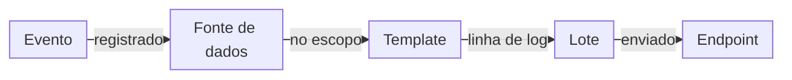
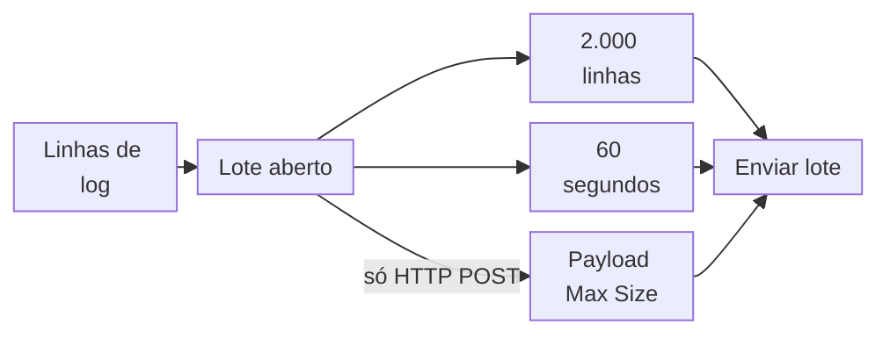
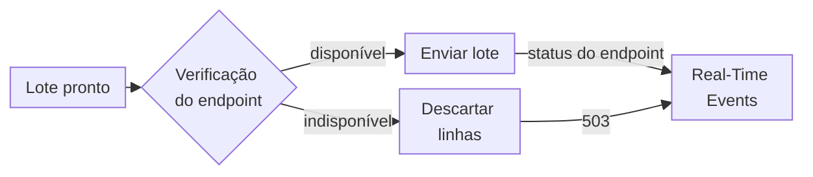

import FrameBox from '@aziontech/webkit/frame-box'
import ItemList from '@aziontech/webkit/item-list'
import DocItem from '@aziontech/webkit/doc-item'

Um stream de logs envia registros para uma plataforma que você opera, em vez de esperar que você os peça. Cada vez que algo acontece no seu tráfego ou na sua conta, um registro é gravado, agrupado com outros registros e entregue em um lote. Os registros chegam segundos a minutos depois dos eventos, e a cópia na sua plataforma é tão completa quanto a disponibilidade da sua plataforma permitiu.

O [Data Stream](/pt-br/documentacao/plataforma/data-stream/) faz isso com um stream. Um stream lê os eventos de uma fonte de dados e renderiza cada evento como uma linha de log com um template. Ele agrupa as linhas em lotes e envia cada lote para um endpoint, como um SIEM, uma plataforma de big data ou uma plataforma de processamento de streams. Os campos de cada parte estão em [Configurações do stream](/pt-br/documentacao/plataforma/data-stream/configuracoes-do-stream/). Para criar seu primeiro stream, consulte [Primeiros passos do Data Stream](/pt-br/documentacao/plataforma/data-stream/primeiros-passos/).

As seções seguem um evento até o endpoint: o pipeline, sampling e filtros de workloads, lotes e entrega, disponibilidade do endpoint e falhas, ativação e alterações, e registros de entrega e métricas.

---

## O pipeline de um evento até um endpoint

Um stream é um pipeline de mão única: a Azion envia linhas de log para o seu endpoint, e cada evento que o stream coleta se torna uma linha de log. Cada stream tem uma fonte de dados, um template e um endpoint. Por isso, enviar os mesmos eventos para duas plataformas, ou os eventos de duas fontes de dados para uma plataforma, exige dois streams.

Este diagrama segue um evento até ele chegar ao endpoint:



1. Algo acontece. Uma requisição chega a uma das suas [aplicações](/pt-br/documentacao/plataforma/applications/), uma [função](/pt-br/documentacao/plataforma/functions/) grava uma mensagem de log, o WAF analisa uma requisição, ou um usuário altera a conta no Azion Console.
2. A fonte de dados registra o evento. Um stream lê uma de quatro: *Activity History*, *Applications*, *Functions* ou *WAF Events*, e cada uma oferece suas próprias variáveis, listadas em [Fontes de dados e variáveis](/pt-br/documentacao/plataforma/data-stream/fontes-de-dados-e-variaveis/). O stream mantém apenas os eventos dentro do seu escopo, definido por sampling ou por um filtro de workloads.
3. O template renderiza o evento como uma linha de log. O data set do template associa cada chave da linha a uma variável, como `"status": "$status"`. O stream substitui cada variável pelo valor do evento. O Data Stream usa codificação ASCII, o que evita problemas de parser e dados mal interpretados no endpoint.
4. O stream adiciona a linha de log a um lote, que fecha com 2.000 linhas de log ou depois de 60 segundos, o que ocorrer primeiro. [Lotes e entrega](#lotes-e-entrega) traz as exceções.
5. O stream envia o lote para o seu endpoint. O Console chama o campo do endpoint de **Connector**, e os 11 tipos dele estão listados em [Endpoints](/pt-br/documentacao/plataforma/data-stream/endpoints/).

O stream se autentica no endpoint com a credencial que o tipo de endpoint recebe. Por exemplo, com *Google BigQuery*, você fornece uma chave de service account, e o Data Stream faz a autenticação Google OAuth 2.0 e gera os JSON Web Tokens. Para o formato do template, consulte [Templates e payload](/pt-br/documentacao/plataforma/data-stream/templates-e-payload/).

A alternativa a um stream é ler os eventos onde a Azion os mantém. O [Real-Time Events](/pt-br/documentacao/plataforma/real-time-events/) responde a consultas sobre os eventos brutos dos seus produtos, e os mantém por 7 dias, e os eventos de *Activity History* por 2 anos. Um stream copia os eventos para a sua própria plataforma, onde as suas ferramentas decidem por quanto tempo eles ficam e como são analisados. O custo é o uso que o Data Stream cobra, em Requests e Data Transfer, conforme listado em [Preços](/pt-br/documentacao/fundamentos/precos/#data-stream).

---

## Sampling e filtros de workloads

Uma conta pode produzir muito mais eventos do que uma plataforma precisa. O escopo de um stream decide quais deles ele coleta. Todo stream tem um escopo: uma taxa de sampling sobre todos os workloads, ou um filtro de [workloads](/pt-br/documentacao/plataforma/workloads/) escolhidos. Um stream sem nenhum dos dois é recusado quando você o salva.

No Azion Console, a **Option** da seção **Transform** escolhe o escopo:

- *All Current and Future Workloads* cobre todos os workloads da conta, inclusive os workloads criados depois, e mostra **Sampling**. Com o sampling ligado, o Data Stream coleta eventos aleatoriamente conforme a porcentagem que você define. Uma taxa de `100` coleta todos os eventos. O Console informa que a porcentagem de sampling é estatística e não absolutamente precisa.
- *Filter Workloads* coleta os eventos dos workloads que você escolhe. Um stream pode coletar os eventos de um único workload ou de vários.

Os dois escopos custam coisas diferentes. O sampling acompanha todo workload que você adiciona depois, sem nenhuma edição no stream. Salvar um stream ativo com sampling, em qualquer taxa, inclusive `100`, desativa todos os outros streams da conta, e a API não retorna erro. O Console avisa antes de salvar e acrescenta esta frase: `When multiple Data Streams have different sampling rates, the system uses the lowest percentage.` Um filtro de workloads mantém os outros streams ativos, então vários streams podem rodar ao mesmo tempo. O custo é a manutenção: um workload criado depois não é coletado até que você o adicione ao filtro.

Por exemplo, os eventos de *Activity History* pertencem à conta, e não a um workload, então um stream de *Activity History* usa sampling. Salvar esse stream ativo desativa todos os outros streams da conta, inclusive os streams de *Applications*.

O escopo deixa de fora os eventos de outros workloads, a parcela que o sampling ignora e os eventos das outras fontes de dados. Uma requisição servida do cache ainda produz um evento de *Applications*, com `$upstream_status` e as variáveis de tempo do upstream definidos como `-`. Uma requisição que o WAF bloqueou ainda produz um evento de *WAF Events*, com `$blocked` definido como `1`. Para os limites da taxa e do filtro, consulte [Configurações do stream](/pt-br/documentacao/plataforma/data-stream/configuracoes-do-stream/#transform).

---

## Lotes e entrega

Enviar cada linha de log separadamente custaria ao endpoint um envio por evento. Em vez disso, o Data Stream agrupa as linhas de log de um stream em um lote e envia o lote quando o primeiro dos seus gatilhos dispara. Um lote fecha com 2.000 linhas de log ou depois de 60 segundos. Em um endpoint *Standard HTTP/HTTPS POST*, um lote também fecha quando atinge o **Payload Max Size**, em bytes. Um endpoint *AWS Kinesis Data Firehose* recebe, em vez disso, lotes de 500 linhas de log ou 60 segundos.

Este diagrama mostra os gatilhos que fecham um lote:



1. Cada linha de log que o template renderiza entra no lote aberto do stream.
2. Quando o lote tem 2.000 linhas de log, o stream o envia.
3. Quando 60 segundos passam antes disso, o stream envia o lote com as linhas que ele tem.
4. Em um endpoint *Standard HTTP/HTTPS POST*, um lote que atinge o **Payload Max Size** é enviado nesse tamanho, mesmo que nenhum dos outros gatilhos tenha disparado.
5. O lote vai para o endpoint em um envio. Um endpoint *Simple Storage Service (S3)* recebe um objeto por lote.

Por exemplo, um stream movimentado que chega a 2.000 linhas de log em 13 segundos envia o lote nesse momento. Um stream com pouco tráfego envia as linhas que tem quando os 60 segundos passam, mesmo que seja uma única linha de log. O nome do objeto junta o **Object Key Prefix**, uma `/`, o horário como `YYYY/MM/DD/hh/mm/` e um ID único, como `activity/2026/01/01/12/02/11111111-…`.

Os lotes trocam atraso por menos envios. Um lote de 2.000 linhas de log chega ao endpoint em um único envio. Uma linha de log de um stream com pouco tráfego, porém, pode esperar até 60 segundos antes que o lote dela saia. Uma linha de log não chega ao endpoint no momento em que o evento dela acontece. Nenhum campo de um stream altera a contagem de 2.000 linhas ou o intervalo de 60 segundos. O **Payload Max Size** de um endpoint *Standard HTTP/HTTPS POST* apenas fecha um lote mais cedo. Para o tempo de entrega e os outros limites, consulte [Limites de Data Stream](/pt-br/documentacao/plataforma/data-stream/limites/#limites-padrao).

---

## Disponibilidade do endpoint e falhas

Um envio para um endpoint que não pode recebê-lo custa caro, então o Data Stream verifica cada endpoint antes de enviar. A verificação roda uma vez por minuto e marca o endpoint como disponível ou indisponível. Um endpoint só está disponível quando todos os servidores da Azion o reportam como disponível. Basta um servidor reportá-lo como indisponível para interromper os envios.

Este diagrama mostra o que acontece com um lote depois da verificação:



1. Uma vez por minuto, o Data Stream verifica cada endpoint e mantém o resultado até a próxima verificação.
2. Quando o endpoint está disponível, o stream envia o lote, e o endpoint responde com o próprio status HTTP.
3. Quando o endpoint está indisponível, o Data Stream não envia para ele e descarta as linhas de log daquele intervalo.
4. O Real-Time Events registra cada envio com o status que o endpoint retornou, e registra um lote descartado com `503`.
5. No minuto seguinte, uma verificação roda de novo. Quando ela marca o endpoint como disponível, o stream envia os lotes que se formam a partir de então.

A entrega não é garantida. As linhas de log descartadas nunca chegam ao endpoint, e um envio que o endpoint responde com um erro é registrado com o próprio status do endpoint. Por exemplo, quando uma URL que não aceita `POST` responde `405`, nenhum envio posterior repete as linhas de log desse lote. Quando um endpoint HTTP POST passa na verificação, mas não recebe o lote dentro do timeout de envio, o envio termina com `504`. O timeout está listado em [Limites de Data Stream](/pt-br/documentacao/plataforma/data-stream/limites/#limites-padrao).

Uma credencial sem uma permissão pode tornar o endpoint indisponível. Uma credencial do [Object Storage](/pt-br/documentacao/plataforma/object-storage/) da Azion sem `listAllBucketNames` e `listBuckets` tem todos os envios registrados com `503`, e nada chega ao bucket. O Real-Time Events registra um envio desses assim:

```json
{"ts":"2026-01-01T11:57:00Z","endpointType":"S3","statusCode":503,"streamedLines":2,"dataStreamed":2797}
```

Depois que você adiciona as duas capabilities, o lote entregue seguinte leva apenas as linhas de log dos eventos que vêm depois. As linhas dos lotes com `503` não são entregues. Para a credencial, consulte [Endpoints](/pt-br/documentacao/plataforma/data-stream/endpoints/#azion-object-storage).

Para limitar o que uma indisponibilidade custa, mantenha o endpoint acessível e acompanhe `statusCode` no Real-Time Events, procurando `503` e erros do endpoint. O Real-Time Events mantém os eventos brutos dos seus produtos por 7 dias, e os eventos de *Activity History* por 2 anos. Durante esse período, você pode consultar ali os eventos de um intervalo perdido, nos campos que o Real-Time Events registra, e não no seu template.

---

## Ativação e alterações

Um stream não tem etapa de deployment. Quando você seleciona **Save** no Azion Console, ou a API aceita um `POST` ou `PATCH`, o stream armazena suas configurações. Um stream ativo então começa a coletar assim que a alteração entra em vigor. O switch **Active** e o campo `active` ligam ou desligam um stream. Um stream inativo mantém suas configurações e não envia nada.

Uma mudança de estado ativo entra em vigor depois de um a dois minutos, e durante essa janela o stream que estava ativo continua enviando. Por exemplo, depois que você ativa um stream com sampling, os outros streams da conta podem continuar enviando durante essa janela, enquanto a API já os lista como inativos. Outras edições também levam alguns minutos para se propagar. Considere essa janela antes de avaliar uma alteração pelo que o endpoint recebe. Um stream que você desliga pode continuar enviando por um ou dois minutos. Os logs também levam um pouco de tempo para aparecer no Real-Time Events depois que um stream fica ativo.

Salvar um stream verifica o formato dos seus campos, não o endpoint. A API aceita uma credencial errada ou uma URL inacessível, e o problema aparece apenas como envios com falha no Real-Time Events. Leia os primeiros registros de entrega depois de salvar, não a resposta do salvamento. Para alterar, parar ou excluir um stream, consulte [Edite, pare ou exclua um stream](/pt-br/documentacao/guias/plataforma/observabilidade/deletar-data-stream/).

---

## Registros de entrega e métricas

Um stream reporta sobre si mesmo nos produtos de Observe. Cada envio deixa um registro no Real-Time Events, e os totais de todos os envios chegam ao Real-Time Metrics. Use o registro para ver o que aconteceu com um lote, e os totais para acompanhar o volume que um stream entrega ao longo do tempo.

O [Real-Time Events](/pt-br/documentacao/plataforma/real-time-events/fontes-de-dados/#data-stream) registra cada envio no dataset `dataStreamedEvents` da sua API GraphQL. Além do horário em `ts`, um registro traz `endpointType`, que indica o tipo de endpoint, e o status HTTP em `statusCode`. Ele também traz as linhas de log em `streamedLines`, os bytes em `dataStreamed` e o destino em `url`. Um envio recusado ou descartado é registrado como um entregue, então um envio que falhou aparece com um status diferente de `200`. Para todos os campos, consulte [Campos GraphQL do Real-Time Events](/pt-br/documentacao/devtools/graphql/campos-gql-real-time-events/#datastreamedevents-data-stream).

A aba **Data Stream** dos [dashboards de Observe do Real-Time Metrics](/pt-br/documentacao/plataforma/real-time-metrics/dashboards-observe/#data-stream) soma os mesmos envios. **Total Data Streamed** soma os bytes que os streams da conta enviaram, e **Total Requests** soma as linhas de log deles. Os totais cobrem períodos mais longos que os registros brutos, mas não mostram o status de um único lote. Os dois leem o dataset `dataStreamedMetrics`, que a [API GraphQL](/pt-br/documentacao/devtools/graphql/visao-geral/) também serve.

O uso que o Data Stream cobra é uma terceira visão, lida dos dados de consumo da conta. Para obtê-lo, consulte [Consulte dados de uso do Data Stream](/pt-br/documentacao/guias/plataforma/observabilidade/consultar-dados-de-uso-data-stream-com-graphql/).

---

## Recursos relacionados

<FrameBox>
<ItemList>
  <DocItem title="Configurações do stream" href="/pt-br/documentacao/plataforma/data-stream/configuracoes-do-stream/">Todos os campos de um stream, da fonte de dados ao endpoint, com seus valores e padrões.</DocItem>
  <DocItem title="Primeiros passos do Data Stream" href="/pt-br/documentacao/plataforma/data-stream/primeiros-passos/">Crie um stream que envia eventos de Activity History para um bucket e confirme a entrega.</DocItem>
  <DocItem title="Limites de Data Stream" href="/pt-br/documentacao/plataforma/data-stream/limites/">Os tamanhos de lote, o tempo de entrega, o timeout de envio e os limites de cada campo.</DocItem>
  <DocItem title="Solucionar problemas de Data Stream" href="/pt-br/documentacao/plataforma/data-stream/solucao-de-problemas/">O que verificar quando um stream não envia nada, ou quando o endpoint responde com um erro.</DocItem>
</ItemList>
</FrameBox>
