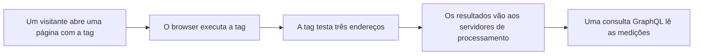

import FrameBox from '@aziontech/webkit/frame-box'
import ItemList from '@aziontech/webkit/item-list'
import DocItem from '@aziontech/webkit/doc-item'

Entregar uma página não diz nada sobre como foi carregá-la. Essa experiência pertence a um dispositivo: o browser que resolveu o nome, abriu a conexão e esperou pelos bytes. A rede em que o visitante estava, a rota que a requisição percorreu e o tempo que o visitante passou esperando são conhecidos ali e em nenhum outro lugar. Uma medição feita em qualquer ponto do caminho descreve outra coisa.

[Edge Pulse](/pt-br/documentacao/plataforma/edge-pulse/) mede de dentro desse browser. Você adiciona uma tag JavaScript às páginas que quer monitorar. A tag roda no browser de um visitante real, executa um teste e envia o resultado para a Azion.

Esta página acompanha uma medição em vez de descrever as tags que a produzem. As duas tags, as configurações de browser que elas respeitam e os dados que coletam estão em [Tag JavaScript do Edge Pulse](/pt-br/documentacao/plataforma/edge-pulse/tag-javascript/). Os passos para adicionar uma tag a uma página estão em [Primeiros passos com Edge Pulse](/pt-br/documentacao/plataforma/edge-pulse/primeiros-passos/). Um produto vizinho conta o que a própria Azion entregou, em vez do que o dispositivo do visitante experimentou: esse produto é [Real-Time Metrics](/pt-br/documentacao/plataforma/real-time-metrics/). As seções abaixo acompanham a tag rodando no browser do visitante, o que um teste mede, como um visitante é distinguido de outro e para onde vão as medições.

---

## A tag roda no browser do visitante

A tag do Edge Pulse é um script que a página carrega e que o browser do visitante executa. Ela é totalmente assíncrona. Ela respeita o protocolo em uso, HTTP ou HTTPS, então não muda o esquema pelo qual a página chegou. Ela não interfere no processo de carregamento nem na estrutura interna do conteúdo entregue.

Rodar de forma assíncrona é o que faz a medição valer a pena. Um script que segurasse a página mudaria aquilo que se propôs a medir, e o visitante pagaria pela medição em espera. Edge Pulse mede uma página que o visitante experimenta como se a tag não estivesse nela.

Estar presa ao evento de carregamento também decide o que conta como visita. A tag mede o carregamento em que ela roda e não fica observando a página depois disso: uma troca de rota que não recarrega a página não produz uma segunda medição. Uma single-page application é medida uma vez por carregamento completo, por mais telas que o visitante percorra depois, e os números dela descrevem a entrada na aplicação, não a navegação dentro dela.

Esse princípio decide o que acontece quando a tag não consegue fazer o trabalho dela: nada visível. A tag não reporta erro, porque um erro chegaria ao visitante que ela existe para não incomodar. Uma página que não coleta nada é idêntica a uma página que coleta normalmente, e a ausência de medições é o único sinal que você recebe.

O custo é que uma visita precisa durar o suficiente. A **Default Tag** espera o evento de carregamento terminar antes de baixar e executar o RUM Client. Um visitante que sai antes desse evento terminar nunca é medido pela Default Tag, e as medições dela descrevem as visitas que foram longe o bastante e nenhuma outra. A **Pre-loading Tag** roda antes, antes que o evento de load dispare. O momento em que o browser roda a tag depende de qual das duas a página carrega. Para mais informações, consulte [Tag JavaScript do Edge Pulse](/pt-br/documentacao/plataforma/edge-pulse/tag-javascript/).

Uma medição percorre o mesmo caminho todas as vezes, do browser que roda a tag até a consulta que lê o resultado:

1. Um visitante abre uma página que carrega a tag do Edge Pulse.
2. O browser roda a tag, em um momento que depende de qual das duas tags a página carrega.
3. A tag executa um teste contra três endereços da infraestrutura distribuída da Azion.
4. O teste mede navegação, disponibilidade, latência e largura de banda, em tempo real.
5. O browser envia os resultados para os servidores de processamento da Azion, e Edge Pulse não testa de novo a partir desse browser por 30 minutos.
6. As medições são lidas com a API GraphQL do Real-Time Events.

## O que um teste mede

Um teste é uma rodada de medições que a tag do Edge Pulse executa a partir do browser de um visitante. Ele coleta informações de navegação, disponibilidade, latência e largura de banda, em tempo real. Cada teste coleta métricas para apenas três endereços da infraestrutura distribuída da Azion por vez.

Três endereços por vez é o que mantém um teste curto. Os testes ocorrem de forma contínua e diversificada e, juntos, cobrem todas as rotas possíveis que aquele visitante tem para chegar ao conteúdo. Um teste é uma amostra dos caminhos abertos para aquele visitante; a série de testes é o formato deles.

O segundo valor é o intervalo. Edge Pulse executa um teste por visitante a cada 30 minutos. Esse intervalo é o que mantém o teste repetido fora do dispositivo do visitante: sem ele, um visitante que ficasse em uma página carregaria o custo do mesmo teste repetidas vezes.

O intervalo custa cobertura por visitante. Um visitante que sai dentro desses 30 minutos contribui com um teste e nada mais. Por exemplo, um visitante que lê três páginas do seu site em dez minutos é medido uma vez, não três. O retrato que Edge Pulse constrói é, portanto, feito de muitos visitantes medidos poucas vezes, em vez de poucos visitantes medidos com frequência.

---

## Como um visitante é distinguido de outro

Edge Pulse dá a cada visitante um identificador gerado pelo algoritmo UUID4, a variante aleatória do esquema de identificador único universal. Ele guarda esse valor no local storage do browser, o armazenamento que um browser mantém para um site e não limpa quando a página fecha.

O identificador é o que faz uma sequência de testes pertencer a um visitante. Sem ele, cada teste chegaria como um resultado sem relação, e um sucesso ou uma falha não poderia ser atribuído ao browser que o produziu. Edge Pulse usa o identificador para controlar casos de sucesso e de falha de forma mais eficiente, porque os resultados de um visitante são contados juntos.

Edge Pulse lê a configuração `navigator.doNotTrack` do browser do visitante, e essa configuração decide quanto tempo o identificador vive. Com a configuração em `1`, o visitante recebe um novo identificador a cada visita, e um identificador guardado em uma visita anterior é apagado antes. Com qualquer outro valor, o mesmo identificador é usado a cada visita daquele visitante.

As medições chegam de qualquer maneira. O que muda é se elas se conectam. Com Do Not Track ligado, Edge Pulse vê uma série de primeiras visitas, então compara os testes dentro de uma visita e não os testes entre visitas. Para os dois valores e o que cada um faz com um identificador guardado, consulte [Tag JavaScript do Edge Pulse](/pt-br/documentacao/plataforma/edge-pulse/tag-javascript/).

O identificador é um valor aleatório guardado no local storage de um browser. A Azion não pretende coletar informações confidenciais nem informações pessoais diretamente identificáveis por meio do Edge Pulse.

## Para onde vão as medições

Depois que um teste termina, o browser envia os resultados para os servidores de processamento da Azion. O tempo de resposta quando os visitantes acessam as aplicações pode ser coletado, assim como informações dos servidores usados para responder a essas requisições.

A partir daí, as medições têm dois leitores. A Azion pode usá-las para melhorar a performance e a confiabilidade no acesso às aplicações e para melhorar seus algoritmos de entrega.

Você mesmo lê essas medições com a API GraphQL do Real-Time Events, o endpoint que [Real-Time Events](/pt-br/documentacao/plataforma/real-time-events/) serve. Elas ajudam você a decidir sobre o roteamento de visitantes, a entender o que os seus clientes precisam e querem, a melhorar a experiência do visitante e a ganhar transparência sobre a sua aplicação. O dataset é o `pulseEvents`, e é isso que um dashboard customizado ou uma plataforma de observabilidade consulta. Para obter um token e enviar uma primeira consulta, consulte [Primeiros Passos API GraphQL](/pt-br/documentacao/devtools/graphql/primeiros-passos/).

As medições duram o mesmo que um registro do Real-Time Events dura, e nada além disso: o mesmo repositório as guarda, então vale a mesma retenção. Essa janela é de 7 dias, e depois dela uma medição desaparece, tendo sido lida ou não. Para os períodos de retenção e todos os outros limites de uma consulta, consulte [Limites do Real-Time Events](/pt-br/documentacao/plataforma/real-time-events/limites/).

Medir de dentro do browser do visitante é o que coloca dentro da medição as partes do caminho que a Azion não controla. O preço é pago do lado da leitura: ler o resultado é uma consulta que você escreve. O Azion Console serve a tag e nada além disso, então nenhuma tela desenha essas medições para você. A API REST não tem endpoint de Edge Pulse, nem na versão 4 nem na versão 3, então um cliente que fala apenas REST não alcança essas medições.

---

## Recursos relacionados

<FrameBox>
<ItemList>
  <DocItem title="Tag JavaScript do Edge Pulse" href="/pt-br/documentacao/plataforma/edge-pulse/tag-javascript/">As duas tags, onde cada uma fica na página e as configurações de browser que cada uma respeita.</DocItem>
  <DocItem title="Primeiros passos com Edge Pulse" href="/pt-br/documentacao/plataforma/edge-pulse/primeiros-passos/">Copie a tag no Azion Console e adicione-a às páginas que quer monitorar.</DocItem>
  <DocItem title="Edge Pulse" href="/pt-br/documentacao/plataforma/edge-pulse/">O que Edge Pulse é, o que ele mede e onde está incluído.</DocItem>
  <DocItem title="Glossário" href="/pt-br/documentacao/plataforma/edge-pulse/glossario/">Os termos que estas páginas usam para o teste, o identificador de visitante e as duas tags.</DocItem>
</ItemList>
</FrameBox>
