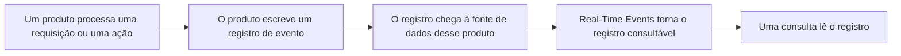
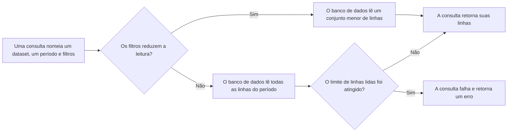

import FrameBox from '@aziontech/webkit/frame-box'
import ItemList from '@aziontech/webkit/item-list'
import DocItem from '@aziontech/webkit/doc-item'

Uma requisição que foi atendida não deixa nada que uma pessoa possa ler, a não ser que quem a atendeu tenha anotado os detalhes. O sistema que processou a requisição registra o que viu: o endereço de onde a requisição veio, o caminho que ela pediu, o status com que respondeu e o tempo que levou. Esse registro é mantido por um período e, durante esse período, você pode consultá-lo. Quando o período termina, o registro é removido e a pergunta que ele responderia não pode mais ser feita.

Na Azion, esses registros são registros de eventos e [Real-Time Events](/pt-br/documentacao/plataforma/real-time-events/) é onde você os consulta. Cada produto escreve os próprios registros em uma fonte de dados própria. Cada fonte de dados carrega seu próprio conjunto de variáveis pré-organizadas, porque cada produto vê uma coisa diferente. Os registros são lidos no Azion Console ou com a API GraphQL do Real-Time Events em `https://api.azion.com/v4/events/graphql`.

Esta página acompanha um registro, em vez de listar os campos que ele carrega. As variáveis de cada fonte de dados estão em [Fontes de dados](/pt-br/documentacao/plataforma/real-time-events/fontes-de-dados/), e todos os limites estão em [Limites](/pt-br/documentacao/plataforma/real-time-events/limites/). Dois produtos vizinhos leem o mesmo tráfego e não são tratados aqui: os contadores agregados sobre ele são [Real-Time Metrics](/pt-br/documentacao/plataforma/real-time-metrics/), e o envio contínuo dos mesmos registros a um endpoint seu é [Data Stream](/pt-br/documentacao/plataforma/data-stream/). As seções abaixo acompanham o caminho que um evento percorre, as fontes de dados e os datasets que guardam os registros, como uma consulta é limitada e a retenção.

---

## O caminho que um evento percorre

Um registro de evento existe porque um produto o escreveu. Real-Time Events não observa nada por conta própria. Uma aplicação que não atende nenhuma requisição, uma function que nunca é executada e uma conta em que ninguém toca não produzem registro algum. Um produto escreve um registro para cada evento que processa, e o evento é aquilo que esse produto faz uma vez: uma requisição, uma consulta DNS, uma entrega a um endpoint configurado, uma ação na conta.

Este diagrama acompanha um único evento, do trabalho que o produz até a consulta que o lê:

1. Um produto processa uma unidade de trabalho: uma requisição, uma consulta DNS, uma entrega ou uma ação na conta.
2. O produto escreve um registro de evento para ela, com um valor para cada variável que sua fonte de dados define.
3. O registro é escrito na fonte de dados do produto que o produziu e em nenhuma outra.
4. Real-Time Events torna o registro consultável pouco tempo depois do evento, e não no instante dele.
5. Uma consulta nomeia uma fonte de dados, um período e os filtros que houver, e lê os registros correspondentes.
6. O registro é removido ao fim do seu período de retenção, tenha alguém o lido ou não.

Uma variável não é um evento por si só. Um evento produz um registro, e as variáveis são os campos desse registro. Uma requisição que deu match com uma regra do WAF e foi atendida pelo cache é, portanto, um registro que carrega os dois fatos, não dois registros. Uma consulta retorna um conjunto desses registros, e um único registro aberto sozinho exibe todas as variáveis que sua fonte de dados define. Para abrir um registro e lê-lo, consulte [Ler um registro de evento](/pt-br/documentacao/guias/plataforma/observabilidade/entender-logs/).

O intervalo entre o evento e o registro consultável é a parte desse caminho que exige atenção. Um registro escrito há instantes pode não aparecer em uma busca executada imediatamente. Um resultado vazio logo depois de uma requisição em geral significa que a busca foi executada cedo demais, e não que a requisição nunca foi atendida. Repita a busca antes de concluir qualquer coisa a partir da primeira. Para o atraso e os demais limites, consulte [Limites](/pt-br/documentacao/plataforma/real-time-events/limites/).

---

## Fontes de dados e datasets

Uma fonte de dados é o produto ou serviço da Azion que gerou os eventos que você consulta. Em uma consulta, ela é o índice de onde os registros são lidos, portanto toda busca seleciona uma antes de selecionar qualquer outra coisa. Real-Time Events expõe oito delas, e cada uma carrega suas próprias variáveis, porque cada produto escreve um registro diferente.

Os mesmos registros são alcançados de duas maneiras, e as duas não nomeiam os campos do mesmo jeito. A classic view do Azion Console, que é a visualização em que Real-Time Events abre, chama cada campo de um registro de variável, escrita da maneira como uma pessoa a lê. A API GraphQL do Real-Time Events guarda cada fonte de dados como um dataset e nomeia os mesmos campos em camelCase. A variável `Remote Address` é, portanto, o campo `remoteAddress` em uma consulta. Um payload do [Data Stream](/pt-br/documentacao/plataforma/data-stream/) escreve esse mesmo campo em snake_case novamente.

Essa divisão custa um passo de tradução toda vez que você passa de uma para a outra. Um nome de variável copiado da interface não é aceito em uma consulta GraphQL, e um nome de campo não aparece na interface. [Fontes de dados](/pt-br/documentacao/plataforma/real-time-events/fontes-de-dados/) nomeia o dataset ao lado das variáveis de cada fonte de dados, e a lista de campos de cada dataset está em [Campos da API GraphQL do Real-Time Events](/pt-br/documentacao/devtools/graphql/campos-gql-real-time-events/). Para obter um token e enviar uma primeira consulta, consulte [Primeiros passos da API GraphQL](/pt-br/documentacao/devtools/graphql/primeiros-passos/). A visualização mais recente do Azion Console, em Preview, fecha essa lacuna ao exibir diretamente os nomes de campo da API.

Dividir os registros por produto é o que mantém cada um legível: uma requisição HTTP e uma consulta DNS quase não têm campos em comum, e um único registro compartilhado carregaria uma linha quase vazia para cada uma. O preço é que uma pergunta que atravessa dois produtos exige duas consultas, uma por fonte de dados, unidas por um valor que os dois registros carregam, como o host.

---

## Como uma consulta é limitada

Uma consulta ao Real-Time Events nomeia três coisas: a fonte de dados que ela lê, o período que ela cobre e os filtros que a reduzem. Esses três decidem quantas linhas o banco de dados de logs lê antes de poder responder, e a leitura é a parte cara do trabalho. O período costuma ser o maior dos três. Uma busca abre nos últimos 15 minutos, e uma busca ampliada para a janela inteira de retenção recorre a muito mais registros.

Na API GraphQL, as três escolhas são escritas explicitamente. A consulta seleciona um dataset, delimita o período com `tsRange: { begin, end }`, ordena o resultado com `orderBy` e limita as linhas que retorna com `limit`. Uma consulta no Azion Console faz as mesmas três escolhas pela interface, e não em texto.

A leitura também é o que uma das duas métricas cobradas conta. Data Scan mede o volume que uma consulta lê, não o volume que ela retorna. Uma busca ampla que responde com dez linhas ainda pode escanear um volume grande. Storage, a outra métrica, mede o volume de registros mantidos.

O banco de dados de logs limita quantas linhas uma consulta pode ler antes de responder qualquer coisa. Este diagrama mostra qual consulta atinge esse limite:

1. Uma consulta que carrega um filtro lê apenas as linhas que podem corresponder a ele, portanto o período que ela nomeia custa pouco por si só.
2. Uma consulta que não carrega filtro além do período lê todas as linhas desse período.
3. Uma leitura que fica dentro do limite retorna suas linhas normalmente.
4. Uma leitura que atinge o limite encerra a consulta com um erro, em vez de um resultado parcial.

A busca sem filtro sobre um período amplo é o único caso que atinge o limite, e ela falha em vez de retornar as primeiras linhas que encontrou. Adicionar um filtro muda esse resultado mais do que encurtar o período: um host, um endereço IP, um código de status HTTP ou outro parâmetro da busca reduz a leitura antes que o período precise fazê-lo.

Real-Time Events limita uma consulta pelo que ela lê, e não pelo que ela retorna, o que impede que uma busca ampla custe a todas as outras buscas os seus resultados. O preço é que a pergunta mais ampla é a que o sistema recusa. Faça-a como várias perguntas estreitas. Para os limites de linhas, de campos, de payload e de taxa, e para a mensagem que uma consulta recusada retorna, consulte [Limites](/pt-br/documentacao/plataforma/real-time-events/limites/).

---

## Retenção

Retenção é por quanto tempo Real-Time Events mantém um registro de evento consultável. Um registro é mantido por 7 dias, o que equivale a 168 horas, e então é removido, tenha alguém o lido ou não, e nada recupera um registro depois que ele some. A retenção é, portanto, o limite externo de toda consulta: um período que alcança mais atrás que a retenção não retorna nada para a parte que fica de fora, porque não sobrou nada ali para ler.

Uma fonte de dados é a exceção. [Activity History](/pt-br/documentacao/fundamentos/activity-history/) registra as ações executadas na conta, e não o tráfego que a conta atende. Seus registros são mantidos por 2 anos, muito mais tempo que os das outras sete fontes de dados. São esses os registros que respondem quem alterou uma configuração, muito depois de o tráfego que rodou sob essa configuração ter sido removido. Para os dois períodos ao lado de todos os outros limites, consulte [Limites](/pt-br/documentacao/plataforma/real-time-events/limites/).

A janela é um meio-termo deliberado. É longa o bastante para investigar um incidente depois do fato. É curta o bastante para que Real-Time Events não seja um repositório definitivo, o que mantém a métrica Storage limitada. A consequência é que um registro de que você precisa além da retenção tem de sair antes de ser removido. [Data Stream](/pt-br/documentacao/plataforma/data-stream/) é o que envia os mesmos registros continuamente a um endpoint seu, onde a sua própria retenção se aplica.

---

## Recursos relacionados

<FrameBox>
<ItemList>
  <DocItem title="Fontes de dados" href="/pt-br/documentacao/plataforma/real-time-events/fontes-de-dados/">As oito fontes de dados, as variáveis que cada uma carrega e o dataset que a guarda na API GraphQL.</DocItem>
  <DocItem title="Limites" href="/pt-br/documentacao/plataforma/real-time-events/limites/">Os períodos de retenção, os limites que uma consulta carrega e o que uma consulta que passa de um deles recebe.</DocItem>
  <DocItem title="Primeiros passos com Real-Time Events" href="/pt-br/documentacao/plataforma/real-time-events/primeiros-passos/">Rode uma primeira busca em uma fonte de dados e leia o que ela retorna.</DocItem>
  <DocItem title="Glossário" href="/pt-br/documentacao/plataforma/real-time-events/glossario/">O que registro de evento, fonte de dados, dataset, retenção e Data Scan significam nestas páginas.</DocItem>
</ItemList>
</FrameBox>
