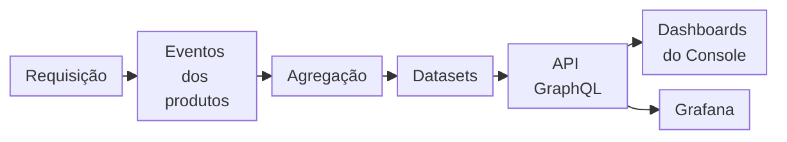

import FrameBox from '@aziontech/webkit/frame-box'
import ItemList from '@aziontech/webkit/item-list'
import DocItem from '@aziontech/webkit/doc-item'

Uma métrica é um número calculado a partir de muitos eventos ao longo de uma fatia de tempo: uma contagem de requisições, uma soma de bytes ou a parcela do conteúdo servida do cache. Cada requisição do seu tráfego é registrada como um evento. Os eventos são somados por minuto, hora ou dia, e um gráfico plota um ponto por fatia. O ponto é um total, então ele chega depois das requisições que conta e não diz nada sobre nenhuma delas individualmente.

[Real-Time Metrics](/pt-br/documentacao/plataforma/real-time-metrics/) mostra esses totais. Ele não cria nada na sua conta: lê as métricas que outros produtos da Azion geram enquanto servem o seu tráfego e as mostra como gráficos no [Azion Console](https://console.azion.com/) e pela [API GraphQL](/pt-br/documentacao/devtools/graphql/). Para abrir o seu primeiro dashboard, consulte [Primeiros passos com Real-Time Metrics](/pt-br/documentacao/plataforma/real-time-metrics/primeiros-passos/).

As seções acompanham uma requisição até ela virar um ponto em um gráfico: o caminho de uma requisição até um gráfico, a agregação e o seu atraso, a resolução de cada ponto, como a contagem difere de Billing, métricas e eventos, os datasets que cada dashboard lê e a retenção.

---

## De uma requisição a um gráfico

Os produtos que servem o seu tráfego registram o que fazem com cada requisição ou consulta: [Applications](/pt-br/documentacao/plataforma/applications/), [Cache](/pt-br/documentacao/plataforma/applications/#cache), [Tiered Cache](/pt-br/documentacao/plataforma/applications/cache/tiered-cache/), [Functions](/pt-br/documentacao/plataforma/functions/), [Image Processor](/pt-br/documentacao/plataforma/applications/#image-processor), [WAF](/pt-br/documentacao/plataforma/firewall/#waf), [Edge DNS](/pt-br/documentacao/plataforma/edge-dns/), [Bot Manager](/pt-br/documentacao/plataforma/firewall/#bot-manager) e [Data Stream](/pt-br/documentacao/plataforma/data-stream/). Real-Time Metrics não muda nada nesses produtos. Ele lê o que eles registram, depois que a Azion agrega esses registros.

Este diagrama acompanha uma requisição até ela virar um ponto em um gráfico:

1. Um cliente envia uma requisição, e o produto que a atende, como uma aplicação, a serve e a registra como um evento.
2. A Azion agrega os eventos em métricas, como uma contagem de requisições ou uma soma de bytes por bucket de tempo. A agregação leva até 10 minutos.
3. As métricas são armazenadas em datasets, um por tipo de tráfego, como `httpMetrics` para as requisições que Applications e WAF atendem.
4. A API GraphQL em `https://api.azion.com/v4/metrics/graphql` responde a queries sobre esses datasets.
5. Cada gráfico no Azion Console é uma query para essa mesma API, então um dashboard e uma query que você escreve leem os mesmos números.
6. Um dashboard do Grafana pode ler os mesmos datasets pela API. Para configurar o Grafana, consulte [Instale o plugin da Azion para Grafana](/pt-br/documentacao/guias/plataforma/observabilidade/integrar-grafana/).

Como todo gráfico é uma query GraphQL, **Copy query**, no menu de um gráfico, copia a query e as variáveis exatas que o gráfico envia. Você pode executar essa query por conta própria, mudar o intervalo dela ou detalhá-la ainda mais. Para o formato do texto copiado, consulte [Copy query](/pt-br/documentacao/plataforma/real-time-metrics/filtros-e-intervalo-de-tempo/#copy-query).

### O que um gráfico conta

Um gráfico de requisições conta acessos: cada vez que um cliente alcança o conteúdo da sua aplicação, a aplicação processa uma requisição, e o gráfico conta uma. Quando o conteúdo não está em cache, o data center o busca na origem antes de responder ao cliente. Esse trajeto inteiro, do cliente ao data center, à origem e de volta, continua contando como uma requisição, e **Missed Requests** o conta uma vez.

Já o gráfico **Edge Cache** divide o mesmo trajeto por direção. Por exemplo, em um cache miss, **Data Transferred In** conta os dados que seguem em direção à origem, e **Data Transferred Out** conta os dados que voltam ao cliente. Um gráfico também conta apenas o que o seu próprio produto registra. Vários produtos, como Tiered Cache e Functions, precisam estar ativos na sua conta antes que os dashboards deles reportem dados, e alguns gráficos aplicam um filtro próprio. Os gráficos de **Image Processor**, por exemplo, mantêm apenas respostas 2XX e 304. Para o caminho e o filtro de cada gráfico, consulte [Dashboards de Build](/pt-br/documentacao/plataforma/real-time-metrics/dashboards-build/).

---

## Agregação e atraso

A agregação leva tempo, então um total não é final no momento em que as suas requisições são servidas. A Azion agrega os eventos nas métricas de cada bucket de tempo, e uma métrica leva até 10 minutos para ser agregada. Até lá, o bucket guarda apenas os eventos contados até aquele momento.

Duas coisas moldam os pontos mais recentes de uma linha. Quando o intervalo selecionado termina no minuto atual, o Console não plota o último bucket, que ainda está aberto. Os buckets anteriores a ele ainda podem estar em agregação, então os últimos pontos de uma linha podem ficar abaixo do tráfego real. Por exemplo, com **Last 15 minutes** selecionado às 15:40, a linha termina antes das 15:40, e os pontos entre 15:30 e 15:39 ainda podem subir à medida que os eventos deles são contados.

O atraso é o custo de servir totais em vez de eventos brutos. Os valores dos 10 minutos mais recentes são um rascunho, enquanto um intervalo que termina 10 minutos ou mais no passado guarda apenas pontos agregados. Dentro de um intervalo, um bucket sem eventos é plotado como zero, então uma pausa no tráfego aparece como uma queda a zero. Para saber como um gráfico mostra cada estado, consulte [Estados do gráfico](/pt-br/documentacao/plataforma/real-time-metrics/filtros-e-intervalo-de-tempo/#estados-do-grafico).

---

## Resolução

Um gráfico não consegue plotar cada minuto de um intervalo longo de forma legível, então cada ponto cobre um bucket de tempo cujo tamanho segue a duração do intervalo selecionado. A API escolhe o tamanho do bucket, e o Console alinha os pontos que recebe a esse tamanho. A query que um gráfico envia não carrega nenhum intervalo próprio.

| Duração do intervalo selecionado | Cada ponto cobre |
| --- | --- |
| Menos de 2,5 dias (60 horas) | Um minuto |
| De 2,5 dias a menos de 60 dias | Uma hora |
| 60 dias ou mais | Um dia |

O tamanho do bucket depende da duração do intervalo, não da idade dos dados. Por exemplo, um intervalo de um dia da semana passada ainda retorna um ponto por minuto. Um dataset não segue a tabela: `httpBreakdownMetrics` retorna buckets de uma hora mesmo para um intervalo de uma hora.

Um campo por segundo, como `requestsTotalPerSecond`, divide o total de um bucket pela duração desse bucket em segundos. Em um bucket de uma hora, 71 requisições aparecem como 0,02 requisição por segundo, que é 71 dividido por 3.600.

A contrapartida é o detalhe. Um intervalo longo mostra uma tendência longa em poucos pontos, mas um pico curto desaparece dentro do seu bucket. Um surto de cinco minutos dentro de um bucket de um dia soma ao total desse dia, e um valor por segundo o espalha pelos 86.400 segundos do dia. Para ver um pico, selecione um intervalo menor que 2,5 dias em torno dele. A forma como um gráfico combina os seus pontos em um total da legenda, com **Sum** ou **Average**, está descrita em [Anatomia do gráfico](/pt-br/documentacao/plataforma/real-time-metrics/filtros-e-intervalo-de-tempo/#anatomia-do-grafico).

---

## Contagem e Billing

Real-Time Metrics foca em performance, e Billing foca em precisão, então os dois contam eventos de formas diferentes. Real-Time Metrics usa uma abordagem at-most-once: cada evento é contado uma vez ou nenhuma, então um evento pode ser perdido, mas nunca é contado duas vezes. Billing usa uma abordagem exactly-once, que conta cada evento exatamente uma vez.

Por isso, as duas abordagens podem dar totais diferentes para o mesmo tráfego. Em média, a diferença entre Real-Time Metrics e Billing é menor que 1%. Quando os dois diferem, Billing é a referência. Por exemplo, se o total de requisições de um mês no dashboard **Requests** difere das requisições nos dados de Billing da Azion, o número de Billing é o que deve ser usado.

Para saber como Billing registra o uso, consulte [Real-Time Metrics e faturamento](/pt-br/documentacao/fundamentos/billing-and-subscriptions/#real-time-metrics-e-faturamento).

---

## Métricas e eventos

Uma métrica é agregada: ela diz quantas requisições chegaram em um minuto, não quais foram. Um evento é bruto: ele guarda uma requisição e os detalhes dela. Real-Time Metrics serve dados agregados, e [Real-Time Events](/pt-br/documentacao/plataforma/real-time-events/) serve os eventos brutos, os logs, que os mesmos produtos registram. Cada um tem a sua própria API GraphQL e os seus próprios datasets.

Use Real-Time Metrics para acompanhar uma tendência ou comparar intervalos, e Real-Time Events para inspecionar as requisições por trás de uma mudança. Por exemplo, quando **Missed Requests** sobe em uma hora, os logs dessa hora em Real-Time Events mostram as requisições individuais por trás da alta. Para enviar os logs brutos para fora da Azion, [Data Stream](/pt-br/documentacao/plataforma/data-stream/) os entrega em pacotes a um destino que você configura.

---

## Datasets

Um dataset é uma coleção nomeada de métricas agregadas para um tipo de tráfego. Cada produto registra os seus próprios campos, então o que um dashboard pode mostrar em gráfico depende do produto a que ele pertence. No Azion Console, uma categoria guarda abas de produto, uma aba de produto guarda um ou mais dashboards e cada dashboard lê um dataset. Para consultar os mesmos números pela API GraphQL, use estes datasets:

| Categoria | Aba de produto | Dataset a consultar |
| --- | --- | --- |
| **Build** | **Applications** | `httpMetrics`, e `httpBreakdownMetrics` para **Request Breakdown** |
| **Build** | **Tiered Cache** | `tieredCacheMetrics` |
| **Build** | **Functions** | `edgeFunctionsMetrics` |
| **Build** | **Image Processor** | `imagesProcessedMetrics` |
| **Secure** | **WAF** | `httpMetrics` |
| **Secure** | **Edge DNS** | `edgeDnsQueriesMetrics` |
| **Secure** | **Bot Manager** | `botManagerMetrics` para **Overview**, e `botManagerBreakdownMetrics` para **Breakdown** |
| **Secure** | **Threats Breakdown** | `httpBreakdownMetrics` |
| **Observe** | **Data Stream** | `dataStreamedMetrics` |

Como um gráfico e uma query leem o mesmo dataset, você pode reconstruir qualquer gráfico como uma query e então agrupá-la, filtrá-la ou executá-la em um intervalo que o gráfico não desenha. [Dashboards de Build](/pt-br/documentacao/plataforma/real-time-metrics/dashboards-build/), [Dashboards de Secure](/pt-br/documentacao/plataforma/real-time-metrics/dashboards-secure/) e [Dashboards de Observe](/pt-br/documentacao/plataforma/real-time-metrics/dashboards-observe/) nomeiam os campos que cada gráfico lê. Para os campos de todos os datasets, consulte [Campos GraphQL de Real-Time Metrics](/pt-br/documentacao/devtools/graphql/campos-gql-real-time-metrics/).

---

## Retenção

Real-Time Metrics mantém cada dataset por um período fixo, que varia por dataset. Depois desse período, uma query retorna um resultado vazio em vez de um erro. Para o período de cada dataset, consulte [Retenção de dados](/pt-br/documentacao/plataforma/real-time-metrics/limites/#retencao-de-dados).

---

## Recursos relacionados

<FrameBox>
<ItemList>
  <DocItem title="Limites de Real-Time Metrics" href="/pt-br/documentacao/plataforma/real-time-metrics/limites/">Por quanto tempo cada dataset é mantido e os limites do Console e da API GraphQL.</DocItem>
  <DocItem title="Boas práticas para Real-Time Metrics" href="/pt-br/documentacao/plataforma/real-time-metrics/boas-praticas/">Qual intervalo escolher para uma tendência ou um pico e quando ler Billing em vez de um gráfico.</DocItem>
  <DocItem title="Solucionar problemas de Real-Time Metrics" href="/pt-br/documentacao/plataforma/real-time-metrics/solucao-de-problemas/">O que fazer quando os últimos pontos caem, um gráfico está vazio ou os totais diferem de Billing.</DocItem>
  <DocItem title="Como a GraphQL API funciona" href="/pt-br/documentacao/devtools/graphql/visao-geral/">Como a API GraphQL que todo gráfico consulta é estruturada e como chamá-la.</DocItem>
</ItemList>
</FrameBox>
