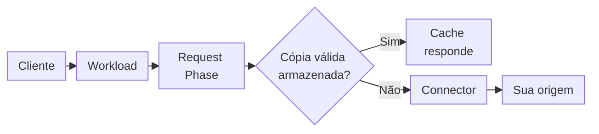
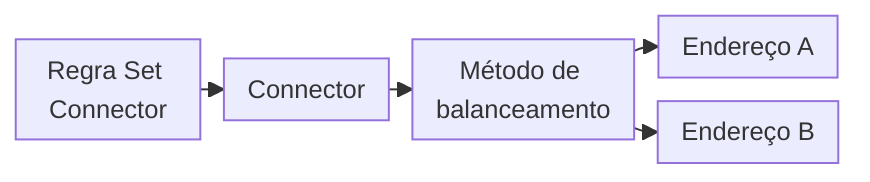
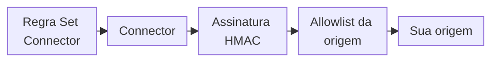
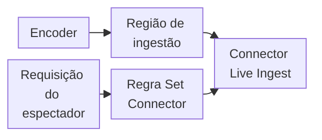

import FrameBox from '@aziontech/webkit/frame-box'
import ItemList from '@aziontech/webkit/item-list'
import DocItem from '@aziontech/webkit/doc-item'

Um proxy reverso responde a um cliente em nome de um servidor que você opera. Quando não consegue responder com o que já guarda, ele abre a sua própria conexão com esse servidor e encaminha a requisição. No caminho, ele decide como endereçar o servidor: qual hostname enviar no header `Host`, qual caminho pedir e qual protocolo e porta usar. O servidor responde ao proxy, e o proxy responde ao cliente.

Na Azion, a [aplicação](/pt-br/documentacao/plataforma/applications/) é o proxy, e um [connector](/pt-br/documentacao/plataforma/connectors/) guarda onde e como ela alcança a sua origem, o servidor que guarda o seu conteúdo. Uma regra da aplicação envia requisições ao connector. O connector carrega o endereço da origem e as configurações que moldam cada requisição a ela. Três produtos agem sobre um connector. [Load Balancer](/pt-br/documentacao/plataforma/connectors/#load-balancer) distribui as requisições entre vários endereços, e [Origin Shield](/pt-br/documentacao/plataforma/connectors/#origin-shield) protege a origem. [Live Ingest](/pt-br/documentacao/plataforma/connectors/#live-ingest) recebe uma transmissão ao vivo por meio de um connector.

Esta página cobre os mecanismos, não os campos: cada campo está em [Configurações de connector](/pt-br/documentacao/plataforma/connectors/configuracoes/), e cada limite está em [Limites de Connectors](/pt-br/documentacao/plataforma/connectors/limites/). As seções seguem uma requisição: o caminho da requisição, os tipos de connector, como o connector endereça a origem, os headers de endereço do cliente, a reutilização de conexões e os timeouts, e a propagação. Load Balancer, Origin Shield e Live Ingest fecham a página, nessa ordem.

---

## Caminho da requisição

Criar um connector não envia tráfego a ele. Uma aplicação envia requisições a um connector por meio de uma regra cujo behavior _Set Connector_ o nomeia e, até que uma regra nomeie um connector, a aplicação não tem origem. A própria aplicação serve apenas as requisições de um [workload](/pt-br/documentacao/plataforma/workloads/) cujo deployment a nomeia.

Este diagrama acompanha uma requisição, do cliente até a origem:



1. Um cliente envia uma requisição a um hostname de um workload, e o deployment do workload nomeia a aplicação que a trata.
2. A aplicação executa as suas regras da Request Phase, em ordem. Uma regra correspondente com o behavior _Set Connector_ nomeia um connector. Quando várias regras correspondentes carregam _Set Connector_, apenas a última é executada.
3. Quando um cache setting se aplica e há uma cópia válida do objeto armazenada, Cache responde a partir dessa cópia. A requisição nunca alcança o connector nem a origem.
4. Caso contrário, o connector abre uma conexão com a origem e envia a requisição, moldada pelas configurações do connector.
5. A origem responde ao connector. A aplicação executa as suas regras da Response Phase sobre a resposta, e o cliente a recebe.

Uma regra guarda o ID do connector, e o connector guarda o endereço. Mover a origem, portanto, significa editar um connector, e toda regra que o nomeia acompanha a mudança sem nenhuma alteração. Por exemplo, quando você altera o `host` e o `path_prefix` do connector, a mesma regra envia requisições à origem com os novos valores. O preço é uma dependência entre os dois objetos: a API recusa excluir um connector que uma regra ainda nomeia.

Na API v3, as origins de uma aplicação cumpriam esse papel. Para esse modelo, consulte [Origins](/pt-br/documentacao/plataforma/connectors/origins/). Para escrever a regra que nomeia um connector, consulte [Rules Engine para Applications](/pt-br/documentacao/plataforma/applications/rules-engine/).

---

## Tipos de connector

Um connector tem um de três tipos, e o tipo decide o que o connector alcança e quais configurações carrega. No Azion Console, a seção **Connector Type** os oferece como _HTTP_, _Object Storage_ e _Live Ingest_. Na API, eles são `http`, `storage` e `live_ingest`.

Um connector do tipo `http` alcança servidores que você opera, por hostname ou por endereço IP. Ele guarda um endereço, ou vários quando Load Balancer está ativado. É o único tipo com opções de conexão, então o header `Host`, o prefixo de caminho, o protocolo e os headers de endereço do cliente se aplicam somente a ele. Use-o para qualquer origem que responda HTTP: um servidor em nuvem, um servidor no seu data center ou um endpoint de armazenamento compatível com S3.

Um connector do tipo `storage` lê objetos de um bucket de [Object Storage](/pt-br/documentacao/plataforma/object-storage/) na sua conta. Ele não guarda endereços nem opções de conexão, porque a origem é o próprio armazenamento da Azion, e não há servidor para você operar. Um prefixo restringe o connector aos objetos sob ele, como `images/`.

Um connector do tipo `live_ingest` recebe uma transmissão ao vivo que a Azion ingere em uma região que você escolhe. Ele não guarda endereços nem opções de conexão. A seção Live Ingest desta página descreve como a transmissão chega aos espectadores.

Por exemplo, uma aplicação pode enviar as requisições de `/images/` a um connector do tipo `storage` e todos os outros caminhos a um connector do tipo `http`. Cada regra corresponde aos seus próprios caminhos, e cada uma nomeia o seu próprio connector. Para os campos de cada tipo, consulte [Configurações de connector](/pt-br/documentacao/plataforma/connectors/configuracoes/#geral).

---

## Como o connector endereça a origem

Um connector do tipo `http` decide quatro coisas sobre cada requisição que encaminha: o header `Host`, o caminho, o protocolo e a porta, e como resolve e segue o endereço da origem. Elas moldam a requisição que a origem recebe, não a URL que o cliente pediu.

### Header Host

O header `Host` diz a um servidor para qual site é uma requisição. Um servidor pode hospedar vários sites, chamados virtual hosts, e lê `Host` para escolher o site e localizar o conteúdo dele. A opção de conexão `host` decide o valor que o connector envia.

Por padrão, `host` é `${host}`, que envia o host que o cliente pediu. Por exemplo, um cliente que pede `www.example.com` faz o connector enviar `Host: www.example.com`. Isso atende uma origem que serve vários virtual hosts e espera cada requisição sob o seu nome público.

Um valor literal é enviado como está, em toda requisição. Defina um quando a origem responde a um virtual host sob um nome diferente do que o cliente usou, como `origin.example.com`. Uma origem que roteia requisições por nome pode não responder ao host do cliente, então ela precisa do seu próprio nome aqui.

### Prefixo de caminho

A opção de conexão `path_prefix` vai na frente do caminho que o cliente pediu. Com `/anything`, uma requisição de `/get` chega à origem como `/anything/get`. O prefixo nunca aparece na URL do cliente: o cliente pede `/get` e recebe a resposta de `/anything/get`.

Use um prefixo quando o conteúdo fica sob um diretório da origem. Uma origem também pode precisar de um segmento de caminho, como o nome do bucket em um endpoint compatível com S3. O padrão é nenhum prefixo, e o caminho chega à origem sem alteração.

### Protocolo e portas

A conexão do connector até a origem tem o seu próprio protocolo, independente do que o cliente usou para alcançar a Azion. A **Transport Protocol Policy** o decide. _Preserve_ mantém o scheme que o cliente usou, então uma requisição HTTPS chega à origem por HTTPS. _Force HTTPS_ e _Force HTTP_ usam esse protocolo em toda requisição, qualquer que seja o protocolo do cliente.

Forçar HTTPS protege o trecho entre a Azion e a origem, e custa um handshake TLS com a origem a cada nova conexão. Forçar HTTP poupa o handshake, e envia a requisição à origem sem criptografia.

Cada endereço carrega as suas próprias portas, `http_port` e `https_port`, com os padrões `80` e `443`. O próprio endereço nunca carrega uma porta nem um protocolo. Para saber como executar uma origem em outras portas, consulte [Configure portas HTTP e HTTPS](/pt-br/documentacao/guias/desenvolvimento-de-aplicacoes/primeiros-passos/configurar-portas/).

### Resolução DNS e redirecionamentos

Um endereço pode ser um hostname, e o connector o resolve antes de se conectar. A **DNS Resolution Policy** decide quais endereços o connector usa: _IPv4 and IPv6_ permite os dois, e _Force IPv4_ mantém a conexão em IPv4 mesmo quando o hostname também resolve para IPv6.

Uma origem pode responder com um redirecionamento HTTP em vez do conteúdo. Com **Following Redirect** ativado, o próprio connector segue o redirecionamento que a origem envia. Ele vem desativado por padrão.

Para cada uma dessas configurações e o seu padrão, consulte [Configurações de connector](/pt-br/documentacao/plataforma/connectors/configuracoes/#opcoes-de-conexao).

---

## Headers de endereço do cliente

A origem recebe a requisição por uma conexão que o connector abre, então o endereço que a origem vê nessa conexão é o da Azion, não o do cliente. Para repassar o endereço do cliente, o connector adiciona dois headers a toda requisição de um connector do tipo `http`.

Por padrão, a origem recebe o endereço IP do cliente em `X-Real-IP` e a porta do cliente em `X-Real-PORT`. As opções de conexão `real_ip_header` e `real_port_header` os renomeiam. Por exemplo, com `real_ip_header` definido como `X-Client-Real-IP`, a origem recebe `X-Client-Real-IP` com o endereço do cliente, e nenhum `X-Real-IP`.

Uma origem que registra, aplica rate limit ou autoriza pelo endereço do cliente o lê desse header. Algumas origens descartam `X-Real-IP` por conta própria, antes que o seu código o veja. Renomear o header contorna esse tipo de origem. Como alternativa, uma regra pode adicionar o IP do cliente a um header de sua escolha. Para essa abordagem, consulte [Envie o IP do cliente para a origem em um header](/pt-br/documentacao/suporte/ip-original-header/).

---

## Reutilização de conexões e timeouts

A conexão da Azion até a origem segue padrões da plataforma que decidem quanto tempo a Azion espera e por quanto tempo mantém aberta uma conexão ociosa. Alguns vêm das configurações globais da Azion e outros do sistema operacional. Um connector sem Load Balancer não expõe nenhum deles como configuração.

Esta tabela lista os padrões da conexão com a origem:

| Comportamento da conexão | Padrão |
| --- | --- |
| Complete TCP Connection | 60 segundos |
| TCP ACK Timeout | Cerca de 15 a 30 minutos |
| TCP Keep-Alive Interval | Desativado |
| Proxy Idle Timeout | 75 segundos |
| Proxy Read Timeout | 120 segundos |
| Proxy Write Timeout | 120 segundos |
| HTTP/2 Pings to Origin | Desativado |
| HTTP/2 Connection Idle | 75 segundos |

Timeouts e novas tentativas só se tornam configurações com Load Balancer no connector. O **Connection Timeout** dele limita a espera por uma conexão com a origem, e o **Read/Write Timeout** limita a espera por dados em uma conexão aberta. O **Max Retries** dele conta as novas tentativas em uma falha de conexão. Na API, `max_retries` tem o padrão `0`, então uma requisição não é tentada de novo a menos que você aumente esse valor. Para esses campos, consulte [Configurações de connector](/pt-br/documentacao/plataforma/connectors/configuracoes/#load-balancer).

Quando uma origem HTTPS recusa o handshake TLS, o cliente recebe `502` com a página intitulada `Azion - Default error page`, não uma página da origem:

```text
HTTP/2 502 
server: nginx
…
content-type: text/html
x-azion-request-id: <request-id>
…
    <title>Azion - Default error page</title>
```

---

## Propagação

Uma mudança em um connector não precisa de um novo deployment e, ainda assim, leva tempo para alcançar o tráfego. A infraestrutura distribuída da Azion a recebe ao longo de vários minutos, e cada data center a aplica no seu próprio momento. O tempo é best-effort, sem duração garantida.

Enquanto uma mudança se espalha, uma requisição pode encontrar as configurações antigas ou as novas, dependendo do data center que responde. Por exemplo, logo depois que você altera o `host` do connector, algumas requisições chegam à origem com o novo header `Host` e outras com o anterior. O mesmo vale para uma nova regra que nomeia um connector.

Uma requisição enviada logo depois de uma mudança mostra apenas o que um data center guarda. Para confirmar uma mudança, envie a requisição várias vezes, até que toda resposta a reflita. Planeje cada mudança para que as duas versões das configurações funcionem enquanto ela se espalha. Por exemplo, mantenha a origem antiga respondendo até que todo data center envie requisições à nova.

---

## Load Balancer

Um único servidor é um ponto único de falha, e ele carrega toda a carga. Distribuir as requisições entre vários servidores que guardam o mesmo conteúdo mantém o site respondendo quando um deles falha, e divide a carga entre eles. Um balanceador escolhe, para cada requisição, qual servidor a recebe.

Ative Load Balancer no connector, e o connector passa a guardar até 15 endereços em vez de um. Um método de balanceamento escolhe o endereço de cada requisição, e o peso e a função do servidor de cada endereço moldam essa escolha. As regras continuam decidindo quais requisições alcançam o connector, então qualquer critério de [Rules Engine para Applications](/pt-br/documentacao/plataforma/applications/rules-engine/), como o caminho, decide quais requisições são balanceadas. Para os limites, consulte [Limites de Connectors](/pt-br/documentacao/plataforma/connectors/limites/#load-balancer).

### Onde Load Balancer age sobre uma requisição

Load Balancer age dentro do connector, depois que uma regra o nomeou e antes que uma conexão com a origem se abra. Ele muda qual endereço recebe a requisição, não como a requisição é endereçada.

Este diagrama acompanha uma requisição, da regra até um de dois endereços:



1. O behavior _Set Connector_ de uma regra nomeia um connector que tem Load Balancer ativado.
2. O método de balanceamento do connector escolhe um dos seus endereços ativos, usando o peso e a função do servidor de cada endereço.
3. O connector abre a conexão com esse endereço, com o mesmo header `Host`, o mesmo prefixo de caminho e o mesmo protocolo de todos os outros endereços.
4. Quando a conexão falha, o connector tenta de novo quantas vezes **Max Retries** permitir.

Cada data center balanceia por conta própria. A rotação de um data center não sabe nada das requisições que outro enviou. Em todo o seu tráfego, portanto, o round robin não é uma alternância estrita, e a divisão não é exata. Por exemplo, de 20 requisições a um connector com dois endereços, um endereço pode receber a maioria delas. Um endereço com **Active** desativado sai da rotação assim que a mudança alcança cada data center e, até lá, alguns data centers ainda lhe enviam requisições.

Para saber como Round Robin, Least Connections e IP Hash escolhem um endereço, consulte [Métodos de balanceamento](/pt-br/documentacao/plataforma/connectors/load-balancer/metodos-de-balanceamento/).

---

## Origin Shield

Uma origem na internet pública responde a qualquer um que encontre o seu endereço, então um cliente pode contornar o proxy e todas as proteções à frente dele. Duas defesas fecham esse caminho. A origem aceita conexões apenas dos endereços do proxy. A origem também exige que cada requisição carregue uma assinatura feita com um segredo que só o proxy guarda.

Ative Origin Shield no connector para usar qualquer uma das defesas. Com Origin IP ACL, o firewall da sua origem permite apenas os endereços da lista `Azion Origin Shield` em [Network Lists](/pt-br/documentacao/plataforma/firewall/network-shield/network-lists/) e recusa qualquer outra fonte. Com HMAC, o connector assina cada requisição com credenciais AWS Signature Version 4, para que uma origem compatível com S3 a autentique. Por exemplo, um bucket privado em um endpoint compatível com S3 responde à requisição assinada com o objeto, e responde `401` assim que HMAC é desativado.

### Onde Origin Shield age sobre uma requisição

Origin Shield age no trecho entre o connector e a origem. HMAC adiciona a assinatura quando o connector envia a requisição, e Origin IP ACL entra em vigor na sua origem, que verifica de onde vem a conexão.

Este diagrama acompanha uma requisição, da regra até uma origem protegida:



1. O behavior _Set Connector_ de uma regra nomeia um connector que tem Origin Shield ativado.
2. Com HMAC ativado, o connector assina a requisição com as credenciais que guarda.
3. A conexão alcança a sua origem a partir de um endereço da Azion. Com Origin IP ACL, o firewall da sua origem a aceita porque o endereço está na lista `Azion Origin Shield`.
4. A origem verifica a assinatura e responde à requisição.

As duas defesas colocam o trabalho em lugares diferentes. Origin IP ACL depende do firewall da sua origem, que precisa guardar a lista atual à medida que os endereços da Azion mudam. HMAC depende de credenciais armazenadas no connector, e um conjunto de credenciais assina as requisições para todos os endereços desse connector.

Para saber como Origin IP ACL e HMAC protegem a origem, consulte [Origin IP ACL e HMAC](/pt-br/documentacao/plataforma/connectors/origin-shield/origin-ip-acl-e-hmac/).

---

## Live Ingest

Uma transmissão ao vivo começa em um encoder, que a envia a um ponto de ingestão à medida que ela é produzida. Os espectadores não se conectam ao encoder. Eles buscam a transmissão por HTTP em servidores que a receberam.

Na Azion, o encoder envia a transmissão a Live Ingest, e um connector do tipo `live_ingest` a recebe na região que você escolhe. A aplicação a entrega: uma regra cujo behavior _Set Connector_ nomeia esse connector envia as requisições dos espectadores à transmissão.

### Onde Live Ingest age sobre uma requisição

Live Ingest age no connector que a requisição de um espectador alcança. Quando você seleciona uma fonte Live Ingest em uma regra, a Azion adiciona o behavior _Enforce HLS cache_ a essa regra da Request Phase. O behavior contorna as regras de cache da aplicação e aplica a política de cache que a Azion define para transmissões HLS ao vivo.

Este diagrama acompanha a transmissão, desde o encoder, e a requisição de um espectador até ela:



1. O encoder envia a transmissão ao vivo a Live Ingest, na região do connector.
2. Um espectador solicita a transmissão em um hostname do workload cujo deployment nomeia a aplicação.
3. O behavior _Set Connector_ de uma regra nomeia o connector do tipo `live_ingest`, e o behavior _Enforce HLS cache_ aplica a política de cache HLS ao vivo.
4. O connector serve a transmissão, e o espectador a recebe.

Para saber como Live Ingest recebe uma transmissão e a entrega, consulte [Ingestão e entrega](/pt-br/documentacao/plataforma/connectors/live-ingest/ingestao-e-entrega/).

---

## Recursos relacionados

<FrameBox>
<ItemList>
  <DocItem title="Configurações de connector" href="/pt-br/documentacao/plataforma/connectors/configuracoes/">Cada campo de um connector por tipo, com o padrão e os valores permitidos por trás dos mecanismos desta página.</DocItem>
  <DocItem title="Primeiros passos com Connectors" href="/pt-br/documentacao/plataforma/connectors/primeiros-passos/">Crie um connector, aponte uma regra para ele e envie a sua primeira requisição por ele até a sua origem.</DocItem>
  <DocItem title="Solucionar problemas de Connectors" href="/pt-br/documentacao/plataforma/connectors/solucao-de-problemas/">Sintomas ao longo do caminho da regra até a origem, com as suas causas e correções.</DocItem>
  <DocItem title="Como Applications funciona" href="/pt-br/documentacao/plataforma/applications/como-funciona/">As regras, o cache e as fases que uma aplicação executa antes e depois que uma requisição alcança um connector.</DocItem>
</ItemList>
</FrameBox>
