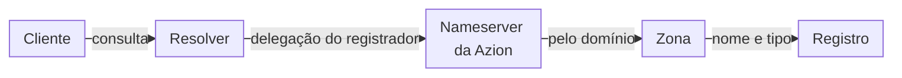
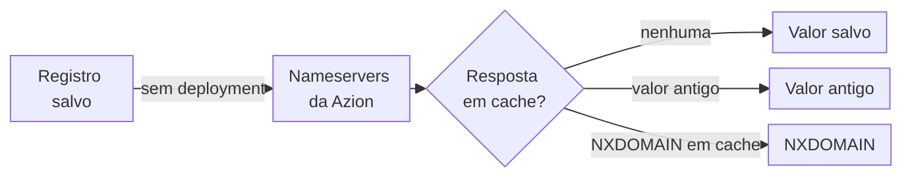
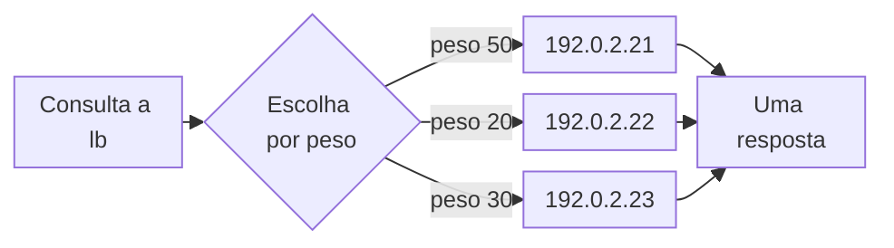
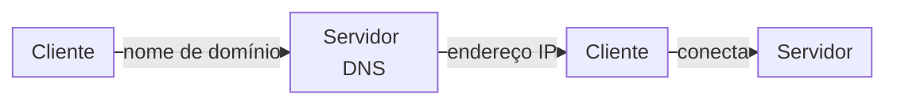
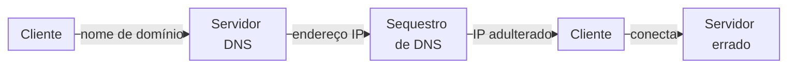
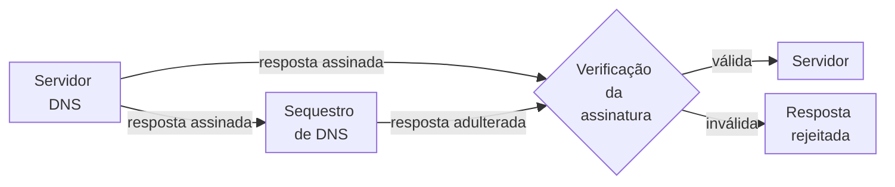

import FrameBox from '@aziontech/webkit/frame-box'
import ItemList from '@aziontech/webkit/item-list'
import DocItem from '@aziontech/webkit/doc-item'

O [DNS](https://www.azion.com/pt-br/learning/dns/o-que-e-dns/) traduz nomes de domínio em endereços IP por meio de uma hierarquia de servidores. Um nameserver autoritativo guarda os registros de um domínio e responde às perguntas sobre eles. Um resolver recebe a consulta de um cliente, segue a delegação do domínio até esses nameservers, pergunta a um deles e mantém a resposta em cache pelo tempo que o time to live (TTL) dela permite.

[Edge DNS](/pt-br/documentacao/plataforma/edge-dns/) realiza isso com zonas e registros. Uma zona hospeda um domínio e guarda os registros dele, e três nameservers na infraestrutura distribuída da Azion, `ns1.aziondns.net`, `ns2.aziondns.com` e `ns3.aziondns.org`, respondem por todas as zonas. Um domínio passa a ser servido pelo Edge DNS quando o registrador do domínio o delega a esses nameservers. Os campos de uma zona e de um registro estão em [Zonas e registros](/pt-br/documentacao/plataforma/edge-dns/zonas-e-registros/). Para criar sua primeira zona, consulte [Primeiros passos com Edge DNS](/pt-br/documentacao/plataforma/edge-dns/primeiros-passos/).

As seções seguem uma consulta até a resposta: o caminho da resolução, cache e propagação, políticas de registro, ANAME no apex e DNSSEC.

---

## O caminho da resolução

Edge DNS é um serviço autoritativo, não um resolver. Os nameservers da Azion respondem pelas zonas que hospedam e não fazem recursão, então seus usuários continuam consultando os próprios resolvers, que chegam à Azion pela delegação.

Este diagrama segue uma consulta de um cliente até o registro que a responde:

1. No registrador do domínio, você delega o domínio aos três nameservers do Edge DNS. Até o registrador publicar essa delegação, os resolvers públicos não chegam à Azion. Um domínio que não foi delegado a nenhum nameserver recebe a resposta `NXDOMAIN`, com o SOA do registry pai, e não o da Azion.
2. Um cliente pede um nome ao próprio resolver, como `www.example.com`. O resolver segue a delegação e pergunta a um dos três nameservers.
3. O nameserver encontra a zona pelo domínio e, em seguida, o registro pelo nome e pelo tipo. Os nomes de registro são relativos à zona: `www` responde por `www.example.com`, e `@` pelo próprio `example.com`.
4. O nameserver retorna os valores do registro como uma resposta autoritativa, com o TTL do registro. O resolver mantém a resposta em cache por esse TTL e a repassa ao cliente.

Um nome sem registro na zona recebe a resposta `NXDOMAIN`, a menos que um [registro wildcard](/pt-br/documentacao/plataforma/edge-dns/tipos-de-registro/#wildcards) corresponda a ele; um nome que tem o próprio registro sempre prevalece sobre um wildcard. Uma zona inativa mantém os registros dela, mas os nameservers respondem aos nomes dela com `REFUSED`.

A delegação é a única etapa fora da Azion. Você pode criar uma zona e os registros dela antes da alteração no registrador e consultar `ns1.aziondns.net` diretamente para ver o que ele responde. Os resolvers públicos só chegam à zona depois que o registrador publica a delegação. Para os nameservers e os valores do SOA, consulte [Zonas e registros](/pt-br/documentacao/plataforma/edge-dns/zonas-e-registros/#nameservers-e-soa).

---

## Cache e propagação

Uma zona ou um registro salvo não precisa de nenhuma etapa de deployment. A API o armazena quando aceita a requisição, e o Console quando você seleciona **Save**. Os nameservers da Azion, porém, respondem a partir de um [cache](https://www.azion.com/en/learning/dns/how-dns-cache-works/) que faz a contagem regressiva do TTL de cada resposta. O que um nameserver responde depois de um salvamento depende do que esse cache já guarda para o nome.

Este diagrama mostra o que um nameserver responde para um nome depois que você salva um registro:

1. Você salva um registro no Console, na CLI ou na API, e os nameservers o servem sem nenhuma outra ação.
2. Quando não há resposta em cache para o nome, um nome novo que ninguém consultou antes de ele existir responde em segundos. Os primeiros registros de uma zona recém-criada podem levar alguns minutos.
3. Quando os nameservers guardaram em cache uma resposta com o valor antigo, eles continuam a servi-la até o cache ser atualizado. Uma alteração em um registro existente pode levar alguns minutos para chegar a todos os nameservers. Desativar uma zona tem efeito da mesma forma.
4. Quando o nome foi consultado antes de existir, os nameservers guardaram esse `NXDOMAIN` em cache. Um nome consultado antes de existir recebe a resposta `NXDOMAIN` por até uma hora, o mínimo do SOA, de 3.600 segundos. Quando um registro wildcard na zona faz o nome existir, uma consulta antecipada guarda em cache uma resposta `NOERROR` vazia, que também dura até uma hora.

Depois dos nameservers da Azion, cada resolver mantém a própria cópia de uma resposta pelo TTL do registro, e de uma resposta negativa por até o mínimo do SOA. Por isso, uma alteração só fica visível para todos os seus usuários depois que os nameservers da Azion a servem e a cópia de cada resolver expira. Consultar `ns1.aziondns.net` diretamente ignora o cache do seu resolver, não o da Azion.

O cache é o que torna as respostas rápidas, e o custo dele é a espera depois de uma alteração. Um TTL longo permite que os resolvers perguntem com menos frequência, e um TTL curto permite que uma alteração chegue a eles mais cedo. Reduzir o TTL antes de uma alteração planejada encurta a espera, e consultar um nome só depois de criá-lo evita o `NXDOMAIN` em cache. As duas práticas estão em [Boas práticas para Edge DNS](/pt-br/documentacao/plataforma/edge-dns/boas-praticas/).

---

## Políticas de registro

A política de um registro decide como os valores dele se tornam uma resposta. Todo registro tem uma: *Simple*, o padrão, ou *Weighted*, definida em **Policy Type** no Console e em `policy` na API.

Um registro *Simple* responde a uma consulta com todos os valores que guarda. Um nome e um tipo comportam um único registro *Simple*, então várias respostas para um nome ficam nos valores desse registro. A política *Weighted* permite que vários registros compartilhem um nome e um tipo, cada um com o próprio peso, de 0 a 255. Cada resposta traz o valor de um registro, escolhido na proporção do peso do registro sobre a soma dos pesos.

Este diagrama mostra três registros A com a política *Weighted* em `lb`, com pesos 50, 20 e 30 e um TTL de 20 segundos:

1. Um resolver pergunta a um nameserver por `lb.example.com`.
2. O nameserver escolhe um dos três registros. Os pesos somam 100, então a chance de cada registro é de 50, 20 ou 30 por cento.
3. A resposta traz apenas o valor do registro escolhido. Como qualquer resposta, ela é guardada em cache e faz a contagem regressiva do TTL, então o mesmo endereço é retornado até o TTL expirar.
4. O resolver também mantém essa única resposta pelo TTL, então os clientes dele recebem o mesmo endereço até lá.

Um registro *Weighted* não divide o tráfego de cada cliente. As parcelas se equilibram ao longo de muitos resolvers e de muitos períodos de TTL, não consulta a consulta. Um TTL curto, como os 20 segundos acima, permite que os resolvers escolham de novo mais cedo, mas também faz com que perguntem com mais frequência, e cada consulta conta para o [uso incluído](/pt-br/documentacao/plataforma/edge-dns/limites/#uso-incluido-por-plano) do seu plano de Edge DNS. Um registro com peso `0` permanece na zona e nunca é respondido, o que o tira do rodízio sem excluí-lo. Para os tipos de registro que aceitam a política *Weighted*, consulte [Tipos de registro](/pt-br/documentacao/plataforma/edge-dns/tipos-de-registro/).

---

## ANAME no apex

O apex de um domínio, como `example.com`, já guarda registros que a Azion escreve: o SOA da zona e o conjunto NS dela. Um CNAME bloqueia todos os outros tipos no nome dele, então um CNAME não pode ficar no apex, e a API recusa um CNAME com o nome `@` com `19005`. Apontar o apex para outro hostname exige outro tipo de registro.

Um registro ANAME aponta um nome para um hostname da Azion e é respondido como um registro A. Edge DNS consulta o destino e responde à consulta com endereços, então o apex pode servir um domínio por meio de outros produtos da Azion e manter os registros SOA, NS, MX e TXT dele. Um destino de ANAME é um nome sob `azioncdn.net`, `azionedge.net` ou `azionedge.com`, como `<your-workload>.map.azionedge.net`, e o TTL do registro é `20`. Um ANAME não se limita ao apex: qualquer nome da zona aceita um. Para as regras dele, consulte [Tipos de registro](/pt-br/documentacao/plataforma/edge-dns/tipos-de-registro/#aname).

Um CNAME em outro nome segue a mesma ideia dentro da zona. Quando um CNAME aponta para um nome da mesma zona, Edge DNS retorna o CNAME e os registros do destino em uma única resposta, então o resolver não precisa de uma segunda consulta.

---

## DNSSEC

Uma resposta DNS viaja do nameserver até o cliente por resolvers e redes que o cliente não controla. Nada em uma resposta comum prova que ela veio do nameserver autoritativo sem alterações. O [DNSSEC](https://www.azion.com/pt-br/learning/dns/o-que-e-dnssec/) acrescenta uma camada extra de segurança: assinaturas digitais nas respostas, que o destinatário verifica.

Este diagrama mostra uma consulta normal, sem adulteração:

Este diagrama mostra um sequestro de DNS, em que um intermediário adultera a resposta:

Este diagrama mostra o mesmo sequestro contra uma resposta assinada:

1. Em uma consulta normal, o cliente envia o nome de domínio, o servidor DNS retorna o endereço IP e o cliente se conecta ao servidor nesse endereço.
2. Em um sequestro, um intermediário altera o endereço IP na resposta no caminho até o cliente. O cliente se conecta a outro destino, que pode servir a uma fraude.
3. Com DNSSEC, o servidor DNS assina a resposta. O destinatário verifica a assinatura: uma resposta inalterada passa, e o cliente chega ao servidor certo.
4. Uma resposta adulterada deixa de corresponder à assinatura dela. Ela falha na verificação e é rejeitada.

Edge DNS assina uma zona quando você ativa o DNSSEC nela. A Azion gera duas chaves para a zona, uma chave de assinatura de chaves (KSK) e uma chave de assinatura de zona (ZSK), ambas com o algoritmo 13, `ECDSAP256SHA256`. As chaves privadas ficam com a Azion, e os nameservers da Azion publicam as chaves públicas como dois registros `DNSKEY`, com as flags `257` para a chave de assinatura de chaves e `256` para a chave de assinatura de zona. Cada resposta traz um registro `RRSIG`, a assinatura daquele registro. A própria Azion escreve esses registros, e você não adiciona nenhum registro DNSSEC à zona.

As assinaturas não provam nada até que um resolver confie nas chaves. Essa confiança vem da zona pai, por meio do registro delegation signer (DS). O registro DS guarda um hash, o digest, da chave de assinatura de chaves da zona, e o seu registrador o publica para o domínio. Um resolver que valida usa o registro DS para verificar os registros `DNSKEY`, e as chaves para verificar o `RRSIG` de cada resposta. Uma assinatura verificada mostra que um registro, como um registro A, AAAA, CNAME ou PTR, veio do nameserver autoritativo com o conteúdo preservado. Para os quatro valores do registro DS, consulte [DNSSEC](/pt-br/documentacao/plataforma/edge-dns/dnssec/#registro-ds).

As duas metades da cadeia acontecem em momentos diferentes. O status do DNSSEC passa a `ready` assim que a Azion assina a zona e gera os valores do DS, quer o registrador os tenha ou não. Por isso, um `RRSIG` em uma resposta mostra que a zona está assinada, não que os resolvers a validam: a validação só começa quando o registrador publica o registro DS. A assinatura chega às respostas pelo cache dos nameservers, como qualquer alteração, então respostas guardadas em cache antes da ativação do DNSSEC podem ser servidas sem assinatura por alguns minutos.

O DNSSEC oferece autenticação criptográfica dos dados, integridade dos dados e negação de existência autenticada. Para essa última garantia, o padrão DNSSEC define os registros `NSEC` e `NSEC3`, que provam que um nome consultado não existe. O DNSSEC não criptografa nada. Respostas e chaves trafegam em texto simples e podem ser guardadas em cache, o que mantém o DNS rápido, então o DNSSEC não mantém uma consulta confidencial. Para criptografar o tráfego entre um cliente e a sua aplicação, use HTTPS.

---

## Recursos relacionados

<FrameBox>
<ItemList>
  <DocItem title="Zonas e registros" href="/pt-br/documentacao/plataforma/edge-dns/zonas-e-registros/">Todos os campos de zona e de registro, os nameservers, os valores do SOA e os erros da API.</DocItem>
  <DocItem title="Tipos de registro" href="/pt-br/documentacao/plataforma/edge-dns/tipos-de-registro/">O formato do valor e as regras de cada tipo de registro, incluindo ANAME, CNAME e wildcards.</DocItem>
  <DocItem title="DNSSEC" href="/pt-br/documentacao/plataforma/edge-dns/dnssec/">A configuração de DNSSEC de uma zona, os valores de status e o registro DS de que o seu registrador precisa.</DocItem>
  <DocItem title="Boas práticas para Edge DNS" href="/pt-br/documentacao/plataforma/edge-dns/boas-praticas/">Como planejar TTLs e alterações para que registros novos e alterados respondam quando você espera.</DocItem>
</ItemList>
</FrameBox>
