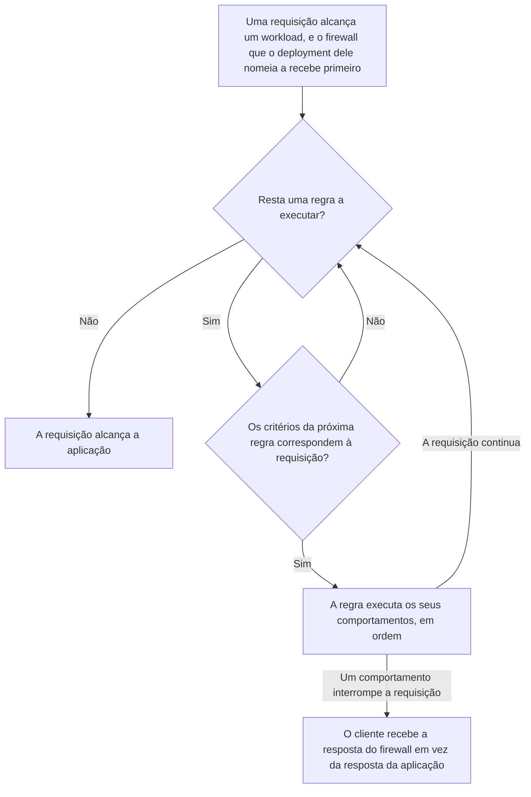
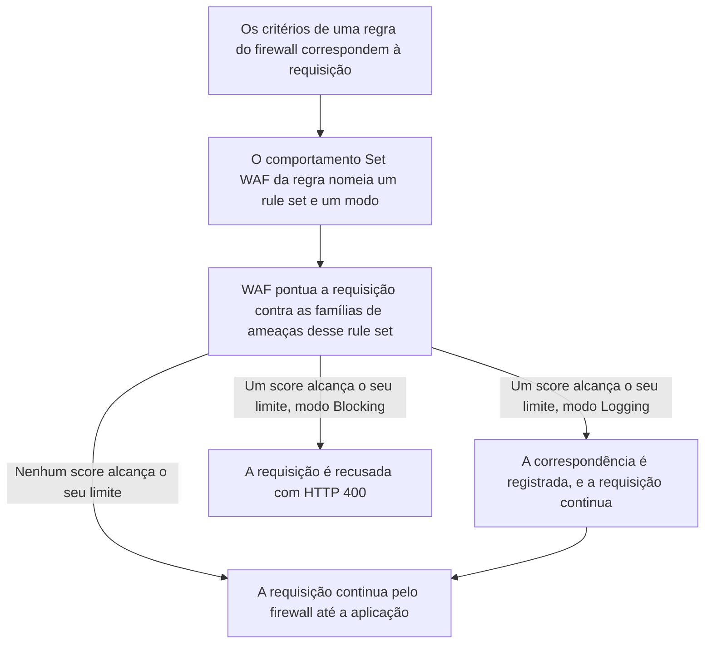
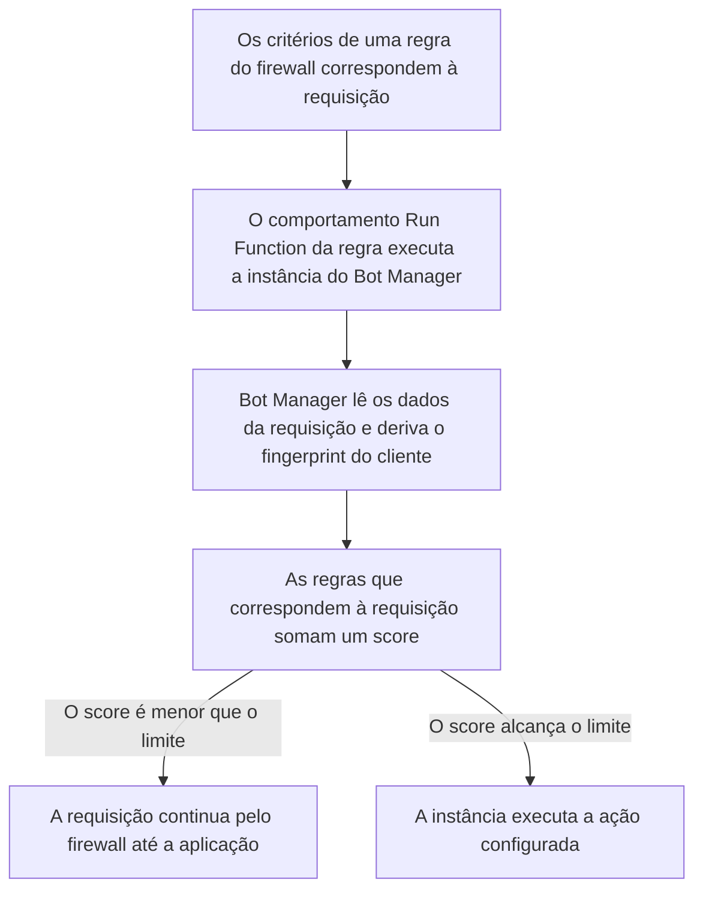

import FrameBox from '@aziontech/webkit/frame-box'
import ItemList from '@aziontech/webkit/item-list'
import DocItem from '@aziontech/webkit/doc-item'

Uma requisição a um site ou a uma API pode ser recusada antes que qualquer código da aplicação seja executado. Um ponto de controle na frente da aplicação lê o que a requisição carrega: o endereço de onde ela vem, o caminho que ela pede e os headers que ela envia. Ele compara esses dados com condições que você escreveu, e uma requisição que atende a uma delas recebe a ação que você associou a essa condição. Uma requisição que não atende a nenhuma segue até a aplicação sem alteração.

Na Azion, esse ponto de controle é um [firewall](/pt-br/documentacao/plataforma/firewall/), uma instância do recurso da plataforma Firewall. Um [workload](/pt-br/documentacao/plataforma/workloads/) vincula um firewall pelo seu deployment, então toda requisição ao workload atravessa o firewall antes da [aplicação](/pt-br/documentacao/plataforma/applications/) por trás dele. As condições e as ações são as regras de [Rules Engine para Firewall](/pt-br/documentacao/plataforma/firewall/rules-engine/), e cada regra associa critérios a comportamentos. Três produtos ampliam o que uma regra pode decidir. Web Application Firewall (WAF) pontua uma requisição contra padrões de ataque conhecidos, e Network Shield compara o endereço do cliente dela com uma lista. Bot Manager avalia se o cliente por trás da requisição é um script ou uma pessoa.

Esta página cobre os mecanismos, não os campos: cada critério, operador e comportamento está em Rules Engine para Firewall, e cada limite está em [Limites de Firewall](/pt-br/documentacao/plataforma/firewall/limites/). As seções seguem o caminho que uma requisição percorre, como as regras são executadas e o que o cliente recebe. Depois cobrem os produtos habilitados em um firewall, as funções em um firewall, a propagação e a observabilidade. WAF, Network Shield e Bot Manager fecham a página, nessa ordem.

---

## O caminho que uma requisição percorre

Um firewall não inspeciona nada até que um workload o nomeie. O vínculo fica no deployment do workload, não no firewall nem no registro do workload. No Azion Console, ele é o campo **Firewall** de **Deployment Settings**, e na API é o `strategy.attributes.firewall` do deployment. `azion create workload-deployment` o recebe como `--firewall-id`. O mesmo deployment nomeia a aplicação, então o firewall e a aplicação sempre andam juntos.

Um firewall não tem domínio próprio. Ele inspeciona as requisições de todo workload cujo deployment o nomeia, e um firewall que nenhum deployment nomeia não inspeciona nenhuma requisição.

Este diagrama acompanha uma requisição, do workload que ela alcança até a resposta que ela recebe:



1. Uma requisição alcança um workload. O firewall que o deployment do workload nomeia recebe a requisição antes da aplicação.
2. O firewall executa as suas regras em ordem e, para cada regra, compara os critérios da regra com a requisição.
3. Uma regra cujos critérios não correspondem não executa nada, e o firewall passa para a próxima regra.
4. Uma regra cujos critérios correspondem executa os seus comportamentos, na ordem em que estão organizados.
5. Um comportamento que interrompe a requisição, como uma negação, responde ao cliente, e nenhuma regra posterior é executada para essa requisição.
6. Uma requisição que nenhuma regra interrompe alcança a aplicação por trás do workload.

A recusa acontece no firewall, então a aplicação nunca recebe uma requisição que uma regra interrompe. Por exemplo, uma regra que nega uma lista de endereços responde `403` a cada um deles, e a aplicação não vê nenhuma dessas requisições. O preço é que a ordem decide. A primeira regra que interrompe uma requisição a resolve, então a posição de uma regra importa tanto quanto o que ela diz. Um firewall pode servir aos deployments de vários workloads, e uma mudança nas suas regras alcança, então, todos eles.

---

## Como as regras são executadas

Uma regra associa critérios, as condições que uma requisição precisa atender, a comportamentos, as ações tomadas quando ela as atende. Os critérios ficam em blocos. Dentro de um bloco, o primeiro critério começa com `if`, e cada um dos seguintes se junta a ele com `and` ou `or`. Quando os critérios correspondem à requisição, a regra executa os seus comportamentos na ordem em que estão organizados e, quando não correspondem, a regra não executa nada. Para cada critério, operador e comportamento, consulte [Rules Engine para Firewall](/pt-br/documentacao/plataforma/firewall/rules-engine/#criterios).

### Ordem das regras

Um firewall executa as suas regras em sequência até que uma delas bloqueie ou restrinja a requisição, ou até que todas as regras tenham sido executadas. Cada regra carrega um `order`, que a API atribui na ordem de criação a partir de `0`, e a lista **Rules Engine** no Azion Console pode ser reordenada. Um comportamento como _Deny (403 Forbidden)_ encerra a execução das regras: nenhum comportamento posterior e nenhuma regra posterior são executados para essa requisição.

A ordem, portanto, muda resultados que as regras sozinhas não mostram. Por exemplo, uma regra que aplica um rate limit a um caminho de login nunca conta as requisições que uma regra anterior nega, porque essas requisições nunca chegam a ela.

A ordem das regras também define a ordem em que as proteções do firewall agem sobre uma requisição. [DDoS Protection](/pt-br/documentacao/plataforma/workloads/#ddos-protection) age primeiro: avalia se cada requisição traz um ataque DoS ou DDoS e a bloqueia ou a permite antes que qualquer regra seja executada. WAF, Network Shield, Bot Manager e as funções não têm uma ordem fixa própria, porque cada um age apenas por meio de uma regra. Network Shield age pelo critério _Network_ de uma regra, WAF por _Set WAF_, e Bot Manager e as demais funções por _Run Function_. Eles agem, portanto, na ordem das regras que os chamam, e nenhum deles age sobre uma requisição que uma regra anterior interrompeu. Dentro de uma regra, _Set WAF_ e _Run Function_ são executados na ordem em que a regra os organiza.

Uma regra pertence ao firewall em que foi criada, e a API a mantém em `/v4/workspace/firewalls/<firewall-id>/request_rules` desse firewall. Uma regra, portanto, não pode ser compartilhada com outro firewall. Para começar um firewall a partir das regras de outro, clone-o: a lista **Firewalls** no Azion Console oferece **Clone** em cada linha. A API descreve um clone como uma cópia profunda do firewall, incluindo as instâncias de função e as regras do Rules Engine dele.

### Comportamentos que encerram a lista

A maioria dos comportamentos não pode ser seguida por outro na mesma regra. Apenas _Run Function_ e _Set WAF_ podem ser seguidos por outro comportamento, e Azion Console oferece cada um deles uma vez por regra. Escolher _Deny (403 Forbidden)_, _Drop (Close Without Response)_, _Set Rate Limit_ ou _Set Custom Response_ remove todo comportamento depois dele. Uma regra que executa uma função e depois nega a requisição é, portanto, válida, e uma regra que nega e depois executa uma função não é.

Um comportamento que define uma resposta não se acumula entre regras. Quando os critérios de várias regras que carregam _Set Custom Response_ são atendidos, apenas o da última dessas regras é executado.

### Rate limits

_Set Rate Limit_ conta requisições por segundo ou por minuto, conforme define o seu campo **Rate Limit Type**. O seu campo **Limit By** as conta por endereço IP do cliente ou entre todos os clientes. A contagem pertence à regra. Uma regra cujos critérios correspondem a mais de uma URI por meio de `or` compartilha um único rate limit entre todas elas. Um limite separado para cada URI exige, portanto, uma regra para cada URI. A Azion aplica a taxa configurada em cada data center, com um algoritmo leaky bucket.

Uma requisição que excede a taxa não é recusada imediatamente. O **Maximum Burst Size** define quantas requisições simultâneas entram em fila e são liberadas na taxa configurada, e ele se aplica apenas a uma taxa por segundo. Por exemplo, com uma taxa de uma requisição por segundo e um burst de um, requisições enviadas uma após a outra são retidas por cerca de um segundo cada e depois servidas. Apenas requisições que chegam ao mesmo tempo, além do burst, recebem `429`.

Nenhum header de rate limit volta em nenhuma resposta, seja a requisição servida ou recusada. Um cliente, portanto, não tem sinal de quanto tempo esperar antes de tentar de novo. Para os campos e os intervalos de valores deles, consulte [Set Rate Limit](/pt-br/documentacao/plataforma/firewall/rules-engine/#set-rate-limit).

---

## O que o cliente recebe

O comportamento que interrompe uma requisição decide o que o cliente recebe, e uma requisição que nenhuma regra interrompe recebe a resposta da aplicação. Esta tabela lista o que cada resultado retorna:

| Resultado | Valor na API | O que o cliente recebe |
| --- | --- | --- |
| _Deny (403 Forbidden)_ | `deny` | `403` e a página de erro padrão da Azion, com o título **Forbidden**. |
| _Drop (Close Without Response)_ | `drop` | Nenhuma resposta HTTP: nem linha de status nem corpo, imediatamente. Em HTTP/2, o stream da requisição é reiniciado, e em HTTP/1.1 a conexão é fechada sem que nada seja enviado. |
| _Set Rate Limit_, além do burst | `set_rate_limit` | `429` e a página de erro padrão, com o título **Too Many Requests**, sem header de rate limit. |
| _Set Custom Response_ | `set_custom_response` | O status code, o content type e o corpo que o comportamento define. O status code vai de 200 a 499. |
| _Set WAF_ em _Blocking_, com um score que alcança o seu limite | `set_waf` | `400` e a página de erro padrão, com o título **Bad Request**. |
| _Run Function_ | `run_function` | O que a função decidir. Uma instância do Bot Manager com `action` definido como `deny` responde `403`. |
| Nenhuma regra interrompe a requisição | — | A resposta da aplicação. |

Uma requisição descartada chega ao `curl` como um erro, não como um status:

```text
$ curl -i https://<your-workload-domain>/
curl: (92) HTTP/2 stream 1 was not closed cleanly: PROTOCOL_ERROR (err 1)

$ curl --http1.1 -i https://<your-workload-domain>/
curl: (52) Empty reply from server
```

Um script que lê o status code com `curl` recebe `000`, e um navegador mostra um erro de conexão em vez de uma página da Azion. O firewall fecha uma requisição descartada cerca de 0,15 segundo depois que o TLS termina, não por timeout, então um `000` em uma fração de segundo indica um descarte, e não uma falha de rede.

Negar e descartar diferem no que o cliente fica sabendo. Uma negação diz ao cliente que ele foi recusado, e a página de erro dela mostra um request ID que uma pessoa bloqueada por engano pode reportar. Um descarte não diz nada ao cliente. Isso deixa um cliente automatizado sem status a que reagir, e deixa uma pessoa bloqueada por engano sem nada para reportar.

---

## Produtos habilitados em um firewall

Um firewall decide com os critérios e os comportamentos que os seus produtos habilitados disponibilizam. No Azion Console, as **Main Settings** do firewall carregam as seções **General**, **Modules**, **Debug Rules** e **Status**. A seção **Modules** reúne quatro interruptores: **DDoS Protection Unmetered**, **Functions**, **Network Shield** e **Web Application Firewall**. A API carrega os mesmos quatro no objeto `modules` do firewall.

Um firewall novo começa com três deles ativados. Um firewall criado pela API apenas com um `name` retorna o seu objeto `modules` definido como:

```json
{
  "ddos_protection": { "enabled": true },
  "functions": { "enabled": true },
  "network_protection": { "enabled": true },
  "waf": { "enabled": false }
}
```

A página **Create Firewall** no Azion Console começa com os mesmos interruptores ativados. Um firewall criado a partir de um drawer do Console, e não dessa página, começa com **Functions** desativado, então verifique esse interruptor antes de contar com _Run Function_.

[DDoS Protection](/pt-br/documentacao/plataforma/workloads/#ddos-protection) está sempre ativado. O seu interruptor carrega a tag **Automatically enabled in all accounts** e não pode ser desativado, e a API trata `ddos_protection` como somente leitura.

Cada um dos outros três controla o que uma regra pode usar. Uma opção controlada continua visível no formulário do Rules Engine enquanto o seu produto está desativado, desabilitada e com um rótulo que nomeia o produto de que precisa:

| Produto no firewall | O que acrescenta a uma regra | Rótulo enquanto o produto está desativado |
| --- | --- | --- |
| Web Application Firewall | Os critérios _Header Accept_, _Header Accept Encoding_, _Header Accept Language_, _Header Cookie_, _Header Origin_, _Header Referer_, _Header User Agent_, _Request Args_ e _Request Method_, e o comportamento _Set WAF_ | _Set WAF - required WAF_, e o mesmo sufixo em cada critério |
| Network Shield | O critério _Network_, `${network}` na API | _Network - required Network Shield_ |
| Functions | O comportamento _Run Function_ | _Run Function - required Functions_ |
| Nenhum | Os critérios _Host_, _Request Uri_, _Scheme_, _Ssl Verification Status_ e _Client Certificate Validation_, e os comportamentos _Deny (403 Forbidden)_, _Drop (Close Without Response)_, _Set Rate Limit_ e _Set Custom Response_ | Sempre oferecidos |

Um firewall precisa de pelo menos um entre [Functions](/pt-br/documentacao/plataforma/functions/), Web Application Firewall ou Network Shield habilitado para funcionar. Os comportamentos nativos não precisam de nenhum produto. Azion Console sempre os oferece, e _Deny (403 Forbidden)_, _Drop (Close Without Response)_ e _Set Rate Limit_ são aplicados em um firewall com Network Shield desativado. Azion Console lê o firewall salvo, então, depois de ativar um produto, salve **Main Settings** antes que as opções dele fiquem selecionáveis.

Bot Manager não tem interruptor. Ele roda como uma instância de função no firewall, invocada por um comportamento _Run Function_, então depende de Functions estar ativado. Para essa cadeia, consulte [Bot Manager](/pt-br/documentacao/plataforma/firewall/como-funciona/#bot-manager).

Esse controle impede que uma regra dependa de um produto que o firewall não executa. O custo é que regras e configurações passam a depender umas das outras nas duas direções. Para as duas recusas que isso produz, consulte [O que Network Shield acrescenta a um firewall](/pt-br/documentacao/plataforma/firewall/como-funciona/#o-que-network-shield-acrescenta-a-um-firewall).

---

## Funções em um firewall

Uma função em um firewall roda na fase de requisição, a única fase que um firewall tem: todas as suas regras são regras de requisição. Três objetos ficam entre uma função e uma requisição. A função declara o ambiente de execução `firewall`, uma instância de função no firewall carrega os argumentos dela, e o comportamento _Run Function_ de uma regra nomeia essa instância pelo ID.

Quando os critérios da regra correspondem, o comportamento entrega a requisição ao Azion Runtime, que executa a função e retorna um resultado. Rules Engine para Firewall então retoma a partir do ponto em que o comportamento foi executado, com base nesse resultado. A função pode negar a requisição, descartá-la ou respondê-la ela mesma. Para os métodos que uma função de firewall chama sobre a requisição, consulte [Functions no Firewall](/pt-br/documentacao/plataforma/firewall/functions/#metodos-do-evento).

Uma função carrega argumentos padrão, e cada instância carrega os seus. Os argumentos da função são a base de toda instância, e os argumentos da instância os sobrescrevem. Os padrões são aplicados quando a função roda, não copiados para a instância: uma instância criada com um objeto vazio armazena `{}`. Nada valida os argumentos de uma instância, então uma chave escrita errada é armazenada e ignorada, enquanto a função roda com o seu padrão. Para mais informações, consulte [Instâncias de função no Firewall](/pt-br/documentacao/plataforma/firewall/functions-instances/#argumentos).

Uma função pode sustentar várias instâncias em um firewall, cada uma com os seus argumentos e cada uma executada pela sua própria regra. É assim que uma função instalada atende duas fatias de tráfego com duas configurações. Uma instância pertence ao firewall em que foi criada, e uma função escrita para o ambiente de execução de aplicação não pode ser instanciada em um firewall. Para os limites do nome de uma instância e dos argumentos dela, consulte [Limites de Firewall](/pt-br/documentacao/plataforma/firewall/limites/#regras-e-instancias-de-funcao).

---

## Propagação

Uma mudança salva não chega ao tráfego imediatamente. Ela se propaga pela infraestrutura distribuída da Azion, e o tempo que isso leva depende do que mudou. Nenhuma duração é garantida:

| O que mudou | Tempo até as requisições mostrarem a mudança |
| --- | --- |
| Uma regra adicionada a um firewall que já atende tráfego | De 6 minutos e 29 segundos a 9 minutos e 18 segundos |
| Um workload recém-vinculado a um firewall, até a primeira regra ser aplicada | De 5 minutos e 12 segundos a 7 minutos e 5 segundos em uma execução, e 22 minutos em outra |
| Os itens de uma network list que regras já referenciam | De 46 a 61 segundos para a primeira resposta alterada, e cerca de 100 segundos para todas as respostas |
| Os argumentos de uma instância de função | Cerca de 105 segundos |

Entre a primeira resposta alterada e a última, as requisições alternam entre o resultado anterior e o alterado. Durante uma mudança em uma network list, quatro rodadas de requisições ao mesmo caminho retornaram `403`, `403`, `204` e `204`. Uma única requisição logo depois de uma mudança, portanto, prova pouco. Por exemplo, depois que você remove o seu próprio endereço de uma blocklist, uma requisição pode passar e a seguinte ainda pode ser recusada.

Um workload novo responde com o `404` provisório da Azion até que o vínculo com a aplicação se propague, e o firewall pode entrar no caminho muito depois da aplicação. Em um workload novo, a aplicação respondeu depois de 5 minutos e 51 segundos, enquanto o firewall aplicou a primeira regra só depois de 22 minutos. Um domínio que responde, portanto, não significa que o firewall já está no caminho. Verifique uma mudança repetindo a requisição até que ela responda como esperado e as respostas concordem, nunca com uma única requisição.

---

## Observabilidade

Uma decisão do firewall deixa pouco na resposta. Nenhum header nomeia o firewall, a regra ou a lista que decidiu. Toda resposta, interrompida ou não, carrega um header `x-azion-request-id`, e a página de erro padrão da Azion repete esse ID na linha Request ID. A linha Your IP mostra o endereço do cliente, que é o endereço que um critério _Network_ compara com a sua lista:

```text
$ curl -i https://<your-workload-domain>/
HTTP/2 403
server: nginx
date: Tue, 29 Sep 2026 02:28:09 GMT
content-type: text/html; charset=utf-8
x-content-type-options: nosniff
x-azion-request-id: <request-id>
x-azion-edge-location: SDU
alt-svc: h3=":443"; ma=86400

<title>Azion - Default error page</title>
...
<h1 class="error-header__title">Forbidden</h1>
...
Your IP         <your-ip>
Request ID      <request-id>
Status Code     403
Edge Location   SDU
```

O status distingue os resultados: `403` para uma negação, `429` para um rate limit, `400` para um bloqueio do WAF e nenhuma resposta para um descarte. Uma requisição descartada não carrega header, então o cliente dela não tem request ID para reportar.

Qual regra decidiu é respondido pelos logs, e apenas enquanto a configuração **Debug Rules** do firewall está ativada. A configuração fica em **Main Settings**, registra as regras que são executadas e vem desativada por padrão. Com ela ativada, [Real-Time Events](/pt-br/documentacao/plataforma/real-time-events/) e [Data Stream](/pt-br/documentacao/plataforma/data-stream/) mostram as regras que uma requisição executou no campo `$traceback`. A GraphQL API do Real-Time Events as mostra na variável `$stacktrace`.

Manter a regra fora da resposta significa que um cliente não consegue saber qual regra o bloqueou, e a consulta passa para você. Um cliente pode reportar um status e um request ID, e a regra por trás deles vem dos logs. Para o procedimento, consulte [Faça o debug de regras criadas com Rules Engine](/pt-br/documentacao/guias/desenvolvimento-de-aplicacoes/primeiros-passos/debug-regras/).

---

## WAF

Uma requisição pode carregar um ataque na query string, em um header ou no corpo que ela envia. Um web application firewall lê essas partes antes da aplicação e pesa o que encontra contra padrões de ataque conhecidos. Quando as evidências se somam, ele recusa a requisição e, caso contrário, a requisição alcança a aplicação sem alteração.

Em um firewall, WAF age em um ponto do caminho da requisição: uma regra cujo comportamento _Set WAF_ nomeia um rule set e um modo. O rule set guarda o que detectar, oito famílias de ameaças e a sensibilidade escolhida para cada uma, e a regra decide quando ele se aplica. Um rule set gerenciado configurado em outro lugar se transfere no mesmo formato: você escolhe categorias, que aqui são as famílias de ameaças, e um rigor para cada uma, que é a sensibilidade dela. As regras individuais ficam com a plataforma. WAF também precisa estar habilitado no firewall, e é o único produto que um firewall novo traz desativado: `modules.waf.enabled` mostra `false` até que você o ative. Um rule set aplicado em um firewall sem WAF nunca roda. Para saber onde fica esse interruptor, consulte [Defina as configurações principais de um firewall](/pt-br/documentacao/guias/seguranca-de-aplicacoes/firewall-e-waf/firewall-definir-main-settings/).

Os campos de um rule set, as famílias de ameaças, os cinco níveis de sensibilidade e as regras internas estão em [Rule sets do WAF](/pt-br/documentacao/plataforma/firewall/waf/rule-sets/). Os campos de uma exceção estão em [Exceções do WAF](/pt-br/documentacao/plataforma/firewall/waf/custom-allowed-rules/).

### Onde WAF age sobre uma requisição

Criar um rule set não inspeciona nada. Um rule set é um objeto de configuração que não carrega domínio, caminho nem método, então ele pontua exatamente as requisições que os critérios de uma regra entregam a ele. Uma regra carrega no máximo um comportamento _Set WAF_, então uma regra decide um rule set e um modo para as requisições a que corresponde.

Este diagrama acompanha uma requisição, da regra que corresponde a ela até a decisão do WAF:



1. Uma regra no firewall corresponde à requisição, e o comportamento _Set WAF_ dela nomeia um rule set e um modo, `logging` ou `blocking`.
2. WAF pontua a requisição contra as famílias de ameaças configuradas nesse rule set.
3. Um score que alcança o limite da sua família torna a requisição uma correspondência.
4. Em _Blocking_, uma correspondência é recusada com `400`. Em _Logging_, uma correspondência é registrada e servida.
5. Uma requisição que não alcança nenhum limite continua pelas regras do firewall até a aplicação.

Manter o rule set separado da regra é o que permite que um rule set rode de duas maneiras. O modo pertence ao comportamento, então o mesmo rule set roda em _Logging_ em uma regra e em _Blocking_ em outra, sobre os caminhos que você escolher. Isso custa um objeto e uma etapa: um rule set que nenhuma regra referencia não inspeciona nada, por mais cuidadosamente que as suas famílias estejam configuradas.

Para saber como WAF pontua uma requisição, o que cada modo faz e como exceções e tuning restringem um rule set, consulte [Score e modos](/pt-br/documentacao/plataforma/firewall/waf/score-e-modos/).

---

## Network Shield

Parte do tráfego é indesejada por causa de onde vem, não do que pede. A fonte pode ser um endereço que abusou de um formulário de login, uma rede inteira ou um país em que o seu serviço não opera. Bloquear pela fonte compara o endereço do cliente de cada requisição com uma lista e recusa a requisição antes que a aplicação a veja. A lista pode mudar com a mesma frequência que as ameaças, enquanto a regra que a lê continua a mesma.

Em um firewall, Network Shield age por meio de um critério de uma regra. A lista é uma [network list](/pt-br/documentacao/plataforma/firewall/network-shield/network-lists/), e a comparação é o critério _Network_, `${network}` na API. O que acontece com uma requisição que corresponde é o comportamento da regra, que Rules Engine para Firewall define e Network Shield não altera. Uma network list não decide nada sozinha, e criar uma não bloqueia nenhuma requisição. Uma lista só corresponde a tráfego depois que uma regra a referencia, em um firewall que o deployment de um workload nomeia.

### O que Network Shield acrescenta a um firewall

Network Shield acrescenta uma coisa a um firewall: o critério _Network_. Enquanto Network Shield está desativado, a API recusa uma regra que usa `${network}` com `25047 Missing Required Modules`. Azion Console mostra a opção desabilitada, como _Network - required Network Shield_. Todo comportamento que uma regra correspondente executa pertence ao Firewall: _Deny (403 Forbidden)_, _Drop (Close Without Response)_ e _Set Rate Limit_ são aplicados com Network Shield desativado. Uma regra pode encadear o critério _Network_ com qualquer outro critério que o firewall oferece.

Um firewall novo começa com Network Shield ativado: o interruptor do Console vem ativado por padrão, e a API retorna `modules.network_protection.enabled` como `true`. O interruptor fica em **Main Settings**, na seção **Modules**, e a opção _Network_ fica selecionável depois que você salva o firewall com ele ativado. Depois que uma regra usa o critério _Network_, Network Shield não pode ser desativado. A mudança é recusada com `24005`, e o detalhe dela lista os IDs das regras.

As duas recusas importam quando uma regra passa de um firewall para outro. Uma regra _Network_ recriada em um firewall em que Network Shield está desativado é recusada até que Network Shield seja ativado ali. No firewall de onde a regra veio, Network Shield só é desativado depois que toda regra _Network_ dele for excluída ou alterada. Uma regra que usa o critério _Network_ conta para as regras do firewall como qualquer outra regra. Para as regras que cada plano inclui, consulte [Limites de Firewall](/pt-br/documentacao/plataforma/firewall/limites/#uso-incluido-por-plano).

O preço de corresponder pela fonte é que o critério _Network_ lê apenas o endereço do cliente. Ele diz de onde uma requisição vem e nada sobre o que ela carrega. Uma regra que também precisa do caminho encadeia um segundo critério, como _Request Uri_, no mesmo bloco. Por exemplo, uma regra pode negar os países de uma lista, a menos que a requisição venha do Googlebot. Os critérios dela são _Network_ _matches_ a lista _and_ _Header User Agent_ _does not match_ `Googlebot`, e o comportamento dela é _Deny (403 Forbidden)_. _Header User Agent_ precisa de WAF no firewall, e um cliente define o seu próprio `User-Agent`, então qualquer cliente pode alegar ser o Googlebot.

Para saber como uma lista corresponde ao endereço do cliente, quando os itens expiram e quais listas a Azion mantém, consulte [Correspondência de listas](/pt-br/documentacao/plataforma/firewall/network-shield/correspondencia-de-listas/).

---

## Bot Manager

Um script e uma pessoa chegam a uma aplicação do mesmo jeito, por HTTP, e a requisição é tudo o que existe para diferenciá-los. O gerenciamento de bots pesa a evidência que uma requisição carrega: os headers que envia, o endereço de onde vem e a sessão que apresenta. Cada verificação que encontra algo soma pontos a um único score. Quando o score alcança um valor que você define, a requisição recebe uma ação e, com um score menor que esse valor, a aplicação recebe a requisição sem alteração.

Em um firewall, Bot Manager age como uma instância de função, não como um interruptor em **Modules**. A função Bot Manager instalada é instanciada no firewall com um objeto JSON de argumentos, e uma regra cujo comportamento é _Run Function_ a executa. A instância guarda o score a partir do qual Bot Manager age e a ação que ele toma, e a regra decide quais requisições recebem um score.

[Bot Manager Lite](/pt-br/documentacao/plataforma/firewall/bot-manager/bot-manager-lite/) é a edição self-service, instalada pelo Azion Marketplace. As duas edições diferem no que usam para calcular o score, não no que fazem com um score.

### Onde Bot Manager age sobre uma requisição

Uma função Bot Manager instalada não pontua nada sozinha. Cinco objetos colocam uma requisição sob inspeção, e cada um nomeia o seguinte:

- A função Bot Manager instalada.
- Um firewall com Functions habilitado.
- Uma instância de função nesse firewall, carregando os argumentos.
- Uma regra nesse firewall cujo comportamento _Run Function_ nomeia a instância.
- Um workload vinculado ao firewall pelo seu deployment.

Este diagrama acompanha uma requisição, da regra que corresponde a ela até a decisão do Bot Manager:



1. Uma regra no firewall corresponde à requisição, e o comportamento _Run Function_ dela executa uma instância do Bot Manager, com os argumentos que essa instância carrega.
2. Bot Manager lê os dados que a requisição carrega, incluindo os dados de dispositivo, de navegador e de rede, e deriva o fingerprint do cliente por trás dela.
3. Bot Manager pontua a requisição contra as suas regras e compara o score com o limite da instância.
4. Um score igual ou maior que o limite executa a ação configurada. Um score menor deixa a requisição seguir até a aplicação.

Manter a seleção em uma regra deixa a mira da inspeção com você: uma instância pontua as requisições a que a sua regra corresponde, não tudo o que o firewall vê. Isso custa um objeto e uma etapa. Uma instância que nenhuma regra nomeia fica inerte, quaisquer que sejam os seus argumentos, e uma regra cujos critérios nunca correspondem não pontua nada.

Para saber como Bot Manager calcula um score e age sobre ele, e como fingerprints, cookies de sessão e modos o moldam, consulte [Score de bots](/pt-br/documentacao/plataforma/firewall/bot-manager/score-de-bots/).

---

## Recursos relacionados

<FrameBox>
<ItemList>
  <DocItem title="Rules Engine para Firewall" href="/pt-br/documentacao/plataforma/firewall/rules-engine/">Cada critério, operador e comportamento que uma regra combina, com os campos por trás da ordem de regras desta página.</DocItem>
  <DocItem title="Functions no Firewall" href="/pt-br/documentacao/plataforma/firewall/functions/">O evento de firewall e os métodos que uma função chama para negar, descartar ou responder a uma requisição.</DocItem>
  <DocItem title="Instâncias de função no Firewall" href="/pt-br/documentacao/plataforma/firewall/functions-instances/">Os campos e os argumentos de uma instância, e o comportamento Run Function que a executa.</DocItem>
  <DocItem title="Limites de Firewall" href="/pt-br/documentacao/plataforma/firewall/limites/">Os limites dentro dos quais esses mecanismos operam, para o firewall e para WAF, Network Shield e Bot Manager.</DocItem>
</ItemList>
</FrameBox>
