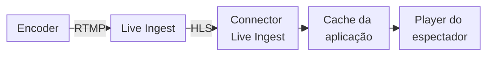

import FrameBox from '@aziontech/webkit/frame-box'
import ItemList from '@aziontech/webkit/item-list'
import DocItem from '@aziontech/webkit/doc-item'

Uma transmissão ao vivo é assistida enquanto é produzida. Um encoder captura o áudio e o vídeo e envia a transmissão a um ponto de ingestão à medida que a captura. O ponto de ingestão empacota a transmissão em arquivos que um player busca por HTTP, e um servidor entrega esses arquivos a cada espectador. Eventos ao vivo, partidas de e-sports e transmissões educacionais chegam ao seu público dessa forma.

Na Azion, [Live Ingest](/pt-br/documentacao/plataforma/connectors/#live-ingest) é o ponto de ingestão. Seu encoder envia a transmissão a ele por RTMP, na região de um connector do tipo `live_ingest`, e Live Ingest converte a transmissão para HLS. Uma [aplicação](/pt-br/documentacao/plataforma/applications/) entrega a transmissão aos espectadores por meio desse connector. Para saber onde Live Ingest atua sobre a requisição de um espectador, consulte [Como Connectors funciona](/pt-br/documentacao/plataforma/connectors/como-funciona/#live-ingest).

As seções tratam da ingestão, da região, da entrega e da métrica de cobrança.

---

## Ingestão

A ingestão é o trecho entre o seu encoder e a Azion. Live Ingest recebe a transmissão por RTMP, então o encoder precisa suportar RTMP com autenticação por usuário e senha. A Azion fornece as credenciais e as URLs de ingestão de um endpoint primário e de um endpoint de backup. Você configura o encoder com elas, então somente um encoder que tem as credenciais publica no endpoint.

Live Ingest converte a transmissão RTMP para HLS para a entrega. Por isso, o encoder não precisa de uma saída HLS própria, e a transmissão que ele envia é a fonte de cada arquivo que os espectadores buscam.

A Azion pode exigir encoders, configurações e endpoints suportados ou aprovados.

---

## Região

Um connector do tipo `live_ingest` carrega um atributo: a região onde Live Ingest recebe a sua transmissão. O encoder envia a transmissão para essa região. Uma região próxima ao encoder encurta o caminho que a transmissão percorre antes que a Azion a receba, o que reduz a latência dela.

A região é obrigatória. No Azion Console, **Region** é um campo obrigatório do tipo de connector _Live Ingest_. Na API, o campo é `attributes.region`. Os dois aceitam um de cinco valores: `us-east-1`, `us-east-2`, `br-east-1`, `br-east-2` e `br-east-3`.

A região decide onde a transmissão entra na Azion, não onde os espectadores se conectam. Os espectadores alcançam a aplicação por meio de um hostname de workload, na infraestrutura distribuída da Azion. Por isso, a escolha considera a localização do encoder, não a do público. Por exemplo, quando você transmite um evento de um local para espectadores em vários continentes, escolha a região com o caminho mais curto a partir desse local.

Um `POST` para `/v4/workspace/connectors` com este corpo cria um connector do tipo `live_ingest` em `br-east-1`:

```json
{
  "name": "my-connector",
  "type": "live_ingest",
  "attributes": { "region": "br-east-1" }
}
```

A API responde `202` com `"state": "pending"`, e a leitura do connector retorna `"attributes": {"region": "br-east-1"}`. Para os erros que uma região ausente ou desconhecida retorna, consulte [Configurações de connector](/pt-br/documentacao/plataforma/connectors/configuracoes/#live-ingest).

---

## Entrega

Os espectadores não se conectam ao encoder e não alcançam Live Ingest diretamente. O player de um espectador solicita a transmissão por HTTP a um hostname de um workload. A aplicação por trás desse workload alcança a transmissão por meio de uma regra cujo behavior _Set Connector_ nomeia o connector do tipo `live_ingest`.

Este diagrama acompanha a transmissão do encoder até o player de um espectador:



1. O encoder envia a transmissão por RTMP a Live Ingest, na região do connector.
2. Live Ingest converte a transmissão para HLS: uma playlist e os segmentos que ela lista.
3. A aplicação alcança a transmissão por meio do connector que o behavior _Set Connector_ de uma regra nomeia.
4. A aplicação armazena em cache cada playlist e cada segmento sob a política do behavior _Enforce HLS cache_.
5. O player do espectador busca a playlist e os segmentos dela na aplicação.

Uma transmissão HLS tem dois tipos de arquivo. A playlist, `.m3u8`, é reescrita conforme a transmissão avança, e um player a lê para encontrar os segmentos que o encoder já escreveu. Cada segmento, `.ts`, é escrito uma vez e nunca muda.

Quando você seleciona uma fonte Live Ingest em uma regra, a Azion adiciona o behavior _Enforce HLS cache_ a essa regra da Request Phase. O behavior ignora as regras de cache da aplicação e aplica a política de cache que a Azion define para transmissões HLS ao vivo. Essa política dá às playlists um tempo de cache curto e aos segmentos um tempo mais longo. Para o tempo de cache de cada tipo de arquivo, consulte [Rules Engine para Applications](/pt-br/documentacao/plataforma/applications/rules-engine/#enforce-hls-cache).

Enquanto uma cópia em cache de uma playlist ou de um segmento é válida, a aplicação responde aos espectadores a partir dessa cópia, e as requisições deles não chegam ao connector. Uma cópia de um segmento responde a cada espectador que a solicita nesse período. Por isso, um público grande não envia cada uma das suas requisições a Live Ingest.

O tempo de cache curto da playlist é a contrapartida. Ele mantém cada espectador próximo do que o encoder escreveu, e envia uma nova requisição da playlist ao connector toda vez que a cópia expira. Para aplicar a política a uma transmissão, consulte [Implemente cache HLS para streaming ao vivo](/pt-br/documentacao/guias/midia-e-streaming/streaming/implementar-cache-hls/).

Para contar os espectadores das suas transmissões, a GraphQL API de Real-Time Metrics oferece o dataset `connectedUsersMetrics`, com dados agregados sobre os usuários conectados às suas transmissões ao vivo. Para mais informações, consulte [Real-Time Metrics](/pt-br/documentacao/plataforma/real-time-metrics/).

---

## Métrica de cobrança

Live Ingest é cobrado por Data Ingestion, o volume de dados de transmissão que a Azion ingere, medido por GB. Para a tarifa, consulte [Preços](/pt-br/documentacao/fundamentos/precos/#live-ingest).

---

## Recursos relacionados

<FrameBox>
<ItemList>
  <DocItem title="Configurações de connector" href="/pt-br/documentacao/plataforma/connectors/configuracoes/#live-ingest">O campo region de um connector do tipo live_ingest, com os erros que uma região ausente ou desconhecida retorna.</DocItem>
  <DocItem title="Implemente cache HLS para streaming ao vivo" href="/pt-br/documentacao/guias/midia-e-streaming/streaming/implementar-cache-hls/">Cache settings e regras que dão à playlist e aos segmentos de uma transmissão HLS tempos de cache próprios.</DocItem>
  <DocItem title="Boas práticas de Connectors" href="/pt-br/documentacao/plataforma/connectors/boas-praticas/#live-ingest">Recomendações para operar um connector, incluindo o encoder, os endpoints e o cache de uma transmissão ao vivo.</DocItem>
  <DocItem title="Transmitir eventos ao vivo para grandes audiências" href="/pt-br/documentacao/casos-de-uso/entregar-midia-e-streaming/transmitir-eventos-ao-vivo-para-grandes-audiencias/">A arquitetura que combina um componente de ingestão, uma aplicação e o cache dela para entregar uma transmissão ao vivo.</DocItem>
</ItemList>
</FrameBox>
