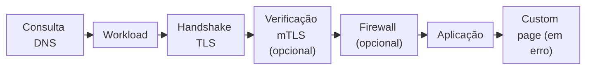
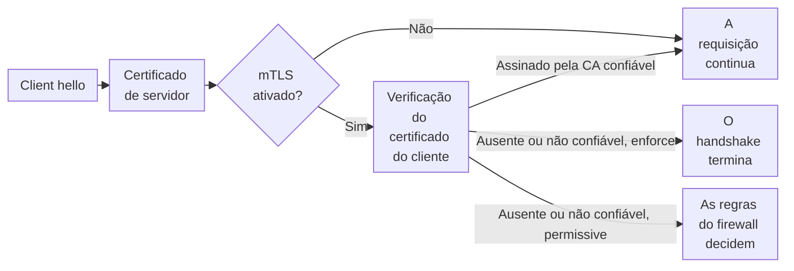
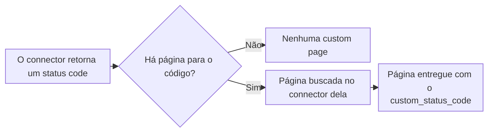
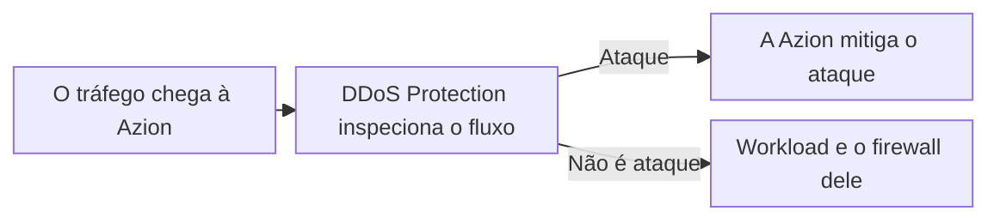

import FrameBox from '@aziontech/webkit/frame-box'
import ItemList from '@aziontech/webkit/item-list'
import DocItem from '@aziontech/webkit/doc-item'

Antes que um site responda a uma requisição, três coisas acontecem no ponto onde o tráfego entra. Uma consulta DNS transforma o hostname em um endereço. O cliente abre uma conexão segura, na qual o servidor prova que tem um certificado para esse nome. A plataforma, então, escolhe a configuração que responde ao hostname. Só depois disso algum código da aplicação é executado.

Na Azion, esse ponto de entrada é um [workload](/pt-br/documentacao/plataforma/workloads/). Ele guarda os hostnames pelos quais uma requisição pode chegar, as configurações de TLS da conexão e as portas e versões HTTP que aceita. O deployment dele nomeia a [aplicação](/pt-br/documentacao/plataforma/applications/) que responde e, opcionalmente, o [firewall](/pt-br/documentacao/plataforma/firewall/) que inspeciona as requisições primeiro e o conjunto de custom pages que substitui as respostas de erro. Na API v3, um único objeto domain cumpria esse papel. Na API v4, o workload e o seu deployment o substituem, e [Migração para API v4](/pt-br/documentacao/fundamentos/api-v4-migration/) mapeia os dois modelos.

Esta página cobre os mecanismos, não os campos: cada campo está em [Configurações de workload](/pt-br/documentacao/plataforma/workloads/configuracoes/#dominios), e cada limite está em [Limites de Workloads](/pt-br/documentacao/plataforma/workloads/limites/). As seções seguem o caminho que uma requisição percorre, o workload domain e os domínios personalizados, a infraestrutura, TLS e as versões HTTP, o deployment e a propagação. Certificate Manager, Custom Pages e DDoS Protection fecham a página, nessa ordem.

---

## O caminho que uma requisição percorre

Uma requisição alcança um workload pelo seu hostname, e o workload decide tudo o que acontece antes que a aplicação a veja. O hostname é o workload domain que a Azion gera ou um domínio seu listado no workload. A conexão, a verificação do certificado do cliente e o firewall pertencem ao workload e ao seu deployment, então a aplicação recebe apenas as requisições que passaram por eles.

Este diagrama acompanha uma requisição, da consulta DNS até a resposta:



1. O cliente consulta o hostname. Para um domínio personalizado que aponta para o workload domain, o DNS retorna o endereço do data center mais próximo da infraestrutura distribuída da Azion.
2. O cliente se conecta a esse data center, e o workload que lista o hostname recebe a requisição.
3. O workload completa o handshake TLS com o seu certificado, a sua versão mínima de TLS e o seu conjunto de cifras. Com o mTLS ativado, ele também verifica o certificado do cliente.
4. Quando o deployment nomeia um firewall, o firewall executa as suas regras sobre a requisição antes da aplicação.
5. A aplicação do deployment trata a requisição e busca o conteúdo pelo seu connector.
6. Quando o connector responde com um status code de erro que o conjunto de custom pages do deployment cobre, o cliente recebe a custom page no lugar dessa resposta.

Manter o ponto de entrada separado da aplicação permite que os hostnames e as configurações de TLS mudem sem alterar o código da aplicação. O preço é que o caminho de uma requisição depende de dois objetos. Um workload sem deployment propagado não tem aplicação para onde enviar a requisição, e uma aplicação não serve tráfego até que um deployment a vincule a um workload.

---

## Workload domain e domínios personalizados

Um hostname é o nome que um cliente pede, e um workload responde apenas aos hostnames que lista. Criar um workload gera o seu workload domain, um hostname somente leitura na zona `azionedge.net`. Um workload de produção recebe `<id>.map.azionedge.net`, e um workload de staging recebe `<id>.preview.azionedge.net`. O workload serve tráfego nesse hostname assim que o seu deployment se propaga, antes que você tenha ou aponte qualquer domínio.

Mais dois tipos de hostname entram nos domínios do workload. O primeiro é o hostname gratuito em `azion.app`, como `my-site.azion.app`, que Azion Console chama de **Azion Custom Domain**. Um workload guarda no máximo um, e um nome que outro workload já guarda não está disponível. A Azion o serve por HTTPS com o seu próprio certificado SAN, então ele não precisa de nenhum certificado seu.

O segundo tipo é um domínio personalizado: um hostname de um domínio que você já tem, como `www.example.com`. Você lista cada um no workload e, depois, o aponta para o workload domain com um registro CNAME no seu provedor de DNS. Em vez disso, [Edge DNS](/pt-br/documentacao/plataforma/edge-dns/) pode hospedar a zona e vincular o domínio à Azion. A conta precisa ter permissão para todo domínio que o workload lista.

Por exemplo, um site que roda em `www.example.com` em outro provedor passa para a Azion com duas mudanças. Você adiciona `www.example.com` aos domínios do workload e, depois, substitui o registro DNS de `www.example.com` por um CNAME para o workload domain. Os visitantes alcançam o workload assim que os seus resolvers obtêm o novo registro. Para os registros DNS passo a passo, consulte [Aponte um domínio para um workload](/pt-br/documentacao/guias/plataforma/migracao/apontar-dominio-para-a-azion/).

O workload domain continua acessível ao lado dos seus próprios hostnames enquanto **Workload Domain Allow Access** está ativado, que é o padrão. Desative-o quando o workload precisar responder apenas nos seus próprios hostnames: o workload domain passa a responder `404`, enquanto os seus domínios continuam servindo. Um workload não pode fechar o seu workload domain sem outro hostname em que responder, então a API recusa essa mudança em um workload cuja lista de domínios está vazia. O workload domain também fica em uma zona que a Azion compartilha com outros clientes. Servir um domínio seu, portanto, exige um certificado de servidor para esse domínio, como descreve TLS e versões HTTP. Para as regras que a API aplica a cada hostname, consulte [Configurações de workload](/pt-br/documentacao/plataforma/workloads/configuracoes/#conjuntos-de-cifras).

---

## Infraestrutura

Um workload roda em uma de duas redes, escolhida uma única vez. O controle **Infrastructure** escolhe a Production Network, para disponibilidade global, ou _Staging Infrastructure_, a Staging Network para testes com propagação limitada. A escolha também define o sufixo do workload domain: `.map.azionedge.net` em produção e `.preview.azionedge.net` em staging.

Um workload de staging não aceita domínio personalizado, então você o alcança apenas pelo seu workload domain. As mudanças que você faz nele não afetam um workload de produção. Para abrir uma aplicação no seu próprio hostname antes que os registros DNS dele mudem, use um workload de produção que liste o hostname. Depois, mapeie esse hostname para o endereço do workload domain no arquivo hosts do seu dispositivo. Todos os outros visitantes continuam alcançando o provedor atual. Para os passos, consulte [Teste uma aplicação pelo arquivo hosts](/pt-br/documentacao/guias/desenvolvimento-de-aplicacoes/primeiros-passos/testar-edge-application-atraves-do-arquivo-hosts/).

A infraestrutura é fixada na criação, e a API recusa uma atualização que a altere. Por exemplo, uma configuração que você testou em um workload de staging chega à produção como um segundo workload, criado com a infraestrutura de produção, não como uma edição do primeiro. O preço dessa divisão é que staging e produção são dois workloads com dois deployments, que você mesmo mantém em sincronia.

---

## TLS e versões HTTP

O TLS criptografa a conexão entre o cliente e o workload, e as configurações `tls` do workload decidem se um handshake tem sucesso. O workload apresenta um certificado para o hostname, e o cliente e o workload combinam uma versão de TLS e uma cifra. Essas configurações protegem o trecho do cliente até a Azion. A conexão da Azion até a sua origem é definida no [connector](/pt-br/documentacao/plataforma/connectors/) que a aplicação usa.

O certificado vem de um de dois lugares. Com `tls.certificate` definido como `null`, o workload usa o certificado SAN da Azion, que cobre o workload domain e o Azion Custom Domain. Para um domínio seu, você vincula um certificado de servidor de Certificate Manager, e o certificado protege o tráfego HTTPS assim que o workload o usa. A API não compara os nomes do certificado com os domínios do workload, então aceita um certificado que não os cobre. Verifique os nomes antes de vincular um certificado.

A versão mínima de TLS e o conjunto de cifras funcionam como a barreira do handshake. A versão mínima é a mais baixa que o workload aceita, então uma sessão ainda pode usar uma versão mais nova. O cliente e o workload negociam uma cifra do conjunto para cada sessão. Um piso mais alto recusa clientes que suportam apenas versões mais antigas, e um mais baixo os admite, até o TLS 1.0, que está obsoleto. Para as cifras que cada conjunto contém, consulte [Conjuntos de cifras](/pt-br/documentacao/plataforma/workloads/configuracoes/#deployment).

Um cliente que não envia Server Name Indication (SNI) não nomeia nenhum host no handshake, então alcança a configuração padrão, que apresenta o certificado SAN da Azion. Em um workload com mTLS no modo `enforce`, a Azion fecha essa conexão antes de resolver uma rota da sua aplicação. Para os demais requisitos do mTLS, consulte [mTLS](/pt-br/documentacao/plataforma/workloads/mtls/#requisitos).

O HTTP/3 roda sobre QUIC, e um cliente o alcança por meio de um upgrade. Na primeira requisição, o handshake e a resposta usam TCP com HTTP/1.1 ou HTTP/2. A resposta carrega um header `Alt-Svc` que anuncia o HTTP/3. Um navegador que suporta HTTP/3 envia, então, as requisições seguintes por QUIC, até que a resposta `Alt-Svc` em cache falte ou expire. A primeira requisição sempre chega por TCP, e a API aceita `http3` nas versões HTTP de um workload apenas junto com `http1` e `http2`. No Azion Console, **HTTP/3 support** também exige que **HTTPS support** esteja ativado.

---

## O deployment

Um workload carrega hostnames e configurações de TLS, mas nenhuma aplicação. O deployment os vincula: ele nomeia a aplicação, que é obrigatória, e, opcionalmente, um firewall e um conjunto de custom pages. No Azion Console, esses são os campos **Application**, **Firewall** e **Custom Page** de **Deployment Settings**. Na API, eles são `strategy.attributes.application`, `strategy.attributes.firewall` e `strategy.attributes.custom_page` em `/v4/workspace/workloads/{workload_id}/deployments`.

Um firewall não tem domínio próprio, e o registro do workload não tem nenhum campo de firewall, então o vínculo do firewall fica no deployment. Até que um deployment nomeie o firewall, as regras do firewall não veem nenhuma requisição ao workload. O mesmo vale para um conjunto de custom pages, que só entra em vigor quando o deployment o nomeia.

Um workload guarda um deployment, e a API recusa um segundo. Todo hostname do workload, portanto, alcança a mesma aplicação, o mesmo firewall e o mesmo conjunto de custom pages. Mudar qualquer um deles significa editar esse único deployment, em **Deployment Settings** ou com `PATCH /v4/workspace/workloads/{workload_id}/deployments/{deployment_id}`, e a edição alcança todos os hostnames de uma vez. Uma mudança no deployment se propaga como qualquer outra mudança do workload, como descreve Propagação.

Até que um deployment se propague, o workload domain responde com a página de erro HTML da Azion. Antes que o deployment se propague, uma requisição ao workload domain recebe o `404` e o header `x-azion-request-id`, que identifica a requisição:

```text
$ curl -sI https://<your-workload-domain>/get
HTTP/2 404 
server: nginx
content-type: text/html
x-azion-request-id: <request-id>
x-azion-edge-location: <edge-location>
```

Para os campos do deployment e as flags da CLI que os definem, consulte [Configurações de workload](/pt-br/documentacao/plataforma/workloads/configuracoes/).

---

## Propagação

Uma mudança salva em um workload ou no seu deployment não alcança o tráfego de imediato. Ela se espalha pela infraestrutura distribuída da Azion, data center por data center, e isso leva vários minutos. A Azion não garante uma duração: a propagação é best-effort.

Enquanto uma mudança se espalha, as requisições podem receber a configuração antiga ou a nova, dependendo do data center que responde. Cada data center serve uma configuração ou a outra, e a parcela de data centers na nova cresce até que todos concordem. Por exemplo, logo depois que o mTLS é ativado no modo `enforce`, um cliente sem certificado ainda pode receber `200` de um data center que não tem a mudança. Enquanto isso, um data center que a tem recusa o handshake do mesmo cliente.

Uma única requisição logo depois de uma mudança, portanto, prova pouco. Verifique uma mudança repetindo a requisição até que ela responda como esperado e as respostas concordem. O preço da propagação best-effort é que nenhuma mudança é atômica: projete cada mudança para que a configuração antiga e a nova possam servir lado a lado. Por exemplo, mantenha o workload domain aberto até que os seus próprios hostnames respondam em todos os lugares e, depois, desative **Workload Domain Allow Access**.

---

## Certificate Manager

[Certificate Manager](/pt-br/documentacao/plataforma/workloads/#certificate-manager) armazena os certificados que um workload usa para TLS. Um certificado de servidor é um certificado que você envia com a sua chave privada, ou um que a Azion solicita ao Let's Encrypt e renova para você. Um certificado de CA confiável é o certificado de uma autoridade em que você confia para assinar certificados de cliente. Certificate Manager também armazena listas de revogação de certificados (CRLs) e cria solicitações de assinatura de certificado (CSRs).

Um workload usa um certificado apenas depois que você o vincula. Um certificado de servidor vai em `tls.certificate`, um certificado de CA confiável em `mtls.config.certificate` e as CRLs em `mtls.config.crl`. A API recusa um certificado enviado no campo destinado ao outro tipo. Um certificado enviado fica `inactive` até que um workload o nomeie, e `active` a partir de então, então o status mostra se algum workload o usa.

### Onde Certificate Manager age sobre uma requisição

Certificate Manager age durante o handshake TLS, antes que qualquer regra de firewall ou aplicação veja a requisição. Um certificado que nenhum workload nomeia não participa de nenhum handshake.

Este diagrama acompanha um handshake, do hello do cliente até a requisição que continua:



1. O cliente abre uma conexão TLS com um dos hostnames do workload e nomeia esse hostname por SNI.
2. O workload apresenta o seu certificado de servidor. Com `tls.certificate` definido como `null`, esse é o certificado SAN da Azion, e um certificado de servidor que você vincula protege os nomes que cobre assim que o workload o usa.
3. Com o mTLS desativado, o handshake se completa, e a requisição continua até o firewall e a aplicação.
4. Com o mTLS ativado, o workload solicita um certificado de cliente e o verifica contra o certificado de CA confiável em `mtls.config.certificate`.
5. No modo `enforce`, um cliente sem certificado, ou com um certificado que outra autoridade assinou, não consegue completar o handshake. No modo `permissive`, o handshake se completa, e uma regra de firewall sobre Client Certificate Validation pode recusar a requisição.

Armazenar os certificados separados do workload permite substituir um deles sem editar as outras configurações do workload. O preço é que o certificado e o workload são verificados separadamente. A API aceita um certificado cujos nomes não cobrem os domínios do workload, e vincular um certificado é uma mudança do workload que se propaga ao longo de vários minutos. Para saber como `enforce` e `permissive` tratam cada cliente, consulte [mTLS](/pt-br/documentacao/plataforma/workloads/mtls/#modos-de-verificacao).

Para saber como a Azion valida, emite e renova um certificado Let's Encrypt, consulte [Emissão e renovação](/pt-br/documentacao/plataforma/workloads/certificate-manager/emissao-e-renovacao/).

---

## Custom Pages

Quando uma origem não encontra um recurso ou não responde, o cliente recebe a resposta de erro da própria origem. Uma custom page substitui essa resposta por um conteúdo que você escolhe, para um status code de cada vez. O cliente vê a página substituta, e a página de erro da própria origem nunca chega até ele.

Em um workload, Custom Pages age por meio de um conjunto de custom pages: uma lista nomeada de páginas, uma por status code HTTP. Cada página nomeia um [connector](/pt-br/documentacao/plataforma/connectors/), o caminho do seu conteúdo nesse connector, o tempo que o conteúdo fica em cache e um status code opcional para a resposta. Um conjunto cobre erros de cliente (4xx) e erros de servidor (5xx), e só entra em vigor quando o deployment do workload o nomeia.

### Onde Custom Pages age sobre uma requisição

Uma custom page age depois que a aplicação obteve uma resposta. Quando um cliente solicita um conteúdo, a aplicação envia a requisição à origem pelo seu connector, e o connector retorna um status code que diz se a requisição teve sucesso. Esse status code decide se uma página se aplica.

Este diagrama acompanha uma resposta, do status code do connector até o que o cliente recebe:



1. A aplicação envia a requisição à origem pelo seu connector, e o connector responde com um status code.
2. A Azion procura uma página com esse código no conjunto de custom pages que o deployment nomeia. Um código marcado como Azion no Azion Console que não tem página serve a página padrão da Azion.
3. Quando uma página corresponde, a Azion busca o conteúdo dela no connector da página, no `uri` da página, e o mantém em cache pelo `ttl` da página.
4. O cliente recebe esse conteúdo no lugar da resposta, sem redirecionamento e sem header `Location`. O status é o `custom_status_code` da página.

Por exemplo, um connector que responde `/status/404` com `404` pode ser substituído pelo documento HTML que o connector serve em `/html`, ainda com o status `404`. O navegador permanece na URL que pediu e mostra a sua página. O preço do cache é que uma página editada só alcança os clientes depois que o seu `ttl` expira: um `ttl` longo poupa a sua origem, e um curto incorpora as edições mais cedo.

Para os campos de um conjunto e das suas páginas, e para os status codes que uma página pode substituir, consulte [Configurações de custom page](/pt-br/documentacao/plataforma/workloads/custom-pages/configuracoes/).

---

## DDoS Protection

Um ataque de negação de serviço inunda um serviço com tráfego até que as requisições legítimas não consigam passar. Ele pode vir de um único endereço IP ou de uma botnet de muitas máquinas enviando ao mesmo tempo. Mitigá-lo significa distinguir o tráfego de ataque do tráfego real antes que qualquer um deles alcance o serviço, e descartar o primeiro.

DDoS Protection é uma funcionalidade da plataforma, e está sempre ativa. A plataforma mitiga ataques DDoS em todo workload, sem nada a criar e nada a configurar. A Azion realiza a mitigação sem afetar a performance das suas aplicações. Ela se aplica quer a sua origem rode on-premise, quer em uma nuvem, e quer a sua rede seja IPv4, IPv6 ou ambos.

### Onde DDoS Protection age sobre uma requisição

DDoS Protection age na infraestrutura distribuída da Azion, antes do firewall do workload. Ele monitora continuamente o fluxo de rede inspecionando o tráfego de entrada, e avalia cada requisição em busca de um ataque DoS ou DDoS antes que qualquer regra de firewall seja executada.

Este diagrama acompanha o tráfego de entrada, da sua chegada até o workload:



1. O tráfego de qualquer workload alcança a infraestrutura distribuída da Azion.
2. DDoS Protection inspeciona o fluxo de rede com algoritmos de detecção que encontram ataques pequenos de um único endereço IP e ataques em larga escala de botnets.
3. A Azion mitiga o tráfego que identifica como ataque.
4. O restante do tráfego continua até o workload, onde o firewall que o deployment nomeia executa as suas regras.

Uma mitigação que não precisa de configuração protege um workload desde o momento em que ele existe, e não deixa nada para você ajustar. A detecção e a mitigação de um ataque específico são construídas como regras em um [firewall](/pt-br/documentacao/plataforma/firewall/). Para ver o volume de ataques, use [Azion Console](https://console.azion.com/) ou [Azion API](https://api.azion.com/). Para registros de ataques e monitoramento, use [Real-Time Events](/pt-br/documentacao/plataforma/real-time-events/), [Real-Time Metrics](/pt-br/documentacao/plataforma/real-time-metrics/) ou os connectors de [Data Stream](/pt-br/documentacao/plataforma/data-stream/), que enviam eventos a serviços de SIEM e de big data.

Para os ataques que DDoS Protection mitiga e as técnicas que usa, consulte [Mitigação de ataques](/pt-br/documentacao/plataforma/workloads/ddos-protection/ddos-mitigation/).

---

## Recursos relacionados

<FrameBox>
<ItemList>
  <DocItem title="Configurações de workload" href="/pt-br/documentacao/plataforma/workloads/configuracoes/">Cada campo de um workload e do seu deployment, com o tipo, o padrão e os valores permitidos por trás dos mecanismos desta página.</DocItem>
  <DocItem title="Primeiros passos com Workloads" href="/pt-br/documentacao/plataforma/workloads/primeiros-passos/">Crie um workload, vincule uma aplicação no deployment dele e envie a sua primeira requisição pelo workload domain dele.</DocItem>
  <DocItem title="mTLS" href="/pt-br/documentacao/plataforma/workloads/mtls/">Como um workload verifica certificados de cliente nos modos enforce e permissive, e o que cada cliente recebe.</DocItem>
  <DocItem title="Solucionar problemas de Workloads" href="/pt-br/documentacao/plataforma/workloads/solucao-de-problemas/">Sintomas ao longo do caminho da requisição, de um domínio que responde 404 a um handshake que falha, com as suas causas e correções.</DocItem>
</ItemList>
</FrameBox>
