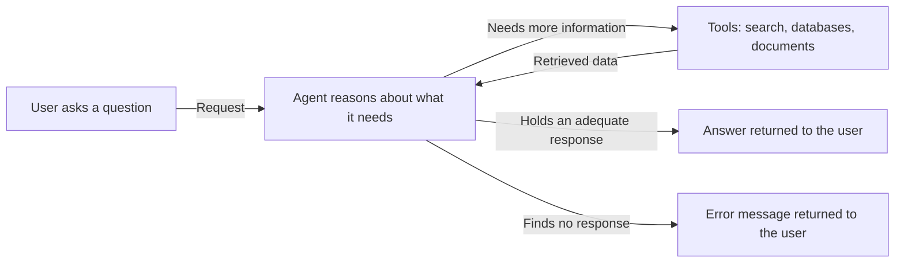
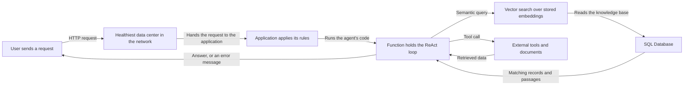

import FrameBox from '@aziontech/webkit/frame-box'
import ItemList from '@aziontech/webkit/item-list'
import DocItem from '@aziontech/webkit/doc-item'

A copilot is an assistant that sits inside a product and answers questions about it in plain language. It guides a user through a complex task instead of returning a list of search results. What it answers depends on what that user is doing. This design builds one on a ReAct agent, which reasons about each request and then acts on it by calling a tool. Use it when the answers live in your own documents and data rather than in a model's training set.

ReAct stands for reasoning and acting. The agent does not answer from the prompt alone. It reads the request, decides whether it can already answer, and calls a tool when it cannot. Each tool call returns data the agent reads before it decides again. The loop ends when the agent holds an adequate response, or when it runs out of ways to find one and returns an error instead.

This loop is a pattern rather than an Azion design, and it looks the same wherever it runs.

---

## Architecture diagram

The diagram places that loop on Azion, naming each part the request passes through:

Read the diagram from the function outward: everything to its left is the request path any application on Azion takes. The request reaches the healthiest data center in the network, and the application applies its rules before the agent's code runs. Everything to its right is the agent's own work. The arrows to the stores and tools run both ways because the agent reads from them once per pass through the loop. How many passes a request takes is decided by the agent, not fixed at deployment.

### Dataflow

A request moves through the design in this order:

1. The user sends a request to the application that hosts the copilot.
2. The healthiest data center in the network attends to the request.
3. The application processes it, running any rule configured on it.
4. The application calls the function that holds the AI agent's logic, and the reasoning loop starts.
5. The agent analyzes the context of the query and consults its external tools and resources: semantic or vector search engines, databases, and documents. It keeps retrieving until the data it holds is relevant enough to answer with.
6. A suitable response travels back to the user along the same path. When the agent finds none, the flow ends with an error message informing the user of the issue.

---

## Components

- [Applications](/en/documentation/platform/applications/): builds and hosts the application that answers the user's request from Azion's distributed infrastructure. The rules you configure here run before the agent does, so a request can be authenticated or rejected before it reaches your code.
- [Functions](/en/documentation/build/functions/): executes code close to the end user, which is where the reasoning loop and the custom logic for handling requests and responses live. One execution holds the whole loop, so the prompt, the tool calls, and the decision to stop all sit in the same place.
- [SQL Database](/en/documentation/store/sql-database/): a SQL solution designed for serverless applications. It holds the knowledge base the agent reads. That is what keeps the answers tied to your own data rather than to what the model learned in training.
- [Vector search](/en/documentation/store/sql-database/vector-search/): lets you implement semantic search engines over the records in SQL Database. A question and a passage match here when they mean the same thing, so the agent retrieves context that a keyword query would miss.
- **Azion's distributed infrastructure**: the highly distributed architecture every part above runs on. The copilot has no region to choose, because whichever data center is healthiest is the one that answers.

---

## Implementation

- [Build an application](/en/documentation/guides/application-development/getting-started/build-an-application/) - creates the application that receives the request.
- [Create a database](/en/documentation/guides/application-development/data/create-database/) - creates the SQL Database the agent consults.
- [Functions quickstart](/en/documentation/build/functions/quickstart/) - writes the function that carries the agent's logic.
- [Instantiate functions](/en/documentation/guides/application-development/getting-started/instantiate-functions/) - attaches that function to the application.
- [Vector search guide](/en/documentation/guides/application-development/data/sql-database-vector-search/) - builds the semantic queries the agent runs against the knowledge base.

---

## Related resources

<FrameBox>
<ItemList>
  <DocItem title="AI Inference" href="/en/documentation/build/ai-inference/">The models Azion runs, for the reasoning step the agent depends on.</DocItem>
  <DocItem title="Model invocation" href="/en/documentation/build/ai-inference/model-invocation/">The request body a function sends when it calls a model.</DocItem>
  <DocItem title="SQL Database" href="/en/documentation/store/sql-database/">The store that holds the knowledge base and its embeddings.</DocItem>
  <DocItem title="Real-Time Metrics" href="/en/documentation/platform/real-time-metrics/">The traffic and performance of the application that serves the copilot.</DocItem>
  <DocItem title="Real-Time Events" href="/en/documentation/observe/real-time-events/">The individual requests and logs to read when an answer comes back wrong.</DocItem>
</ItemList>
</FrameBox>
