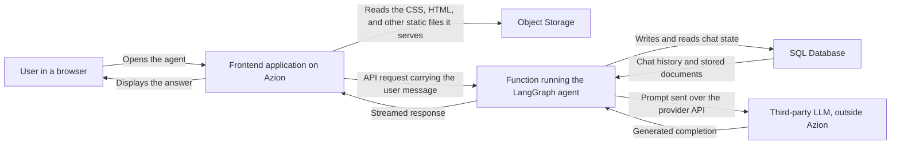

import FrameBox from '@aziontech/webkit/frame-box'
import ItemList from '@aziontech/webkit/item-list'
import DocItem from '@aziontech/webkit/doc-item'

An agent answers inside a conversation, so every turn pays for the model call plus everything the agent does around it. This design puts everything around the call on Azion: the interface, the agent logic, and the chat state all run here, close to the user. The model is not one of them. It runs at a third-party provider such as OpenAI or Anthropic, and the agent reaches it over that provider's API with your key.

Use this design when the provider is already chosen. What you want near the user is the agent itself, its history, and the documents it reads. [AI Inference](/en/documentation/build/ai-inference/) describes the design where Azion runs the model instead.

---

## Architecture diagram

The diagram traces one turn of a conversation, from the browser to the provider and back:

Read the diagram from the function outward. Every node on it runs on Azion except one: the third-party LLM sits outside, and the arrow reaching it is the only one that leaves. The function is where the design converges, because it holds the agent, owns the reads and writes of chat state, and places the model call. Object Storage stays off that path. It serves the static files the interface is built from, and the documents the agent later answers from.

### Dataflow

A request moves through the design in this order:

1. A request arrives at Azion.
2. The frontend application serves the user interface, with the static files coming from Object Storage.
3. The frontend application sends an API request to the backend function.
4. The backend function reads and writes chat state in SQL Database for persistence and context. It then runs the LangGraph agent and streams the response to the client.
5. The agent calls the third-party LLM, uses the data in the database to form a response, and sends it back along the same path.
6. The frontend application displays the response to the user.

---

## Components

- [Applications](/en/documentation/platform/applications/): hosts the AI agent on Azion. It is the address the browser talks to, and it routes the interface and the API request to the right place behind one domain.
- [Functions](/en/documentation/build/functions/): contains the AI agent logic. Your code runs nowhere else in the design, so the LangGraph graph, the provider call, and the response stream all sit in one execution.
- [Object Storage](/en/documentation/store/object-storage/): stores the data the agent uses to answer questions, and the static files the interface loads. Neither one is fetched from a server you keep running.
- [SQL Database](/en/documentation/store/sql-database/): stores chat state and documents. It is what makes a turn contextual, because the agent reads the earlier messages and the matching documents from here before it writes a prompt.
- **Third-party LLM**: the external service that runs the model, such as OpenAI or Anthropic. It is the one part Azion does not operate, so its availability, its rate limits, and its billing stay with the provider.

:::note
A deployment of this design uses [Application Accelerator](/en/documentation/build/application-accelerator/), [Functions](/en/documentation/build/functions/), and [SQL Database](/en/documentation/store/sql-database/), and may generate usage-related costs. Check the [pricing page](/en/documentation/fundamentals/pricing/) for more information.
:::

---

## Implementation

- [How to deploy the LangGraph AI Agent Boilerplate](/en/documentation/guides/application-development/frameworks/langgraph-ai-agent-boilerplate/) - creates the frontend, the function, and the database this page describes, and carries the document loader that fills them.
- [Azion GitHub App](/en/documentation/guides/application-development/automation/azion-github-app/) - connects the repository that deployment pushes to, which the guide requires before it starts.

---

## Related resources

<FrameBox>
<ItemList>
  <DocItem title="AI Inference" href="/en/documentation/build/ai-inference/">The design where Azion runs the model, instead of calling a third-party provider.</DocItem>
  <DocItem title="Vector search" href="/en/documentation/store/sql-database/vector-search/">How SQL Database answers an embedding query, which is what document retrieval rests on.</DocItem>
  <DocItem title="Vector search with SQL Database" href="/en/documentation/guides/application-development/data/sql-database-vector-search/">Builds and queries an embedding store directly, outside a template.</DocItem>
  <DocItem title="SQL Database" href="/en/documentation/store/sql-database/">The store that holds the chat state and the documents.</DocItem>
  <DocItem title="Object Storage" href="/en/documentation/store/object-storage/">The store the static files and the agent's source documents come from.</DocItem>
</ItemList>
</FrameBox>
