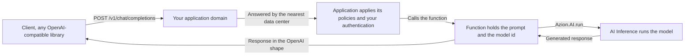

import FrameBox from '@aziontech/webkit/frame-box'
import ItemList from '@aziontech/webkit/item-list'
import DocItem from '@aziontech/webkit/doc-item'

A client that calls a model needs one address to post to and one response shape to read. This design puts that address on an application you deploy: the application is the inference endpoint, and the model runs behind it. Use it when your team already serves an HTTP API and wants inference to be one more path on it. You own the domain, and no inference server stays running.

[How AI Inference works](/en/documentation/build/ai-inference/how-it-works/) covers the hand-offs inside a single call. This page describes the shape you deploy around them.

---

## Architecture diagram

The diagram traces one request through the deployed shape, from the client to the model and back:

Read the diagram from the application domain outward. To its left is a client that knows nothing about Azion. It posts JSON to a URL and reads JSON back, as it would against any OpenAI-compatible service. Behind the domain, one execution does the rest: the application calls the function, and the function holds the request open until the model responds. No arrow leaves for an inference host, because the function configures no base URL and names no host. It passes a model id, and Azion places the call.

### Dataflow

A request moves through the design in this order:

1. A client posts an OpenAI-compatible request to `/v1/chat/completions` on the application domain.
2. The nearest data center receives the request and hands it to the application.
3. The application applies its policies, checks the authentication you configured, and calls the function.
4. The function preprocesses the input and calls the model with `Azion.AI.run`, which reaches AI Inference through the Azion Cells API.
5. AI Inference runs the model and returns the generated response to the function.
6. The function shapes that response and returns it to the client along the same path.

---

## Components

- [Applications](/en/documentation/platform/applications/): receives the request on your domain and applies its policies before any of your code runs. It is what makes the endpoint yours, because the domain, the path, and the authentication in front of the function are all configured here. Azion issues no credential for a model call, so an endpoint with no check of its own answers anyone who finds it.
- [Functions](/en/documentation/build/functions/): holds the inference logic and issues the model call. Your code runs nowhere else in the design, so the prompt, the model id, the context retrieved from a store, and any external service the call needs all sit in one execution.
- [AI Inference](/en/documentation/build/ai-inference/): runs the model, which is what removes the inference server from the design. You load no model and size no cluster, and the id from [AI models](/en/documentation/build/ai-inference/models/) is the only address the function needs.
- [Orchestrator](/en/documentation/build/orchestrator/): manages the requests for Azion Cells execution. `Azion.AI.run` reaches a model through the Azion Cells API, which is the part of Orchestrator this design depends on.
- **Azion's distributed infrastructure**: runs every part above. It is why the design has no region to choose. The data center nearest the client answers the request, and you select none of them.
- [Real-Time Metrics](/en/documentation/platform/real-time-metrics/): reports the traffic and performance of the application that serves the endpoint. A design with no inference server of your own still needs a view of what the endpoint carried.
- [Real-Time Events](/en/documentation/observe/real-time-events/): tracks individual requests, raw data, and logs. When a response is wrong, the request that produced it is what you read here.

:::note
Azion Cells is an advanced feature that is part of Orchestrator. To activate it, contact Azion's sales team to verify the requirements and enable the product in your account.
:::

---

## Implementation

- [AI Inference quickstart](/en/documentation/build/ai-inference/quickstart/) - deploys the design and posts a first request to a model on the domain it assigns.
- [How to deploy the AI Inference Starter Kit template](/en/documentation/guides/application-development/frameworks/ai-inference-starter-kit/) - creates the application, the function, and the domain this page describes, in one deployment.
- [Model invocation](/en/documentation/build/ai-inference/model-invocation/) - carries the request body both interfaces accept, and the `curl` form for the HTTP endpoint.

---

## Related resources

<FrameBox>
<ItemList>
  <DocItem title="How AI Inference works" href="/en/documentation/build/ai-inference/how-it-works/">The invocation chain hand-off by hand-off, and where Azion's part ends.</DocItem>
  <DocItem title="AI models" href="/en/documentation/build/ai-inference/models/">The id to pass, and what each model accepts.</DocItem>
  <DocItem title="AI Inference limits" href="/en/documentation/build/ai-inference/limits/">The ceilings a model call runs against, and when Azion deprovisions a model.</DocItem>
  <DocItem title="SQL Database" href="/en/documentation/store/sql-database/">The store a function reads context from before it calls a model.</DocItem>
  <DocItem title="Vector search" href="/en/documentation/store/sql-database/vector-search/">The embedding queries that build the context a prompt carries.</DocItem>
</ItemList>
</FrameBox>
