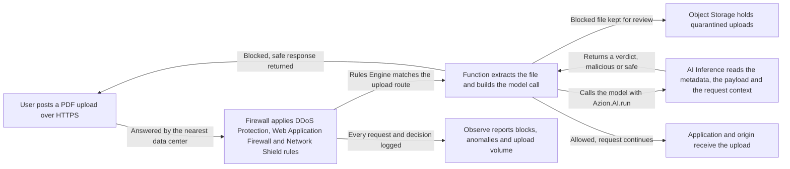

import FrameBox from '@aziontech/webkit/frame-box'
import ItemList from '@aziontech/webkit/item-list'
import DocItem from '@aziontech/webkit/doc-item'

An upload endpoint accepts a file that nobody has read. A PDF is the hard case. The format is a container, so a valid header can sit in front of embedded code, macros, or malicious links. Rules that match on the request see none of it, because the evidence is inside the payload.

This design reads the payload before the origin does. A function running on Firewall extracts the uploaded file, calls a model through AI Inference, and applies the verdict in the same request. The model acts as a security co-processor. It reads the content and the context of the upload in real time, and a file that fails the check never reaches the application.

PDF inspection is one worked example of file analysis. The same shape, a function on Firewall that calls a model and acts on the answer, covers other autonomous-security scenarios. It fits wherever a decision depends on what a request carries, not on where it came from.

[How AI Inference works](/en/documentation/build/ai-inference/how-it-works/) covers a single model call. This page describes the security design built around one.

---

## Architecture diagram

The diagram follows one upload from the user to the verdict and back:

Read the diagram at the function in the middle. Everything to its left is an ordinary firewall policy, decided from the request envelope: the source, the headers, the rate. The function is where the design stops reading the envelope and starts reading the file. Everything to its right follows from one answer, so the model call is the only new dependency this design adds to the request path. A blocked upload never travels to the origin, so the origin carries none of the traffic the policy rejects.

### Dataflow

A request moves through the design in this order:

1. A user sends an HTTPS request carrying a PDF upload. The data center nearest to them answers it.
2. Firewall processes the request. It applies DDoS Protection rules, and Web Application Firewall and Network Shield Protection rules where you configured them.
3. Before the request reaches the origin, a Rules Engine rule on the upload route triggers the security function. The function extracts the file and builds the model call.
4. AI Inference inspects the upload. It checks the file metadata: size, type, and internal structure. It then reads the payload for suspicious objects, embedded code, PDF Injection patterns, scripts, macros, malicious links, and structural inconsistencies that indicate exploitation attempts. It correlates the result with the request context and the policies you defined.
5. The function applies the verdict. It blocks a malicious upload and returns a safe response, such as a generic error or an invalid-file message. A safe upload continues to the application and on to the origin.
6. Firewall logs every request and every decision, and the Observe products carry that record.

---

## Components

- [Firewall](/en/documentation/platform/firewall/): applies the security policy an upload passes through before any inspection runs. DDoS Protection absorbs volumetric attacks, and Web Application Firewall covers the OWASP Top 10, including upload and content-manipulation vectors. Network Shield blocks suspicious sources by IP, ASN, or geolocation. The cheap checks run first, so the model only sees requests the policy already accepted.
- [Functions for Firewall](/en/documentation/platform/firewall/functions/): runs the function that carries the decision. It receives the request, extracts the PDF, invokes the model, and applies the outcome: allow, block, quarantine, or a custom response. The decision lives here rather than in the origin application, which is what keeps a rejected file outside your own infrastructure.
- [AI Inference](/en/documentation/build/ai-inference/): holds the models and the decision logic. It runs in real time against the structure and the content of the PDF, and applies risk policies aligned with your organization's GRC requirements. It also learns from human feedback and past events, which is what brings the false-positive rate down over time.
- [Applications](/en/documentation/platform/applications/) (optional): hosts the web application that consumes the uploads and exposes the HTTP and HTTPS endpoints. It is marked optional because the inspection runs on Firewall, before the request reaches whatever serves the upload endpoint.
- [Object Storage](/en/documentation/store/object-storage/) (optional): stores the files held in quarantine, so a blocked upload can be re-examined instead of disappearing. It also keeps the training samples that feed later model improvement.
- [Real-Time Metrics](/en/documentation/platform/real-time-metrics/) and [Real-Time Events](/en/documentation/observe/real-time-events/): report blocks, anomalies, and upload volume, down to the individual request. A policy that decides with a model needs a record of what it decided, because a false positive is invisible from the outside. Data Stream carries the detailed logs to a SIEM, a data lake, or a fraud platform. The GraphQL API answers the correlation queries an investigation asks.

---

## Implementation

- [Scan file uploads with an AI Inference firewall function](/en/documentation/guides/ai/inference/scan-uploads-with-ai-inference/) - builds the function, instantiates it on Firewall, and wires the Rules Engine rule that triggers it on the upload route.
- [AI models](/en/documentation/build/ai-inference/models/) - the ids the function can pass, and what each model accepts.
- [Model invocation](/en/documentation/build/ai-inference/model-invocation/) - the request body the function sends, and the shape the answer comes back in.

---

## Related resources

<FrameBox>
<ItemList>
  <DocItem title="How AI Inference works" href="/en/documentation/build/ai-inference/how-it-works/">The invocation chain behind the model call this design places in the request path.</DocItem>
  <DocItem title="AI Inference limits" href="/en/documentation/build/ai-inference/limits/">The ceilings a model call runs against.</DocItem>
  <DocItem title="Functions" href="/en/documentation/build/functions/">The runtime the security function runs in, and what its code can do.</DocItem>
  <DocItem title="Object Storage" href="/en/documentation/store/object-storage/">The bucket a quarantined upload is written to, and how to read it back.</DocItem>
</ItemList>
</FrameBox>
