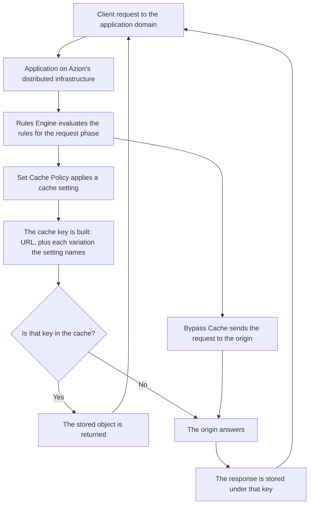

import FrameBox from '@aziontech/webkit/frame-box'
import ItemList from '@aziontech/webkit/item-list'
import DocItem from '@aziontech/webkit/doc-item'

This design serves an application whose responses depend on more than the URL: an API that answers differently per query string, a catalog that differs per device, a page that varies per session. [Application Accelerator](/en/documentation/build/application-accelerator/) puts those inputs into the cache key, so the cache can tell two correct responses apart instead of serving one of them to everyone or caching neither.

It suits teams whose dynamic paths reach the origin on every request because a URL-keyed cache cannot represent what makes those requests different.

---

## The request path

1. A client requests a domain associated with the application. [Workloads](/en/documentation/platform/workloads/) registers that domain with Azion.
2. The application receives the request in the nearest data center and [Rules Engine](/en/documentation/platform/applications/rules-engine/) evaluates its request-phase rules.
3. A rule decides what happens to the cache. **Set Cache Policy** applies a cache setting; **Bypass Cache** sends the request to the origin and caches nothing.
4. The cache key is built from the URL plus every variation the cache setting names: the allowed query string arguments, the named cookies, the device group, and, for a cached `POST` or `OPTIONS`, the MD5 hash of the request body.
5. A key already in the cache is answered from the stored object. A key that is not reaches the origin, and the response is stored under that key for the TTL the cache setting carries.
6. A request carrying the `Pragma: azion-debug-cache` header gets the key back in the `X-Cache-Key` response header, which is how you confirm the variation is the one you configured.

Two behaviors change the shape of this path rather than its steps. A **Max Age** of 0 seconds keeps the request on the cache path while collapsing simultaneous requests into one origin request, where **Bypass Cache** leaves the cache path entirely. For that difference, and for what each variation costs, refer to [How Application Accelerator works](/en/documentation/build/application-accelerator/how-it-works/).

---

## Components

- **[Applications](/en/documentation/platform/applications/)** holds the delivery configuration, the cache settings, and the rules, and is where the Application Accelerator module is turned on.
- **[Cache](/en/documentation/build/cache/)** holds the objects and owns the cache key format that every variation appends to.
- **[Rules Engine](/en/documentation/platform/applications/rules-engine/)** decides which requests a cache setting covers, and carries the behaviors this module unlocks.
- **[Application Accelerator](/en/documentation/build/application-accelerator/)** supplies the cache variation, the caching of `POST` and `OPTIONS` responses, and the cache TTL below 60 seconds.
- **[Workloads](/en/documentation/platform/workloads/)** registers the domain that serves the application.

---

## Implementation

1. Create an application, in [Azion Console](https://console.azion.com), through the [Azion API](https://api.azion.com/), or with [Azion CLI](/en/documentation/devtools/cli/). For the steps, refer to [Build an application](/en/documentation/guides/application-development/getting-started/build-an-application/).
2. Register the domain that serves it. For the steps, refer to [How to configure a domain](/en/documentation/guides/platform/migration/configure-a-domain/).
3. Turn on Application Accelerator and create a cache setting that varies by the attribute your responses depend on. For a query string or a cookie, refer to [Configure Advanced Cache Key for an application](/en/documentation/guides/application-performance/cache-and-purge/advanced-cache-key/). For a `POST` response, refer to [Cache POST and OPTIONS responses](/en/documentation/guides/application-performance/cache-and-purge/cache-post-and-options-responses/).
4. Apply the cache setting with a Rules Engine rule, and add any bypass or cookie-forwarding rule the design needs. For the steps, refer to [Configure cache policies for an application](/en/documentation/guides/application-performance/cache-and-purge/cache-settings/).
5. Point your domain's CNAME record at the Azion endpoint for that domain.
6. Confirm the variation with the `Pragma: azion-debug-cache` header, then watch the cache status over real traffic and adjust the variation rather than the TTL when the cached object count grows faster than the content.

Plan the purge alongside the variation. A URL purge does not reach objects that vary by cookie or device group, so those need a cache key purge or a wildcard purge. For the purge types, refer to [Real-Time Purge](/en/documentation/build/cache/real-time-purge/#application-accelerator-purge).

---

## Related resources

<FrameBox>
<ItemList>
  <DocItem title="Application Accelerator" href="/en/documentation/build/application-accelerator/">What the module is, what it unlocks, and where its boundaries are.</DocItem>
  <DocItem title="How Application Accelerator works" href="/en/documentation/build/application-accelerator/how-it-works/">What each variation appends to the cache key, and what a variation costs.</DocItem>
  <DocItem title="Application Accelerator settings" href="/en/documentation/build/application-accelerator/settings/">The field, enum, and default behind every choice this design makes.</DocItem>
  <DocItem title="Application Accelerator quickstart" href="/en/documentation/build/application-accelerator/quickstart/">Build a smaller version of this design in one sitting.</DocItem>
  <DocItem title="Cache" href="/en/documentation/build/cache/">The cache key format, the cache statuses, and the limits on a cached object.</DocItem>
</ItemList>
</FrameBox>
