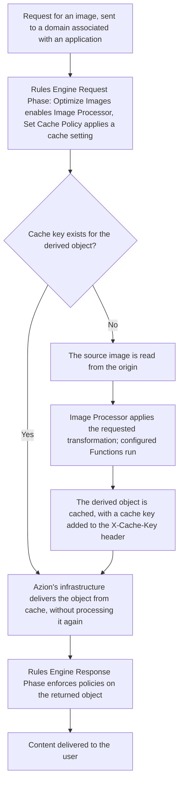

import DocButton from '~/components/webkit/DocButton.vue'
import FrameBox from '@aziontech/webkit/frame-box'
import ItemList from '@aziontech/webkit/item-list'
import DocItem from '@aziontech/webkit/doc-item'

Serving an image at its original size and format costs load time and storage. Every device receives the same file regardless of screen size, and every size or format an application needs must be produced and stored in advance.

[Image Processor](/en/documentation/build/image-processor/) removes that need. A request for an image can carry a query string that describes a transformation. The transformation can resize or crop the image, convert its format, or apply a filter such as a watermark. Image Processor returns a derived image built from a single source file on the origin. The source is never modified, and the derived image is never stored as a separate asset.

---

## Architecture diagram

The diagram traces a request from the domain configured for the application, through [Rules Engine](/en/documentation/platform/applications/rules-engine/)'s two phases, to delivery. Between the phases, Image Processor derives the image when no cache key already holds one, and Azion's distributed infrastructure caches the result for the next matching request.

### Dataflow

1. A user requests an image through the domain associated with the application.
2. Rules Engine's **Request Phase** processes the request. The **Optimize Images** behavior enables Image Processor, and a **Set Cache Policy** behavior applies the cache setting configured for image files.
3. Cache determines whether a key already exists for the derived object. On a match, Azion delivers the cached object directly, and Image Processor does not run: an image served from cache without processing is not counted against the Images meter.
4. On a miss, the source image is read from the origin, Image Processor applies the requested transformation, and any configured [Functions](/en/documentation/build/functions/) run. Azion caches the result and adds a cache key to the `X-Cache-Key` response header.
5. The object returns to the application layer, where Rules Engine's **Response Phase** enforces any policies configured for objects returned from the origin.
6. Azion delivers the content to the user.

---

## Components

- [Applications](/en/documentation/platform/applications/) holds the delivery and cache configuration for a request, and is the platform resource that Image Processor, Cache, and Rules Engine belong to as modules.
- Rules Engine evaluates the request against configured criteria and applies behaviors by phase. On this path, the **Optimize Images** behavior enables Image Processor, and a **Set Cache Policy** behavior applies the cache setting for image files.
- Image Processor reads the `ims` query string on a request and returns a derived image built from the source file on the origin, without modifying the source or storing the derived image as a separate asset.
- [Cache](/en/documentation/build/cache/) stores the derived image after the first request, indexed by a key that includes the `ims` query string, so a later matching request skips Image Processor and the origin.
- [Workloads](/en/documentation/platform/workloads/) registers the domain that receives the request and routes it to the application.

---

## Implementation

- [Build an application](/en/documentation/guides/application-development/getting-started/build-an-application/) - create the application that Rules Engine and Image Processor operate on, using [Azion Console](https://console.azion.com/), Azion API, or [Azion CLI](/en/documentation/devtools/cli/).
- [Image Optimization template](/en/documentation/guides/application-development/frameworks/image-optimization-template/) - deploy an application preconfigured with Image Processor enabled.

<DocButton
  label="Deploy the Image Optimization template"
  href="https://console.azion.com/create/azion/image-optimization"
  icon="ai ai-azion"
  target="_blank"
  size="medium"
/>

- [Configure a domain](/en/documentation/guides/platform/migration/configure-a-domain/) - register the domain that receives requests for the application.
- [Migrate your nameservers to Azion](/en/documentation/guides/platform/migration/migrate-ns-to-azion/) - point the domain at Azion so the requests reach the application.
- [Configure cache policies](/en/documentation/guides/application-performance/cache-and-purge/cache-settings/) - create a cache setting for image files, with a long TTL.
- [Cache Settings](/en/documentation/build/cache/cache-settings/) - the field reference for the TTL ceiling a cache setting accepts.
- [Create request and response rules](/en/documentation/guides/application-development/getting-started/rules-engine/) - add a rule that applies the **Optimize Images** behavior and a **Set Cache Policy** behavior to image requests.
- [Image Processor URL parameters](/en/documentation/build/image-processor/url-parameters/) - the `ims` query string syntax that requests a transformation.
- [Real-Time Metrics](/en/documentation/platform/real-time-metrics/) - track image traffic and bandwidth savings after deployment.

---

## Related resources

<FrameBox>
<ItemList>
  <DocItem title="Image Processor quickstart" href="/en/documentation/build/image-processor/quickstart/">Turn on Image Processor and process the first image.</DocItem>
  <DocItem title="How Image Processor works" href="/en/documentation/build/image-processor/how-it-works/">The mechanism behind a transformation, in detail.</DocItem>
  <DocItem title="Image Processor settings" href="/en/documentation/build/image-processor/settings/">The field names, types, and defaults behind every setting on this path.</DocItem>
  <DocItem title="Limits" href="/en/documentation/build/image-processor/limits/">The size and dimension limits a derived image respects.</DocItem>
  <DocItem title="Best practices" href="/en/documentation/build/image-processor/best-practices/">Recommended cache and rule configurations for image delivery.</DocItem>
  <DocItem title="Configure Image Processor" href="/en/documentation/guides/application-performance/delivery-optimization/process-images/">The steps that configure Image Processor and its cache policy.</DocItem>
</ItemList>
</FrameBox>
