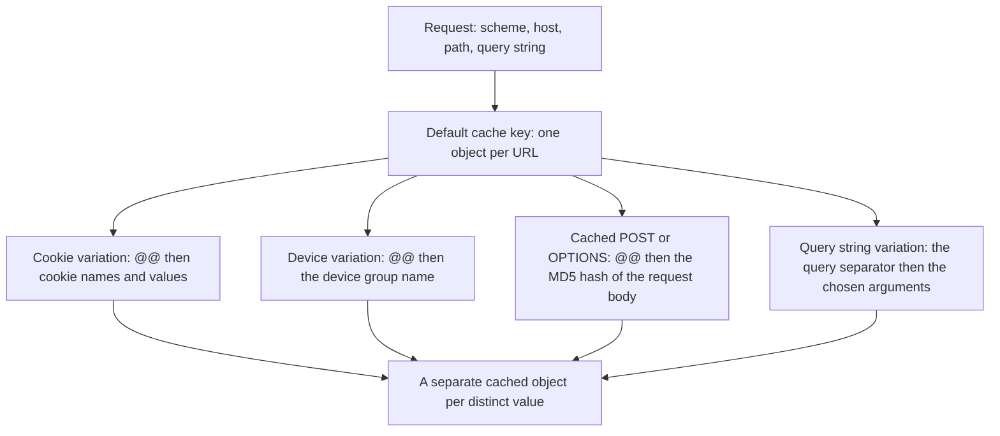

import FrameBox from '@aziontech/webkit/frame-box'
import ItemList from '@aziontech/webkit/item-list'
import DocItem from '@aziontech/webkit/doc-item'

A cache stores a response and answers later requests for the same object from that copy. It finds the copy by the URL, which assumes that one URL has one correct response. Dynamic content breaks the assumption. Under a single URL, a signed-in visitor sees their own cart, a listing reorders on a filter, and a layout changes on a phone.

Application Accelerator is the [Applications](/en/documentation/platform/applications/) module that removes the assumption. One switch on an application turns it on, and that switch changes four things at once. Each of the four exists for the same reason: a request whose response depends on more than its URL cannot be cached by URL alone.

This page covers the mechanisms rather than the values. The field names, types, and defaults are on [Application Accelerator settings](/en/documentation/build/application-accelerator/settings/), and the ceilings are on [Limits](/en/documentation/build/application-accelerator/limits/). The full cache key format belongs to [Cache](/en/documentation/build/cache/), which owns it.

The sections below cover what the module unlocks, how a variation changes the cache key, and what a variation costs. The last two cover how a purge reaches an object that varies, and how a cache TTL of zero differs from Bypass Cache.

---

## What Application Accelerator unlocks

Application Accelerator is a single switch, and it belongs to one application. Turning it on unlocks four capabilities that look unrelated until you see what they have in common:

- Cache variation beyond the URL, by query string, by cookie, and by device group. The feature is [Advanced Cache Key](/en/documentation/build/cache/cache-settings/#advanced-cache-key).
- Caching of `POST` and `OPTIONS` responses, beyond the `GET` and `HEAD` an application caches natively.
- A cache TTL as low as 0 seconds.
- Seven more [Rules Engine](/en/documentation/platform/applications/rules-engine/) behaviors, and the `${device_group}` variable in rule criteria.

What the four have in common is dynamic content. Cache variation gives the cache index the extra input it needs to tell two correct responses apart. Caching `POST` and `OPTIONS` brings in the methods that carry that input in the request body. A TTL under a minute fits content that stops being correct before a minute passes. Several of the gated behaviors act on the cookies and paths that carry that difference in the first place.

The switch is all four or none. An application cannot take cache variation without also taking the extra methods and the extra behaviors, and turning the switch on changes no traffic by itself. Every variation control starts in its ignore mode, and a cache setting reaches a request only when a [Set Cache Policy](/en/documentation/platform/applications/rules-engine/#set-cache-policy) behavior in a rule applies it. Turning a module on can also generate usage-related costs. For more information, refer to [Pricing](/en/documentation/fundamentals/pricing/#application-accelerator).

---

## The cache key and its variations

A cache key is the index entry for a cached object. By default, Azion builds the key from the request's scheme, host, path, and query string, so each URL is a distinct object in cache. Application Accelerator adds one more input to that key, and each kind of variation appends its own marker.

Cookie variation appends the `@@` separator, then the cookie names and their values, each followed by `;`. Device variation appends `@@` and the name of the device group. A cached `POST` or `OPTIONS` response appends `@@` and the MD5 hash of the request body, so two different bodies posted to one path are two objects. Query string variation is the exception, because the arguments are already part of the URL. The key carries the query separator and the chosen arguments, in the order they were submitted. A request that uses any method other than `GET` or `HEAD` is a complex request, and its key carries the method as a prefix.

The diagram shows what the default key is built from and what each variation adds to it:

A cookie variation on a `user` cookie produces a key shaped like `httpwww.example.com/@@user=user;`, and a cached `POST` produces one shaped like `httpsdynamic.example.com/path@@md5_of_post_arguments`. The key is the whole story: two requests share a cached object when they produce the same key, and get separate objects when they do not. For the full format and every input a key carries, refer to [Cache key format](/en/documentation/build/cache/#cache-key-format).

---

## The cost of a variation

Cache variation has one cost, and it follows from how the key is built: each distinct value of a varying attribute produces a separate cached object. That makes the choice of what to vary by more consequential than the choice to vary at all. A cookie whose value is unique per visitor gives every visitor a copy of the object. The cache still works, but it no longer serves one stored response to many requests. The number of objects grows with the audience instead of with the content.

An allowlist is the control for that cost. The `allowlist` behavior names the query string arguments or the cookies that change the response, so an attribute nobody named cannot create another object. The `all` behavior varies by every attribute that arrives, including the ones the application ignores. For example, a link that arrives with a campaign argument gets its own cached object under `all`. Under an allowlist that does not name that argument, the same link maps to the shared object.

Query string sorting applies the same economy to argument order. The chosen arguments enter the key in the order they were submitted, so `?a=1&b=2` and `?b=2&a=1` are two objects holding one response. With sorting on, those variations group under one key, ordered alphabetically. The cost of sorting is that the key no longer matches the URL as the client wrote it, which matters at purge time.

---

## Cache variation and purges

A purge removes an object from the cache, and it finds the object by its cache key. A URL purge converts the URL it is given to a cache key without considering content variation. Every variation the URL does not carry therefore survives it. Cookie variations and device group variations do not expire with a URL purge, and their copies stay in the cache.

Two purge types reach them. A cache key purge names each variation individually, and a wildcard purge ends the key with `@@*`. Query string variations are the exception again, because the query string is part of the URL. A URL purge reaches them when the arguments are sent in the order they were presented, and in alphabetical order when query string sorting is on.

The variations you configure are also the objects a purge has to reach. A high-cardinality variation therefore costs you at purge time as well as in storage. For the purge types and the steps to run each one, refer to [Real-Time Purge](/en/documentation/build/cache/real-time-purge/#application-accelerator-purge).

---

## A cache TTL of zero and Bypass Cache

Without Application Accelerator, the shortest cache TTL an application accepts is 60 seconds. The module removes that floor and allows 0. A cache TTL of 0 seconds is not the same as not caching, and the difference between the two is why both exist.

The [Bypass Cache](/en/documentation/platform/applications/rules-engine/#bypass-cache) behavior sends every HTTP and HTTPS request to the origin, and Azion caches nothing. It does not change the browser cache, which a Set Cache Policy behavior sets. Use it when each request has to receive different content.

A **Max Age** of 0 seconds keeps the request on the cache path. Multiple parallel requests for the same object are sent to the origin as a single request, and Azion validates changes with an `If-Modified-Since` request. An object that has not changed is not transferred again. Use 0 when dynamic content can be delivered identically to everyone requesting it at the same moment.

The trade is between per-request freshness and load on the origin. Bypass Cache gives every request its own answer, and gives up both the single origin request for parallel requests and the revalidation that skips an unchanged transfer. A TTL of 0 keeps both, and gives up the ability to answer two simultaneous requests differently.

---

## Related resources

<FrameBox>
<ItemList>
  <DocItem title="Application Accelerator quickstart" href="/en/documentation/build/application-accelerator/quickstart/">Turn the module on and create a cache setting that varies the cache key.</DocItem>
  <DocItem title="Application Accelerator settings" href="/en/documentation/build/application-accelerator/settings/">The field names, types, and defaults behind every mechanism on this page.</DocItem>
  <DocItem title="Limits" href="/en/documentation/build/application-accelerator/limits/">The values that bound a cache setting, including the TTL floor and ceiling.</DocItem>
  <DocItem title="Cache" href="/en/documentation/build/cache/">The full cache key format that every variation appends to.</DocItem>
  <DocItem title="Real-Time Purge" href="/en/documentation/build/cache/real-time-purge/">How to purge an object that varies by cookie, query string, or device group.</DocItem>
  <DocItem title="Configure Advanced Cache Key" href="/en/documentation/guides/application-performance/cache-and-purge/advanced-cache-key/">The steps that configure cache variation on a cache setting.</DocItem>
</ItemList>
</FrameBox>
