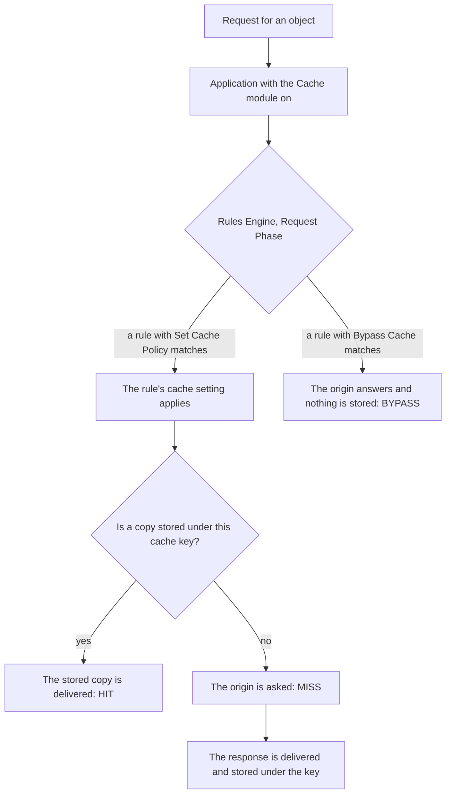

import FrameBox from '@aziontech/webkit/frame-box'
import ItemList from '@aziontech/webkit/item-list'
import DocItem from '@aziontech/webkit/doc-item'

A cache keeps a copy of an origin response in the data center that fetched it. Later requests for the same object are answered from that copy, and the origin is not asked again. The copy is indexed by a cache key built from the request, and it is kept for a time to live, the TTL. When the TTL ends, the copy expires and the next request checks the origin.

On Azion, the copy belongs to the Cache module of an application, and the module is on for every application you create in [Applications](/en/documentation/platform/applications/). A cache setting holds the TTLs and the variation rules. A [Rules Engine](/en/documentation/platform/applications/rules-engine/) rule with the **Set Cache Policy** behavior applies that setting to the requests it matches. A rule with **Bypass Cache** sends a request past the cache instead.

This page covers the mechanisms rather than the values. The full format of the key is on [Cache keys](/en/documentation/build/cache/cache-keys/), and the fields with their defaults are on [Cache settings](/en/documentation/build/cache/cache-settings/). Cache variation by query string and cookie belongs to [Application Accelerator](/en/documentation/build/application-accelerator/). The sections below cover the request path, TTL and expiration, stale cache, Large File Optimization, cache variation, Tiered Cache, and purge.

---

## The request path

A request reaches a cached copy through a chain of objects. The diagram shows that chain, from the request to the stored copy or to the origin:

A cache setting does nothing until a rule applies it. The Cache module is on for every application, but a new application has no cache settings and no rules. The chain starts when you create a setting on the **Cache Settings** tab and a **Request Phase** rule with **Set Cache Policy** names it. Every request the rule matches is then looked up by its cache key. When a stored copy exists, the data center that received the request answers from it, and the response reports `HIT`. Otherwise the request goes to the origin, the response reports `MISS`, and Azion may store the response for later requests. A rule with the **Bypass Cache** behavior sends its requests to the origin instead, nothing is stored, and the response reports `BYPASS`.

On a miss, the platform limits what the origin has to do. When several requests for the same uncached object arrive at the same time, Azion opens one connection to the origin for all of them. Where possible, Azion also keeps its connections to the origin open between fetches instead of opening a new one each time. Under a burst of requests for an uncached object, the origin therefore sees one fetch per data center, not one per visitor. For the key the lookup uses and the header that reports the status, refer to [Cache keys](/en/documentation/build/cache/cache-keys/).

---

## TTL and expiration

A cached copy is valid for its time to live, the TTL, and a cache setting carries two of them. The browser TTL controls how long a visitor's browser keeps its copy, and the cache TTL controls how long Azion keeps its own. A request the browser answers from its copy never reaches Azion, and a request Azion answers from its copy never reaches the origin.

Where each TTL comes from depends on the behavior the setting selects. Under _Honor cache policies_, Azion keeps the `Cache-Control` and `Expires` headers the origin sends and forwards them to the browser. The origin decides how long its content lives. Under _Override cache behavior_, the **Max Age** field replaces those headers for Azion's cache. The **Browser Cache** section carries its own honor-or-override choice for the browser's copy. When the origin sends no TTL under _Honor cache policies_, the copy is kept for a default TTL, as the Console states on that option.

The copy expires when the cache TTL ends, and the next request for the object goes to the origin. When the origin returns the object, that response updates the copy, and the response reports `EXPIRED`. A check with conditional headers can also find the copy unchanged: the response then reports `REVALIDATED`, and the origin does not transmit the object again.

The TTL is a trade between the origin's load and the age of what a visitor sees. A long TTL answers more requests from the copy and reaches the origin less. The price is that content the origin already changed stays in the copy until the copy expires. A short TTL keeps the copy close to the origin's version, at the price of more origin fetches. For example, one application can hold two cache settings, each applied by its own rule. Images that rarely change take a TTL of a day, and a listing that changes through the day takes a TTL of a few minutes. The cache TTL has a floor that Application Accelerator lifts, and a ceiling. For both values, refer to [Cache limits](/en/documentation/build/cache/limits/).

### Bypass Cache versus a TTL of 0

Two ways exist to keep a copy from being served, and they differ in what the origin sees. The **Bypass Cache** behavior sends every request it matches to the origin and caches nothing. It keeps protocol optimizations and, where possible, a keep-alive connection to the origin. Use it when each request has to receive different content. It does not change the browser cache, which **Set Cache Policy** governs.

A **Max Age** of 0 seconds keeps the request on the cache path, and it requires Application Accelerator because the module lifts the TTL floor. Parallel requests for the same object reach the origin as one request. Azion validates the object with an `If-Modified-Since` request, so an unchanged object is not transferred again. Use it when dynamic content can be delivered identically to everyone who requests it at the same moment.

Each choice costs what the other keeps. Bypass Cache answers every request from the origin, so no requests are combined and no object is revalidated. A TTL of 0 combines simultaneous requests and revalidates the object, so two visitors who ask at the same moment receive the same response.

---

## Stale cache

A copy past its TTL still has a use. With **Stale cache** on in the cache setting, Azion may reuse an expired copy when a revalidation attempt fails for one of four reasons:

- The origin returns a `5xx` error.
- The connection times out, or the origin is unreachable.
- The origin's cache-control headers are invalid or missing.
- The object is under update, with a revalidation in progress.

How long the expired copy may be served is the stale window. Under _Honor cache policies_, Azion reads the `stale-while-revalidate=<ttl>` directive the origin supplies, and that value is the window. Under _Override cache behavior_, or when the origin omits the directive, the window is 300 seconds. During the window the data center serves the expired copy at once and fetches a fresh version in the background. Once the new object is stored, later requests receive the updated content.

The response says which case applies. A response served from an expired copy because the origin failed to respond reports `STALE`. One served while the fresh version is on its way from the origin reports `UPDATING`.

The consequence is that an origin outage shows visitors an old page instead of an error page, for as long as the window lasts. The cost is freshness: a visitor inside the window can receive content the origin already replaced. A change every visitor has to see at once is therefore a case for a purge rather than for expiry. Whether a new setting starts with the toggle on depends on the interface. A setting created through the API or the CLI has stale cache off, and the Console turns it on for a new setting. For the field, refer to [Cache settings](/en/documentation/build/cache/cache-settings/).

---

## Large File Optimization

A large object is cached in fragments rather than as one piece. With **Large file optimization** on in the cache setting, Azion splits the file into fragments of 1,024 kB. Each fragment is delivered as the user consumes it and cached on demand, at the moment it is requested. The cache key of a fragment ends in `@@bytes=` and the byte range the fragment holds, so every fragment is an object of its own. For example, a 2,097,151-byte video at `https://static.example.com/media/file.mp4` yields two fragments, stored under `httpsstatic.example.com/media/file.mp4@@bytes=0-1048575` and `httpsstatic.example.com/media/file.mp4@@bytes=1048576-2097151`.

Because a fragment is fetched only when a user reaches it, a download that stops partway leaves the later fragments unfetched. The fragments that were fetched stay cached for the next request. The fragmentation applies to Azion's cache and to the Tiered Cache layer when the setting has that toggle on.

The cost comes at purge time. One file becomes many keys, so a purge lists each fragment's key or uses a wildcard that ends the file's path with `*`. A purge that removes some fragments and not others leaves a mix of new and old fragments in the cache. For the purge types, refer to [Real-Time Purge](/en/documentation/build/cache/real-time-purge/).

---

## Cache variation

A variation is a second copy of one URL, stored under a different cache key. Azion builds the default key from the request's scheme, host, path, and query string, so one URL is one stored object. When something other than the URL changes the response, the cache setting names it, and the key carries a marker for each named input. Four inputs can vary a copy: a cookie, a query-string argument, the device group a request falls in, and the request method. A fifth, the image format, is added when [Image Processor](/en/documentation/build/image-processor/) converts an image.

Device groups come from [Device Groups](/en/documentation/platform/applications/device-groups/). A setting either delivers one version regardless of device or keeps a copy per group it names. The method is a variation too. `GET` and `HEAD` requests are cached natively, and `POST` and `OPTIONS` responses are cached only with Application Accelerator on. The request body then becomes part of the key as an MD5 hash, so two different bodies posted to one path are two objects.

Each distinct value is a separate stored object, so a variation splits the requests for one URL across several copies. Fewer requests find a copy already present, and a purge has to reach every copy. For example, a listing page that varies by a `page` argument stores one copy per page number. A purge of the listing has to name each of them. For the format of each marker, refer to [Cache keys](/en/documentation/build/cache/cache-keys/). The controls that turn a variation on are on [Application Accelerator settings](/en/documentation/build/application-accelerator/settings/).

---

## Tiered Cache

[Tiered Cache](/en/documentation/build/cache/tiered-cache/) adds a second cache layer between Azion's cache and the origin. When the data center that received a request holds no valid copy, it asks the Tiered Cache layer before it asks the origin. A miss in the first layer can therefore still be answered from cache. The second layer keeps objects longer than the first, in a region closer to your users.

The layer is turned on per cache setting with the **Tiered Cache** toggle, and it is included in every plan. The setting names one of three topologies: `nearest-region`, `br-east-1`, or `us-east-1`. Tiered Cache also requires _Override cache behavior_, because the API rejects it under _Honor cache policies_.

The trade is an extra hop and a floor on the TTL. A miss in the first layer travels to the second before it reaches the origin. A setting with Tiered Cache on also has to carry a minimum TTL, because the layer is designed for objects that stay cached a long time. In return, fewer requests reach the origin. For the minimum, refer to [Cache limits](/en/documentation/build/cache/limits/).

A **Bypass Cache** rule affects Azion's cache and not the Tiered Cache layer. An application with active Tiered Cache settings continues to cache in that layer for the minimum TTL. When you purge an object held in both layers, purge the Tiered Cache layer first and then Cache. Otherwise the first layer is refilled from stale Tiered Cache content. The Tiered Cache layer is purged by cache key.

---

## Purge

A purge removes a stored copy before its TTL ends. The next request for the object finds no copy, goes to the origin, and stores the version the origin returns, and that response reports `MISS`. A purge is queued after you confirm it, because the result takes time to propagate. It appears in the purge history once it completes across Azion's infrastructure.

A purge finds an object by its cache key, and that is why the purge type matters for an object that varies. A URL purge converts each URL to a cache key without considering content variation. A copy that varies by cookie, device group, or image format therefore survives it. A cache key purge names each variation, and a wildcard purge reaches every key that matches an expression with `*`. Query-string variations are the exception a URL purge does reach. The arguments have to be in the order they were presented, or in alphabetical order when **Sort** is on.

Removing an object with the `DEL` HTTP method instead of a purge also makes the user's first `GET` request go to the origin. The difference is the safety net. The method prevents Azion from delivering a stale copy when the origin is inaccessible, and an error page is delivered instead. Three cases suit it:

- Content left the origin and has to leave the cache too.
- Content whose timestamp is unreliable needs a forced removal and a later update.
- An error page is preferable to a stale copy while the origin is unreachable.

A purge is the tool for a change that cannot wait for the TTL. Its cost is the origin fetch that refills each purged key. The more keys an object has, through variations or fragments, the more a purge has to name. For the purge types and their arguments, refer to [Real-Time Purge](/en/documentation/build/cache/real-time-purge/). The steps are on [Purge cached content](/en/documentation/guides/application-performance/cache-and-purge/purge-cached-content/).

---

## Related resources

<FrameBox>
<ItemList>
  <DocItem title="Cache settings" href="/en/documentation/build/cache/cache-settings/">Every field of a cache setting, with its type and its default per interface.</DocItem>
  <DocItem title="Cache keys" href="/en/documentation/build/cache/cache-keys/">The full key format, the debug headers, and every cache status named on this page.</DocItem>
  <DocItem title="Real-Time Purge" href="/en/documentation/build/cache/real-time-purge/">The three purge types and how each one reaches an object that varies.</DocItem>
  <DocItem title="Tiered Cache" href="/en/documentation/build/cache/tiered-cache/">The second cache layer, its topologies, and the purge order it needs.</DocItem>
  <DocItem title="Cache limits" href="/en/documentation/build/cache/limits/">The TTL floor and ceiling, the fragment size, and the purge quotas.</DocItem>
  <DocItem title="Best practices" href="/en/documentation/build/cache/best-practices/">The recommendations that follow from these mechanisms, one section per practice.</DocItem>
  <DocItem title="Application Accelerator settings" href="/en/documentation/build/application-accelerator/settings/">The controls behind cache variation, cached POST and OPTIONS, and a TTL under the floor.</DocItem>
  <DocItem title="Cache quickstart" href="/en/documentation/build/cache/quickstart/">Create a cache setting, apply it with a rule, and read the cache status of the first response.</DocItem>
</ItemList>
</FrameBox>
