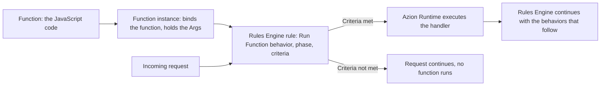
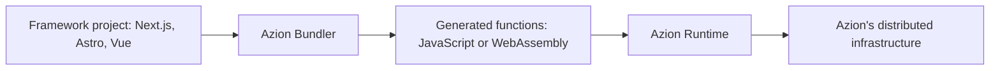

import Code from '~/components/Code/Code.astro'
import FrameBox from '@aziontech/webkit/frame-box'
import ItemList from '@aziontech/webkit/item-list'
import DocItem from '@aziontech/webkit/doc-item'

Code that runs next to the user answers a request near where it starts, instead of at a distant server the request must travel to. That code does not start by itself. Something in the request path has to decide, on every request, that this is the moment to call it.

On Azion, three separate objects carry that decision. A function holds the JavaScript code. A function instance binds that function to an application or to a firewall. The instance carries the Args, a JSON object passed into the context of the function's execution. A [Rules Engine](/en/documentation/platform/applications/rules-engine/) rule names the instance, the phase it runs in, and the criteria that trigger it.

Creating a function does not run it. A function that no rule points at never executes, however correct its code.

The APIs the code calls are documented in the [Azion Runtime](/en/documentation/devtools/runtime/) tree rather than here, and the value of every boundary named below lives on [Limits](/en/documentation/build/functions/limits/). The mechanisms are the three objects, the invocation chain, execution phases and their criteria, the two execution contexts, Args, and what Azion Runtime provides.

---

## The function, the instance, and the rule

Functions keeps three objects apart, and each one owns a different decision.

The _function_ is the code. You write it in JavaScript, and it belongs to Functions rather than to any single application. The same function can serve several applications, which is why the code lives apart from the places that run it.

A _function instance_ binds one function to one application or to one firewall. Instantiation does not open the code for editing. The only thing an instance sets is the Args, the arguments passed to the context of the function's execution in JSON format. One function can therefore have many instances, each configured differently.

A _Rules Engine rule_ is the trigger. Its **Run Function** behavior selects an instance, and the rule carries the execution phase and the criteria that decide when the behavior fires. Nothing else invokes a function.

The split buys reuse: one piece of code, many bindings, many configurations. It costs a third object to keep track of. An instance that no rule points at is inert, and so is a correct function with no instance.

---

## The invocation chain

The diagram below has two inputs that meet at the rule. The chain along the top is configuration you create once, in that order. The arrow from the left is a live request.

When a request reaches Azion, Rules Engine evaluates the rules of the current phase in the order they are arranged. A rule whose criteria do not match contributes nothing, and the request continues as though the rule were absent. A rule whose criteria match runs its behaviors in order. When one of those behaviors is Run Function, it resolves the instance it names. Azion Runtime then executes the handler with the request and the instance's Args. Control returns to Rules Engine, which continues with the behaviors that follow.

The decision is made per request, so the criteria are the only control over how often the code runs. Criteria that match broadly invoke the function on every matching request.

---

## Execution phases and criteria

Every request to an application is processed in a fixed sequence of two phases. The **Request Phase** handles what the user sent. The **Response Phase** handles what the application sends back. A rule belongs to one phase, and that choice decides what its criteria can read: a request-phase rule cannot use variables that describe the response, because the application has not produced the response yet.

Within the phase, the criteria decide whether the rule fires. A criterion pairs a variable with a comparison operator, plus an argument when the operator takes one: _is equal_, _is not equal_, _starts with_, _does not start with_, _matches_, _does not match_, _exists_, and _does not exist_. The logical operators `and` and `or` combine several criteria into one condition, and `and` has implicit precedence over `or`. A rule whose criterion compares `${uri}` with _starts with_ against the argument `/api/` runs its function only on requests under that path.

Order matters twice over. Behaviors run in the order they are arranged, and a behavior that finishes processing stops everything after it. **Deny (403 Forbidden)**, **Deliver**, and **Finish Request Phase** all end the sequence, so a Run Function behavior placed after one of them never executes.

The Run Function behavior also requires the [Application Accelerator](/en/documentation/build/application-accelerator/) module. When that module is off, only some variables and behaviors are available to a rule.

Evaluating criteria in Rules Engine keeps the invocation out of requests that do not need it. The price is that the trigger lives in the rule and not in the code: reading a function tells you what it does and never when it runs.

---

## The two execution contexts

A function runs in one of two contexts, and the context decides which handler the code exports and what the function is allowed to do. An instance on an application runs the function inside the traffic path of that application. An instance on a firewall runs it before the request reaches the application.

### Functions in an application

The trigger for an instance on an application is a Rules Engine rule of that application. The Run Function behavior is available in both the Request Phase and the Response Phase. The code exports a `fetch` handler:

<Code lang="javascript" code={`
export default {
  async fetch(request, env, ctx) {
    return new Response('Hello World!');
  },
};
`} />

The handler receives `request`, the HTTP request object; `env`, the environment variables and bindings; and `ctx`, the execution context. `ctx.waitUntil(promise)` extends the lifetime of the execution beyond the point where the handler returns.

### Functions on a firewall

The trigger for an instance on a firewall is a Rules Engine rule of that firewall. A function on a firewall runs during the request phase, before the application produces a response. The code exports a `firewall` handler:

<Code lang="javascript" code={`
export default {
  async firewall(request, env, ctx) {
    return new Response('Hello World!');
  },
};
`} />

The parameters match the fetch handler, with one addition. `ctx.deny()` blocks the request immediately, and it exists in the ES Modules pattern only. When the code does not call it, the request continues to the fetch handler.

The Service Worker pattern carries the same decisions as events on a `firewall` listener. Every function on a firewall must reach a finishing outcome. `event.continue()` lets the request proceed, `event.deny()` ends it with a 403 Forbidden, and `event.drop()` closes the request without returning an answer to the client. `event.respondWith()` returns a custom response instead, while `event.addRequestHeader()` and `event.addResponseHeader()` add headers to the request sent to the origin and to the response sent to users.

Azion Runtime processes the function and returns an outcome, and Rules Engine on the firewall resumes processing from the point where the behavior was triggered. A function on a firewall also reads [metadata](/en/documentation/devtools/runtime/api-reference/metadata/) about the request it is deciding on:

- The geographic location derived from the client IP address.
- The client IP address and TCP port.
- The request protocol, such as HTTP/1.1.
- The TLS cipher and the TLS protocol, when the request arrives over a secure connection.

The two contexts trade in opposite directions. A function on a firewall decides whether the request reaches the application at all, which no function in an application can do. A function in an application is the only one that runs in the Response Phase.

---

## Args

Args are the arguments an instance passes into the context of the function's execution, written as a JSON object. They exist so that one function behaves differently in each place it is instantiated, with no edit to the code. The code reads a key at run time; the instance decides the value.

A function can define default Args of its own, and those defaults are the basis for every instance of that function. An instance's Args override the keys they repeat, and every key the instance leaves out keeps its default. A function whose defaults set `threshold`, `action`, and `log_level`, instantiated with Args that set only the first two, executes with these values:

| Key | Function default | Instance Args | Passed to the function |
| --- | --- | --- | --- |
| `threshold` | `100` | `50` | `50` |
| `action` | `"deny"` | `"block"` | `"block"` |
| `log_level` | `"info"` | not set | `"info"` |

In the Service Worker pattern, the code reads Args from the `event.args` object, one property per key:

<Code lang="javascript" code={`
async function handleRequest(request, argValue) {
  return new Response(argValue, { status: 200 });
}

addEventListener("fetch", (event) => {
  event.respondWith(handleRequest(event.request, event.args.value));
});
`} />

With `{"value": "hello_world"}` in the Args of one instance, that instance answers with `hello_world`. A second instance of the same function answers with whatever its own Args carry.

The Args object has a size cap, and an object above it makes the function fail at instantiation rather than at run time. Configuration held in Args also costs you the ability to read behavior off the code: two instances of one function can act differently, and only their Args say how. Args are per-instance configuration, so sensitive values such as API keys, credentials, and access tokens belong in [environment variables](/en/documentation/build/functions/environment-variables/), which keep them out of the codebase.

---

## What Azion Runtime provides

Azion Runtime is the environment the handler executes in. It runs JavaScript built on Web standards, so the code calls Web APIs rather than a proprietary interface: network, encoding and decoding, Web Streams, standards, and V8 primitives. Strict mode is the default and is required, which turns several silent JavaScript errors into thrown errors and blocks syntax that later ECMAScript versions may define.

Each execution context is a V8 isolate, and the memory boundary applies to that isolate. Two more boundaries shape how code is written against the runtime: a function that exceeds the CPU budget is terminated, and the number of outbound `fetch()` calls in a single invocation is capped. [Limits](/en/documentation/build/functions/limits/) carries all three values.

The runtime also reaches Azion's own stores from inside the handler. `Azion.KV` reads and writes pairs through the [KV Store API](/en/documentation/devtools/runtime/api-reference/kv-store/), and `Database.open()` opens a connection through the [SQL Database API](/en/documentation/devtools/runtime/api-reference/sql-database/). The `Storage` class reads and writes objects in a bucket through the [Object Storage API](/en/documentation/devtools/runtime/api-reference/storage/). These interfaces reach the stores from inside the runtime rather than through an external API call.

Building on Web standards rather than on Node.js is the trade this design makes. A subset of Node.js APIs is supported, and the [Node.js compatibility](/en/documentation/devtools/runtime/node/) reference lists that subset together with the polyfills that cover part of the remainder. The handler signatures, the full Web API list, and the metadata catalog live in the [Azion Runtime](/en/documentation/devtools/runtime/) tree.

---

## Framework builds through Azion Bundler

A framework project does not reach Azion as the files you wrote. [Azion Bundler](https://github.com/aziontech/bundler), an open-source framework adapter, transforms that code into functions, and those generated functions are what the chain above invokes.

The build runs in four stages:

1. **Framework detection.** When you initialize a project with [Azion CLI](/en/documentation/devtools/cli/), the bundler identifies the framework and applies its adapter.
2. **Code transformation.** The bundler converts the framework's server-side logic, API routes, and middleware into functions compatible with Azion Runtime.
3. **Function generation.** Each route, API endpoint, and server component becomes a function that executes independently.
4. **Deployment.** The functions are distributed across Azion's infrastructure and execute closer to users, with no cold start.

The build also writes `azion.config.js`, an infrastructure-as-code file created from the chosen preset that becomes the source of truth for the configuration. It declares the function instances and the rules that bind them, so a framework deploy creates the objects you would otherwise create by hand. For its fields, refer to [azion.config.js](/en/documentation/devtools/cli/azion-config-js/).

The deployed artifact is therefore a set of generated functions rather than your source tree, and that has two consequences. A framework deployment is billed as functions are, by compute time and invocations, per [Pricing](/en/documentation/fundamentals/pricing/). And the code you observe when something fails is the generated function, not the file you edited, so the tools in [Troubleshooting](/en/documentation/build/functions/troubleshooting/) are what show you the behavior.

For the frameworks the bundler supports, refer to [Frameworks compatibility](/en/documentation/devtools/runtime/frameworks/frameworks-compatibility/).

---

## Related resources

<FrameBox>
<ItemList>
  <DocItem title="Function instances" href="/en/documentation/build/functions/functions-instances/">The instance object and its Args, in reference form.</DocItem>
  <DocItem title="Rules Engine" href="/en/documentation/platform/applications/rules-engine/">Every variable, comparison operator, and behavior a rule can use.</DocItem>
  <DocItem title="Handlers" href="/en/documentation/devtools/runtime/api-reference/handlers/">The fetch and firewall handler signatures and their parameters.</DocItem>
  <DocItem title="Azion Runtime" href="/en/documentation/devtools/runtime/">The Web APIs, the metadata, and the Node.js compatibility list.</DocItem>
  <DocItem title="Functions for Firewall" href="/en/documentation/platform/firewall/functions/">The firewall execution path and the events a firewall function can call.</DocItem>
  <DocItem title="Limits" href="/en/documentation/build/functions/limits/">The value of every boundary this page names.</DocItem>
  <DocItem title="Best practices" href="/en/documentation/build/functions/best-practices/">Where the log output of an invocation goes, and what each boundary asks of the code.</DocItem>
  <DocItem title="Quickstart" href="/en/documentation/build/functions/quickstart/">Create your first function and put it in the path of a request.</DocItem>
</ItemList>
</FrameBox>
