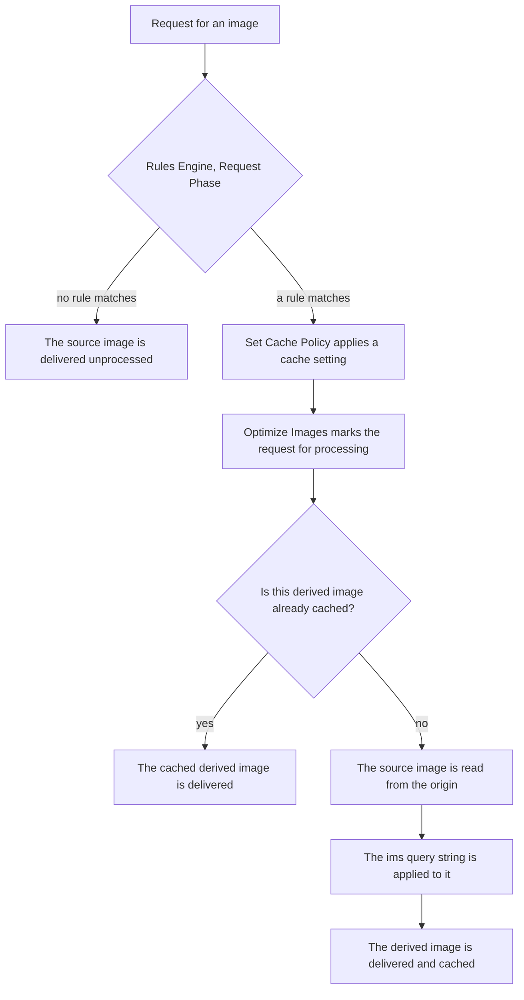

import FrameBox from '@aziontech/webkit/frame-box'
import ItemList from '@aziontech/webkit/item-list'
import DocItem from '@aziontech/webkit/doc-item'

A derived image is built at the moment a request asks for it. The URL carries a description of the transformation, and the platform reads that description, applies it to the **source image** on the origin, and returns the result. The source is never modified, and the derived image is never stored as an asset of its own. One file therefore answers every size, crop, quality, and format a page asks for, instead of one stored file per variant.

This page describes the four mechanisms behind that: the path a request takes before a transformation happens, how the delivered format is chosen, how the cache tells one derived image from another, and where the boundaries of the module sit.

---

## The request path

A transformation does not happen because an `ims` query string is present. It happens because a [Rules Engine](/en/documentation/platform/applications/rules-engine/) rule ran and applied the **Optimize Images** behavior to the request. Turning the module on in **Main Settings** makes that behavior available; it does not process anything on its own.

The chain from the request to the derived image:

1. A request arrives for a path that holds an image.
2. Rules Engine evaluates the **Request Phase** rules. A rule for images matches on `${request_uri}` or `${uri}` against an argument such as `\.(jpg|jpeg|gif|bmp|png|ico|webp|avif)`.
3. A matching rule applies its behaviors. **Set Cache Policy** chooses the cache setting, and **Optimize Images** marks the request for Image Processor.
4. If the derived image is already cached, it is delivered from the cache and no processing happens.
5. Otherwise the source image is read from the origin, the `ims` query string is applied to it, and the result is delivered and stored.

Two consequences follow from step 2, and both surprise readers who expect the query string alone to do the work. A request that no rule matches is delivered unprocessed, `ims` and all. And a rule that matches a path holding no image still runs, so the criteria decide which requests reach the module.

---

## Format negotiation

The delivered format is not always the format of the source image. Two mechanisms change it, and they behave differently.

The first is explicit. A `filters:format()` filter in the `ims` string asks for a named output format. Converting to WEBP or AVIF also requires the request to carry `Accept: image/webp` or `Accept: image/avif`, which is what the **Add Request Header** behavior adds when the browser does not send it.

The second is automatic and needs no `ims` parameter at all. Image Processor detects whether the browser supports WEBP and converts the image when it does, and BMP images are converted to JPEG or WEBP depending on the same support. A reader who never writes a filter can therefore still receive a different format from the one on the origin, which is the point: the format that costs the fewest bytes for that browser is the one delivered.

The consequence for anyone comparing files is that the bytes on the origin and the bytes on the wire are different measurements, and the response says so. A processed response carries `x-ims: Enabled`, and `x-original-image-size` carries the size of the source image before the transformation. For the headers and the behavior that sends the `Accept` header, refer to [Settings](/en/documentation/build/image-processor/settings/).

---

## One cache entry per transformation

A derived image is only worth building once. The cache tells two derived images apart because the cache key carries the `ims` query string, and a variation converted to another format carries the file format after the separator, as in `httpsstatic.yourdomain.com/static/images/image_1.jpg?ims=880x@@webp`.

That key is not free. Varying the cache by a query string is a field of a cache setting that belongs to [Application Accelerator](/en/documentation/build/application-accelerator/), `cache_vary_by_querystring` under `modules.application_accelerator`, so varying the cache on `ims` requires that module. Processing an image does not.

The tradeoff is cardinality. Every distinct `ims` string is a distinct stored object, so a page that asks for arbitrary widths stores an object per width, while a page that asks for four fixed widths stores four. Choosing a small set of sizes is therefore a caching decision as much as a layout one.

It is also a billing decision, and this is the part worth reading twice: an image served from the cache without processing is **not** counted against the monthly Images meter. A well-cached derived image costs one processed image no matter how many readers receive it. For what is counted and the amount each plan includes, refer to [Limits](/en/documentation/build/image-processor/limits/).

---

## Where the module stops

Image Processor reads a source image and returns a derived one. It does not store images, and it does not accept uploads: the source stays wherever it already lives, and no derived image becomes an asset the account owns. A workflow that needs to keep a transformed file has to save the response itself.

The transformation is also bounded by what the `ims` string can express and by the size of the image. The operations the string accepts are on [URL parameters](/en/documentation/build/image-processor/url-parameters/), and the maximum size and dimensions are on [Limits](/en/documentation/build/image-processor/limits/).

One boundary is worth naming, because the two surfaces share a name. **WASM Image Processor** is a WebAssembly library that processes images inside a function on [Functions](/en/documentation/build/functions/). It is a different surface with a different interface, and nothing on this page configures it.

---

## Related resources

<FrameBox>
<ItemList>
  <DocItem title="Image Processor quickstart" href="/en/documentation/build/image-processor/quickstart/">Turn the module on and request a derived image for the first time.</DocItem>
  <DocItem title="Image Processor URL parameters" href="/en/documentation/build/image-processor/url-parameters/">Every operation the `ims` query string expresses, with the values each one accepts.</DocItem>
  <DocItem title="Image Processor settings" href="/en/documentation/build/image-processor/settings/">The module toggle, the Rules Engine behaviors, and the headers named on this page.</DocItem>
  <DocItem title="Image Processor limits" href="/en/documentation/build/image-processor/limits/">The bounds on one image, and what counts against the monthly Images meter.</DocItem>
  <DocItem title="Cache" href="/en/documentation/build/cache/">How a cache key is built, and where a derived image is held.</DocItem>
  <DocItem title="Rules Engine" href="/en/documentation/platform/applications/rules-engine/">The criteria and behaviors that decide which requests reach the module.</DocItem>
</ItemList>
</FrameBox>
