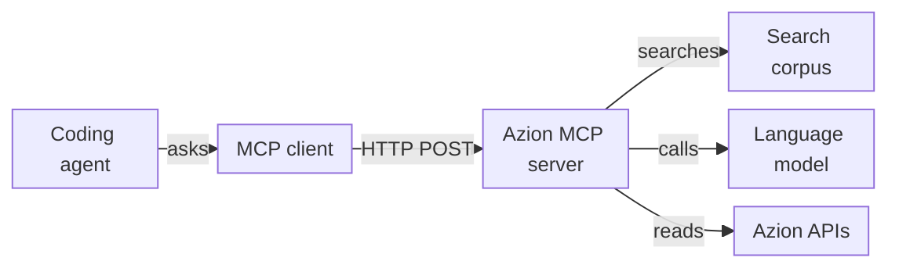

import FrameBox from '@aziontech/webkit/frame-box'
import ItemList from '@aziontech/webkit/item-list'
import DocItem from '@aziontech/webkit/doc-item'

A coding agent answers questions about a platform more reliably when it can look facts up instead of recalling them. The Model Context Protocol (MCP) is an open specification for that lookup. It uses JSON-RPC to standardize how an application lists and calls the tools of a server, reads its resources, and fetches its prompts. The agent's MCP client sends each request to the server, and the agent reads the answer as context.

The [Azion MCP server](/en/documentation/devtools/mcp/) is a hosted MCP server at `https://mcp.azion.com/`. It authenticates every request with your Azion [personal token](/en/documentation/fundamentals/personal-tokens/), and it answers with text drawn from the Azion documentation, code samples, and the references of the CLI, the API, and the Terraform provider. No tool changes your account. To connect an agent, refer to [MCP server quickstart](/en/documentation/devtools/mcp/configuration/). For the terms, refer to [Glossary](/en/documentation/devtools/mcp/glossary/).

The sections cover the request path, the connection and its transport, authentication, tools and resources, tool execution, the tool set of each API profile, and OAuth discovery.

---

## The request path

The Azion MCP server follows the client-server model of the protocol. Your agent decides when it needs a fact, its MCP client turns that decision into a JSON-RPC request, and the server does the lookup and returns text.

This diagram follows one tool call from the agent to the systems the server reaches:



1. You ask the agent a question in natural language, and the agent decides that a tool can answer it.
2. The MCP client connects to `https://mcp.azion.com/` over HTTP and sends your personal token in the `Authorization` header of the request.
3. The server validates the token and learns the API profile of your account, which decides the tools the client can discover.
4. The client lists the tools and resources, and then calls a tool by name with JSON arguments.
5. The server runs the tool. Depending on the tool, it searches a document corpus, asks a language model to build an answer, or reads data from the Azion APIs with your token.
6. The server returns the result as text, and the agent uses that text to answer you.

Azion runs the server on its own platform, as a [function](/en/documentation/platform/functions/) behind an application and a workload. The server is written in TypeScript with the MCP SDK, and its source is public at [github.com/aziontech/mcp-server](https://github.com/aziontech/mcp-server). To run a server of your own the same way, refer to [Run an MCP server on Azion](/en/documentation/guides/application-development/automation/run-mcp-server/).

---

## Connection and transport

A transport is the way MCP messages travel between a client and a server. The Azion MCP server uses streamable HTTP: the client sends every message as an HTTP `POST` to the root of the host, and the server answers with a `text/event-stream` response that holds one server-sent event. The server answers at the bare host only, and a request to `/mcp` returns `404`.

The first request of a connection is `initialize`. A client sends it as a `POST` to `https://mcp.azion.com` with the headers `Authorization: Bearer [TOKEN VALUE]`, `Content-Type: application/json`, and `Accept: application/json, text/event-stream`, and this body:

```json
{
  "jsonrpc": "2.0",
  "method": "initialize",
  "id": 1,
  "params": {
    "protocolVersion": "2025-03-26",
    "capabilities": {},
    "clientInfo": {
      "name": "my-client",
      "version": "0.1"
    }
  }
}
```

The server answers with status `200`. The data of its event, decoded, names the protocol version, the capabilities of the server, and its name:

```json
{
  "result": {
    "protocolVersion": "2025-03-26",
    "capabilities": {
      "logging": {},
      "resources": {
        "listChanged": true
      },
      "tools": {
        "listChanged": true
      },
      "completions": {}
    },
    "serverInfo": {
      "name": "azion-mcp-server",
      "version": "1.0.0"
    }
  },
  "jsonrpc": "2.0",
  "id": 1
}
```

The client then sends `notifications/initialized`, and the server answers `202` with an empty body. No response carries an `Mcp-Session-Id` header, because the server is stateless: it keeps no session between requests. Every later request, such as `tools/list` or `tools/call`, is an independent `POST` that carries its own `Authorization` header.

Statelessness has a price and a benefit. The server cannot carry context from one call to the next, so each request must hold everything the server needs, the token included. In exchange, any request can be answered on its own, with no session to set up or lose.

The server accepts only TLS 1.3. A client built on an older TLS library fails the handshake before its request reaches the server. For example, a Python interpreter built against LibreSSL 2.8.3 cannot connect.

Some clients start every MCP server as a local process and talk to it over standard input and output instead of HTTP. Those clients reach the Azion MCP server through `mcp-remote`, a package that `npx` downloads and runs as a local bridge to `https://mcp.azion.com`. The bridge costs time: it takes about 10 to 13 seconds to connect, part of it spent on OAuth discovery. For the clients that use it, refer to [MCP server quickstart](/en/documentation/devtools/mcp/configuration/).

---

## Authentication

The Azion MCP server authenticates each request on its own, from the `Authorization` header. A personal token is `azion` followed by 35 letters and digits, 40 characters in all. You send it with either scheme, and the server answers both the same way:

- `Authorization: Bearer [TOKEN VALUE]`
- `Authorization: Token [TOKEN VALUE]`

The server reads the scheme and the shape of the value to decide how to validate it. A `Token` value is always validated as a personal token. A `Bearer` value in the shape of a personal token is validated as a personal token first. Any other `Bearer` value is tried as an Azion JWT, which the server checks against the `/v4/account/account` endpoint of the [Azion API](/en/documentation/devtools/api/), and then as an OAuth access token, which it checks against the `/oauth/userinfo` endpoint of Azion SSO. An OAuth access token or a JWT must therefore use the `Bearer` scheme.

A request that fails authentication gets HTTP `401` with a plain-text body that holds JSON, not a JSON-RPC error object, and no `WWW-Authenticate` header. For example, a request with no `Authorization` header gets this body:

```json
{
  "message": "No authentication provided",
  "status": 401
}
```

Because the server keeps no session, a token that stops being valid fails on the next request, not at the next connection. The messages for a malformed header or a rejected token, and what to do about each one, are on [Troubleshoot the MCP server](/en/documentation/devtools/mcp/troubleshooting/).

---

## Tools and resources

The protocol defines three kinds of capability a server can expose: tools, which a client calls to get an answer; resources, which a client reads like files; and prompts, which are message templates. The Azion MCP server exposes tools and resources, and no prompts.

A tool is a function the server runs on request. The `tools/list` answer describes each tool with a `name`, a `title`, a `description` the agent reads to decide when to call it, and an `inputSchema` written in JSON Schema. The agent then sends `tools/call` with the tool name and arguments that match the schema. For example, a call to `search_azion_docs_and_site` carries a `query` such as `how to configure cache`.

A resource is a document the client reads by its URI with `resources/read`, without calling a tool. The URIs of the Azion MCP server take the form `azion://<category>/<resource>/<item>`, as in `azion://static-site/deploy/step-0-preparation`. That resource reads back as `step-0-preparation.md`, with the type `text/markdown`. The server generates the text of a deployment guide when the client reads it, so the text carries the date of the request.

The static site guides are reachable by two routes. A client that supports resources lists and reads them directly; a client that does not can call `deploy_azion_static_site` for the same text. For every tool with its inputs, and every resource URI, refer to [Tools and resources](/en/documentation/devtools/mcp/tools/).

---

## Tool execution

The tools of the Azion MCP server differ in what they do with a request, and the difference decides how long a call takes and how far to trust its answer. None of them creates, changes, or deletes anything in your account.

- The search tools, whose names start with `search_azion_`, run your `query` against a corpus of documents and return the closest matches as a JSON array. Each document carries its `title`, `content`, and `source`, with the `similarity` and `relevance_score` that ranked it.
- `create_rules_engine` looks up the Rules Engine documents for the use case you name, then makes one language model call that turns your goal into a rule proposal. It does not use your token, and no rule is created.
- `create_graphql_query` searches the GraphQL documentation and has a language model write a query for your goal. It then runs each generated query against the analytics [GraphQL API](/en/documentation/devtools/graphql/) of your account, with your token, to validate it. These queries only read data, and the tool makes up to six attempts, plus introspection calls.
- `deploy_azion_static_site` returns fixed guide text. It makes no network call and does not use your token.

The search tools rank documents by how close they are to the words of the query, not by what the query means. A broad query can rank a document about another product or operation first, so read the `title` of each match before you act on it.

A `create_graphql_query` call takes longer than a search, and can take more than 15 seconds, because it generates and validates each query against your account. Its answer is not guaranteed. When no attempt produces a valid query, the tool returns a fallback text that says the information could not be retrieved and points to the GraphQL API documentation.

Both model-backed tools report a failure as text inside a successful result, with no `isError` flag. The text, not the status, tells the agent whether the call worked. A call to a tool the server does not list is different: it returns the JSON-RPC error `-32602`.

---

## Tool set by API profile

When the Azion MCP server authenticates a token, it learns the API profile of the account, `v3` or `v4`, and the profile decides which tools `tools/list` returns.

An account on the `v4` profile sees eight tools. An account on the `v3` profile sees a ninth, `search_azion_api_v3_commands`, which searches the documentation of the Azion API v3. A `v4` account that calls that tool by name gets the JSON-RPC error `-32602`, the same error as for any tool that does not exist.

The profile belongs to the account, not to the client configuration. For example, two teammates with the same agent configuration see different tool lists when their tokens belong to accounts on different profiles. For the error message and the full tool list, refer to [Tool set by API profile](/en/documentation/devtools/mcp/tools/#tool-set-by-api-profile).

---

## OAuth discovery

OAuth discovery lets a client find out where to obtain a token without being configured for it. The Azion MCP server publishes two discovery documents, and anyone can read them without authentication.

`/.well-known/oauth-protected-resource` names `https://sso.azion.com` as the authorization server and accepts the token in the request header only. `/.well-known/oauth-authorization-server` describes Azion SSO itself. Read it with a plain `GET`:

```bash
curl https://mcp.azion.com/.well-known/oauth-authorization-server
```

The server answers with status `200` and this document:

```json
{
  "issuer": "https://sso.azion.com",
  "authorization_endpoint": "https://sso.azion.com/oauth/authorize",
  "token_endpoint": "https://sso.azion.com/oauth/token",
  "jwks_uri": "https://sso.azion.com/oauth/jwks",
  "response_types_supported": ["code"],
  "grant_types_supported": ["authorization_code", "refresh_token"],
  "token_endpoint_auth_methods_supported": ["client_secret_post", "client_secret_basic"],
  "code_challenge_methods_supported": ["S256"],
  "scopes_supported": ["openid", "profile", "email", "offline_access"],
  "service_documentation": "https://www.azion.com/en/documentation/devtools/mcp/"
}
```

The document advertises the authorization code grant with PKCE (`S256`) and refresh tokens, and the scopes `openid`, `profile`, `email`, and `offline_access`. An access token issued by Azion SSO reaches the server as a `Bearer` value, which the server validates against `/oauth/userinfo`.

Discovery runs even when a token is already configured. `mcp-remote` reads both documents on every start, and spends about four seconds on them before it connects. When the `Authorization` header authenticates the connection, no browser window opens and no sign-in runs.

---

## Related resources

<FrameBox>
<ItemList>
  <DocItem title="Tools and resources" href="/en/documentation/devtools/mcp/tools/">Every tool with its inputs and return value, and every resource URI the server serves.</DocItem>
  <DocItem title="MCP server quickstart" href="/en/documentation/devtools/mcp/configuration/">Connect a coding agent to the server with a personal token and make a first call.</DocItem>
  <DocItem title="Troubleshoot the MCP server" href="/en/documentation/devtools/mcp/troubleshooting/">Fix a refused token, a missing tool, or a client that cannot connect.</DocItem>
  <DocItem title="Run an MCP server on Azion" href="/en/documentation/guides/application-development/automation/run-mcp-server/">Build and deploy a server of your own as a function on Azion.</DocItem>
</ItemList>
</FrameBox>
