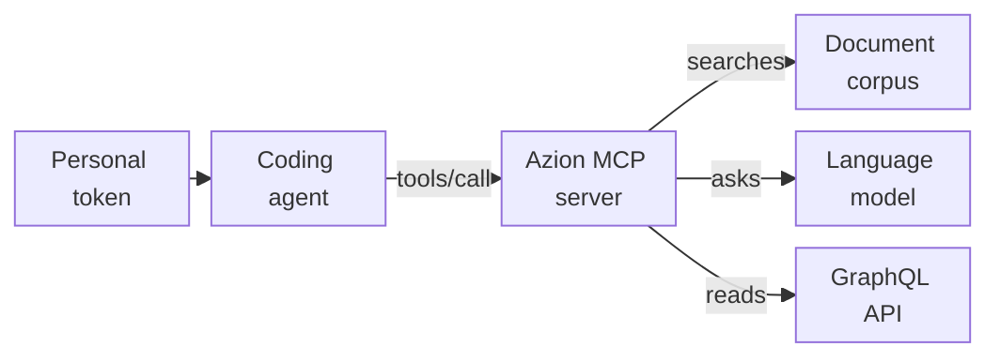

import DocButton from '~/components/webkit/DocButton.vue'
import DocCardGroup from '@aziontech/webkit/doc-card-group'
import DocCard from '@aziontech/webkit/doc-card'

An MCP server gives a coding agent tools it can call to look facts up instead of recalling them from training. The [Model Context Protocol](https://modelcontextprotocol.io) (MCP) is an open standard, developed by Anthropic, that uses JSON-RPC to define how an agent lists the tools of a server, calls them, and reads its resources. The agent asks the server when a question needs a fact, and reads the answer as context, so you do not paste documentation into the conversation yourself.

**Azion MCP server** is a hosted MCP server at `https://mcp.azion.com/` that answers questions about the Azion Platform. It authenticates every request with your Azion [personal token](/en/documentation/fundamentals/personal-tokens/). Its answers are text drawn from the Azion documentation, code samples, and the references of the [Azion CLI](/en/documentation/devtools/cli/), the [Azion API](/en/documentation/devtools/api/), and the [Azion Terraform Provider](/en/documentation/devtools/terraform/). Use the Azion MCP server to find a CLI command or an API operation, pull a code sample, draft a [Rules Engine](/en/documentation/platform/applications/rules-engine/) rule, or write a GraphQL query for the metrics of your account.

<DocButton href="/en/documentation/devtools/mcp/configuration/" label="Get started" size="medium" />
<DocButton href="/en/documentation/devtools/mcp/tools/" label="Browse the tools" kind="secondary" size="medium" />

---

## Tool call

A coding agent reaches a tool with a JSON-RPC `tools/call` request. The request below asks `search_azion_docs_and_site` for two documents about cache. It is a `POST` to `https://mcp.azion.com` with the headers `Authorization: Bearer [TOKEN VALUE]`, `Content-Type: application/json`, and `Accept: application/json, text/event-stream`, and this body:

```json
{
  "jsonrpc": "2.0",
  "method": "tools/call",
  "id": 1,
  "params": {
    "name": "search_azion_docs_and_site",
    "arguments": {
      "query": "how to configure cache",
      "docsAmount": 2
    }
  }
}
```

The server answers with status `200` and one server-sent event. Its data, decoded, is the result below, with the `text` value cut at `…`; the full value holds the two documents that `docsAmount` asks for:

```json
{
  "result": {
    "content": [
      {
        "type": "text",
        "text": "[\n  {\n    \"title\": \"application-acceleration\",\n    \"content\": \"Title: application-acceleration\\nDescription: Application Accelerator speeds up web applications and APIs through protocol optimizations and manages dynamic content requirements.\\nMetatag Keywords: Application Accelerator, Serveless, Edg…"
      }
    ]
  },
  "jsonrpc": "2.0",
  "id": 1
}
```

- `params.name` selects the tool, and `params.arguments` carries its inputs: the `query`, and `docsAmount` for the number of documents.
- `result.content` holds one item of type `text`. For a search tool, that text is a JSON array of documents, each with its `title`, `content`, and `source`, and the `similarity` and `relevance_score` that ranked it.
- The `Authorization` header travels with every request, because the server keeps no session between requests.

If you know JSON-RPC 2.0, you know the message format. You rarely write these requests by hand: the MCP client of your agent writes them when you ask a question in natural language, such as one of these prompts:

- `Configure Rules Engine to cache static assets for 1 year and API responses for 5 minutes.`
- `Optimize my site's Core Web Vitals scores`

---

## Request path

Connecting the Azion MCP server gives your agent no access to change your account. Every tool returns text, and the agent decides what to do with it.



1. You add the server to the configuration of your coding agent, with your personal token in the `Authorization` header.
2. When a question needs a fact about Azion, the MCP client of the agent sends a JSON-RPC request to `https://mcp.azion.com/` as an HTTP `POST`.
3. The server checks the token and reads the API profile of your account, which decides the tools the agent can list.
4. A search tool runs the `query` against a corpus of Azion documents. `create_rules_engine` and `create_graphql_query` also ask a language model to write a rule proposal or a query from the goal you state.
5. `create_graphql_query` runs each query it writes against the analytics [GraphQL API](/en/documentation/devtools/graphql/) of your account, with your token, to validate it. These queries only read data.
6. The server returns the result as text, and the agent uses it to answer you.

For the transport, both authentication schemes, and the OAuth discovery documents, refer to [How the MCP server works](/en/documentation/devtools/mcp/how-it-works/).

---

## What the server covers

The Azion MCP server answers questions and proposes configurations. These are its tools, its limits, and the ways to reach it:

- **Tools**: an account on the v4 API profile sees eight tools. Five search the Azion documentation and website, code samples, Azion CLI commands, the Azion API v4 reference, and the Azion Terraform Provider documentation. `create_rules_engine` drafts a rule for the Rules Engine, `create_graphql_query` writes a GraphQL query, and `deploy_azion_static_site` returns guides to deploy a static site and test its cache. An account on the v3 API profile sees a ninth tool, `search_azion_api_v3_commands`. [Tools and resources](/en/documentation/devtools/mcp/tools/) lists the inputs and the result of each tool.
- **Resources and prompts**: the server serves seven Markdown resources under `azion://static-site/deploy/` and `azion://static-site/test-cache/`, the same guides that `deploy_azion_static_site` returns. It offers no prompts, and a `prompts/list` request returns `-32601 Method not found`.
- **Read only**: no tool creates, changes, or deletes anything in your account. `create_rules_engine` returns a proposal and creates no rule. The server does not deploy either: the static site guides name the Azion CLI commands that you or your agent run.
- **Answers**: search ranking is loose, so the top match can miss the topic. The tools that call a language model report a failure as text inside a successful result. Each search document carries its `source`, the page to check it against.
- **Credential**: every request carries a personal token, as `Authorization: Bearer [TOKEN VALUE]` or `Authorization: Token [TOKEN VALUE]`, and the server answers both the same way. A request without the header gets `401` with the message `No authentication provided`. You create the token in [Azion Console](https://console.azion.com/).
- **Connection**: the server uses the streamable HTTP transport at the bare host, and a request to `/mcp` returns `404`. It answers each request with a server-sent event, keeps no session, and accepts only TLS 1.3.
- **Clients**: [Agent Setup](/en/documentation/agent-setup/) connects Claude Code, Cursor, GitHub Copilot, Windsurf, Codex, Gemini CLI, and OpenCode. [MCP server quickstart](/en/documentation/devtools/mcp/configuration/) connects Claude Code with one command, and shows the configuration for Kiro, and for Claude Desktop and Warp, which reach the server through the `mcp-remote` bridge.
- **Other servers**: a staging server answers at `https://stage-mcp.azion.com` and also requires a token. Its availability can differ from production, so point critical work at `https://mcp.azion.com`. The source of the server is public at [github.com/aziontech/mcp-server](https://github.com/aziontech/mcp-server), and [Run the Azion MCP server locally](/en/documentation/guides/application-development/automation/run-azion-mcp-server-locally/) runs it on `http://localhost:3333`.
- **Your own server**: Azion runs this server as a [function](/en/documentation/platform/functions/). To build and deploy an MCP server of your own the same way, refer to [Run an MCP server on Azion](/en/documentation/guides/application-development/automation/run-mcp-server/).
- **Help**: [Troubleshoot the MCP server](/en/documentation/devtools/mcp/troubleshooting/) lists each error with its cause and fix, [Test cache behavior with the MCP server](/en/documentation/guides/application-performance/cache-and-purge/test-cache-with-mcp/) uses the cache guides on a deployed site, and the [Glossary](/en/documentation/devtools/mcp/glossary/) defines the terms of the server.

---

## Next steps

<DocCardGroup cols={2}>
  <DocCard title="MCP server quickstart" href="/en/documentation/devtools/mcp/configuration/" label="Connect Claude Code to the server and ask your first question." />
  <DocCard title="How the MCP server works" href="/en/documentation/devtools/mcp/how-it-works/" label="Follow a tool call from your agent through authentication to the answer." />
  <DocCard title="Tools and resources" href="/en/documentation/devtools/mcp/tools/" label="Look up the inputs and the result of each tool, and every resource URI." />
  <DocCard title="MCP server guides and tutorials" href="/en/documentation/devtools/mcp/guides/" label="Run an MCP server on Azion, run this server locally, or test cache behavior." />
</DocCardGroup>
