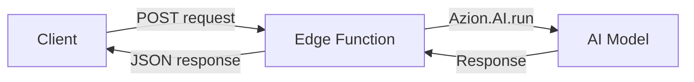

import LinkButton from 'azion-webkit/linkbutton';

Build AI agents that think, respond, and act. Agents run on Azion's global edge network, providing low-latency responses and seamless scalability.

**What you will build:** A conversational AI agent that answers questions and maintains context.

**Time:** ~5 minutes

---

## Create a new project

<LinkButton
    label="Deploy Starter Kit"
    link="https://console.azion.com/create/azion/ai-inference-starter-kit"
    icon="ai ai-azion"  
    icon-pos="left"
/>

1. Access the [Azion Console](https://console.azion.com/).
2. Click **+ Create**.
3. Search for **AI Inference Starter Kit** and select it.
4. Enter a name for your application, such as `my-first-agent`.
5. Click **Deploy**.

This creates a project with:

- An **Edge Application** configured for AI workloads
- A **Function** with pre-configured AI Inference integration
- Example code to get you started

---

## Your first agent

After deployment, navigate to your function and replace the code with this simple agent:

```javascript
async function handler(event) {
  const body = JSON.parse(event.request.body || '{}');
  const userMessage = body.message || 'Hello!';

  const modelResponse = await Azion.AI.run("Qwen/Qwen3-30B-A3B-Instruct-2507-FP8", {
    "stream": false,
    "messages": [
      {
        "role": "system",
        "content": "You are a helpful AI assistant. Be concise and friendly."
      },
      {
        "role": "user",
        "content": userMessage
      }
    ],
    "max_tokens": 500
  });

  return new Response(JSON.stringify({
    response: modelResponse.choices[0].message.content,
    model: modelResponse.model,
    usage: modelResponse.usage
  }), {
    headers: { "Content-Type": "application/json" }
  });
}

addEventListener("fetch", handler);
```

---

## Test your agent

Send a POST request to your function's endpoint:

```bash
curl -X POST https://your-function-url.azion.net \
  -H "Content-Type: application/json" \
  -d '{"message": "What is edge computing?"}'
```

Expected response:

```json
{
  "response": "Edge computing processes data closer to its source, reducing latency and bandwidth by bringing computation near end users or devices.",
  "model": "Qwen/Qwen3-30B-A3B-Instruct-2507-FP8",
  "usage": {
    "prompt_tokens": 22,
    "completion_tokens": 24,
    "total_tokens": 46
  }
}
```

---

## Add conversation memory

To maintain context across messages, you need to manage conversation history. Since edge functions are stateless, you have two options:

### Option 1: Pass history in the request body

```javascript
async function handler(event) {
  const body = JSON.parse(event.request.body || '{}');
  const userMessage = body.message || 'Hello!';
  const conversationHistory = body.history || [];

  // Add user message to history
  conversationHistory.push({
    role: "user",
    content: userMessage
  });

  const modelResponse = await Azion.AI.run("Qwen/Qwen3-30B-A3B-Instruct-2507-FP8", {
    "stream": false,
    "messages": [
      {
        "role": "system",
        "content": "You are a helpful AI assistant. Be concise and friendly."
      },
      ...conversationHistory
    ],
    "max_tokens": 500
  });

  const assistantMessage = modelResponse.choices[0].message.content;

  // Add assistant response to history
  conversationHistory.push({
    role: "assistant",
    content: assistantMessage
  });

  return new Response(JSON.stringify({
    response: assistantMessage,
    history: conversationHistory
  }), {
    headers: { "Content-Type": "application/json" }
  });
}

addEventListener("fetch", handler);
```

### Option 2: Use KV Store for persistent sessions

For persistent conversation history across requests, use [KV Store](/en/documentation/products/store/kv-database/) to store session data with a unique session ID.

---

## What just happened?

When you sent a message:

1. **Request** arrived at your edge function
2. **Function** called `Azion.AI.run()` with your message
3. **Model** processed the request at the edge
4. **Response** returned to the client with minimal latency



### Key concepts

| Concept | What it means |
|---------|---------------|
| **Edge execution** | Code runs on Azion's distributed network, close to users |
| **Azion.AI.run()** | SDK method to invoke AI models |
| **Model selection** | Choose from available models based on your use case |
| **Streaming** | Enable real-time responses with `stream: true` |

---

## Add tool calling

Enable your agent to call external functions:

```javascript
async function handler(event) {
  const body = JSON.parse(event.request.body || '{}');
  const userMessage = body.message;

  const tools = [
    {
      "type": "function",
      "function": {
        "name": "get_weather",
        "description": "Get current weather for a location",
        "parameters": {
          "type": "object",
          "properties": {
            "location": {
              "type": "string",
              "description": "City name"
            }
          },
          "required": ["location"]
        }
      }
    }
  ];

  const modelResponse = await Azion.AI.run("Qwen/Qwen3-30B-A3B-Instruct-2507-FP8", {
    "stream": false,
    "messages": [
      {
        "role": "system",
        "content": "You are a helpful assistant with access to tools."
      },
      {
        "role": "user",
        "content": userMessage
      }
    ],
    "tools": tools
  });

  // Check if the model wants to call a tool
  if (modelResponse.choices[0].message.tool_calls) {
    const toolCall = modelResponse.choices[0].message.tool_calls[0];
    const args = JSON.parse(toolCall.function.arguments);
    
    // Execute the tool (you would implement this)
    const weatherData = await getWeather(args.location);
    
    return new Response(JSON.stringify({
      tool: toolCall.function.name,
      location: args.location,
      weather: weatherData
    }), {
      headers: { "Content-Type": "application/json" }
    });
  }

  return new Response(JSON.stringify({
    response: modelResponse.choices[0].message.content
  }), {
    headers: { "Content-Type": "application/json" }
  });
}

async function getWeather(location) {
  // Implement your weather API call here
  return { location, temperature: "22°C", condition: "Sunny" };
}

addEventListener("fetch", handler);
```

---

## Troubleshooting

### "Model not found" error

Make sure:
1. The model name matches exactly (case-sensitive)
2. Check [available models](/en/documentation/products/ai/ai-inference/models/) for correct names

### High latency

Try these solutions:
1. Enable streaming: `"stream": true`
2. Reduce `max_tokens` for shorter responses
3. Choose a smaller model for faster inference

### Rate limit errors

Check the default limits:
- **300 requests per minute**

Contact support to increase limits for production workloads.

### Function timeout

If your function times out:
1. Reduce `max_tokens`
2. Simplify your prompt
3. Consider breaking complex tasks into smaller steps

---

## Next steps

Now that you have a working agent, explore:

| Learn how to | Refer to |
|-------------|----------|
| Use different models | [Available models](/en/documentation/products/ai/ai-inference/models/) |
| Implement tool calling | [Tool calling example](/en/documentation/products/ai/ai-inference/models/mistral-3-small/#tool-calling-example) |
| Build RAG applications | [Vector Search](/en/documentation/products/store/sql-database/vector-search/) |
| Deploy with templates | [AI Inference Starter Kit](/en/documentation/products/guides/ai-inference-starter-kit/) |
