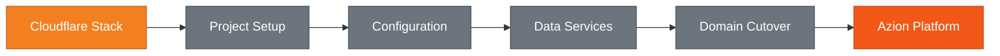

import Tabs from '~/components/tabs/Tabs'

# Why Migrate from Cloudflare to Azion

A platform migration usually begins long before the first configuration file is changed. It starts when a team notices that its current environment no longer gives the same level of clarity, speed, or control it once did.

Maybe deployments still work, but the process requires too much manual coordination. Maybe the application has grown beyond the original architecture. Maybe the team needs stronger compliance alignment, more predictable runtime behavior, or a more unified way to manage compute, storage, databases, delivery, and security.

For teams currently using Cloudflare Pages, Workers, Workers KV, R2, D1, redirects, custom headers, DNS, WAF, logs, or analytics, Azion provides equivalent capabilities through Applications, Functions, KV Store, Object Storage, SQL Database, Rules Engine, Edge DNS, Web Application Firewall, Real-Time Events, and Real-Time Metrics.

The strongest reason to migrate is not simply to replace one vendor with another. It is to modernize your application platform without restarting your architecture from zero.

## How Cloudflare to Azion Migration Works

Traditional platform migrations often require rewriting application logic, reconfiguring infrastructure from scratch, and managing multiple disconnected services. This approach creates operational risk, extends timelines, and fragments team knowledge across different configuration patterns.



The Azion migration approach preserves your application logic while transitioning to a unified platform:

1. **Incremental migration path.** Start with a single project, validate each layer independently, and expand with confidence. No need to migrate everything at once.

2. **Preserved application logic.** Functions, redirects, headers, and data services map directly to Azion equivalents with minimal code changes—primarily syntax updates for environment access and service imports.

3. **Unified platform model.** Instead of managing compute, storage, databases, security, and observability as disconnected layers, Azion brings these capabilities together with consistent APIs and configuration patterns.

| Phase | Description |
| :---- | :---------- |
| **Project Setup** | Connect repository, configure build, deploy to Azion-generated URL |
| **Variables & Secrets** | Recreate runtime configuration securely in Azion |
| **Routing & Headers** | Migrate redirects, rewrites, and custom header rules |
| **Functions** | Update Workers to Azion Functions with syntax changes |
| **Data Services** | Move KV data, object storage, and database workloads |
| **Domain Cutover** | Configure certificates, point DNS, validate production traffic |

## Overview

The migration follows this high-level flow:


:::note
If you do not need near-zero downtime, you can migrate in phases with maintenance windows. This allows stopping writes during each migration step without requiring parallel data synchronization.
:::

## 1. Project Setup on Azion

The first step brings your application into Azion in a way that feels familiar to teams that deploy modern web projects. If you have used Cloudflare Pages, you already understand the pattern: connect a repository, define framework settings, run a build, deploy the output, and validate the generated URL.

Azion follows a similar workflow but with a broader platform context. Your project becomes part of an environment where application delivery, Functions, rules, security, and observability can be managed together.

### Key Differences

| Aspect | Cloudflare | Azion |
| :----- | :--------- | :---- |
| **Config file** | `wrangler.toml` (TOML) | `azion.config.js` (JavaScript) |
| **Framework detection** | 15+ frameworks | 24+ frameworks with auto-detection |
| **Cold starts** | Possible | Eliminated |
| **Compliance** | SOC 2, ISO 27001 | PCI DSS 4.0.1 Level 1, SOC 2 Type II |

### Connect Your Repository

1. Open [Azion Console](https://console.azion.com/).
2. Click **+ Create** > **Import from GitHub**.
3. Authorize the Azion GitHub App.
4. Select the repository you want to migrate.

:::note
Keep the first deployment intentionally small. Do not try to migrate every domain, redirect, function, storage dependency, and database at once. Start by proving the application can build and run on Azion.
:::

### Configure Your Build

Azion auto-detects your framework and configures build settings. Override the detected preset in `azion.config.js`:

```javascript
import { defineConfig } from 'azion'

export default defineConfig({
  name: 'my-project',
  preset: 'nextjs', // Override auto-detection if needed
})
```

### Deploy and Verify

Deploy from the Azion Console or CLI. Your temporary Azion URL follows this pattern:

```
https://xxxxxxxxxx.map.azionedge.net/
```

Validate the deployment:

```bash
curl https://xxxxxxxxxx.map.azionedge.net/
```

## 2. Migrating Custom Domains

Custom domain migration is one of the most sensitive parts of any platform transition. It affects users, SEO, brand trust, and production availability. Plan domain migration as a controlled cutover, not a last-minute DNS change.

### Migration Strategies

| Strategy | Best For | DNS Control |
| :------- | :------- | :---------- |
| **CNAME** | Quick subdomain migration | Keep your DNS provider |
| **Nameserver** | Full DNS control and apex domains | Transfer DNS to Azion |

### Create the Certificate

Create your SSL/TLS certificate **before** pointing your domain to Azion. This ensures users can access the application securely over HTTPS when the domain starts resolving to the new infrastructure.

Azion provides free Let's Encrypt certificates with automatic renewal.

### Configure the Domain

Create a workload in Azion Console and associate your custom domain. See [Workloads Documentation](https://www.azion.com/en/documentation/products/secure/workloads/).

### Point the Domain to Azion

<Tabs client:visible>
    <Fragment slot="tab.cname">CNAME Migration</Fragment>
    <Fragment slot="tab.nameserver">Nameserver Migration</Fragment>

<Fragment slot="panel.cname">
Point the subdomain to the Azion-generated domain:

```
www CNAME xxxxxxxxxx.map.azionedge.net
```

This keeps your current DNS provider while routing traffic through Azion.
</Fragment>

<Fragment slot="panel.nameserver">
Configure your domain to use Azion DNS nameservers:

```
ns1.aziondns.net
ns2.aziondns.com
ns3.aziondns.org
```

This gives Azion full DNS control, required for apex domains.
</Fragment>
</Tabs>

### Verify Propagation

```bash
dig www.yourdomain.com CNAME +short
```

:::caution[warning]
Before switching production traffic, confirm: certificate is active, domain is associated with correct workload, DNS records are ready, critical routes have been tested, redirects behave as expected, and monitoring is configured for post-cutover validation.
:::

## 3. Converting Build Configuration

A migration can appear successful when the build passes but fail later when runtime behavior differs. Review build and deployment configuration carefully instead of treating it as a mechanical command replacement.

### CLI Quick Reference

| Task | Cloudflare | Azion |
| :--- | :--------- | :---- |
| **Install** | `npm install -g wrangler` | `curl -fsSL https://cli.azion.app/install.sh \| bash` |
| **Login** | `wrangler login` | `azion login` |
| **Local dev** | `wrangler pages dev ./dist` | `azion dev` |
| **Deploy** | `wrangler pages deploy ./dist` | `azion deploy` |

### Review Questions

During migration, answer these questions:

* Does the application build with the expected framework preset?
* Does the build output match what Azion expects to deploy?
* Are runtime variables accessed through correct Azion APIs?
* Are any Cloudflare-specific assumptions still embedded in code?
* Can the team run local development and deploy flows consistently?

## 4. Moving Environment Variables

Environment variables contain API keys, database credentials, authentication secrets, service endpoints, feature flags, and environment-specific configuration. Migrating them incorrectly causes runtime failures even when deployment succeeds.

### Key Differences

| Aspect | Cloudflare | Azion |
| :----- | :--------- | :---- |
| **Access** | `env.VARIABLE` | `Azion.env.get('VARIABLE')` |
| **Parameters** | `fetch(request, env, ctx)` | `fetch(request)` |

### Inventory Your Variables

Before changing code, identify every variable in:

* Cloudflare Pages: **Dashboard > Settings > Environment variables**
* Cloudflare Workers: `wrangler.toml`
* CLI-managed secrets
* CI/CD environment settings
* Runtime configuration in source code

### Create Variables in Azion

Via Console:

```
Build > Variables > Add Variable
```

Via API:

```bash
curl -X POST 'https://api.azionapi.net/v4/variables' \
  --header 'Authorization: Token YOUR_TOKEN' \
  --data '{"name": "API_KEY", "value": "your-secret-key"}'
```

### Update Your Code

```javascript
// Before: Cloudflare
const apiKey = env.API_KEY;

// After: Azion
const apiKey = Azion.env.get('API_KEY');
```

:::caution[warning]
Avoid copying secrets into local notes, tickets, chat messages, or temporary documents. Keep secrets in approved systems and limit access to processes that need them.
:::

## 5. Rewriting and Redirecting URLs

Redirects protect years of SEO value, campaign links, backlinks, bookmarks, and user expectations. When redirects break, the impact shows up as lost traffic, lower rankings, and poor user experience.

### Key Differences

| Aspect | Cloudflare | Azion |
| :----- | :--------- | :---- |
| **Configuration** | `_redirects` file | Rules Engine (Console or API) |
| **Pattern matching** | Glob patterns (`/*`) | Regex (`^/.*$`) |
| **Capture groups** | `:splat`, `:placeholder` | `%{capture[1]}`, `%{capture[2]}` |

### Pattern Conversion

| Cloudflare Pattern | Azion Regex |
| :----------------- | :---------- |
| `/old-page` | `^/old-page$` |
| `/blog/*` | `^/blog/(.*)$` |
| `:splat` | `%{capture[1]}` |

### Create Redirect Rules

Navigate to **Rules Engine** and configure:

**Criteria:**

```
${uri} matches ^/old-blog/(.*)$
```

**Behavior:**

```
Redirect To (301): /blog/%{capture[1]}
```

### Verify Redirects

```bash
curl -I https://yourdomain.com/old-blog/post
```

:::note
For SEO-sensitive migrations: prioritize permanent redirects where appropriate, avoid unnecessary redirect chains, confirm canonical paths remain consistent, and test both trailing slash versions when relevant.
:::

## 6. Migrating Custom Headers

HTTP headers control caching, security, and browser behavior. Azion gives teams a more flexible model through `azion.config.js` and Rules Engine, allowing rules that respond to request characteristics.

### Key Differences

| Aspect | Cloudflare | Azion |
| :----- | :--------- | :---- |
| **Config file** | `_headers` (text) | `azion.config.js` (JavaScript) |
| **Phases** | Response only | Request and response |
| **Dynamic values** | Not supported | `${uri}`, `${host}`, `${geoip_city_country_code}` |

### Example: Security Headers

```javascript
import type { AzionConfig } from 'azion/config';

const config: AzionConfig = {
  applications: [{
    name: 'my-app',
    rules: {
      response: [{
        name: 'Security Headers',
        active: true,
        criteria: [[{ variable: '${uri}', operator: 'starts_with', argument: '/' }]],
        behaviors: [
          { type: 'add_response_header', attributes: { value: 'X-Frame-Options: SAMEORIGIN' }},
          { type: 'add_response_header', attributes: { value: 'X-Content-Type-Options: nosniff' }}
        ]
      }]
    }
  }]
};

export default config;
```

## 7. Migrating Workers to Functions

Functions are the computational engine of modern distributed applications. They often contain the most business-critical logic: authentication, personalization, API orchestration, and integrations with third-party systems.

### Key Differences

| Aspect | Cloudflare Workers | Azion Functions |
| :----- | :----------------- | :-------------- |
| **Function signature** | `fetch(request, env, ctx)` | `fetch(request)` |
| **Environment access** | `env.VARIABLE` | `Azion.env.get('VARIABLE')` |
| **Memory** | 128 MB free, 2 GB paid | 512 MB all plans |
| **Cold starts** | Possible | Eliminated |

### Update Function Signature

```javascript
// Before: Cloudflare
export default {
  async fetch(request, env, ctx) {
    const apiKey = env.API_KEY;
    return fetch(apiUrl, { headers: { 'Authorization': `Bearer ${apiKey}` }});
  }
};

// After: Azion
export default {
  async fetch(request) {
    const apiKey = Azion.env.get('API_KEY');
    return fetch(apiUrl, { headers: { 'Authorization': `Bearer ${apiKey}` }});
  }
};
```

### Update Geo Metadata

```javascript
// Before: Cloudflare
const country = request.cf.country;

// After: Azion
const country = request.metadata['geoip_country_code'];
```

### Update Service Imports

```javascript
import { Database } from 'azion:sql';

const db = new Database('my-database');
const result = await db.prepare('SELECT * FROM users').all();
```

## 8. Replacing Workers KV with KV Store

Key-value storage is used for fast access to configuration, user preferences, session metadata, feature flags, and personalization data. The migration should preserve data consistency and application compatibility.

### API Comparison

```javascript
// Before: Cloudflare
await env.MY_KV_NAMESPACE.put('key1', 'value1');
const value = await env.MY_KV_NAMESPACE.get('key1');

// After: Azion
import { KVStore } from 'azion:kv';

const kv = new KVStore('my-store');
await kv.put('key1', 'value1');
const value = await kv.get('key1');
```

### Export and Import

Export existing KV data through Cloudflare's API. Before importing, review:

* Key naming conventions and prefixes
* Expiration logic
* Value formats and serialized object structure
* Missing-key and default value behavior

## 9. Replacing R2 with Object Storage

Object storage powers files that matter to users and business operations: images, documents, static assets, media files, uploads, and generated content.

### Key Differences

| Aspect | Cloudflare R2 | Azion Object Storage |
| :----- | :------------ | :------------------- |
| **Endpoint** | `<account>.r2.cloudflarestorage.com` | `s3.azionstorage.net` |
| **Region** | `auto` | `us-east` |
| **Data transfer out** | Free | Zero cost |

### Update Configuration

```javascript
import { S3Client } from '@aws-sdk/client-s3';

const client = new S3Client({
  region: 'us-east',
  endpoint: 'https://s3.azionstorage.net',
  credentials: {
    accessKeyId: Azion.env.get('AZION_ACCESS_KEY'),
    secretAccessKey: Azion.env.get('AZION_SECRET_KEY')
  }
});
```

:::note
Migrate data using familiar tools such as rclone or AWS CLI. Before migration, map buckets, object prefixes, public/private assets, access patterns, and signed URL logic.
:::

## 10. Replacing D1 with SQL Database

Database migration touches the core of application state. Azion SQL Database is SQLite-compatible, ACID-compliant, and uses a distributed Main/Replicas architecture.

### Key Differences

| Aspect | Cloudflare D1 | Azion SQL Database |
| :----- | :------------ | :----------------- |
| **Connection** | `env.DB` binding | `new Database('name')` |
| **SQL dialect** | SQLite | SQLite |
| **Vector search** | Supported | Supported |

### Update Your Code

```javascript
// Before: Cloudflare
const result = await env.DB
  .prepare('SELECT * FROM users WHERE id = ?')
  .bind(1)
  .first();

// After: Azion
import { Database } from 'azion:sql';

const db = new Database('my-database');
const result = await db
  .prepare('SELECT * FROM users WHERE id = ?')
  .bind(1)
  .first();
```

### Export and Import

```bash
# Export from D1
wrangler d1 export my-db --output=dump.sql

# Import to Azion (via EdgeSQL CLI or migration workflow)
```

## Resuming After Interruption

If migration is interrupted, follow this approach:

1. **Verify last completed phase** - Check what was successfully migrated
2. **Resume from next phase** - Continue with the next migration step
3. **Re-validate affected services** - Test any services that may have been partially migrated

:::caution[warning]
Do not attempt to resume mid-data-transfer. If KV, Object Storage, or SQL Database migration is interrupted, complete a fresh export/import to ensure data consistency.
:::

### Starting Over

If you need to restart the migration:

1. Remove migrated resources from Azion
2. Verify source data integrity in Cloudflare
3. Begin migration from project setup phase

## Troubleshooting

### Common Issues

| Issue | Solution |
| :---- | :------- |
| **Build fails on Azion** | Check framework preset matches your project; verify build command in `azion.config.js` |
| **Environment variables not found** | Confirm variables created in Azion Console; check code uses `Azion.env.get()` syntax |
| **Redirects not working** | Verify regex patterns are correct; check Rules Engine criteria syntax |
| **Functions return errors** | Update function signature to `fetch(request)`; verify `Azion.env.get()` for variables |
| **KV data missing** | Re-export from Cloudflare; verify import completed without errors |
| **Object Storage access denied** | Check S3 credentials are correct; verify endpoint is `s3.azionstorage.net` |
| **Database queries fail** | Confirm schema imported correctly; verify `new Database('name')` syntax |
| **DNS not resolving** | Check CNAME or nameserver configuration; allow time for propagation |
| **Certificate not active** | Verify domain ownership; check certificate provisioning status |

### Checking Logs

Access logs through Real-Time Events:

```bash
# Via Azion CLI
azion logs --application my-app --tail
```

Review error patterns and validate against expected behavior.


## Feature Mapping

| Cloudflare Feature | Azion Feature | Documentation |
| :----------------- | :------------ | :------------ |
| Pages build settings | Applications | [Applications Docs](https://www.azion.com/en/documentation/products/build/applications/) |
| Page Rules / redirects | Rules Engine | [Rules Engine Docs](https://www.azion.com/en/documentation/products/build/applications/rules-engine/) |
| Workers / Functions | Functions | [Functions Docs](https://www.azion.com/en/documentation/products/build/applications/functions/) |
| Workers KV | KV Store | [KV Store](https://www.azion.com/en/products/kv-store/) |
| R2 Object Storage | Object Storage | [Object Storage Docs](https://www.azion.com/en/documentation/products/store/object-storage/) |
| D1 Database | SQL Database | [SQL Database Docs](https://www.azion.com/en/documentation/products/store/sql-database/) |
| Images | Image Processor | [Image Processor Docs](https://www.azion.com/en/documentation/products/build/applications/image-processor/) |
| WAF | Web Application Firewall | [WAF Docs](https://www.azion.com/en/documentation/products/secure/firewall/web-application-firewall/) |
| DDoS Protection | DDoS Protection | [DDoS Docs](https://www.azion.com/en/documentation/products/secure/firewall/ddos-protection/) |
| DNS | Edge DNS | [Edge DNS Docs](https://www.azion.com/en/documentation/products/secure/edge-dns/) |
| TLS/SSL | Certificate Manager | [Certificates Guide](https://www.azion.com/en/documentation/products/guides/secure/digital-certificates/) |
| Analytics | Real-Time Metrics | [Metrics Docs](https://www.azion.com/en/documentation/products/observe/real-time-metrics/) |
| Logs | Real-Time Events | [Events Docs](https://www.azion.com/en/documentation/products/observe/real-time-events/) |

## Key Advantages After Migration

Migrating from Cloudflare to Azion is straightforward for most modern applications, especially those using Workers, KV, R2, or D1. The immediate goal of migration is continuity—your application should keep working, users should keep accessing the same experiences, and critical business flows should remain stable.

But the larger value comes after the migration, when the team starts operating on a more unified platform.

| Advantage | Impact |
| :---- | :---- |
| **Zero cold starts** | More consistent response times |
| **Unmetered DDoS protection** | No surprise billing at scale |
| **S3-compatible storage** | Easier migration and zero DTO cost |
| **SQLite-compatible database** | Familiar tooling and vector search |
| **PCI DSS Level 1 compliance** | Ready for financial workloads |
| **Unified platform model** | Less fragmentation across build, secure, store, and observe workflows |
| **Rules Engine** | More control over routing, redirects, and headers |
| **Real-Time Metrics and Events** | Better production visibility and troubleshooting |

With Azion, teams can build and run applications on globally distributed infrastructure while combining compute, delivery, storage, database, security, and observability capabilities in one environment. This reduces the fragmentation that often appears when modern applications depend on many separate services and configuration patterns.

Functions can interact with platform services such as KV Store and SQL Database. Applications can use Rules Engine for routing, redirects, and headers. Object Storage can support static assets, media, and user-generated files. Security capabilities can protect workloads. Real-Time Metrics and Events can give teams visibility into what is happening in production.

For engineering leaders, this means more operational clarity. For developers, it means a more cohesive workflow. For infrastructure and security teams, it means stronger control over how applications are delivered and protected. For the business, it means a platform foundation that can support growth without adding unnecessary complexity to every release cycle.

## Next Steps

After your migration is complete:

* Review [Real-Time Metrics](https://www.azion.com/en/documentation/products/observe/real-time-metrics/) to monitor application performance
* Set up [Real-Time Events](https://www.azion.com/en/documentation/products/observe/real-time-events/) for production visibility
* Configure [Web Application Firewall](https://www.azion.com/en/documentation/products/secure/firewall/web-application-firewall/) for production security
* Review the individual feature guides for advanced configuration

### Get Started with a Small Project

The best way to begin is not with the most complex application in your portfolio. Start with a project that is meaningful enough to validate the migration path, but small enough to move quickly and safely.

Choose an application or workload that includes representative pieces of your architecture: a build process, a few redirects, environment variables, maybe one function, and a manageable amount of data. Use that project to validate the workflow, document the process, and identify internal patterns your team can reuse.

From there, expand gradually. Migrate more complex routes. Move additional functions. Bring over storage and database workloads. Add observability. Review security rules. Then prepare production cutovers with greater confidence.

### Recommended Next Steps

* [Create your free Azion account](https://console.azion.com/signup)
* [Read the Applications documentation](https://www.azion.com/en/documentation/products/build/applications/)
* [Explore the Azion CLI](https://www.azion.com/en/documentation/products/azion-cli/overview/)
* [Join the Azion community](https://www.azion.com/en/documentation/community/)

## Need Help?

Get help from [the Azion Support team](https://www.azion.com/en/documentation/), or join our [Discord community](https://discord.gg/azion) to see how others are using Azion.
