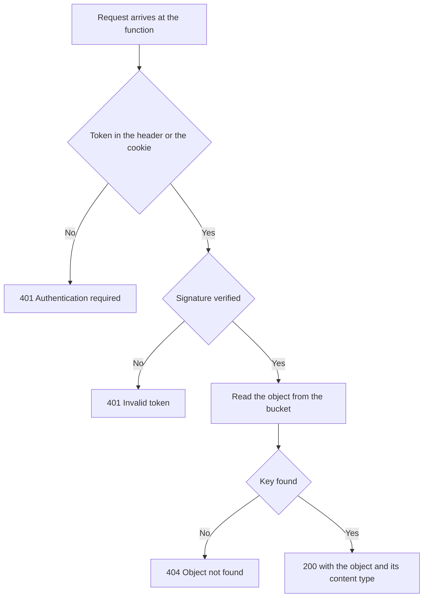

import DocCardGroup from '@aziontech/webkit/doc-card-group'
import DocCard from '@aziontech/webkit/doc-card'
import DocSteps from '@aziontech/webkit/doc-steps'
import DocStep from '@aziontech/webkit/doc-step'

You can put a function in front of an [Object Storage](/en/documentation/store/object-storage/) bucket, so the function validates a JSON Web Token before any object leaves the bucket.

A request that carries a valid token receives the object with its content type. Every other request receives HTTP `401`, and the bucket is never read. A bucket that needs no token is served by a connector and a Rules Engine rule instead, which [Use a bucket as an application origin](/en/documentation/guides/application-development/data/use-bucket-as-origin/) covers.

---

## Prerequisites

- An [Azion account](https://console.azion.com/).
- The [Azion CLI](/en/documentation/devtools/cli/) installed and authorized.
- Node.js version 18 or higher.
- A bucket that holds the objects to protect, with **Workloads Access** set to _Read Only_ or _Read & Write_. A bucket set to _Restricted_ is not read by Azion Runtime, so the function reaches nothing in it. Refer to [Create a bucket](/en/documentation/guides/application-development/data/create-and-modify-bucket/).
- A signing secret for the tokens your application issues.

---

## How the check runs

The function answers the requests a rule routes to it. It reads the token from the `Authorization` header or from the `auth_token` cookie, verifies the signature against the shared secret, and calls Object Storage only after the signature checks out. A bucket is also reachable through the S3 endpoint and through a connector, and neither of those paths asks for a token; the function guards the path it sits on.

The flow below shows the two refusals and the single route that reaches the bucket:



---

## Create the function project

The Azion CLI scaffolds the project and `npm` adds the library that verifies the token. To set up the project:

<DocSteps>
  <DocStep title="Initialize the project">

  ```bash
  azion init my-auth-storage
  ```

  At the prompts, set **Template** to _JavaScript_ and **Runtime** to _Azion Runtime_. The Azion CLI writes the project into a `my-auth-storage` folder.

  </DocStep>
  <DocStep title="Go to the project folder">

  ```bash
  cd my-auth-storage
  ```

  </DocStep>
  <DocStep title="Install the token library">

  ```bash
  npm install jose
  ```

  The `jose` library verifies JSON Web Tokens in JavaScript runtimes. `npm` adds it to `package.json`.

  </DocStep>
</DocSteps>

The project folder holds the template source and the `jose` dependency.

---

## Write the handler

Open the main JavaScript file of the project and replace its contents with this handler:

```javascript
import Storage from "azion:storage";
import { jwtVerify } from "jose";

async function verifyToken(token) {
  try {
    const secretKey = new TextEncoder().encode(Azion.env.get("JWT_SECRET"));
    const { payload } = await jwtVerify(token, secretKey);
    return { valid: true, payload };
  } catch (error) {
    console.error("JWT verification failed:", error.message);
    return { valid: false, error: error.message };
  }
}

function extractToken(request) {
  // The Authorization header comes first.
  const authHeader = request.headers.get("Authorization");
  if (authHeader && authHeader.startsWith("Bearer ")) {
    return authHeader.substring(7);
  }

  // The cookie is the fallback.
  const cookieHeader = request.headers.get("Cookie");
  if (cookieHeader) {
    const cookies = cookieHeader.split(";").map(c => c.trim());
    const authCookie = cookies.find(c => c.startsWith("auth_token="));
    if (authCookie) {
      return authCookie.substring(11);
    }
  }

  return null;
}

async function handleRequest(event) {
  const request = event.request;
  const url = new URL(request.url);

  // /files/image.png reaches the bucket as the key image.png
  const objectKey = url.pathname.replace(/^\/files\//, "");

  if (!objectKey) {
    return new Response(JSON.stringify({ error: "Object key required" }), {
      status: 400,
      headers: { "Content-Type": "application/json" }
    });
  }

  const token = extractToken(request);

  if (!token) {
    return new Response(JSON.stringify({
      error: "Authentication required",
      message: "Provide a valid JWT token in Authorization header or auth_token cookie"
    }), {
      status: 401,
      headers: {
        "Content-Type": "application/json",
        "WWW-Authenticate": "Bearer"
      }
    });
  }

  const verification = await verifyToken(token);

  if (!verification.valid) {
    return new Response(JSON.stringify({
      error: "Invalid token",
      message: verification.error
    }), {
      status: 401,
      headers: { "Content-Type": "application/json" }
    });
  }

  try {
    const storage = new Storage(Azion.env.get("BUCKET_NAME"));
    const storageObject = await storage.get(objectKey);

    return new Response(storageObject.content, {
      status: 200,
      headers: {
        "Content-Type": storageObject.contentType || "application/octet-stream",
        "Content-Length": String(storageObject.contentLength ?? ""),
        "Cache-Control": "private, max-age=3600"
      }
    });
  } catch (error) {
    console.error("Storage error:", error);

    if (error.message && error.message.includes("not found")) {
      return new Response(JSON.stringify({
        error: "Object not found"
      }), {
        status: 404,
        headers: { "Content-Type": "application/json" }
      });
    }

    return new Response(JSON.stringify({
      error: "Internal server error"
    }), {
      status: 500,
      headers: { "Content-Type": "application/json" }
    });
  }
}

addEventListener("fetch", (event) => {
  event.respondWith(handleRequest(event));
});
```

Six decisions sit in the code:

- The object key is the request path with `/files/` removed, so `/files/image.png` reads the key `image.png`. A request that leaves the key empty returns `400` with the body `{"error": "Object key required"}`.
- A request with no token returns `401`, carries the header `WWW-Authenticate: Bearer`, and names both accepted places in its `message` field.
- A token the secret does not verify returns `401` with the body `{"error": "Invalid token"}` and the message `jose` raised.
- A verified token reads the object and returns it with the content type Object Storage stored, or `application/octet-stream` when the object carries none. `Cache-Control: private, max-age=3600` keeps the response out of a shared cache.
- A key that is not in the bucket returns `404` with the body `{"error": "Object not found"}`. Every other storage failure returns `500`.
- `console.error` writes `JWT verification failed:` and `Storage error:`, and both lines reach the function logs.

The handler reads `JWT_SECRET` and `BUCKET_NAME` with `Azion.env.get`, so neither value is written into the code.

---

## Configure the environment variables

Create a `.env` file in the root of the project, with the bucket the handler reads and the secret it verifies against:

```text
BUCKET_NAME=your-bucket-name
JWT_SECRET=your-secret
```

:::caution
Never commit the `.env` file or a secret such as `JWT_SECRET` to your code repository. Add `.env` to your `.gitignore`.
:::

---

## Configure local storage for development

Azion Runtime answers a local Object Storage call from a folder on your machine. Add a `storage` block to `azion.config` so `storage.get` resolves while you develop:

```javascript
storage: [
  {
    name: 'your-bucket-name',
    prefix: 'your-bucket-prefix',
    dir: './path/to/storage/files',
    workloadsAccess: 'read_only',
  },
],
```

Replace `your-bucket-name`, `your-bucket-prefix`, and `./path/to/storage/files` with the values of your project. `workloadsAccess` is the camelCase spelling the configuration file uses for the bucket's access level, and `read_only` is enough for a handler that only reads.

---

## Deploy the function

The deploy sends the code, and `azion sync` sends the values the code reads. To put both on your account:

<DocSteps>
  <DocStep title="Deploy the project">

  ```bash
  azion deploy
  ```

  The Azion CLI builds the project and sends the function to your account.

  </DocStep>
  <DocStep title="Send the environment variables">

  ```bash
  azion sync
  ```

  The handler reads `BUCKET_NAME` and `JWT_SECRET` at run time. Without this step the variables exist only in your `.env` file, and the function does not find them.

  </DocStep>
</DocSteps>

The function runs on your account with the bucket name and the signing secret it needs.

---

## Verify the setup

Sign a token with the same secret, then request an object three times: with the header, with the cookie, and with neither. To check the function:

<DocSteps>
  <DocStep title="Sign a test token">

  Save the script as `sign-token.mjs` in the project folder, so Node.js reads it as a module, and run it with `node sign-token.mjs`:

  ```javascript
  import { SignJWT } from 'jose';

  const secret = new TextEncoder().encode('your-secret-key');

  const token = await new SignJWT({
    sub: 'user123',
    permissions: ['read:files']
  })
    .setProtectedHeader({ alg: 'HS256' })
    .setIssuedAt()
    .setExpirationTime('2h')
    .sign(secret);

  console.log(token);
  ```

  The script prints the signed token. Set `secret` to the value you stored in `JWT_SECRET`, or the function refuses every token the script issues.

  </DocStep>
  <DocStep title="Request an object with the Authorization header">

  ```bash
  curl -H "Authorization: Bearer YOUR_JWT_TOKEN" \
    https://your-domain.com/files/document.pdf
  ```

  The response carries the object and the content type Object Storage stored for it.

  </DocStep>
  <DocStep title="Request the same object with the cookie">

  ```bash
  curl -b "auth_token=YOUR_JWT_TOKEN" \
    https://your-domain.com/files/document.pdf
  ```

  The response is the same, which confirms the cookie fallback.

  </DocStep>
  <DocStep title="Request the object with no token">

  ```bash
  curl https://your-domain.com/files/document.pdf
  ```

  The function refuses the request with HTTP `401`:

  ```json
  {
    "error": "Authentication required",
    "message": "Provide a valid JWT token in Authorization header or auth_token cookie"
  }
  ```

  </DocStep>
</DocSteps>

A signed token returns the object, and an absent or unverifiable token returns `401` without reaching the bucket.

---

## Next steps

<DocCardGroup cols={2}>
  <DocCard title="Create a bucket" href="/en/documentation/guides/application-development/data/create-and-modify-bucket/" label="Create the bucket this function reads, and set its access level." />
  <DocCard title="Use a bucket as an application origin" href="/en/documentation/guides/application-development/data/use-bucket-as-origin/" label="Serve a bucket through a connector and a rule when the objects need no token." />
  <DocCard title="Storage runtime API" href="/en/documentation/devtools/runtime/api-reference/storage/" label="Every method and field of the azion:storage module the handler calls." />
  <DocCard title="Functions" href="/en/documentation/build/functions/" label="How a function is built, deployed, and routed on the Azion platform." />
</DocCardGroup>
