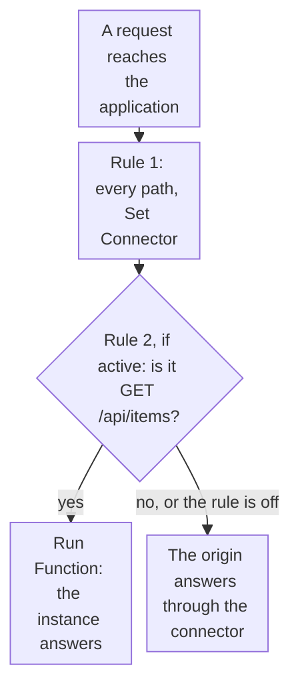

import DocCardGroup from '@aziontech/webkit/doc-card-group'
import DocCard from '@aziontech/webkit/doc-card'
import DocSteps from '@aziontech/webkit/doc-steps'
import DocStep from '@aziontech/webkit/doc-step'
import Tabs from '~/components/webkit/Tabs.vue'

You run a function on one path and one method of an application with a _Run Function_ rule, and roll the path back by turning that rule off, from Azion Console, the API, or the Azion CLI. To create the function and its instance first, refer to [Functions quickstart](/en/documentation/platform/functions/quickstart/).

A rule for one path moves that path to the function, while every other path keeps the rule that served it before. The rule's **Active** switch, the `active` field in the API, is the rollback: a rule turned off does not run, and the path goes back to the earlier rule with no change to any other rule.



1. Every request matches the first rule, which sends it to the origin through a connector.
2. A `GET` request for `/api/items` also matches the second rule while it is active, and the function instance answers it.
3. Any other request, and every request once the second rule is off, is answered by the origin.

---

## Prerequisites

- An application served by a workload, with a rule that sends every request to a connector. To create them, refer to [Applications quickstart](/en/documentation/platform/applications/quickstart/).
- Application Accelerator on the application, which the _Run Function_ behavior requires. To turn it on, refer to [Turn on Application Accelerator](/en/documentation/guides/application-performance/cache-and-purge/cache-settings/#turn-on-application-accelerator).
- A function instance on the application. To create the function and the instance, refer to [Functions quickstart](/en/documentation/platform/functions/quickstart/), stages 1 and 2.
- A [personal token](/en/documentation/guides/platform/account-and-billing/personal-tokens/), for the API procedures.
- The [Azion CLI](/en/documentation/devtools/cli/) installed and authorized, for the CLI procedures.

The examples run the instance `<function-instance-id>` on `GET /api/items` of the application `<application-id>`, on the domain `www.example.com`. Replace them with your values.

---

## Create the rule for the path and the method

The rule carries two criteria groups, one for the path and one for the method. Groups join with `and`, so a request matches only when both match, and a `POST` to the same path keeps reaching the origin. Neither `${uri}` nor `${request_method}` needs a Product on the application.

A new rule is created at the end of the Request Phase, after the rule that sends every path to the connector. A rule placed after one that ends the processing, such as _Deliver_ or _Finish Request Phase_, never runs for the requests that rule matches.

<Tabs client:visible sharedStore="interface">
<Fragment slot="tab.console">Console</Fragment>
<Fragment slot="tab.api">API</Fragment>
<Fragment slot="tab.cli">CLI</Fragment>

<Fragment slot="panel.console">

To create the rule in Azion Console:

<DocSteps>
  <DocStep title="Go to the Rules Engine tab">

  Access [Azion Console](https://console.azion.com/) > **Applications** > **your application**, then go to the **Rules Engine** tab.

  </DocStep>
  <DocStep title="Select + Rule" />
  <DocStep title="Name the rule">

  Enter a name that identifies the path. For example: `function - GET /api/items`.

  </DocStep>
  <DocStep title="Select Request Phase" />
  <DocStep title="Match the path">

  In the **Criteria** section, set the criterion to `${uri}` _is equal_ `/api/items`.

  </DocStep>
  <DocStep title="Match the method">

  Add a second criteria group with one criterion: `${request_method}` _is equal_ `GET`.

  </DocStep>
  <DocStep title="In the Behaviors section, select Run Function" />
  <DocStep title="Select the function instance" />
  <DocStep title="Select Save" />
</DocSteps>

The rule appears in the **Request** list, after the rule that sends every path to the connector.

</Fragment>

<Fragment slot="panel.api">

The criteria carry `${uri}`, which a shell expands, so the body is sent from a file. To create the rule:

<DocSteps>
  <DocStep title="Write the rule to a file">

  Save the following as `rule.json`, with the ID of the function instance in `attributes.value`:

  ```json
  {
    "name": "function - GET /api/items",
    "active": true,
    "criteria": [
      [
        { "variable": "${uri}", "conditional": "if", "operator": "is_equal", "argument": "/api/items" }
      ],
      [
        { "variable": "${request_method}", "conditional": "if", "operator": "is_equal", "argument": "GET" }
      ]
    ],
    "behaviors": [{ "type": "run_function", "attributes": { "value": <function-instance-id> } }]
  }
  ```

  </DocStep>
  <DocStep title="Send the create request">

  ```bash
  curl --request POST \
    --url https://api.azion.com/v4/workspace/applications/<application-id>/request_rules \
    --header 'Accept: application/json' \
    --header 'Authorization: Token <personal-token>' \
    --header 'Content-Type: application/json' \
    --data @rule.json
  ```

  </DocStep>
</DocSteps>

The API answers `202` with `"state": "pending"` and the rule as it was stored, with its `id` and the `order` it holds in the phase. Keep the `id` for the rollback.

</Fragment>

<Fragment slot="panel.cli">

The CLI reads the rule from a JSON file. To create the rule:

<DocSteps>
  <DocStep title="Write the rule to a file">

  Save the following as `rule.json`, with the ID of the function instance in `attributes.value`:

  ```json
  {
    "name": "function - GET /api/items",
    "active": true,
    "criteria": [
      [
        { "variable": "${uri}", "conditional": "if", "operator": "is_equal", "argument": "/api/items" }
      ],
      [
        { "variable": "${request_method}", "conditional": "if", "operator": "is_equal", "argument": "GET" }
      ]
    ],
    "behaviors": [{ "type": "run_function", "attributes": { "value": <function-instance-id> } }]
  }
  ```

  </DocStep>
  <DocStep title="Create the rule">

  ```bash
  azion create rules-engine --application-id <application-id> --phase request --file rule.json
  ```

  The command prints the ID of the rule:

  ```text
  Created Rules Engine with ID <rule-id>
  ```

  </DocStep>
</DocSteps>

Keep the rule ID for the rollback.

</Fragment>
</Tabs>

`GET /api/items` runs the function instance, and every other request keeps reaching the origin. A new rule takes a few minutes to reach every data center. When _Run Function_ is missing from the behaviors list, the application needs Application Accelerator.

---

## Roll the path back

Turning the rule off keeps its criteria and its behavior, so turning it on again moves the path back to the function. The update changes `active` alone.

<Tabs client:visible sharedStore="interface">
<Fragment slot="tab.console">Console</Fragment>
<Fragment slot="tab.api">API</Fragment>
<Fragment slot="tab.cli">CLI</Fragment>

<Fragment slot="panel.console">

To turn the rule off in Azion Console:

<DocSteps>
  <DocStep title="Go to the Rules Engine tab">

  Access [Azion Console](https://console.azion.com/) > **Applications** > **your application**, then go to the **Rules Engine** tab.

  </DocStep>
  <DocStep title="Select the rule">

  In the **Request** list, select `function - GET /api/items`.

  </DocStep>
  <DocStep title="Turn off the Active switch">

  In the **Status** section, turn off **Active**.

  </DocStep>
  <DocStep title="Select Save" />
</DocSteps>

</Fragment>

<Fragment slot="panel.api">

To turn the rule off, send a `PATCH` request with `active` set to `false`. Replace `<rule-id>` with the `id` the create returned:

```bash
curl --request PATCH \
  --url https://api.azion.com/v4/workspace/applications/<application-id>/request_rules/<rule-id> \
  --header 'Accept: application/json' \
  --header 'Authorization: Token <personal-token>' \
  --header 'Content-Type: application/json' \
  --data '{ "active": false }'
```

The rule keeps its criteria and its behavior, with `active` set to `false`. To move the path to the function again, send the same request with `"active": true`.

</Fragment>

<Fragment slot="panel.cli">

The update is partial, so a file with `active` alone keeps the rest of the rule. To turn the rule off:

<DocSteps>
  <DocStep title="Write the change to a file">

  Save the following as `rollback.json`:

  ```json
  { "active": false }
  ```

  </DocStep>
  <DocStep title="Update the rule">

  ```bash
  azion update rules-engine --application-id <application-id> --rule-id <rule-id> --phase request --file rollback.json
  ```

  The command prints the ID of the rule:

  ```text
  Updated Rules Engine with ID <rule-id>
  ```

  </DocStep>
</DocSteps>

To move the path to the function again, run the same command with `{ "active": true }` in the file.

</Fragment>
</Tabs>

`GET /api/items` reaches the origin again once the change propagates. While it propagates, some data centers still run the function, so both versions answer for a few minutes.

---

## Check which version answers

The **Upstream Addr** of a request record names who answered it, and `127.0.0.1:1666` marks Azion Runtime. To check the path in Real-Time Events:

<DocSteps>
  <DocStep title="Open Real-Time Events">

  Access [Azion Console](https://console.azion.com/) > **Real-Time Events**.

  </DocStep>
  <DocStep title="Select the HTTP Requests data source" />
  <DocStep title="Filter by the path">

  In **Filter by**, enter `request_uri like '/api/items%'`.

  </DocStep>
  <DocStep title="Read the Upstream Addr of each record" />
</DocSteps>

While the rule is active, the `GET` records carry `127.0.0.1:1666`. After the rollback, new records carry the address and the port of the origin. For the filter syntax, refer to [Filter events](/en/documentation/guides/platform/observability/add-filters-events/).

---

## Next steps

<DocCardGroup cols={2}>
  <DocCard title="How Functions works" href="/en/documentation/platform/functions/how-it-works/" label="How a function, its instance, and the rule that runs it fit together on each request." />
  <DocCard title="Rules Engine for Applications" href="/en/documentation/platform/applications/rules-engine/#run-function" label="The Run Function behavior, the rule fields, and the API that updates a rule." />
  <DocCard title="Azion CLI rules-engine" href="/en/documentation/devtools/cli/resources/rules-engine/" label="Every flag of the commands that create, update, and order rules." />
  <DocCard title="Modernize a monolithic application without a rewrite" href="/en/documentation/use-cases/build-and-run-applications/modernize-a-monolithic-application-without-a-rewrite/" label="Move one route of a monolith at a time to a function, and roll each one back." />
</DocCardGroup>
