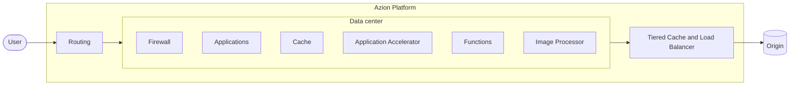

import UseCaseList from '~/components/webkit/UseCaseList.vue'
import FrameBox from '@aziontech/webkit/frame-box'
import ItemList from '@aziontech/webkit/item-list'
import DocItem from '@aziontech/webkit/doc-item'

A request for your application does not travel to a server you run. It reaches the data center of Azion's distributed infrastructure with the best route to it, and the configuration you saved decides what happens next: whether the request is blocked, answered from cache, handled by your code, or forwarded to your origin. **Azion Platform** is the integrated technology and the set of interfaces where that configuration lives, and where you build, secure, and scale applications, which includes operating and monitoring them.

Azion includes content delivery and caching, but it is broader than a CDN. The same infrastructure runs application code with no server to provision, filters the traffic that reaches your applications and APIs, stores the data they read, and reports every request in real time. This page covers where the platform runs, the path a request takes, what you enable on each resource of that path, and the interfaces you manage it through.

---

## Distributed infrastructure

Azion runs your configuration in data centers spread across the world, and each request is served by the data center with the best route to it. The route is chosen by latency, network conditions, and load at the moment the request arrives, so two users in different countries requesting the same page are each served nearby, from the same configuration. Compute and data sit close to the user, which reduces latency and improves reliability. Deploys are fast, functions run with no cold starts, and visibility into traffic is real time. For the list of data centers, refer to [Our Network](https://www.azion.com/en/products/our-network/).

## Request path

The diagram shows the path of one request, from the user to your origin and back. Inside Azion Platform, the request is routed to a data center, where the resources you configured run, and content that the data center cannot answer is fetched through the delivery layer:

Requests travel from left to right. Responses return along the same path.

1. The user's request reaches Azion. Azion selects the best route and forwards the request to the nearest data center, based on latency, network conditions, and load.
2. At that data center, Azion applies your configuration and logic: the workload that owns the domain, the security policies of its firewall, the caching behavior and rules of its application, and the code of the functions they run.
3. When the cache cannot answer the request, the application fetches the content from your origin through its connector. [Tiered Cache](/en/documentation/build/cache/) adds a second cache layer between the data centers and your origin, and [Load Balancer](/en/documentation/platform/load-balancer/) spreads the fetch across several addresses.
4. The response is delivered to the user, and the request appears in your metrics, events, and streams.

The resources on that path bind to one another: a workload binds a firewall, an application, and a custom page set, and the application fetches through a connector. For the interactive diagram and what each resource attaches to, refer to [Platform resources topology](/en/documentation/fundamentals/#platform-resources-topology).

---

## Platform resources on the request path

Everything you enable or create lives on the resources of the request path. Some of it is enabled on a resource you already have, such as a rule set applied to the firewall or a switch on the application; the rest are resources you create on their own, such as a bucket or a DNS zone. The table lists each one by the resource it attaches to, with a link to its reference:

| Resource | What you enable or create on it | Reference |
| --- | --- | --- |
| Workload | The TLS certificate bound to the workload, and DDoS mitigation, which applies to every workload with nothing to enable. | [Certificate Manager](/en/documentation/platform/certificate-manager/), [DDoS Protection](/en/documentation/platform/ddos-protection/) |
| Firewall | A WAF rule set applied to the firewall, a Bot Manager instance running on it, and the network lists its rules reference. | [WAF](/en/documentation/secure/waf/), [Bot Manager](/en/documentation/secure/bot-manager/), [Network Shield](/en/documentation/secure/network-shield/) |
| Application | Cache settings, the Application Accelerator and Image Processor switches, the functions instantiated on the application, and the custom page set assigned to it. | [Cache](/en/documentation/build/cache/), [Application Accelerator](/en/documentation/build/application-accelerator/), [Image Processor](/en/documentation/build/image-processor/), [Custom Pages](/en/documentation/platform/custom-pages/) |
| Connector | Load balancing across several addresses, and Origin Shield, which lets only Azion's IP ranges reach the origin. | [Load Balancer](/en/documentation/platform/load-balancer/), [Origin Shield](/en/documentation/secure/origin-shield/) |
| Resources you create on their own | Functions, buckets, databases, key-value namespaces, DNS zones, streams, and the infrastructure you run yourself with Orchestrator. | [Functions](/en/documentation/build/functions/), [Object Storage](/en/documentation/store/object-storage/), [SQL Database](/en/documentation/store/sql-database/), [KV Store](/en/documentation/store/kv-store/), [Edge DNS](/en/documentation/secure/edge-dns/), [Data Stream](/en/documentation/observe/data-stream/), [Orchestrator](/en/documentation/build/orchestrator/) |
| Inside a function | The models your code calls, and the adapters you fine-tune for them. | [AI Inference](/en/documentation/build/ai-inference/), [LoRA Fine-Tune](/en/documentation/build/ai-inference/lora-fine-tune/) |
| Everything above | The raw events, metrics, and real-user measurements that report what the platform did with each request. | [Real-Time Events](/en/documentation/observe/real-time-events/), [Real-Time Metrics](/en/documentation/platform/real-time-metrics/), [Edge Pulse](/en/documentation/observe/edge-pulse/) |

Every control in the table can be automated through the API and infrastructure as code. Azion's catalog groups everything in the table into four categories, Build, Store, Secure, and Observe; the [pricing page](/en/documentation/fundamentals/pricing/) is organized that way.

## What you can build

The same chain of resources serves very different workloads. Azion organizes them into five solutions, and the use cases below are the ones teams most often start from. Each one links to the architecture that implements it, or, where no architecture is published yet, to the reference it starts from.

### Build and run applications

<UseCaseList solution="build-and-run-applications" lang="en" />

### Improve application performance and reliability

<UseCaseList solution="improve-performance-and-reliability" lang="en" />

### Build and run AI workloads

<UseCaseList solution="build-and-run-ai-workloads" lang="en" />

### Secure applications and networks

<UseCaseList solution="secure-applications-and-networks" lang="en" />

### Deliver media and streaming content

<UseCaseList solution="deliver-media-and-streaming" lang="en" />

[Templates and integrations](/en/documentation/marketplace/templates-and-integrations-overview/) give many of these a deployable starting point, the [guides](/en/documentation/guides/) cover frameworks and step-by-step tasks, and [Migrate to Azion](/en/documentation/fundamentals/migrate-to-azion/) covers moving an application that already runs elsewhere.

---

## Interfaces

You manage the Platform yourself, through interfaces that expose the same resources. [Azion Console](/en/documentation/guides/platform/account-and-billing/getting-to-know-azion-console/) configures resources, provisioning, billing, and permissions in the browser. [Azion CLI](/en/documentation/devtools/cli/) manages services from the terminal and is open source, written in Go. The [Azion API](https://api.azion.com/) is a REST API over HTTPS for integration and automation, and the [Azion Terraform Provider](/en/documentation/devtools/terraform/) manages Azion resources as code.

Some origins accept connections only from known addresses. To allow Azion's data centers through your origin's firewall, refer to [How to retrieve Azion IP ranges for origin server allowlisting](/en/documentation/guides/application-security/bots-and-network/retrieve-azion-ip-ranges/).

For the fundamentals of distributed architectures, watch the [Introduction to Platform Foundations](https://www.youtube.com/watch?v=ZBC8h-0l1FQ&list=PL02NW2s3y10N0SQ-2mWL9WN-RWHE8atMp) playlist.

---

## Related resources

<FrameBox>
<ItemList>
  <DocItem title="Create an account" href="/en/documentation/fundamentals/creating-account/">Open the account that holds every resource you create.</DocItem>
  <DocItem title="First deploy" href="/en/documentation/fundamentals/first-deploy/">Put an application on the request path in a few minutes.</DocItem>
  <DocItem title="Migrate to Azion" href="/en/documentation/fundamentals/migrate-to-azion/">Bring an existing application and its infrastructure to Azion.</DocItem>
</ItemList>
</FrameBox>
