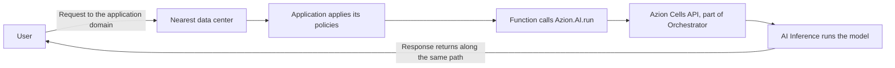

import DocButton from '~/components/webkit/DocButton.vue';
import DocCardGroup from '@aziontech/webkit/doc-card-group'
import DocCard from '@aziontech/webkit/doc-card'

Inference is the act of running a trained AI model. You send an input, and the model returns an output computed from the weights it learned in training: generated text, a ranking, or a vector of numbers that stands for the input. A model answers nothing until those weights are loaded into memory, on hardware sized for them. An inference service carries that part, keeping the models loaded and putting each one behind a request.

**AI Inference** runs the models on Azion's distributed infrastructure, on [Azion Runtime](/en/documentation/devtools/runtime/). A model is not an object you create. You name one by its id inside a [function](/en/documentation/build/functions/), and that call is what invokes it. Use AI Inference to generate text from a prompt, read the text out of an image, turn a document into a vector for retrieval, or rank a set of documents against a query.

<DocButton href="/en/documentation/build/ai-inference/quickstart/" label="Quickstart" size="medium" />
<DocButton href="/en/documentation/build/ai-inference/models/" label="AI models" kind="secondary" size="medium" />

---

## Model call

A function reaches a model through `Azion.AI.run`, the runtime binding that takes the model id and an OpenAI-compatible request body:

```ts
const modelResponse = await Azion.AI.run("Qwen/Qwen3-30B-A3B-Instruct-2507-FP8", {
  "stream": false,
  "messages": [
    { "role": "system", "content": "You are a helpful assistant." },
    { "role": "user", "content": "Name three European capitals." }
  ]
})

const answer = modelResponse?.choices?.[0]?.message?.content
```

- The first argument is the model id, the string the model answers to. The ids do not share one form, so copy the one stated on the model's own page in [AI models](/en/documentation/build/ai-inference/models/).
- The second argument is the request body. `messages` carries the conversation, and fields such as `stream`, `max_tokens`, and `temperature` shape the output. Every field a body accepts is in [Model invocation](/en/documentation/build/ai-inference/model-invocation/).
- The call is asynchronous. The function awaits it, and the generated text sits at `choices[0].message.content` in the resolved value.
- The id selects the model, and the code names no host, no base URL, and no credential.

If you have written against the OpenAI chat completions format, the request body and the response object are the ones you already know, and the binding is what changes.

---

## Invocation path

A model call does not leave the request that started it. The function already handling the request is what calls the model, so the call is one step inside one execution rather than a round trip to a separate service.



1. A user sends a request to the domain of your application.
2. The nearest data center receives the request and forwards it to the application, which applies its policies and calls the function.
3. The function preprocesses the input and calls the model with `Azion.AI.run`, through the Azion Cells API.
4. The response travels back to the user along the same path.

Four products carry that chain. [Applications](/en/documentation/platform/applications/) receives the request and applies policies to it, [Functions](/en/documentation/build/functions/) runs the code that makes the call, [Orchestrator](/en/documentation/build/orchestrator/) places the call on Azion Cells, and AI Inference runs the model. For the same chain with the line drawn between what Azion operates and what you own, refer to [How AI Inference works](/en/documentation/build/ai-inference/how-it-works/).

---

## Scope and limits

- **Models**: AI Inference runs a catalog of open-source models. It holds large language models, vision language models that read text and images, an embedding model, and a reranker. Each model page states the id the model answers to and the capabilities it supports. For the catalog, refer to [AI models](/en/documentation/build/ai-inference/models/).
- **Context length**: a per-model value, from 8k tokens to 131k tokens across the catalog. Size a prompt against the model you call rather than against the catalog.
- **Input**: every model reads text. The models whose input also covers images read an image passed as a URL, in a content part of the message.
- **Interfaces**: two of them reach the same models. A function calls `Azion.AI.run` directly, or an application you deploy serves an OpenAI-compatible endpoint at `/v1/chat/completions` on its own domain and calls the binding behind it. Both carry the same request body, documented in [Model invocation](/en/documentation/build/ai-inference/model-invocation/).
- **Management**: AI Inference has no management surface of its own, and no API of its own. You do not create, configure, or deploy a model. You call one by id from inside a function, so the function is the object you create and manage, through the interfaces [Functions](/en/documentation/build/functions/) states.
- **Model adaptation**: adapting a model to a task with Low-Rank Adaptation is [LoRA Fine-Tune](/en/documentation/build/ai-inference/lora-fine-tune/), an extension of AI Inference. The model pages state which models accept it.
- **Vectors**: an embedding model returns vectors, and [SQL Database](/en/documentation/store/sql-database/) stores and queries them. The semantic and hybrid queries a retrieval-augmented generation flow reads from are in [Vector search](/en/documentation/store/sql-database/vector-search/).
- **Termination**: Azion may terminate a model that consumes more than the maximum defined memory, or that runs for longer than the maximum allowed time. A model created and then not executed for more than three days may be deprovisioned. For what each condition covers, refer to [AI Inference limits](/en/documentation/build/ai-inference/limits/).
- **Observability**: a model call runs inside a function, on an application, so what it did in production is read where that traffic is read. [Real-Time Metrics](/en/documentation/platform/real-time-metrics/) reports the traffic, and [Real-Time Events](/en/documentation/observe/real-time-events/) carries the requests and the logs.
- **Billing**: for how the consumption of a model call is measured and charged, refer to [Pricing](/en/documentation/fundamentals/pricing/#ai-inference).

Azion hosts no inference endpoint and issues no credential for a model call. The OpenAI-compatible endpoint belongs to an application you deploy, and the authentication in front of it is one you define.

---

## Next steps

<DocCardGroup cols={2}>
  <DocCard title="Quickstart" href="/en/documentation/build/ai-inference/quickstart/" label="Get a first model response without writing code." />
  <DocCard title="How it works" href="/en/documentation/build/ai-inference/how-it-works/" label="Follow a request from your domain to the model and back." />
  <DocCard title="AI models" href="/en/documentation/build/ai-inference/models/" label="Choose a model and copy the id it answers to." />
  <DocCard title="Model invocation" href="/en/documentation/build/ai-inference/model-invocation/" label="Look up a request field, its default, or its bounds." />
  <DocCard title="AI Inference guides" href="/en/documentation/build/ai-inference/guides/" label="Work through a guide or a reference architecture." />
  <DocCard title="Limits" href="/en/documentation/build/ai-inference/limits/" label="Find when Azion terminates a model or deprovisions one." />
</DocCardGroup>
