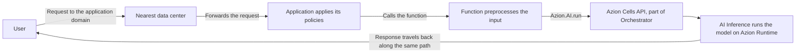

import FrameBox from '@aziontech/webkit/frame-box'
import ItemList from '@aziontech/webkit/item-list'
import DocItem from '@aziontech/webkit/doc-item'

When an application needs a model to answer something, it sends the input and holds the request open while the model generates a response. It then returns that response to the caller. Every model call has that shape. What differs from one platform to another is where the model runs and how much of it you operate.

[AI Inference](/en/documentation/build/ai-inference/) runs the models, and a [function](/en/documentation/build/functions/) is what calls one. The function reaches a model through `Azion.AI.run`, the runtime binding that takes a model id and a request body in the OpenAI shape. The call happens inside the function's execution, so a single piece of your code holds both the request that arrived and the answer the model produced.

Three adjacent subjects have their own pages. [LoRA Fine-Tune](/en/documentation/build/ai-inference/lora-fine-tune/) is the extension that adapts a model with LoRA, and it names the models that accept it. The vectors an embedding model returns are stored and queried with [Vector search](/en/documentation/store/sql-database/vector-search/) in SQL Database. For the request body field by field, refer to [Model invocation](/en/documentation/build/ai-inference/model-invocation/).

The mechanisms are the model call itself, the invocation chain, the binding and the HTTP endpoint, what Azion runs against what you own, and what the design costs.

---

## The model call

A model call starts in the code you deploy. `Azion.AI.run` is the runtime binding that makes it, and it takes two arguments: the id of the model, and the request body in the OpenAI shape. The call is asynchronous, so the function awaits it and reads the model response from the resolved value. For a chat model, the generated text sits at `choices[0].message.content` inside that response.

The id is the only address the code needs. Azion publishes no inference endpoint of its own, so a function configures no base URL and names no host to reach a model. Model ids do not follow a single form: some are a repository path such as `Qwen/Qwen3-30B-A3B-Instruct-2507-FP8`, and others a lowercase string such as `gpt-oss-20b`. Copy the id from the model's own page in [AI models](/en/documentation/build/ai-inference/models/) rather than deriving it from the model name.

Around the call, the function is ordinary code. It preprocesses the input before it invokes the model, and it shapes what the model returns before the caller sees it. The same execution can retrieve context from a store and reach an external service. The retrieval, the call, and the response shaping happen within one request.

---

## The invocation chain

This diagram traces one request, from the user to the model and back. Each arrow is a hand-off from one part of the platform to the next, and each part is named in the list that follows.

Read the diagram as four movements:

1. The user sends a request to the domain of the application.
2. The nearest data center receives the request and forwards it to the application, which applies its policies and calls the function.
3. The function orchestrates the inference. It preprocesses the input and calls the model with `Azion.AI.run`, through the Azion Cells API.
4. The response travels back to the user along the same path.

Five parts carry that chain. [Applications](/en/documentation/platform/applications/) is the application layer that receives the request and applies policies to it. Functions executes the inference logic: it orchestrates retrieval, integrates external services, and issues the model call. AI Inference runs the models, on [Azion Runtime](/en/documentation/devtools/runtime/). [Orchestrator](/en/documentation/build/orchestrator/) manages the requests for Azion Cells execution, and Azion Cells is the part of Orchestrator that the binding reaches. Azion's distributed infrastructure is what all of it runs on, which is why the data center that answers is the one nearest to the user.

---

## The binding and the HTTP endpoint

A request reaches a model through one of two interfaces, and both end at the same binding.

The first is the binding itself. Inside a function, the code calls `Azion.AI.run`, and nothing stands between that code and the model call. The function decides which model answers, what the request body carries, and what happens before and after.

The second is an OpenAI-compatible HTTP endpoint, and the mechanism behind it is that Azion does not host it. The host is the application you deploy, so the endpoint is one more thing that application serves, on the domain it answers on. [Model invocation](/en/documentation/build/ai-inference/model-invocation/) carries the path, the domain form, and the request the endpoint accepts.

Behind the endpoint there is still a function, and it calls `Azion.AI.run` the way any other function does. The second interface is therefore the first one with an application in front of it, published in a request shape that clients already speak. That endpoint carries no Azion authentication and Azion issues no credential for it, so any check it performs is one your application defines.

---

## What Azion runs and what you own

The invocation chain crosses a line between what Azion operates and what you deploy. Where that line falls is what tells you which side a problem sits on.

Azion runs the models and everything under them: the models themselves, the hardware that executes them, Azion Runtime, and the orchestration that places a call on Azion Cells. You load no model, size no cluster, and keep no inference server running. You also do not select which data center serves a given request, because the request is answered by the nearest one.

You own everything that decides what the model is asked. The function is your code: the input handling, the prompt, the model id, the request body, and the response the caller finally receives. The application in front of the function is yours as well, along with the domain it answers on and the authentication it checks. When a response is wrong, the input your function sent is where to look first, because the model answered exactly that.

---

## What the design costs

Running a model from inside a function keeps the request and the model call in one execution. Three things pay for that.

The model call happens inside one execution. The function awaits it, so the time the model takes to generate is time the function spends waiting, and the request stays open for both. A function that calls a model is therefore bounded by two sets of values at once: its own, in [Functions limits](/en/documentation/build/functions/limits/), and the model's, in [AI Inference limits](/en/documentation/build/ai-inference/limits/).

Azion bounds the model side as well. Azion may terminate a model that consumes more than the maximum defined memory, or that runs longer than the maximum allowed time. A model that is created and then not executed for more than three days may be deprovisioned. For what each of those conditions covers, refer to [AI Inference limits](/en/documentation/build/ai-inference/limits/).

The OpenAI-compatible endpoint is a shape your application serves, not a service Azion operates for you. You build the application that exposes it, you keep it running, and you secure it. Azion hands you no managed endpoint to point a client at. The endpoint is yours to change, and yours to keep answering.

---

## Related resources

<FrameBox>
<ItemList>
  <DocItem title="Model invocation" href="/en/documentation/build/ai-inference/model-invocation/">Every field the request body accepts, on both interfaces.</DocItem>
  <DocItem title="AI Inference quickstart" href="/en/documentation/build/ai-inference/quickstart/">Deploy an application and send a first request to a model.</DocItem>
  <DocItem title="AI models" href="/en/documentation/build/ai-inference/models/">The id to pass, and what each model states about itself.</DocItem>
  <DocItem title="AI Inference limits" href="/en/documentation/build/ai-inference/limits/">The conditions under which Azion terminates or deprovisions a model.</DocItem>
  <DocItem title="Functions" href="/en/documentation/build/functions/">The runtime that holds the binding and the ceilings that bound a call.</DocItem>
  <DocItem title="AI Inference architecture" href="/en/documentation/guides/ai/inference/ai-inference-architecture/">The same chain as a reference architecture, with a worked function.</DocItem>
  <DocItem title="Pricing" href="/en/documentation/fundamentals/pricing/#ai-inference">How AI Inference consumption is measured and charged.</DocItem>
</ItemList>
</FrameBox>
