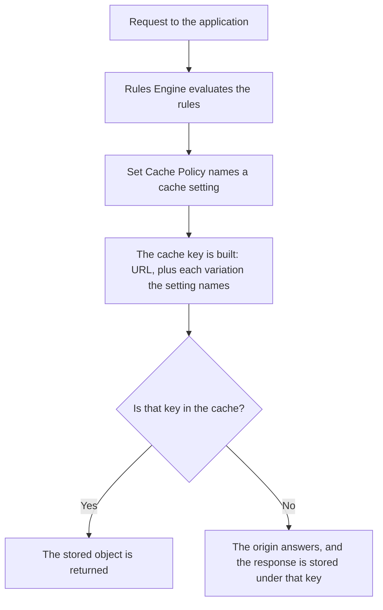

import DocButton from '~/components/webkit/DocButton.vue';
import DocCardGroup from '@aziontech/webkit/doc-card-group'
import DocCard from '@aziontech/webkit/doc-card'

A cache answers a request from a stored copy instead of sending it to the origin, and it finds that copy with a _cache key_: an index entry built from the request. When the key is the URL alone, the cache assumes that one URL has one correct response. Dynamic content breaks the assumption. Under a single URL, a signed-in visitor sees their own cart, a listing reorders on a filter, and a layout changes on a phone. A cache that cannot tell those responses apart either serves the wrong one or stops caching the path.

**Application Accelerator** is an [Applications](/en/documentation/platform/applications/) module that puts the rest of the request into the cache key. One switch on an application unlocks the fields that vary the key, the caching of `POST` and `OPTIONS` responses, a cache TTL below the one-minute floor, and seven [Rules Engine](/en/documentation/platform/applications/rules-engine/) behaviors. Use Application Accelerator to cache a personalized page, an API response that changes with a query string, a catalog that differs by device, or a response to a `POST`.

<DocButton href="/en/documentation/build/application-accelerator/quickstart/" label="Quickstart" size="medium" />
<DocButton href="/en/documentation/build/application-accelerator/settings/" label="Application Accelerator settings" kind="secondary" size="medium" />

---

## The cache setting

The artifact is a **cache setting**. It holds how long the cache keeps an object and what makes two requests different, and the module adds its own object to it:

```json
{
  "name": "product-listing",
  "browser_cache": { "behavior": "override", "max_age": 30 },
  "modules": {
    "cache": { "behavior": "override", "max_age": 30 },
    "application_accelerator": {
      "cache_vary_by_method": ["post"],
      "cache_vary_by_querystring": {
        "behavior": "allowlist",
        "fields": ["category", "page"],
        "sort_enabled": true
      },
      "cache_vary_by_cookies": {
        "behavior": "allowlist",
        "cookie_names": ["session_id"]
      }
    }
  }
}
```

- `modules.cache.max_age` is how long the cache holds the object, in seconds. The value `30` is below the 60-second floor that applies without the module.
- Each `cache_vary_by_*` object names one input that varies the key. `allowlist` varies by the attributes it names and ignores the rest; `ignore` is the default for all four.
- `sort_enabled` groups the same arguments in any order under one key.
- `cache_vary_by_method` names the methods whose responses are cached, beyond `GET` and `HEAD`.

If you have written a `Vary` header or a cache-key rule on another platform, the model transfers: you are naming the inputs that make two requests different.

---

## How a request reaches a cached object

Turning the module on changes no traffic by itself. Every variation control starts in its ignore mode, and a cache setting reaches a request only when a Rules Engine rule applies it.



1. A request arrives at an application on Azion's distributed infrastructure.
2. [Rules Engine](/en/documentation/platform/applications/rules-engine/) evaluates its rules against the request.
3. A rule whose criteria match applies a cache setting with the **Set Cache Policy** behavior.
4. The cache key is built from the URL plus every variation that cache setting names, so two requests that differ only in an attribute nobody named share one key.
5. A key already in the cache is answered from the stored object.
6. A key that is not is answered by the origin, and the response is stored under that key for the TTL the setting carries.

For what each variation appends to the key, and what a variation costs, refer to [How Application Accelerator works](/en/documentation/build/application-accelerator/how-it-works/).

---

## Scope and limits

- **Cache variation**: the key can vary by query string, by cookie, by device group, and by request method. The feature is **Advanced Cache Key**, and the four controls that configure it sit in the **Application Accelerator** section of a cache setting.
- **HTTP methods**: the module adds `OPTIONS`, `POST`, `PUT`, `PATCH`, and `DELETE` to the `GET` and `HEAD` an application accepts natively. Of those, only `POST` and `OPTIONS` responses can be cached.
- **Rules Engine**: seven behaviors require the module — Add Cookie, Bypass Cache, Capture Match Groups, Filter Cookie, Forward Cookies, Rewrite Request, and Run Function — along with the `${device_group}` variable in rule criteria. The full index is in [Settings](/en/documentation/build/application-accelerator/settings/#rules-engine-behaviors).
- **Cache TTL**: without the module the shortest TTL an application accepts is 60 seconds; with it, 0. The ceiling is 31,536,000 seconds either way, and [Tiered Cache](/en/documentation/build/cache/tiered-cache/) raises the floor to 3 seconds. The conditions are in [Limits](/en/documentation/build/application-accelerator/limits/).
- **Interfaces**: you set the module and its fields in [Azion Console](https://console.azion.com), through the [Azion API](https://api.azion.com/), with [Azion CLI](/en/documentation/devtools/cli/), in `azion.config.js`, and with Azion Lib. The field or flag each one uses is in [Settings](/en/documentation/build/application-accelerator/settings/).
- **Protocol optimization**: the module includes protocol optimization features for dynamic traffic.
- **Billing**: turning on a module can generate usage-related costs, per [Pricing](/en/documentation/fundamentals/pricing/#application-accelerator).

Application Accelerator does not hold cached objects and does not decide how long they live. [Cache](/en/documentation/build/cache/) does both. This module decides what makes two requests different, which is what the cache then keys on.

---

## Next steps

<DocCardGroup cols={2}>
  <DocCard title="Quickstart" href="/en/documentation/build/application-accelerator/quickstart/" label="Turn the module on and cache a listing that varies by a query string argument." />
  <DocCard title="How Application Accelerator works" href="/en/documentation/build/application-accelerator/how-it-works/" label="What each variation appends to the cache key, and what a variation costs." />
  <DocCard title="Application Accelerator settings" href="/en/documentation/build/application-accelerator/settings/" label="Look up a field, an enum value, or a default, per interface." />
  <DocCard title="Limits" href="/en/documentation/build/application-accelerator/limits/" label="The cache TTL floor and ceiling, and the conditions that move each one." />
  <DocCard title="Guides and tutorials" href="/en/documentation/build/application-accelerator/guides/" label="Complete one task: vary by cookie, bypass the cache, cache a POST response." />
  <DocCard title="Glossary" href="/en/documentation/build/application-accelerator/glossary/" label="Look up a term this documentation uses." />
</DocCardGroup>
