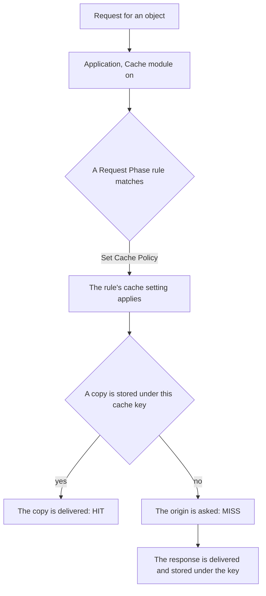

import DocButton from '~/components/webkit/DocButton.vue';
import DocCardGroup from '@aziontech/webkit/doc-card-group'
import DocCard from '@aziontech/webkit/doc-card'

A cache keeps a copy of a response next to the people who request it. The first request for an object travels to the origin server that holds it; the copy is stored under a key built from that request, and later requests for the same object are answered from the copy instead. Each copy is kept for a time to live, the TTL, and the origin is asked again only when the TTL ends or the copy is removed.

**Cache** stores those copies on Azion's distributed infrastructure, in the data centers that receive your traffic. It is a module of an [application](/en/documentation/platform/applications/), on for every application you create. Use Cache to keep static files close to your users, hold an API response for a few seconds, serve large video files in fragments, keep a copy answering while the origin is down, and remove a copy the moment the origin changes.

<DocButton href="/en/documentation/build/cache/quickstart/" label="Quickstart" size="medium" />
<DocButton href="/en/documentation/build/cache/cache-settings/" label="Cache settings" kind="secondary" size="medium" />

---

## The cache setting

What you configure is a cache setting: an object on an application holding the TTLs, the behavior toward the origin's own cache headers, and the rules that decide when two requests share one copy. The request below creates one through the Azion API:

```json
{
  "name": "static-assets",
  "browser_cache": { "behavior": "override", "max_age": 86400 },
  "modules": {
    "cache": {
      "behavior": "override",
      "max_age": 300,
      "stale_cache": { "enabled": true },
      "large_file_cache": { "enabled": true, "offset": 1024 },
      "tiered_cache": { "enabled": true, "topology": "nearest-region" }
    }
  }
}
```

- `browser_cache` decides what the visitor's browser is told to keep, and `modules.cache.max_age` how long Azion keeps its own copy.
- `behavior` chooses between honoring the origin's `Cache-Control` and `Expires` headers and overriding them with the TTL in the setting.
- `stale_cache` allows an expired copy to answer while the origin is failing, and `large_file_cache` stores a large object in fragments.
- `tiered_cache` adds a second cache layer between Azion's cache and the origin.

If you have set `Cache-Control` headers on an origin before, the `honor` and `override` behaviors are the two choices you already know. For every field, its type, and its default, refer to [Cache settings](/en/documentation/build/cache/cache-settings/).

---

## How a request reaches a copy

Creating a cache setting does not cache anything. A [Rules Engine](/en/documentation/platform/applications/rules-engine/) rule is what applies a setting to requests, so a setting no rule names is inert:



1. A request arrives for an application whose Cache module is on.
2. A rule in the request phase matches it and applies a cache setting through the **Set Cache Policy** behavior.
3. Azion builds the cache key from the request: the scheme, the host, the path, the query string, and any variation the setting adds.
4. A copy stored under that key is delivered, and the response reports `HIT`.
5. With no copy stored, the origin is asked, the response reports `MISS`, and the response may be stored under the key.
6. The copy answers later requests until its TTL ends, a purge removes it, or a rule sends the request past the cache.

For the mechanisms behind each step, refer to [How Cache works](/en/documentation/build/cache/how-it-works/). For the key and the header that reports the status, refer to [Cache keys](/en/documentation/build/cache/cache-keys/).

---

## Scope and limits

- **Interfaces.** A cache setting is created and managed in [Azion Console](https://console.azion.com/), through the Azion API v4, the [Azion CLI](/en/documentation/devtools/cli/), `azion.config.js`, [Azion Lib](/en/documentation/devtools/azion-lib/application/), and [Terraform](/en/documentation/devtools/terraform/applications/).
- **Methods.** `GET` and `HEAD` responses are cached natively. `POST` and `OPTIONS` responses are cached with [Application Accelerator](/en/documentation/build/application-accelerator/), which also lifts the TTL floor below 60 seconds and turns on cache variation by query string, cookie, and device group.
- **One URL, several copies.** A setting can store one copy per query-string argument, cookie value, device group, request method, image format, or byte range of a large file. Each is a separate key, so each is purged separately. The formats are on [Cache keys](/en/documentation/build/cache/cache-keys/).
- **A second layer.** [Tiered Cache](/en/documentation/build/cache/tiered-cache/) answers a miss in the first layer before the origin is asked, and is turned on per cache setting.
- **Removing a copy.** [Real-Time Purge](/en/documentation/build/cache/real-time-purge/) removes an object by URL, by cache key, or by a wildcard expression, from either layer, before its TTL ends.
- **Bounds.** The cache TTL runs from 60 seconds, or 0 with Application Accelerator, up to 31,536,000 seconds. A single object is held up to 10 GB, and large files are fragmented at 1,024 kB. Every ceiling, and the purges each plan includes, are on [Cache limits](/en/documentation/build/cache/limits/).
- **What it does not do.** Cache stores responses your origin or your application produces; it does not run code. A function that reads and writes cached entries from inside its own code uses the [Cache API](/en/documentation/devtools/runtime/api-reference/cache/) of [Functions](/en/documentation/build/functions/) instead.
- **Watching it.** [Real-Time Metrics](/en/documentation/platform/real-time-metrics/) carries a Cache dataset and a Tiered Cache dataset, and a single response reports its own status through a debug header.
- **Billing.** Cache is billed on Purges, and the pricing page lists data transfer under [Application Accelerator](/en/documentation/build/application-accelerator/). For the rate past the amount a plan includes, refer to [Pricing](/en/documentation/fundamentals/pricing/#cache).

---

## Next steps

<DocCardGroup cols={2}>
  <DocCard title="Quickstart" href="/en/documentation/build/cache/quickstart/" label="Cache a path of your application and read the cache status of the first response." />
  <DocCard title="How it works" href="/en/documentation/build/cache/how-it-works/" label="Follow the TTL, stale cache, fragments, variation, and the second layer through a request." />
  <DocCard title="Cache settings" href="/en/documentation/build/cache/cache-settings/" label="Look up a field, its type, its default per interface, and the error past its bound." />
  <DocCard title="Cache guides" href="/en/documentation/build/cache/guides/" label="Complete a specific task, from the Console, the API, or the CLI." />
  <DocCard title="Real-Time Purge" href="/en/documentation/build/cache/real-time-purge/" label="Remove a copy before its TTL ends, by URL, cache key, or wildcard." />
  <DocCard title="Troubleshooting" href="/en/documentation/build/cache/troubleshooting/" label="Find the cause when a setting has no effect, or a purge leaves a copy behind." />
</DocCardGroup>
