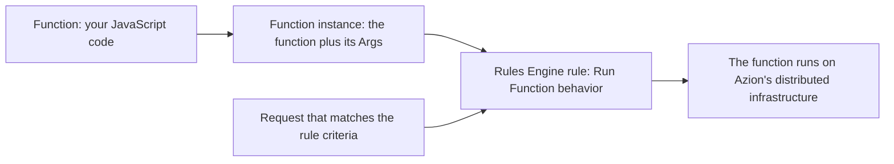

import DocButton from '~/components/webkit/DocButton.vue';
import DocCardGroup from '@aziontech/webkit/doc-card-group'
import DocCard from '@aziontech/webkit/doc-card'

A function is code that runs on demand, when an event such as an HTTP request arrives. You write a handler that receives the request and returns a response. The platform runs that handler for each request and stops it when the response is sent, so nothing runs between requests. This model is called _serverless_: there is no server to provision and no capacity to plan.

**Functions** holds your JavaScript code and runs it on Azion's distributed infrastructure, in the path of a request to an [application](/en/documentation/platform/applications/) or a [firewall](/en/documentation/platform/firewall/functions/). A rule in [Rules Engine](/en/documentation/platform/applications/rules-engine/) selects the function and the phase of the request that invokes it. Use Functions to build an API, rewrite request and response headers, apply logic from request metadata, or block a request before it reaches your application.

<DocButton href="/en/documentation/build/functions/quickstart/" label="Quickstart" size="medium" />
<DocButton href="/en/documentation/build/functions/guides/" label="Functions guides" kind="secondary" size="medium" />

---

## Function structure

A function exports a default object that carries one handler. In an application, the handler is named `fetch`:

```javascript
export default {
  async fetch(request, env, ctx) {
    return new Response('Hello World!');
  },
};
```

- `request` is the incoming HTTP request, as a `Request` object.
- `env` carries the [environment variables](/en/documentation/build/functions/environment-variables/) and the bindings available to the function.
- `ctx` is the execution context. `ctx.waitUntil(promise)` extends the lifetime of the invocation.
- In a firewall, the handler is named `firewall` and the context adds `ctx.deny()`, which blocks the request immediately.

[Azion Runtime](/en/documentation/devtools/runtime/) is built on Web standards, so what you know about the `Request` and `Response` objects applies to a function. Functions also accepts the Service Worker pattern, which registers the handler with `addEventListener`. For both patterns and their parameters, refer to [Handlers](/en/documentation/devtools/runtime/api-reference/handlers/).

---

## Invocation path

Creating a function does not execute it. A function runs only when a rule invokes an instance of it, so two objects sit between your code and a request.



1. You create a function in Functions. The function holds the code, and the same function can be instantiated in more than one application.
2. You create a [function instance](/en/documentation/build/functions/functions-instances/) on an application or on a firewall. The instance binds the function and carries the **Args**, a JSON object passed into the execution context. The code cannot be edited at instantiation, and only the Args are set there.
3. You create a rule in Rules Engine and select the **Run Function** behavior. The rule names the instance, the execution phase, and the criteria that trigger it.
4. When a request matches the criteria, the function runs on Azion's distributed infrastructure, with no cold start.

An instance that no rule invokes never runs. For the objects, the phases, and the format of the Args, refer to [How it works](/en/documentation/build/functions/how-it-works/).

---

## Scope and limits

- **Language**: you write functions in JavaScript. A function can also compile and instantiate WebAssembly modules through the [WebAssembly API](/en/documentation/devtools/runtime/api-reference/webassembly/). A TypeScript project builds with the `Typescript` preset of [Azion CLI build](/en/documentation/devtools/cli/build/#preset), and the `azion/utils` package publishes type definitions the code imports.
- **Runtime**: functions run on [Azion Runtime](/en/documentation/devtools/runtime/), which implements the [Web APIs](/en/documentation/devtools/runtime/api-reference/javascript/) and a set of [Node.js modules](/en/documentation/devtools/runtime/node/). A `Response` accepts a `ReadableStream` as its body, so a function streams a response to the client as it is generated instead of building the whole body first. For every body type, refer to [Parameters](/en/documentation/devtools/runtime/api-reference/response/#parameters).
- **Frameworks**: a project built with a supported JavaScript framework becomes functions when [Azion CLI](/en/documentation/devtools/cli/) builds it, through [Azion Bundler](https://github.com/aziontech/bundler), the open-source framework adapter. For the list, refer to [Frameworks compatibility](/en/documentation/devtools/runtime/frameworks/frameworks-compatibility/).
- **Execution contexts**: in an application, a function runs in the request phase or the response phase, and the **Run Function** behavior requires the [Application Accelerator](/en/documentation/build/application-accelerator/) module. In a [firewall](/en/documentation/platform/firewall/functions/), a function runs in the request phase and allows, denies, or drops the request.
- **Platform services**: a function reaches [KV Store](/en/documentation/store/kv-store/), [SQL Database](/en/documentation/store/sql-database/), and [Object Storage](/en/documentation/store/object-storage/) from the runtime, and calls models through [AI Inference](/en/documentation/build/ai-inference/).
- **Limits**: an invocation has 512 MB of memory per isolate, 2 s of CPU time, 5 min of wall-clock time including I/O wait, and 50 outbound `fetch()` calls. The Args field holds 100 KB. Some values vary by plan, and the full table is in [Limits](/en/documentation/build/functions/limits/).
- **Interfaces**: you create and manage functions in [Azion Console](https://console.azion.com), with [Azion CLI](/en/documentation/devtools/cli/), through the [Azion API](https://api.azion.com/), and with the [Azion Terraform provider](/en/documentation/devtools/terraform/).
- **Development**: you write the code in the [code editor](/en/documentation/build/functions/code-editor/) in Azion Console, [Preview deployment](/en/documentation/build/functions/preview-deployment/) sends a simulated request and shows the response the code returns before the function serves traffic, and [`azion dev`](/en/documentation/devtools/cli/dev-command/) builds and runs the project locally.
- **Observability**: a function writes log messages with `console.log`, and [Real-Time Events](/en/documentation/observe/real-time-events/) and [Data Stream](/en/documentation/observe/data-stream/) carry that output.
- **Billing**: Functions is charged by compute time and by invocation, per [Pricing](/en/documentation/fundamentals/pricing/).

Functions does not host AI models. AI Inference runs the model on Azion Runtime, and a function calls it.

---

## AI workflows

A function is the request-time component of an AI application on Azion. It calls models through [AI Inference](/en/documentation/build/ai-inference/), which serves models that follow the OpenAI API standard, so a client written against that standard works unchanged.

The pieces an AI workflow draws on sit on the same platform:

- **Models**: AI Inference runs the model on Azion Runtime. Functions does not host models itself.
- **Retrieval**: [SQL Database](/en/documentation/store/sql-database/) stores vectors and supports retrieval that combines vector and full-text search, which is what a retrieval-augmented generation flow reads from.
- **Agent frameworks**: functions run agents built with LangGraph and LangChain.
- **Agent-to-agent calls**: MCP servers let agents call one another over Google's Agent2Agent (A2A) protocol.

---

## Next steps

<DocCardGroup cols={2}>
  <DocCard title="Quickstart" href="/en/documentation/build/functions/quickstart/" label="Run your first function now." />
  <DocCard title="How it works" href="/en/documentation/build/functions/how-it-works/" label="Follow a request from a rule to your code." />
  <DocCard title="JavaScript examples" href="/en/documentation/build/functions/javascript-examples/" label="Start from working code." />
  <DocCard title="Functions guides" href="/en/documentation/build/functions/guides/" label="Complete a specific task." />
  <DocCard title="Limits" href="/en/documentation/build/functions/limits/" label="Look up a ceiling, a default, or a value that varies by plan." />
  <DocCard title="Troubleshooting" href="/en/documentation/build/functions/troubleshooting/" label="Find the cause when a function fails or never runs." />
</DocCardGroup>
