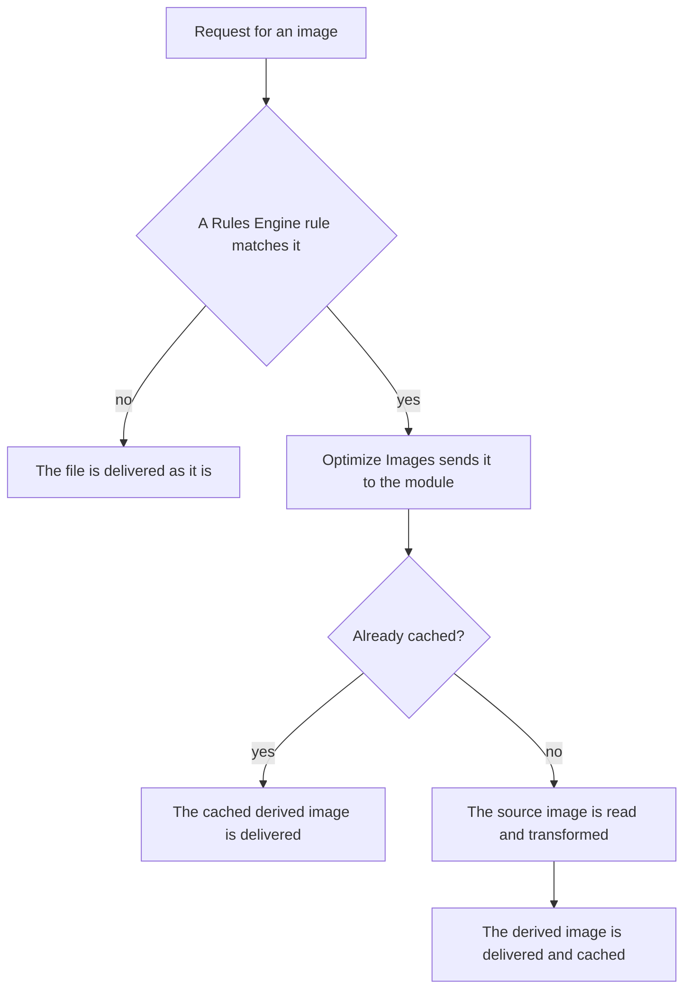

import DocButton from '~/components/webkit/DocButton.vue';
import DocCardGroup from '@aziontech/webkit/doc-card-group'
import DocCard from '@aziontech/webkit/doc-card'

A page that shows the same photograph on a phone, a laptop, and a print layout needs it at three sizes. The usual answer is to produce three files, name them, store them, and keep all three in step with the original. Transforming an image on request replaces that. One file stays on the origin, and the URL that asks for it describes the size, crop, quality, and format. The image that reaches the reader is built when the request arrives, and the file on the origin is never touched.

**Image Processor** is a module of [Applications](/en/documentation/platform/applications/) that performs those transformations on Azion's distributed infrastructure. A request whose URL carries an `ims` query string returns a derived image built from the source image on the origin. Use Image Processor to resize images for a layout, crop them to a subject, reduce their weight, add a watermark, or deliver WEBP and AVIF to the browsers that accept them.

<DocButton href="/en/documentation/build/image-processor/quickstart/" label="Quickstart" size="medium" />
<DocButton href="/en/documentation/build/image-processor/url-parameters/" label="URL parameters" kind="secondary" size="medium" />

---

## The transformation in a URL

A transformation is a query string appended to the image's own URL:

```text
https://www.example.com/images/photo.jpg?ims=fit-in/400x400/filters:quality(85)
```

- `fit-in/400x400` fits the image inside a 400 by 400 pixel box and preserves the aspect ratio.
- `filters:` opens a group of filters, and a `:` separates one filter from the next.
- `quality(85)` compresses the image to the value that reduces weight without a visible change.
- Everything before the `?` is the path of the file that already sits on your origin.

If you know how a query string works, you know the interface. There is no upload step, no SDK, and no second copy of the file to manage: the same URL with a different `ims` value is a different image, and the same URL without one is the original.

---

## How a request becomes a derived image

An `ims` query string does nothing on its own. A [Rules Engine](/en/documentation/platform/applications/rules-engine/) rule has to match the request and apply the **Optimize Images** behavior, which is what turning the module on makes available.



1. A request arrives for an image path.
2. Rules Engine evaluates the Request Phase rules, and a rule for images matches on the file extension.
3. The rule applies a cache setting and the **Optimize Images** behavior.
4. A derived image already in the cache is delivered from there, and nothing is processed.
5. Otherwise the source image is read from the origin, the `ims` string is applied, and the result is delivered and cached.

For what each step costs and why the cache key matters, refer to [How Image Processor works](/en/documentation/build/image-processor/how-it-works/).

---

## Scope and limits

- **Operations**: resize, crop, rotate, quality, watermark, format conversion, fill, and any combination of them in one string. Each one and the values it accepts are on [URL parameters](/en/documentation/build/image-processor/url-parameters/).
- **Formats**: JPEG, GIF, PNG, BMP, ICO, WEBP, and AVIF. Conversion to WEBP or AVIF needs the request to carry the matching `Accept` header, and BMP is converted automatically according to what the browser supports.
- **Bounds on one image**: a maximum size of 150 MB, a maximum width of 3840 pixels, and a maximum height of 2160 pixels. The monthly volume of processed images is set by the service plan. Both are on [Limits](/en/documentation/build/image-processor/limits/).
- **Interfaces**: the module is turned on from Azion Console, the Azion API, the Azion CLI, and `azion.config.js`. Every field and flag is on [Settings](/en/documentation/build/image-processor/settings/).
- **Caching**: a derived image is cached under a key that includes its `ims` value, and an image served from the cache is not processed again. Varying the cache by a query string requires the [Application Accelerator](/en/documentation/build/application-accelerator/) module.
- **What it does not do**: Image Processor stores nothing and accepts no uploads. The source image stays where it already is, and no derived image becomes an asset on your account. To process images inside a function instead, refer to the [WASM Image Processor](/en/documentation/devtools/azion-lib/wasm-image-processor/) library, which is a different surface.

---

## Next steps

<DocCardGroup cols={2}>
  <DocCard title="Quickstart" href="/en/documentation/build/image-processor/quickstart/" label="Transform your first image now." />
  <DocCard title="How it works" href="/en/documentation/build/image-processor/how-it-works/" label="Follow a request from a rule to a derived image." />
  <DocCard title="URL parameters" href="/en/documentation/build/image-processor/url-parameters/" label="Start from a working ims string, and look up what each one accepts." />
  <DocCard title="Image Processor guides" href="/en/documentation/build/image-processor/guides/" label="Complete a specific task." />
  <DocCard title="Limits" href="/en/documentation/build/image-processor/limits/" label="Look up a ceiling, a default, or a value that varies by plan." />
  <DocCard title="Troubleshooting" href="/en/documentation/build/image-processor/troubleshooting/" label="Find the cause when an image comes back wrong or unprocessed." />
</DocCardGroup>
