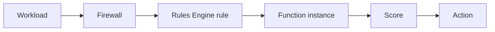

import DocButton from '~/components/webkit/DocButton.vue';
import DocCardGroup from '@aziontech/webkit/doc-card-group'
import DocCard from '@aziontech/webkit/doc-card'

Bot management is the practice of telling automated clients apart from people, and deciding what each one is allowed to do. Some automation is welcome, such as a search engine indexing a catalogue. Some is not: credential stuffing, vulnerability scanning, inventory scraping, and checkout abuse all arrive as traffic that looks close enough to a browser to pass an unaided eye.

**Bot Manager** runs in the path of a request and scores it. Each rule the request matches adds points, and when the total reaches the threshold you set, the action you configured runs: the request continues, or it is refused, redirected, delayed, or answered with your own HTML. Bot Manager is not a firewall module. It runs as a **function instance** on a [Firewall](/en/documentation/platform/firewall/), selected by a [Rules Engine for Firewall](/en/documentation/platform/firewall/rules-engine/) rule, and it writes a report log line for the requests you choose to record.

<DocButton href="/en/documentation/secure/bot-manager/quickstart/" label="Quickstart" size="medium" />
<DocButton href="/en/documentation/secure/bot-manager/guides/" label="Bot Manager guides and tutorials" kind="secondary" size="medium" />

---

## The arguments an instance carries

One JSON object holds the whole configuration. This is Bot Manager Lite running in observation mode, scoring every request and refusing none:

```json
{
  "threshold": 30,
  "action": "allow",
  "internal_logs": 2,
  "log_tag": "storefront-bots"
}
```

`threshold` is the score at which `action` runs. `action` is what happens at or above it. `internal_logs` decides which requests produce a report line, and `log_tag` is how you tell one instance's lines from another's in the logs.

The object is **not validated**. Every key you send is stored and returned unchanged, whether or not the function reads it, so a misspelled argument is accepted, echoed back exactly as you typed it, and silently ignored while the function runs on its default. For every argument and its values, refer to [Arguments](/en/documentation/secure/bot-manager/arguments/#fields).

---

## The objects a request passes through

Five objects put a request under inspection, and each one names the next:



1. A **workload** answers on a domain and is bound to a firewall through its deployment.
2. The **firewall** has the Functions module enabled.
3. A **Rules Engine rule** on that firewall matches the requests you want scored, and its `Run Function` behavior names the instance.
4. The **function instance** is the installed Bot Manager function plus the arguments above.
5. The **score** the rules produce is compared against the threshold, and the **action** runs.

An installed function scores nothing on its own. All five have to exist. For the mechanism in full, refer to [How Bot Manager works](/en/documentation/secure/bot-manager/how-it-works/).

---

## Two editions

Bot Manager ships in two editions of one product. They differ in what they score with, not in what they do with a score.

| | Bot Manager Lite | Bot Manager |
| --- | --- | --- |
| How you get it | Marketplace, self-serve | On request, through the Service Delivery team |
| Service plans | Included on Hobby and Pro | Enterprise |
| Scoring | 26 published static rules, including a reputation check against [Network Lists](/en/documentation/secure/network-shield/network-lists/) | The static rules, plus a dynamic score derived from a fingerprint's own history |

Bot Manager Lite publishes its rules, their score increments and their classes. For that table, refer to [Bot Manager Lite](/en/documentation/secure/bot-manager/bot-manager-lite/#rules).

---

## Scope and limits

- **Three interfaces build the same objects.** Azion Console, [Azion CLI](/en/documentation/devtools/cli/) and the Azion API each create the instance and the rule. Installing the integration from Marketplace runs in Azion Console.
- **A score is a number, and the threshold is yours.** No maximum is published, so set a threshold against the scores your own traffic produces rather than against a number on a page. For the loop, refer to [Bot Manager best practices](/en/documentation/secure/bot-manager/best-practices/).
- **What Bot Manager writes, and where.** A report line per scored request, readable in [Real-Time Events](/en/documentation/observe/real-time-events/), charted in [Real-Time Metrics](/en/documentation/platform/real-time-metrics/#bot-manager), and forwarded by [Data Stream](/en/documentation/observe/data-stream/). For the fields, refer to [Logs](/en/documentation/secure/bot-manager/logs/#fields).
- **What it works with.** A redirect action can send a request to an [ALTCHA challenge](/en/documentation/guides/application-development/functions-and-runtime/altcha/); the [JavaScript Tag](/en/documentation/guides/application-development/integrations/javascript-tag-js-tag/) enriches the signals a fingerprint is built from; and a Rules Engine rule can rate limit alongside the score.
- **What it does not do.** Bot Manager does not inspect a request for application vulnerabilities. That is [Web Application Firewall](/en/documentation/secure/waf/), and the two run on the same firewall.
- **Other bot managers run here too.** [Radware Bot Manager](/en/documentation/guides/application-development/integrations/radware-bot-manager/) and [DataDome Bot Protection](/en/documentation/guides/application-development/integrations/datadome-bot-protection/) install from Marketplace as firewall functions, under their own subscriptions.
- **Usage costs.** Bot Manager is billed on requests and profiles. For the rates, refer to [Pricing](/en/documentation/fundamentals/pricing/#bot-manager); for the bounds and what each plan includes, refer to [Bot Manager limits](/en/documentation/secure/bot-manager/limits/).

---

## Next steps

<DocCardGroup cols={2}>
  <DocCard title="Bot Manager quickstart" href="/en/documentation/secure/bot-manager/quickstart/" label="Score your first request." />
  <DocCard title="How Bot Manager works" href="/en/documentation/secure/bot-manager/how-it-works/" label="Follow a request from the rule to the action." />
  <DocCard title="Bot Manager examples" href="/en/documentation/secure/bot-manager/examples/" label="Start from a configuration that runs." />
  <DocCard title="Bot Manager guides and tutorials" href="/en/documentation/secure/bot-manager/guides/" label="Complete a specific task." />
  <DocCard title="Bot Manager limits" href="/en/documentation/secure/bot-manager/limits/" label="Look up a bound, the response past it, and what a plan includes." />
  <DocCard title="Troubleshoot Bot Manager" href="/en/documentation/secure/bot-manager/troubleshooting/" label="Find the cause when a client is refused or nothing is scored." />
</DocCardGroup>
