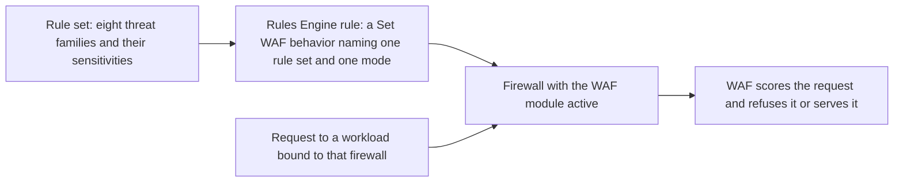

import DocButton from '~/components/webkit/DocButton.vue';
import DocCardGroup from '@aziontech/webkit/doc-card-group'
import DocCard from '@aziontech/webkit/doc-card'

A web application firewall reads what an application would otherwise trust: the query string, the headers, the cookies, and the body of a request. It weighs what it finds against patterns known to carry attacks, and refuses the request when the evidence passes a threshold you choose. The check runs at layer 7 of the OSI model, the application layer, in front of the application rather than inside it. The application code does not change. For the generic term, refer to the [Learning Center](https://www.azion.com/en/learning/).

**Web Application Firewall (WAF)** runs that inspection on Azion's distributed infrastructure, as a module of [Firewall](/en/documentation/platform/firewall/). What to detect lives in a rule set, which carries eight threat families and the sensitivity level chosen for each. When to apply it lives in a [Rules Engine for Firewall](/en/documentation/platform/firewall/rules-engine/) rule, whose `Set WAF` behavior names the rule set and the mode. Use WAF to score traffic in front of an application, watch a configuration before it refuses anything, exempt the requests your application legitimately sends, and find the rule behind a block.

<DocButton href="/en/documentation/secure/waf/quickstart/" label="Quickstart" size="medium" />
<DocButton href="/en/documentation/secure/waf/guides/" label="WAF guides" kind="secondary" size="medium" />

---

## Rule set structure

A rule set is the object you configure. The one below carries the default configuration: all eight threat families, each at `medium` sensitivity.

```json
{
  "name": "my-waf-rule-set",
  "active": true,
  "product_version": "1.0",
  "engine_settings": {
    "engine_version": "2021-Q3",
    "type": "score",
    "attributes": {
      "rulesets": [1],
      "thresholds": [
        { "threat": "cross_site_scripting", "sensitivity": "medium" },
        { "threat": "directory_traversal", "sensitivity": "medium" },
        { "threat": "evading_tricks", "sensitivity": "medium" },
        { "threat": "file_upload", "sensitivity": "medium" },
        { "threat": "identified_attack", "sensitivity": "medium" },
        { "threat": "remote_file_inclusion", "sensitivity": "medium" },
        { "threat": "sql_injection", "sensitivity": "medium" },
        { "threat": "unwanted_access", "sensitivity": "medium" }
      ]
    }
  }
}
```

- `thresholds` carries one entry per threat family, each naming the family and the sensitivity that turns a score into a block. There are eight families, and every one starts at `medium`.
- `rulesets` names the managed rule set the engine runs, and `engine_settings.type` is `score`. Both accept one value each, so the internal rules behind the families belong to Azion and are not edited here.
- `name` and `active` are the rule set's own fields. Nothing in the object names a domain, a path, or a method, because a rule set does not choose the traffic it scores.
- Azion Console builds the same object through the **Name** field, the **Threat Type Configuration** table, and the **Active** switch, and always writes all eight families.

If you have configured a managed rule set elsewhere, the shape transfers: you choose categories and a strictness per category, and the individual rules stay with the platform.

---

## Inspection path

Creating a rule set inspects nothing. A rule set stays inert until a rule applies it to traffic, so three more objects sit between the configuration above and a request.



1. You create a rule set. It holds the eight threat families and the sensitivity chosen for each.
2. The firewall that will run it carries the WAF module active. WAF is the one module a firewall does not turn on for itself.
3. You create a rule in Rules Engine for Firewall and select the `Set WAF` behavior. The rule's criteria choose the requests, and the behavior names the rule set and the mode, _Logging_ or _Blocking_.
4. A [workload](/en/documentation/platform/workloads/) serving your application is bound to that firewall, so requests to it run that firewall's Rules Engine.
5. A request whose criteria match is scored against the threat families of the named rule set.
6. A score that reaches its family's threshold makes the request a match. _Blocking_ refuses it, and _Logging_ records it and serves it.

A rule set that no rule names never runs, however carefully its families are set. For the scoring model and what each mode does, refer to [How WAF works](/en/documentation/secure/waf/how-it-works/).

---

## Scope and limits

- **Threat families**: a rule set scores a request against eight families: SQL injection, cross-site scripting, remote file inclusion, directory traversal, file upload, evading tricks, identified attack, and unwanted access. They are backed by 63 internal rules, each carrying its own identifier. For what each family covers and what each rule matches, refer to [WAF Rule Sets](/en/documentation/secure/waf/rules-set/#threat-families).
- **Sensitivity**: five levels, set per family, starting at `medium`. The level fixes the score at which that family blocks, and a higher sensitivity is a lower threshold, so it blocks on less evidence. For the five levels and their thresholds, refer to [WAF Rule Sets](/en/documentation/secure/waf/rules-set/#sensitivity-levels).
- **Modes**: a `Set WAF` behavior applies a rule set in `logging` or in `blocking`. The mode belongs to the rule rather than to the rule set, so the same rule set runs in _Logging_ on one path and in _Blocking_ on another. For more information, refer to [How WAF works](/en/documentation/secure/waf/how-it-works/#modes).
- **What a blocked request receives**: `400` and Azion's default error page. Nothing in that response names WAF, the rule that matched, or the score, so a block is identified by the `x-azion-request-id` header on it and looked up afterwards.
- **Exceptions**: an exception exempts one part of a request from one internal rule, or from all of them, without lowering the sensitivity for the rest of the traffic. Azion Console calls the object an allowed rule. For every field and all fifteen match zones, refer to [WAF Exceptions](/en/documentation/secure/waf/custom-allowed-rules/#fields).
- **Interfaces**: you create and manage rule sets and exceptions in **Azion Console**, which lists rule sets under **WAF Rules**, with [Azion CLI](/en/documentation/devtools/cli/), and through the Azion API under `https://api.azion.com/v4/workspace/wafs`. For the API and CLI surfaces, refer to [WAF Rule Sets](/en/documentation/secure/waf/rules-set/#api) and [WAF Exceptions](/en/documentation/secure/waf/custom-allowed-rules/#api).
- **Observability**: a match leaves nothing in the response, so every question about one is answered from a reporting surface. [Real-Time Metrics](/en/documentation/platform/real-time-metrics/#waf) reports requests processed and requests blocked over time, [Real-Time Events](/en/documentation/observe/real-time-events/) returns one row per request with the rules that matched and the score each family reached, and [Data Stream](/en/documentation/observe/data-stream/) ships those events to a system outside Azion. The same event data is queried through the [GraphQL API Overview](/en/documentation/devtools/graphql/overview/), and [How to integrate WAF with SIEMs](/en/documentation/products/secure/automate/integrate-siems/) covers sending it to a SIEM.
- **Bounds**: WAF parses a request body in five content types, and a request whose body passes 131,072 bytes, which is 128 KiB, is refused rather than inspected. A rule set carries one `thresholds` entry per threat family, and a Tuning query reaches back a fixed window. For every bound, the response past it, and the usage each service plan includes, refer to [WAF limits](/en/documentation/secure/waf/limits/).
- **Billing**: WAF is billed on Requests, Rule Sets, and Exceptions. For the rate past the amount a plan includes, refer to [Pricing](/en/documentation/fundamentals/pricing/#web-application-firewall).

WAF does not choose the traffic it inspects. A rule set carries no domain, no path, and no method, so the requests it scores are exactly the ones a Rules Engine rule's criteria hand it.

---

## Tuning loop

The two modes and the exceptions work as one loop, and it is what keeps a new rule set from refusing legitimate traffic. A rule runs in _Logging_ first, where every request that reaches a threshold is recorded and none is refused.

The **Tuning** tab of a rule set lists those records, grouped by the internal rule that matched, and filtered by workload, path, country, IP address, and [Network Lists](/en/documentation/secure/network-shield/network-lists/). A record that is a legitimate request is a false positive, and Tuning turns selected records into allowed rules in bulk, so an exception comes from the request that produced it. When the records stop carrying false positives, the rule changes to _Blocking_.

For the Tuning screen and its fields, refer to [WAF Exceptions](/en/documentation/secure/waf/custom-allowed-rules/#tuning). For the procedure, refer to [Tune a WAF rule set](/en/documentation/guides/application-security/firewall-and-waf/tune-waf/).

---

## Next steps

<DocCardGroup cols={2}>
  <DocCard title="How WAF works" href="/en/documentation/secure/waf/how-it-works/" label="Follow a request from the workload to the decision, and see what each mode does." />
  <DocCard title="WAF Rule Sets" href="/en/documentation/secure/waf/rules-set/" label="Look up the fields, the eight threat families, the five sensitivity levels, and the internal rules." />
  <DocCard title="WAF Exceptions" href="/en/documentation/secure/waf/custom-allowed-rules/" label="Look up the fields and match zones that take one false positive out of scoring." />
  <DocCard title="WAF limits" href="/en/documentation/secure/waf/limits/" label="Look up a bound, the response past it, and the usage each service plan includes." />
  <DocCard title="WAF guides and tutorials" href="/en/documentation/secure/waf/guides/" label="Complete a specific task, from creating a rule set to tuning one." />
  <DocCard title="Troubleshoot WAF" href="/en/documentation/secure/waf/troubleshooting/" label="Find the cause when a legitimate request is refused or nothing is blocked." />
</DocCardGroup>
