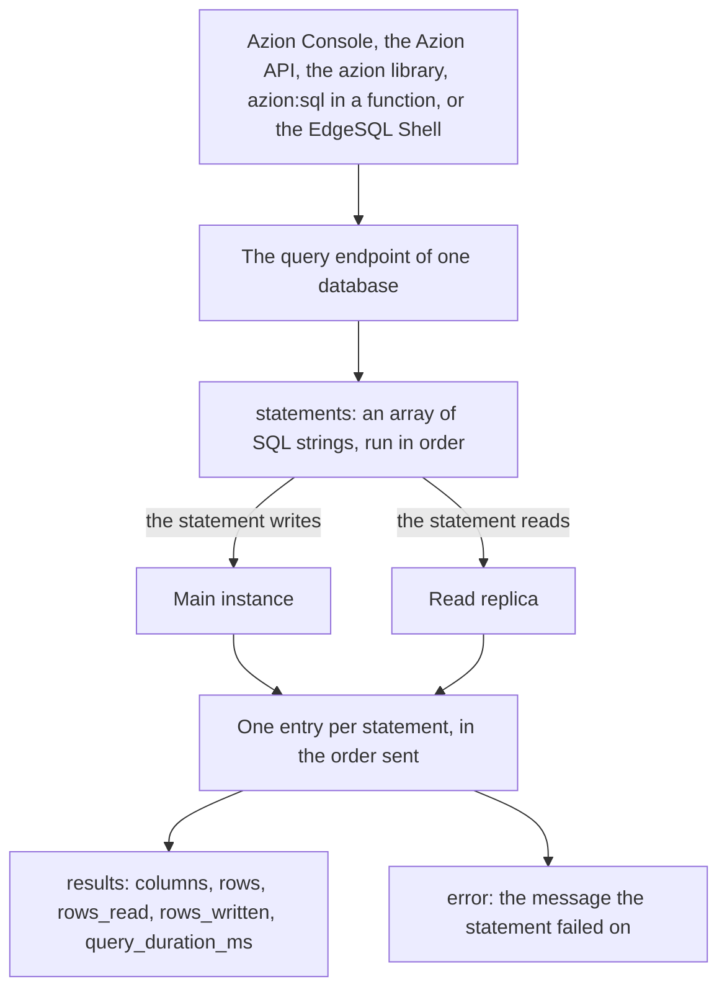

import DocButton from '~/components/webkit/DocButton.vue';
import DocCardGroup from '@aziontech/webkit/doc-card-group'
import DocCard from '@aziontech/webkit/doc-card'

A [relational database](https://www.azion.com/en/learning/storage-database/what-is-relational-database/) holds records in tables of rows and columns, where each column carries one kind of value and each row is one record. SQL is the language that reads and changes those records: a statement describes the rows you want, and the database finds them. As a managed service, a database is created by a request instead of installed, so there is no server to provision, no engine to patch, and no replication to set up.

**SQL Database** runs those databases on Azion's distributed infrastructure. A database is an object you create by name, and every statement is addressed to one of them. The databases are fully ACID-compliant and the dialect is SQLite's, so a statement you already write runs unchanged. One main instance takes every write, and read replicas answer the reads. Use SQL Database to store telemetry from IoT devices, track inventory across distributed ecommerce centers, analyze access logs for security attacks, or manage access data.

<DocButton href="/en/documentation/store/sql-database/quickstart/" label="Quickstart" size="medium" />
<DocButton href="/en/documentation/store/sql-database/guides/" label="SQL Database guides" kind="secondary" size="medium" />

---

## Statements and results

SQL reaches a database through one endpoint, which takes an array of SQL strings and returns one entry per string:

```bash
curl --request POST \
  --url https://api.azion.com/v4/workspace/sql/databases/1851/query \
  --header 'Accept: application/json' \
  --header 'Authorization: Token [TOKEN VALUE]' \
  --header 'Content-Type: application/json' \
  --data '{
  "statements": ["SELECT id, name, email FROM users;"]
}'
```

The response carries the columns, the rows, and what the statement cost:

```json
{
  "state": "executed",
  "data": [
    {
      "results": {
        "columns": ["id", "name", "email"],
        "rows": [[1, "Ada", "ada@example.com"]],
        "rows_read": 1,
        "rows_written": 0,
        "query_duration_ms": 0.034
      }
    }
  ]
}
```

- `statements` holds one or more SQL strings. `CREATE TABLE`, `INSERT`, and `SELECT` are all strings in that one array, so a single call mixes schema changes, writes, and reads.
- `columns` and `rows` carry the result set. Each entry of `rows` is one row, with its values in column order.
- `rows_read` and `rows_written` are the two metrics Azion bills on, and every statement reports its own.
- A statement that fails still answers HTTP `200`, and its entry carries `error` in place of `results`. Read `data[].error` before you read `data[].results`.

If you know SQLite, you know the dialect: the strings inside the array are ordinary SQL. For the statements the engine accepts, refer to the [SQLite language reference](https://www.sqlite.org/lang.html).

---

## Statement path

A statement that fails does not fail the request. The call answers HTTP `200` whether every statement succeeded or one of them did not, so the status line describes the request and never the SQL inside it.



1. You create a database with `POST /databases` and a `name`. It answers statements once its `status` reads `created`, about 15 seconds later.
2. Five interfaces send statements to the query endpoint of that database: Azion Console, the Azion API, the `azion` library, the `azion:sql` module inside a [function](/en/documentation/build/functions/), and the EdgeSQL Shell.
3. The `statements` array runs in the order it lists, and at least 100 statements in one call succeed.
4. A statement that writes is applied to the main instance, while a read is answered from a read replica, so nothing writes to a replica directly.
5. Each statement returns one entry in `data`, carrying `results` with `columns`, `rows`, `rows_read`, `rows_written`, and `query_duration_ms`.
6. A statement that failed carries `error` in that entry instead, and the entries around it still carry their results.

For the instances, the lifecycle of a database, and what a statement costs, refer to [How SQL Database works](/en/documentation/store/sql-database/how-it-works/).

---

## What SQL Database covers

- **Interfaces.** Azion Console, the [Azion API v4](/en/documentation/store/sql-database/databases-and-queries/), the [`azion` library](/en/documentation/devtools/azion-lib/sql/) for Node and TypeScript, the [`azion:sql` module](/en/documentation/devtools/runtime/api-reference/sql-database/) inside a function, and the [EdgeSQL Shell](/en/documentation/store/sql-database/edgesql-shell/), a command-line tool. All five reach the same databases.
- **SQL dialect.** SQLite's, which is why an existing schema and an existing query transfer. The vector types and vector functions extend it, and nothing else does.
- **Availability.** SQL Database is a Preview product on every service plan. It is not enabled on an account by default, and access is requested through a support ticket. To request it, refer to [Technical Support](/en/documentation/support/).
- **Bounds.** A database name is 6 to 50 characters of letters, numbers, and the hyphen, and it is unique across the account. A table holds up to 2,000 columns, a vector carries up to 65,536 dimensions, and one list request returns up to 100 databases. The number of databases, the size of each one, and the storage per account are included per plan. For every bound and what happens past it, refer to [SQL Database limits](/en/documentation/store/sql-database/limits/).
- **Recommendations and failures.** [Best practices](/en/documentation/store/sql-database/best-practices/) covers reading the error key of every statement, polling a new database before the first query, and indexing a vector column before the first nearest-neighbor query. When a create request is rejected, a statement returns `error`, or the EdgeSQL Shell exits at startup, refer to [Troubleshooting](/en/documentation/store/sql-database/troubleshooting/).
- **What it does not do.** SQL Database stores relational records, so unstructured files belong in [Object Storage](/en/documentation/store/object-storage/) and key-value pairs in [KV Store](/en/documentation/store/kv-store/). A database cannot be renamed, and `active` cannot be changed after creation: `PATCH` and `PUT` answer `405`. Azion CLI carries no SQL command, and the Azion Terraform provider publishes no SQL resource.

---

## Vector search

A vector column holds an embedding, the numeric representation of a text, an image, or another value, in the same table as the ordinary columns. One statement therefore filters on a `WHERE` clause and ranks by vector distance, and no separate service holds a second copy of the data.

The column is declared as a blob type carrying its dimension count, an index marks it for approximate nearest-neighbor search, and `vector_top_k` returns the closest rows:

```sql
CREATE TABLE teams (name TEXT, year INT, stats_embedding F32_BLOB(3));
CREATE INDEX teams_idx ON teams (libsql_vector_idx(stats_embedding));
SELECT name, year FROM vector_top_k('teams_idx', vector('[82, 25, 63]'), 2) JOIN teams ON teams.rowid = id;
```

This is what the retrieval step of a retrieval-augmented generation (RAG) application reads from: [AI Inference](/en/documentation/build/ai-inference/) serves the model, and the database serves the rows that ground it. For the column types, the distance functions, the index, and the bounds, refer to [Vector search](/en/documentation/store/sql-database/vector-search/).

---

## Next steps

<DocCardGroup cols={2}>
  <DocCard title="Quickstart" href="/en/documentation/store/sql-database/quickstart/" label="Create your first database and run a query in Azion Console." />
  <DocCard title="How it works" href="/en/documentation/store/sql-database/how-it-works/" label="Follow a statement from the call to the instance that answers it." />
  <DocCard title="Databases and queries" href="/en/documentation/store/sql-database/databases-and-queries/" label="Look up a field, an operation, an envelope, or an error code." />
  <DocCard title="Vector search" href="/en/documentation/store/sql-database/vector-search/" label="Declare a vector column, index it, and rank rows by distance." />
  <DocCard title="SQL Database guides" href="/en/documentation/store/sql-database/guides/" label="Complete a specific task, from Azion Console, the API, or a function." />
  <DocCard title="Limits" href="/en/documentation/store/sql-database/limits/" label="Look up a bound, what happens past it, and what each plan includes." />
</DocCardGroup>
