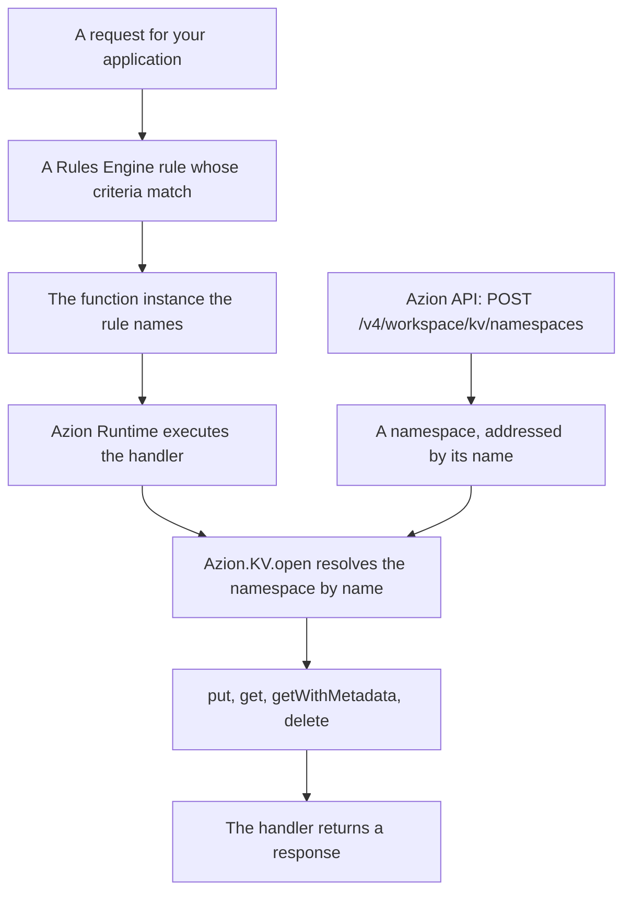

import DocButton from '~/components/webkit/DocButton.vue';
import DocCardGroup from '@aziontech/webkit/doc-card-group'
import DocCard from '@aziontech/webkit/doc-card'

A key-value store holds each value under a name you choose, and finds it again by that name alone. There are no tables, no columns, and no query language: a read asks for one key and gets back what was last written to it. That narrow shape is what makes the lookup cheap, and it is also the trade, because nothing searches the values and nothing lists the keys for you.

**KV Store** runs that model on Azion's distributed infrastructure. Keys live inside a **namespace**, which you create through the Azion API and address by its name. A function reads and writes those keys through `Azion.KV`, a global of Azion Runtime that needs no import and no credential. Use KV Store for the small values a request needs immediately: session state, feature flags, routing and redirect tables, per-user preferences, and rate-limit counters.

<DocButton href="/en/documentation/store/kv-store/quickstart/" label="Quickstart" size="medium" />
<DocButton href="/en/documentation/store/kv-store/guides/" label="KV Store guides" kind="secondary" size="medium" />

---

## Keys and values

A function opens a namespace by name, then reads and writes keys on the client that `open` returns:

```javascript
export default {
  async fetch(request, env, ctx) {
    const kv = await Azion.KV.open('sessions');

    await kv.put('user-42', 'active', { metadata: { region: 'br' } });

    const value = await kv.get('user-42', 'text');
    if (value === null) {
      return new Response('No value for that key', { status: 404 });
    }

    return new Response(value);
  },
};
```

- `Azion.KV.open` is the only way to obtain a client, and it is asynchronous. Every client names a namespace, because there is no default one.
- `put` takes the key, the value, and an options object. A value is a string, an object, an `ArrayBuffer`, a `ReadableStream`, or a typed array view; `metadata` rides alongside it and comes back with `getWithMetadata`.
- `get` takes the key and the type you want back: `text`, `json`, `arrayBuffer`, or `stream`. Pass an array of keys instead of one, and it returns an object keyed by name.
- **A key that was never written returns `null` rather than throwing.** The caller checks for it; it is not an error condition.

---

## How a key reaches a function

A namespace is created once through the API. Everything after that happens inside a request:



1. You create the namespace through the Azion API. It is synchronous, and there is no provisioning state to wait on.
2. A request arrives for your application, and Rules Engine evaluates the rules of the current phase.
3. A rule whose criteria match runs its behaviors, one of which selects a function instance.
4. Azion Runtime executes that function's handler.
5. `Azion.KV.open` resolves the namespace by name. A name no namespace on the account carries throws `NotFound`.
6. The handler calls `put`, `get`, `getWithMetadata`, or `delete`, and returns its response.

Creating the namespace outside the request keeps the request path short, and it costs you the ability to provision one on demand: a function cannot create the namespace it needs, so the name has to exist before the code that opens it ships.

---

## What KV Store covers

- **Interfaces.** Two. The [Azion API](/en/documentation/store/kv-store/namespaces/) creates, lists, and retrieves namespaces; the [`Azion.KV` client](/en/documentation/store/kv-store/kv-client/) reads and writes keys inside a function. **Azion Console has no KV Store screen**, and **Azion CLI and the Azion Terraform provider carry no KV Store command or resource** — there is nothing to look for in any of the three.
- **Availability.** KV Store is a Preview product on every service plan. It is not enabled on an account by default, and access is requested through a support ticket. To request it, refer to [Technical Support](/en/documentation/support/).
- **Bounds.** A namespace name is 3 to 63 characters of letters, numbers, the hyphen, and the underscore, and it is unique across the account. **A namespace is permanent**: it cannot be renamed, emptied, or deleted, so its name is worth settling before the first request. For every bound and the usage each plan includes, refer to [KV Store limits](/en/documentation/store/kv-store/limits/).
- **Consistency.** A write is visible immediately where it lands and converges elsewhere afterwards, so a read can return the value a newer write replaced. [How KV Store works](/en/documentation/store/kv-store/how-it-works/) covers what that changes about the code you write.
- **Recommendations and failures.** [Best practices](/en/documentation/store/kv-store/best-practices/) covers naming a namespace you cannot rename, deriving key names when nothing lists them, and reading both of the error shapes the platform returns. When a call throws, a build fails on an `azion:kv` import copied from older material, or a namespace the API lists is not found from a function, refer to [Troubleshooting](/en/documentation/store/kv-store/troubleshooting/).
- **What it does not do.** There is no key listing, no atomic increment, and no operation that spans more than one key as a unit. KV Store holds small values addressed by name, so unstructured files belong in [Object Storage](/en/documentation/store/object-storage/), relational records in [SQL Database](/en/documentation/store/sql-database/), and a response you want served again in [Cache](/en/documentation/build/cache/).

---

## Next steps

<DocCardGroup cols={2}>
  <DocCard title="Quickstart" href="/en/documentation/store/kv-store/quickstart/" label="Create your first namespace and read a key back from a function." />
  <DocCard title="How KV Store works" href="/en/documentation/store/kv-store/how-it-works/" label="Follow a key from the request to the function that reads it, and what consistency changes." />
  <DocCard title="KV client" href="/en/documentation/store/kv-store/kv-client/" label="Look up a method, a return type, an option, or an error the client throws." />
  <DocCard title="Namespaces" href="/en/documentation/store/kv-store/namespaces/" label="Look up a field, an operation, an envelope, or an error code on the Azion API." />
  <DocCard title="KV Store guides" href="/en/documentation/store/kv-store/guides/" label="Complete a specific task with the client, from storing a value to reading a stream." />
  <DocCard title="Limits" href="/en/documentation/store/kv-store/limits/" label="Look up a bound, what happens past it, and what each plan includes." />
</DocCardGroup>
