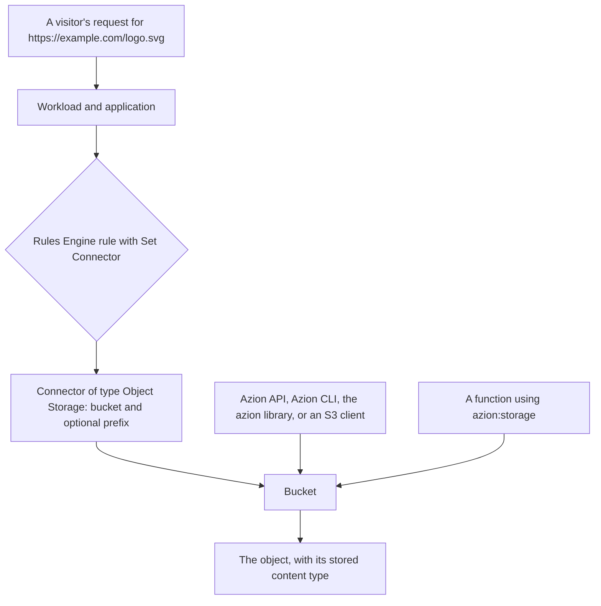

import DocButton from '~/components/webkit/DocButton.vue';
import DocCardGroup from '@aziontech/webkit/doc-card-group'
import DocCard from '@aziontech/webkit/doc-card'

Object storage keeps a file whole, under a name you choose, in a flat container. There are no directories and no partial writes: a file is written once, read as a unit, and replaced whole. The name is the only address it has, so everything that reads the file later reads it by that name. The model suits anything written rarely and read often, such as images, video, archives, and build output.

**Object Storage** holds those files on infrastructure Azion operates, as objects inside buckets. A [Connector](/en/documentation/platform/connectors/) points an application at a bucket, so a request to your domain is answered from it, and code in [Azion Runtime](/en/documentation/devtools/runtime/api-reference/storage/) reads and writes the same objects during a request. Use Object Storage to serve a static site, hold the assets an application delivers, receive uploads from your users, or collect the data a stream produces.

<DocButton href="/en/documentation/store/object-storage/quickstart/" label="Quickstart" size="medium" />
<DocButton href="/en/documentation/store/object-storage/guides/" label="Object Storage guides" kind="secondary" size="medium" />

---

## The bucket and the object

A bucket is created with a name and an access level. Nothing else is configured, and the bucket is ready as soon as the request returns:

```bash
curl --request POST \
  --url https://api.azion.com/v4/workspace/storage/buckets \
  --header 'Accept: application/json' \
  --header 'Authorization: Token [TOKEN VALUE]' \
  --header 'Content-Type: application/json' \
  --data '{
  "name": "site-assets-ro",
  "workloads_access": "read_only"
}'
```

An object is written into it by key, with its content as the body:

```bash
curl --request POST \
  --url https://api.azion.com/v4/workspace/storage/buckets/site-assets-ro/objects/assets/logo.svg \
  --header 'Accept: application/json' \
  --header 'Authorization: Token [TOKEN VALUE]' \
  --header 'Content-Type: image/svg+xml' \
  --data-binary '@./logo.svg'
```

- `name` is unique across every Azion account, 6 to 63 characters, and cannot be changed afterwards.
- `workloads_access` decides what the Azion platform may do with the objects when an application serves them. It does not restrict the Azion API or the S3 protocol.
- The object key is the whole address. The `assets/` segment is part of the key, not a folder that had to exist first.
- The stored content type comes from the `Content-Type` header. With no header, Azion detects it.

If you have used an S3-compatible service, the model transfers: the same buckets and objects answer S3 requests signed with a credential you create.

---

## How a request reaches an object

An object answers three kinds of caller, and they authenticate differently:



Creating a bucket exposes nothing. Until a connector names the bucket and a rule sends requests to it, the objects are reachable only by a caller holding a personal token or an S3 credential. That is the step most first setups miss.

The S3 endpoint is a management interface, dimensioned for creating, listing, and removing objects rather than for serving traffic. End users reach objects through an application, where [Cache](/en/documentation/build/cache/) keeps a copy and the application's own rules apply.

---

## What Object Storage covers

- **Interfaces.** Azion Console, the [Azion API v4](/en/documentation/store/object-storage/buckets-and-objects/), the [Azion CLI](/en/documentation/devtools/cli/), [Azion Runtime](/en/documentation/devtools/runtime/api-reference/storage/), the [`azion` library](/en/documentation/devtools/azion-lib/storage/), and the [S3 protocol](/en/documentation/store/object-storage/s3-compatibility/). All six reach the same buckets.
- **S3 compatibility.** Sixteen S3 operations, signed with an access key and secret key you create as a credential, scoped to the buckets and capabilities you name. Existing S3 tools and SDKs connect to `s3.us-east-005.azionstorage.net`.
- **Access levels.** `read_only`, `read_write`, and `restricted` decide what the platform may do when an application serves a bucket.
- **Serving.** A Connector of type Object Storage, plus a Rules Engine rule, put a bucket behind a domain. A prefix on the connector decides where the application's path starts.
- **Bounds.** Bucket names are 6 to 63 characters and unique across every Azion account; an object key is up to 1,024 characters; a list returns up to 1,000 keys per page; a bucket is deleted only when it holds no objects and none was removed from it in the last 24 hours. Storage and operations are included per plan. For every bound, refer to [Object Storage limits](/en/documentation/store/object-storage/limits/).
- **Region.** Objects are stored in `us-east-005`, and the region is not selectable.
- **What it does not do.** Object Storage does not version objects: writing to a key replaces its content, and the previous version cannot be recovered. It stores unstructured files rather than records, so query it through your own code, or use [SQL Database](/en/documentation/store/sql-database/) for relational data and [KV Store](/en/documentation/store/kv-store/) for key-value pairs.

---

## Next steps

<DocCardGroup cols={2}>
  <DocCard title="Quickstart" href="/en/documentation/store/object-storage/quickstart/" label="Create your first bucket and store an object in it." />
  <DocCard title="How it works" href="/en/documentation/store/object-storage/how-it-works/" label="Follow an object from the write to the request that serves it." />
  <DocCard title="Buckets and objects" href="/en/documentation/store/object-storage/buckets-and-objects/" label="Look up a field, an operation, or the error a rejection returns." />
  <DocCard title="S3 compatibility" href="/en/documentation/store/object-storage/s3-compatibility/" label="Create a credential and connect an existing S3 tool or SDK." />
  <DocCard title="Object Storage guides" href="/en/documentation/store/object-storage/guides/" label="Complete a specific task, from Azion Console, the API, or the CLI." />
  <DocCard title="Limits" href="/en/documentation/store/object-storage/limits/" label="Look up a bound, what happens past it, and what each plan includes." />
</DocCardGroup>
