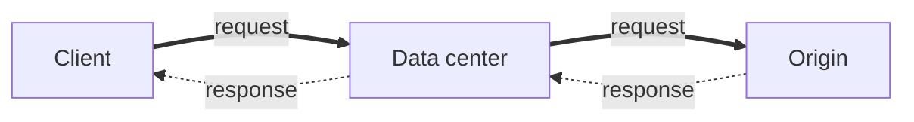
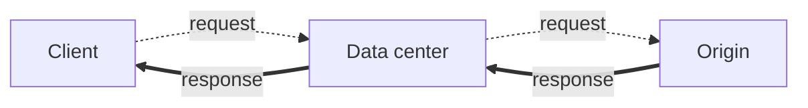
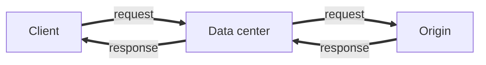
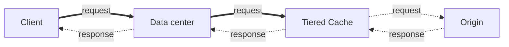
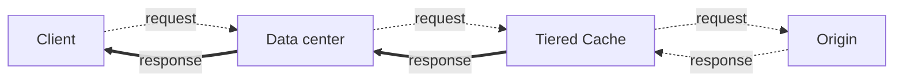
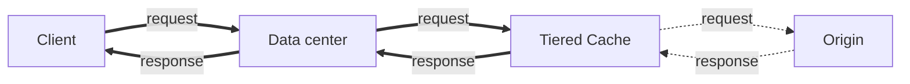
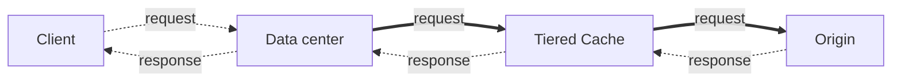
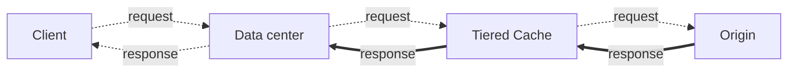
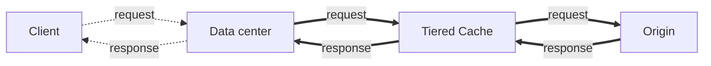

import FrameBox from '@aziontech/webkit/frame-box'
import ItemList from '@aziontech/webkit/item-list'
import DocItem from '@aziontech/webkit/doc-item'

The **Build** category of [Real-Time Metrics](/en/documentation/platform/real-time-metrics/) holds the dashboards of four product tabs: **Applications**, **Tiered Cache**, **Functions**, and **Image Processor**. Select **Build** in the category dropdown to open them. With no dashboard in the URL, Real-Time Metrics opens on **Build** › **Applications** › **Data Transferred**.

Each dashboard below has a table with one row per chart, in the order the Console draws them. The **Aggregation** column holds the tag shown under each chart's description. With **Sum**, a legend entry shows the total over the selected range. With **Average**, it shows that total divided by the number of points. The prose under each table names the series a chart draws, the path of the data it counts, and its variation tag. That tag compares the selected range with the window of equal length immediately before it, and it appears only on a chart that draws one series. Each dashboard closes with the dataset and fields that return the same numbers through the GraphQL API, for a breakdown or a range the chart does not draw. For the time range and the filters that apply to every chart, refer to [Filters and time range](/en/documentation/platform/real-time-metrics/filters-and-time-range/).

---

## Applications

The **Applications** tab shows metrics on the traffic of the [Applications](/en/documentation/platform/applications/) configured in your account. It holds five dashboards, in this order in the dashboard selector: **Data Transferred**, **Requests**, **Status Codes**, **Bandwidth Saving**, and **Request Breakdown**. The first four read the `httpMetrics` dataset, and **Request Breakdown** reads `httpBreakdownMetrics`.

### Data Transferred

The **Data Transferred** dashboard measures the bytes and the bandwidth your applications move, and how much of that content the data center serves from its cache. Its **Edge Cache** chart counts the data that passes through [Cache](/en/documentation/platform/applications/#cache), which must be active in your account to report data.

| Chart | What it measures | Unit | Aggregation |
| --- | --- | --- | --- |
| Edge Cache | Data transferred through Cache, split into data in, data out, and their total. | Bytes | Sum |
| Edge Offload | Share of data the data center delivered from its cache, without fetching it from the origin. | Percent | Average |
| Saved Data | Data the data center delivered from its cache, without fetching it from the origin. | Bytes | Sum |
| Missed Data | Data the data center delivered after fetching it from the origin. | Bytes | Sum |
| Total Bandwidth Usage | Bandwidth used to deliver your content. | Bits per second | Sum |
| Bandwidth Offloaded | Share of bandwidth delivered from the cache, without fetching the content from the origin. | Percent | Average |
| Saved Bandwidth | Bandwidth delivered from the cache, without fetching the content from the origin. | Bits per second | Sum |
| Missed Bandwidth | Bandwidth used to fetch content from the origin and deliver it to the client. | Bits per second | Sum |

**Edge Cache** draws three series: **Data Transferred Total**, **Data Transferred Out**, and **Data Transferred In**. The path each series counts depends on whether the application uses [Tiered Cache](/en/documentation/platform/applications/cache/tiered-cache/), a second cache layer between the data center and your origin:

| Series | Without Tiered Cache | With Tiered Cache |
| --- | --- | --- |
| Data Transferred In | Client → data center → origin | Client → data center → Tiered Cache layer |
| Data Transferred Out | Origin → data center → client | Tiered Cache layer → data center → client |
| Data Transferred Total | Data Transferred In + Data Transferred Out | Data Transferred In + Data Transferred Out |

Each diagram below draws one series. The top row is the request, from the client toward the origin, and the bottom row is the response. A solid arrow is a leg the series counts, and a dotted arrow is a leg it does not count.

1. Counted: the request travels from the client to the data center, and from the data center to the origin.
2. Not counted: the response that returns to the client, which **Data Transferred Out** counts.

1. Counted: the response travels from the origin to the data center, and from the data center to the client.
2. Not counted: the request that reaches the origin, which **Data Transferred In** counts.

1. Counted: the request, from the client to the data center and on to the origin.
2. Counted: the response, from the origin to the data center and back to the client.

1. Counted: the request travels from the client to the data center, and from the data center to the Tiered Cache layer.
2. Not counted: the leg to the origin, which the **Tiered Cache** tab counts, and the response, which **Data Transferred Out** counts.

1. Counted: the response travels from the Tiered Cache layer to the data center, and from the data center to the client.
2. Not counted: the request, which **Data Transferred In** counts, and the leg from the origin, which the **Tiered Cache** tab counts.

1. Counted: the request, from the client to the data center and on to the Tiered Cache layer.
2. Counted: the response, from the Tiered Cache layer to the data center and back to the client.
3. Not counted: both legs between the Tiered Cache layer and the origin, which the **Tiered Cache** tab counts.

With Tiered Cache, the traffic between the Tiered Cache layer and the origin is counted on the **Tiered Cache** tab instead. **Data Transferred In** sums the length of each request, and adds it a second time when the content is not a cache hit. **Data Transferred Out** sums the bytes sent, and adds the upstream bytes sent when the content is not a cache hit.

**Edge Offload**, **Saved Data**, **Bandwidth Offloaded**, and **Saved Bandwidth** measure content the data center delivered to the client from its own cache: Client → data center → client. **Missed Data** and **Missed Bandwidth** measure content the data center fetched from the origin first: Client → data center → origin → data center → client. A higher offload or saved value means your cache policies serve more content from cache, and your origin handles less demand. For example, if an application transfers 1 GB with an average **Edge Offload** of 80%, the data center served 800 MB of it from cache.

The Console scales each unit in steps of 1,000. Byte charts read `B`, `kB`, `MB`, `GB`, and `TB`, and bandwidth charts read bits per second as `bit/s`, `kb/s`, `Mb/s`, and `Gb/s`. Percentages show two decimals, such as `45.67%`.

An increase shows as good on **Edge Offload**, **Saved Data**, **Total Bandwidth Usage**, **Bandwidth Offloaded**, and **Saved Bandwidth**, and as bad on **Missed Data** and **Missed Bandwidth**. **Edge Cache** draws three series, so it shows no variation tag.

To query the same numbers, use the `httpMetrics` dataset. **Edge Cache** reads `dataTransferredIn`, `dataTransferredOut`, and `dataTransferredTotal`. The other charts, in table order, read `offload`, `savedData`, `missedData`, `bandwidthTotal`, `bandwidthOffload`, `bandwidthSavedData`, and `bandwidthMissedData`. For each field, refer to [Real-Time Metrics GraphQL fields](/en/documentation/devtools/graphql/gql-real-time-metrics-fields/#httpmetrics-applications-waf).

### Requests

The **Requests** dashboard counts the requests made to the domains of your applications and how many the data center answered from its cache. It also splits them by method and scheme, and measures how long they take.

| Chart | What it measures | Unit | Aggregation |
| --- | --- | --- | --- |
| Total Requests | Requests made to your domains, split by scheme. | Requests | Sum |
| Requests Offloaded | Share of requests the data center delivered from its cache, without fetching the content from the origin. | Percent | Average |
| Saved Requests | Requests delivered from the cache, without fetching the content from the origin. | Requests | Sum |
| Missed Requests | Requests delivered after fetching the content from the origin. | Requests | Sum |
| Total Requests per Second | Requests per second made to your domains. | Requests per second | Sum |
| Requests per Second Offloaded | Share of requests per second delivered from the cache. | Percent | Average |
| Saved Requests per Second | Requests per second delivered from the cache. | Requests per second | Sum |
| Missed Requests per Second | Requests per second delivered after fetching the content from the origin. | Requests per second | Sum |
| Requests by Method | Requests for each HTTP method. | Requests | Sum |
| Average Request Time | Average time to process a request and answer it. | Seconds | Average |
| Requests by Scheme | Requests for each scheme, HTTP or HTTPS. | Requests | Sum |

**Total Requests** draws three series. **Http Requests Total** counts the requests served over HTTP, and **Https Requests Total** counts those served over HTTPS, which encrypts and verifies the connection. **Edge Requests Total** is the sum of the two.

**Requests Offloaded**, **Saved Requests**, and their per-second charts measure requests the data center answered from its own cache: Client → data center → client. **Missed Requests** and **Missed Requests per Second** count requests the data center sent on to the origin: Client → data center → origin → data center → client. A higher saved count means your cache policies keep more requests away from your origin. For example, with 5 requests and an average **Requests Offloaded** of 80%, the data center answered 4 of the 5 from cache. On **Requests per Second Offloaded**, 5 requests in one second at 80% means 4 of them came from cache in that second.

The per-second charts divide the requests in each time bucket by the length of the bucket in seconds: 60 for a minute bucket, 3,600 for an hour bucket. The bucket size follows the length of the selected range; for the ranges, refer to [How Real-Time Metrics works](/en/documentation/platform/real-time-metrics/how-it-works/). The Console shows these values with a `/s` suffix, such as `0.026/s`.

**Requests by Method** draws one series per HTTP method found in the range, such as `GET`, which retrieves a resource, or `POST`, which sends data to the server. A `HEAD` request retrieves the information about a resource without its content. The chart shows how clients interact with the content on your domains.

**Average Request Time** is a duration: the average time, in seconds, that the server or application takes to process a request and answer it. The Console formats it with the per-second suffix, such as `1.7/s`, which reads as 1.7 seconds. Use the chart to find trends in processing time, such as a bottleneck that needs attention. To shorten that time, refer to [Configure cache policies for an application](/en/documentation/guides/application-performance/cache-and-purge/cache-settings/), [Configure Advanced Cache Key for an application](/en/documentation/guides/application-performance/cache-and-purge/advanced-cache-key/), and [Balance traffic across multiple origins](/en/documentation/guides/application-performance/availability/multiple-origins/).

**Requests by Scheme** draws one series per scheme. HTTP carries requests without encryption, which an attacker can intercept. HTTPS carries requests encrypted to keep the data intact and confidential. Use the chart to follow the share of encrypted traffic over time. For more information, refer to [Configure HTTP and HTTPS ports](/en/documentation/guides/application-development/getting-started/configure-ports/).

An increase shows as good on **Requests Offloaded**, **Saved Requests**, **Total Requests per Second**, **Requests per Second Offloaded**, and **Saved Requests per Second**. It shows as bad on **Missed Requests**, **Missed Requests per Second**, **Average Request Time**, and **Requests by Scheme**. **Total Requests** draws three series and shows no variation tag. **Requests by Method** and **Requests by Scheme** show the tag only when one method or one scheme has data. On **Requests by Method**, the tag carries no arrow.

To query the same numbers, use the `httpMetrics` dataset. **Total Requests** reads `edgeRequestsTotal`, `httpsRequestsTotal`, and `httpRequestsTotal`. The next seven charts, in table order, read `requestsOffloaded`, `savedRequests`, `missedRequests`, `edgeRequestsTotalPerSecond`, `requestsPerSecondOffloaded`, `savedRequestsPerSecond`, and `missedRequestsPerSecond`. **Requests by Method** and **Requests by Scheme** sum `requests` grouped by `requestMethod` and by `scheme`, and **Average Request Time** averages `requestTime`. The fields `requestsHttpMethodGet`, `requestsHttpMethodPost`, `requestsHttpMethodHead`, and `requestsHttpMethodOthers` return one total per method, with methods such as `PUT` and `PATCH` in `requestsHttpMethodOthers`. For each field, refer to [Real-Time Metrics GraphQL fields](/en/documentation/devtools/graphql/gql-real-time-metrics-fields/#httpmetrics-applications-waf).

### Status Codes

The **Status Codes** dashboard sums the requests to the domains of your applications by the HTTP status code of the response. Every request to a domain of an application receives a status code, and each chart counts one class of codes.

| Chart | What it measures | Unit | Aggregation |
| --- | --- | --- | --- |
| HTTP Status Codes 2XX | Successful responses: the request was received, understood, accepted, and processed, and the client received your content. | Requests | Sum |
| HTTP Status Codes 3XX | Redirections: the content was at another location, and the client needed one more action to reach it. | Requests | Sum |
| HTTP Status Codes 4XX | Client errors, such as a page that is not available or a request with bad syntax. The content was not delivered. | Requests | Sum |
| HTTP Status Codes 5XX | Server errors: the request seemed valid, but the server failed to deliver content that still exists. | Requests | Sum |
| Requests by Status and Upstream Status | Requests for each pair of status and upstream status, for the 10 most frequent pairs. | Requests | Sum |

**HTTP Status Codes 2XX** draws one series per status code from 200 to 299 found in the range. **HTTP Status Codes 3XX** draws one per code from 300 to 399. **HTTP Status Codes 4XX** draws four series: **Requests Status Code 400**, **Requests Status Code 403**, **Requests Status Code 404**, and **Requests Status Code 4xx**. **HTTP Status Codes 5XX** draws **Requests Status Code 500**, **Requests Status Code 502**, **Requests Status Code 503**, and **Requests Status Code 5xx**. The **Requests Status Code 4xx** and **Requests Status Code 5xx** series count only the codes in their class that have no series of their own. For example, a 404 response counts in **Requests Status Code 404** and never in **Requests Status Code 4xx**.

The codes these charts show most often:

| Status code | Meaning |
| --- | --- |
| 200 | The content was delivered correctly. This is the standard success response. |
| 204 | The request completed, and there was no content to deliver. |
| 206 | Only part of the content was delivered, because the content was split into parts. |
| 301 | The request, and every later request, is redirected to another URL. |
| 302 | The request is redirected to another URL for a limited time. |
| 304 | The content was not modified, so the browser uses the file it already holds. |
| 400 | The server cannot process the request, generally because of a format error in the request. |
| 403 | The request is valid, but the user or the IP address is not authorized. |
| 404 | The requested file does not exist on the origin server. |
| 500 | The server met a generic, unexpected error. |
| 502 | A server acting as a gateway or proxy received an invalid response from the origin, generally because the origin is offline. |
| 503 | The server is not available, generally for a short time. |

**Requests by Status and Upstream Status** is a table with three columns. **Status** is the code of the response the client received, generated by your application or by Azion's infrastructure. It can be a 2XX success, a 4XX client error, or a 5XX server error. **Upstream Status** is the code the origin or an external service returned, which exposes connectivity issues, timeouts, and failures behind your application. A request the origin did not answer, such as one answered from cache, carries upstream status `0` in the API, and a request for which no origin server can be selected carries `502`. **Total** is the number of requests with that pair of codes. Use the table to find which layer returns an error and to detect trends in how requests are handled.

The table lists the 10 most frequent pairs. To reach the others, add a filter that narrows the chart to the requests you need, or query the dataset. To break requests down by any status code through the GraphQL API, refer to [Break down requests by status code](/en/documentation/guides/platform/observability/break-down-requests-by-status-code/).

**HTTP Status Codes 2XX** and **HTTP Status Codes 3XX** show a variation tag, with no arrow, only when one status code has data. The 4XX and 5XX charts draw four series each and show no variation tag, and neither does the table.

To query the same numbers, use the `httpMetrics` dataset. The 2XX and 3XX charts sum `requests` grouped by `status`, limited to their range of codes. The 4XX and 5XX charts read `requestsStatusCode400`, `requestsStatusCode403`, `requestsStatusCode404`, `requestsStatusCode4xx`, `requestsStatusCode500`, `requestsStatusCode502`, `requestsStatusCode503`, and `requestsStatusCode5xx`. The table sums `requests` grouped by `status` and `upstreamStatus`. The class fields follow the rule of the series: `requestsStatusCode2xx` counts no 200, 204, or 206 response, because `requestsStatusCode200`, `requestsStatusCode204`, and `requestsStatusCode206` count them. In the same way, `requestsStatusCode3xx` leaves out the 301, 302, and 304 responses. For each field, refer to [Real-Time Metrics GraphQL fields](/en/documentation/devtools/graphql/gql-real-time-metrics-fields/#httpmetrics-applications-waf).

### Bandwidth Saving

The **Bandwidth Saving** dashboard holds one chart, the bytes that [Image Processor](/en/documentation/platform/applications/#image-processor) saved when it delivered the images it processed for your domains. Processing covers resizing, cropping, changing the quality, and every other Image Processor operation. The chart counts the saving on every processed image of the domain.

| Chart | What it measures | Unit | Aggregation |
| --- | --- | --- | --- |
| Bandwidth Saving | Savings on every transmission of an image that Image Processor processed and delivered. | Bytes | Sum |

**Bandwidth Saving** draws one series, **Bandwidth Images Processed Saved Data**, and an increase shows as good. The Console scales the bytes from `B` up to `TB` in steps of 1,000.

To query the same number, read `bandwidthImagesProcessedSavedData` from the `httpMetrics` dataset. For the field, refer to [Real-Time Metrics GraphQL fields](/en/documentation/devtools/graphql/gql-real-time-metrics-fields/#httpmetrics-applications-waf).

### Request Breakdown

The **Request Breakdown** dashboard holds one table chart, **IP Address Information**, which shows where the requests to your applications come from, by network and by place. It reads the `httpBreakdownMetrics` dataset.

| Chart | What it measures | Unit | Aggregation |
| --- | --- | --- | --- |
| IP Address Information | Requests for each IP address, with its network, country, and region, for the 10 most frequent addresses. | Requests | Sum |

The table has five columns:

- **Remote Address**: the IP address that made the requests.
- **ASN**: the Autonomous System Number, which identifies the network operator or organization responsible for the IP address.
- **Country**: the country the requests come from.
- **Region**: the region the requests come from.
- **Total**: the number of requests from that remote address.

The table lists the 10 remote addresses with the most requests. To reach the others, add a filter that narrows the chart to the requests you need. Use the table to find regional traffic patterns and unusual activity from one country or network, then act on it. For example, to block the requests of one address or country, refer to [Block requests by IP, ASN, or country](/en/documentation/guides/application-security/bots-and-network/blocklists-ip-addresses-edge/). The table shows no variation tag.

To query the same numbers, sum `requests` from the `httpBreakdownMetrics` dataset grouped by `remoteAddress`, `geolocAsn`, `geolocCountryName`, and `geolocRegionName`. For each field, refer to [Real-Time Metrics GraphQL fields](/en/documentation/devtools/graphql/gql-real-time-metrics-fields/#httpbreakdownmetrics).

---

## Tiered Cache

The **Tiered Cache** tab shows metrics on the applications that use Tiered Cache, which must be active in your account for the tab to report data. Tiered Cache adds a cache layer between the data center and your origin. The tab holds one dashboard, **Caching Offload**, so the Console shows no dashboard selector.

| Chart | What it measures | Unit | Aggregation |
| --- | --- | --- | --- |
| Tiered Cache | Data transferred through the Tiered Cache layer, split into data in, data out, and their total. | Bytes | Sum |
| Tiered Cache Offload | Share of data the Tiered Cache layer delivered to the data center without fetching it from the origin. | Percent | Average |

The **Tiered Cache** chart draws three series, and each one counts this path:

| Series | Path counted |
| --- | --- |
| Data Transferred In | Data center → Tiered Cache layer → origin |
| Data Transferred Out | Origin → Tiered Cache layer → data center |
| Data Transferred Total | Data Transferred In + Data Transferred Out |

Each diagram below draws one series of the **Tiered Cache** chart, with the request on the top row and the response on the bottom row. A solid arrow is a leg the series counts, and a dotted arrow is a leg it does not count.

1. Counted: the request travels from the data center to the Tiered Cache layer, and from the Tiered Cache layer to the origin.
2. Not counted: the client legs, which the **Edge Cache** chart counts, and the response, which **Data Transferred Out** counts.

1. Counted: the response travels from the origin to the Tiered Cache layer, and from the Tiered Cache layer to the data center.
2. Not counted: the client legs, which the **Edge Cache** chart counts, and the request, which **Data Transferred In** counts.

1. Counted: the request, from the data center to the Tiered Cache layer and on to the origin.
2. Counted: the response, from the origin to the Tiered Cache layer and back to the data center.
3. Not counted: both legs between the client and the data center, which the **Edge Cache** chart counts.

The traffic between the client and the data center is counted by the **Edge Cache** chart on the **Applications** tab instead.

**Tiered Cache Offload** measures the share of data the Tiered Cache layer returned to the data center from its own cache: data center → Tiered Cache layer → data center. A higher percentage means the Tiered Cache layer answers more of the requests the data center cannot serve, and your origin handles less demand. For example, if 1 GB passes through the Tiered Cache layer with an average **Tiered Cache Offload** of 80%, the layer delivered 800 MB of it from cache.

An increase on **Tiered Cache Offload** shows as good. The **Tiered Cache** chart draws three series and shows no variation tag. Byte values scale from `B` up to `TB`, and percentages show two decimals.

To query the same numbers, use the `tieredCacheMetrics` dataset. The **Tiered Cache** chart reads `dataTransferredIn`, `dataTransferredOut`, and `dataTransferredTotal`, and **Tiered Cache Offload** reads `offload`. For each field, refer to [Real-Time Metrics GraphQL fields](/en/documentation/devtools/graphql/gql-real-time-metrics-fields/#tieredcachemetrics-tiered-cache).

---

## Functions

The **Functions** tab shows metrics on the invocations of the [Functions](/en/documentation/platform/functions/) configured in your account, and Functions must be active for the tab to report data. The tab holds one dashboard, **Invocations**.

| Chart | What it measures | Unit | Aggregation |
| --- | --- | --- | --- |
| Total Invocations | Times your functions ran, split by where each function is attached. | Invocations | Sum |

Each execution of a configured function counts as one invocation. **Total Invocations** draws two series: **Edge Application Invocations** counts the functions that ran on an application, and **Edge Firewall Invocations** counts those that ran on a firewall. The chart draws two series, so it shows no variation tag.

To query the same numbers, read `edgeApplicationInvocations` and `edgeFirewallInvocations` from the `edgeFunctionsMetrics` dataset. For each field, refer to [Real-Time Metrics GraphQL fields](/en/documentation/devtools/graphql/gql-real-time-metrics-fields/#edgefunctionsmetrics-functions).

---

## Image Processor

The **Image Processor** tab shows metrics on the requests for the images that Image Processor processes. Image Processor must be active in your account for the tab to report data. The tab holds one dashboard, **Requests**.

| Chart | What it measures | Unit | Aggregation |
| --- | --- | --- | --- |
| Total Requests | Requests for processed images that returned status 304 or a status from 199 to 299. | Requests | Sum |
| Total Requests per Second | Requests per second for processed images that returned status 304 or a status from 200 to 299. | Requests per second | Sum |

Both charts count the requests for every processed image on the domain where Image Processor is configured, and both draw one series, **Requests**. **Total Requests** keeps the responses with status 304 or a status from 199 to 299. **Total Requests per Second** keeps status 304 or a status from 200 to 299, and returns the rate of those requests per second. An increase shows as good on both charts.

To query the same numbers, sum `requests` from the `imagesProcessedMetrics` dataset, filtered to those status codes. For each field, refer to [Real-Time Metrics GraphQL fields](/en/documentation/devtools/graphql/gql-real-time-metrics-fields/#imageprocessedmetrics-image-processor).

---

## Related resources

<FrameBox>
<ItemList>
  <DocItem title="Filters and time range" href="/en/documentation/platform/real-time-metrics/filters-and-time-range/">The time range, the filters, and the chart menu that apply to every chart on these dashboards.</DocItem>
  <DocItem title="How Real-Time Metrics works" href="/en/documentation/platform/real-time-metrics/how-it-works/">How a metric reaches a chart, and which bucket size each time range returns.</DocItem>
  <DocItem title="Real-Time Metrics GraphQL fields" href="/en/documentation/devtools/graphql/gql-real-time-metrics-fields/">Every field of the datasets named on this page, with its type and description.</DocItem>
  <DocItem title="Measure cache offload for a domain" href="/en/documentation/guides/platform/observability/measure-cache-offload/">Query the offload, saved, and missed values of one domain through the GraphQL API.</DocItem>
</ItemList>
</FrameBox>
