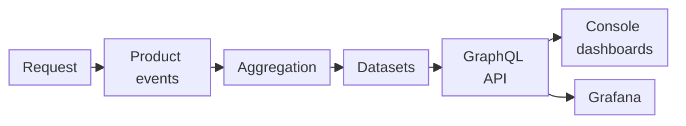

import FrameBox from '@aziontech/webkit/frame-box'
import ItemList from '@aziontech/webkit/item-list'
import DocItem from '@aziontech/webkit/doc-item'

A metric is a number computed from many events over a slice of time: a count of requests, a sum of bytes, or a share of content served from cache. Every request your traffic makes is recorded as an event, the events are added up per minute, hour, or day, and a chart plots one point per slice. The point is a total, so it arrives later than the requests it counts and says nothing about any single one of them.

[Real-Time Metrics](/en/documentation/platform/real-time-metrics/) shows those totals. It creates nothing in your account: it reads the metrics that other Azion products generate while they serve your traffic, and it shows them as charts in [Azion Console](https://console.azion.com/) and through the [GraphQL API](/en/documentation/devtools/graphql/). To open your first dashboard, refer to the [Real-Time Metrics quickstart](/en/documentation/platform/real-time-metrics/quickstart/).

The sections follow a request until it is a point on a chart: the path from a request to a chart, aggregation and its delay, the resolution of each point, how counting differs from Billing, metrics and events, the datasets each dashboard reads, and retention.

---

## From a request to a chart

The products that serve your traffic record what they do with each request or query: [Applications](/en/documentation/platform/applications/), [Cache](/en/documentation/platform/applications/#cache), [Tiered Cache](/en/documentation/platform/applications/cache/tiered-cache/), [Functions](/en/documentation/platform/functions/), [Image Processor](/en/documentation/platform/applications/#image-processor), [WAF](/en/documentation/platform/firewall/#waf), [Edge DNS](/en/documentation/platform/edge-dns/), [Bot Manager](/en/documentation/platform/firewall/#bot-manager), and [Data Stream](/en/documentation/platform/data-stream/). Real-Time Metrics changes nothing on these products. It reads what they record, after Azion aggregates it.

This diagram follows one request until it becomes a point on a chart:

1. A client sends a request, and the product that handles it, such as an application, serves it and records it as an event.
2. Azion aggregates the events into metrics, such as a count of requests or a sum of bytes per time bucket. Aggregation takes up to 10 minutes.
3. The metrics are stored in datasets, one per kind of traffic, such as `httpMetrics` for the requests that Applications and WAF handle.
4. The GraphQL API at `https://api.azion.com/v4/metrics/graphql` answers queries on those datasets.
5. Each chart in Azion Console is a query to that same API, so a dashboard and a query you write read the same numbers.
6. A Grafana dashboard can read the same datasets through the API. To set up Grafana, refer to [Install the Azion plugin for Grafana](/en/documentation/guides/platform/observability/integrate-grafana/).

Because every chart is a GraphQL query, **Copy query** in a chart's menu copies the exact query and variables that the chart sends. You can run that query yourself, change its range, or break it down further. For the format of the copied text, refer to [Copy query](/en/documentation/platform/real-time-metrics/filters-and-time-range/#copy-query).

### What a chart counts

A request chart counts accesses: each time a client reaches your application's content, the application processes one request, and the chart counts one. When the content is not in cache, the data center fetches it from the origin before it answers the client. That whole trip, from the client to the data center, to the origin, and back, still counts as one request, and **Missed Requests** counts it once.

The **Edge Cache** chart splits the same trip by direction instead. For example, on a cache miss, **Data Transferred In** counts the data that travels toward the origin, and **Data Transferred Out** counts the data that travels back to the client. A chart also counts only what its own product records. Several products, such as Tiered Cache and Functions, must be active in your account before their dashboards report data, and some charts apply a filter of their own. The **Image Processor** charts, for example, keep only 2XX and 304 responses. For the path and the filter of each chart, refer to [Build dashboards](/en/documentation/platform/real-time-metrics/build-dashboards/).

---

## Aggregation and delay

Aggregation takes time, so a total is not final the moment its requests are served. Azion aggregates events into the metrics of each time bucket, and a metric takes up to 10 minutes to aggregate. Until then, the bucket holds only the events counted so far.

Two things shape the newest points of a line. When the selected range ends at the current minute, the Console does not plot the last bucket, which is still open. The buckets before it can still be aggregating, so the last points of a line can read lower than the traffic was. For example, with **Last 15 minutes** selected at 3:40 PM, the line ends before 3:40 PM, and the points between 3:30 PM and 3:39 PM can still rise as their events are counted.

The delay is the cost of serving totals instead of raw events. The values of the most recent 10 minutes are a draft, while a range that ends 10 minutes or more in the past holds only aggregated points. Inside a range, a bucket with no events plots as zero, so a pause in traffic reads as a drop to zero. For how a chart shows each state, refer to [Chart states](/en/documentation/platform/real-time-metrics/filters-and-time-range/#chart-states).

---

## Resolution

A chart cannot plot every minute of a long range in a readable way, so each point covers a time bucket whose size follows the length of the selected range. The API picks the bucket size, and the Console aligns the points it receives to that size. The query a chart sends carries no interval of its own.

| Length of the selected range | Each point covers |
| --- | --- |
| Shorter than 2.5 days (60 hours) | One minute |
| From 2.5 days to less than 60 days | One hour |
| 60 days or longer | One day |

The bucket size depends on the length of the range, not on the age of the data. For example, a one-day range from last week still returns one point per minute. One dataset does not follow the table: `httpBreakdownMetrics` returns hour buckets even for a range of one hour.

A per-second field, such as `requestsTotalPerSecond`, divides the total of a bucket by the length of that bucket in seconds. In an hour bucket, 71 requests read as 0.02 requests per second, which is 71 divided by 3,600.

The tradeoff is detail. A long range shows a long trend in few points, but a short spike disappears into its bucket. A five-minute burst inside a day bucket adds to the total of that day, and a per-second value spreads it across all 86,400 seconds of the day. To see a spike, select a range shorter than 2.5 days around it. How a chart combines its points into a legend total, with **Sum** or **Average**, is described in [Chart anatomy](/en/documentation/platform/real-time-metrics/filters-and-time-range/#chart-anatomy).

---

## Counting and Billing

Real-Time Metrics focuses on performance, and Billing focuses on precision, so the two count events differently. Real-Time Metrics uses an at-most-once approach: each event is counted once or not at all, so an event can be missed but never counted twice. Billing uses an exactly-once approach, which counts each event precisely once.

The two approaches can therefore give different totals for the same traffic. On average, the difference between Real-Time Metrics and Billing is smaller than 1%. When the two differ, Billing is the reference. For example, if the total requests of a month on the **Requests** dashboard differ from the requests in Azion Billing data, the Billing figure is the one to use.

For how Billing records usage, refer to [Real-Time Info and Precise Billing](/en/documentation/fundamentals/billing-and-subscriptions/#real-time-info-and-precise-billing).

---

## Metrics and events

A metric is aggregated: it tells you how many requests arrived in a minute, not which ones. An event is raw: it holds one request and its details. Real-Time Metrics serves aggregated data, and [Real-Time Events](/en/documentation/platform/real-time-events/) serves the raw events, the logs, that the same products record. Each has its own GraphQL API and its own datasets.

Use Real-Time Metrics to watch a trend or to compare ranges, and Real-Time Events to inspect the requests behind a change. For example, when **Missed Requests** rises in one hour, the logs of that hour in Real-Time Events show the individual requests behind the rise. To send the raw logs out of Azion instead, [Data Stream](/en/documentation/platform/data-stream/) delivers them in packets to a destination you configure.

---

## Datasets

A dataset is a named collection of aggregated metrics for one kind of traffic. Each product records its own fields, so what a dashboard can chart depends on the product it belongs to. In Azion Console, a category holds product tabs, a product tab holds one or more dashboards, and each dashboard reads one dataset. To query the same numbers through the GraphQL API, use these datasets:

| Category | Product tab | Dataset to query |
| --- | --- | --- |
| **Build** | **Applications** | `httpMetrics`, and `httpBreakdownMetrics` for **Request Breakdown** |
| **Build** | **Tiered Cache** | `tieredCacheMetrics` |
| **Build** | **Functions** | `edgeFunctionsMetrics` |
| **Build** | **Image Processor** | `imagesProcessedMetrics` |
| **Secure** | **WAF** | `httpMetrics` |
| **Secure** | **Edge DNS** | `edgeDnsQueriesMetrics` |
| **Secure** | **Bot Manager** | `botManagerMetrics` for **Overview**, and `botManagerBreakdownMetrics` for **Breakdown** |
| **Secure** | **Threats Breakdown** | `httpBreakdownMetrics` |
| **Observe** | **Data Stream** | `dataStreamedMetrics` |

Because a chart and a query read the same dataset, you can rebuild any chart as a query and then group it, filter it, or run it over a range the chart does not draw. [Build dashboards](/en/documentation/platform/real-time-metrics/build-dashboards/), [Secure dashboards](/en/documentation/platform/real-time-metrics/secure-dashboards/), and [Observe dashboards](/en/documentation/platform/real-time-metrics/observe-dashboards/) name the fields each chart reads. For the fields of every dataset, refer to [Real-Time Metrics GraphQL fields](/en/documentation/devtools/graphql/gql-real-time-metrics-fields/).

---

## Retention

Real-Time Metrics keeps each dataset for a fixed period, which differs by dataset. Past that period, a query returns an empty result instead of an error. For the period of each dataset, refer to [Data retention](/en/documentation/platform/real-time-metrics/limits/#data-retention).

---

## Related resources

<FrameBox>
<ItemList>
  <DocItem title="Real-Time Metrics limits" href="/en/documentation/platform/real-time-metrics/limits/">How long each dataset is kept, and the bounds of the Console and the GraphQL API.</DocItem>
  <DocItem title="Best practices for Real-Time Metrics" href="/en/documentation/platform/real-time-metrics/best-practices/">Which range to pick for a trend or a spike, and when to read Billing instead of a chart.</DocItem>
  <DocItem title="Troubleshoot Real-Time Metrics" href="/en/documentation/platform/real-time-metrics/troubleshooting/">What to do when the last points drop, a chart is empty, or totals differ from Billing.</DocItem>
  <DocItem title="GraphQL API overview" href="/en/documentation/devtools/graphql/overview/">How the GraphQL API that every chart queries is structured, and how to call it.</DocItem>
</ItemList>
</FrameBox>
