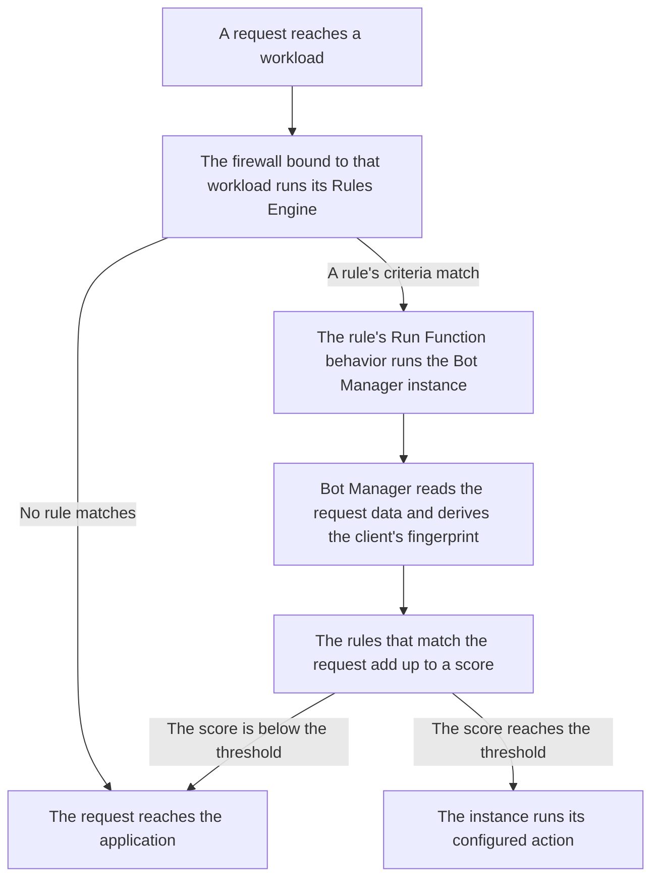

import FrameBox from '@aziontech/webkit/frame-box'
import ItemList from '@aziontech/webkit/item-list'
import DocItem from '@aziontech/webkit/doc-item'

A script and a person reach an application the same way, over HTTP, and the request itself is all there is to tell them apart. Bot management weighs the evidence one request carries: the headers it sends, the address it came from, and the session it presents. Each check that finds something adds points, and the points add up to one score. When the score reaches a figure you set, the request is acted on rather than served. When it stays below that figure, the application receives the request unchanged.

On Azion, that inspection is [Bot Manager](/en/documentation/secure/bot-manager/), and it is not a firewall module. Bot Manager reaches the request path as a function instance: an installed function, instanced on a [Firewall](/en/documentation/platform/firewall/) with a JSON arguments object, and run by a [Rules Engine for Firewall](/en/documentation/platform/firewall/rules-engine/) rule whose behavior is **Run Function**. The instance holds the score at which Bot Manager acts and the action it takes. The rule decides which requests are scored at all.

This page covers the mechanism rather than the values. The arguments an instance carries, each with its type and its default, are on [Arguments](/en/documentation/secure/bot-manager/arguments/#fields). The fields Bot Manager writes about a scored request, and the verdicts it records, are on [Logs](/en/documentation/secure/bot-manager/logs/#classification). The static rules Bot Manager Lite scores against, each with its ID and the points it adds, are on [Bot Manager Lite](/en/documentation/secure/bot-manager/bot-manager-lite/#rules).

The sections below follow the path a request travels, the scoring model, and what the threshold decides. They then cover the fingerprint a score attaches to, the dynamic score only Bot Manager runs, the state a new fingerprint starts in, the session cookie pair, and the two modes.

---

## The path a request travels

An installed Bot Manager function scores nothing on its own. Five objects put a request under inspection, and each one names the next: the installed function, a firewall with its [Functions](/en/documentation/build/functions/) module turned on, a function instance on that firewall carrying the arguments, a Rules Engine rule whose **Run Function** behavior names that instance, and a workload bound to the firewall through its deployment.

The diagram below follows one request, from the workload it arrives at to the application behind it:

1. A request reaches a [workload](/en/documentation/platform/workloads/), and the firewall bound to that workload through its deployment runs its Rules Engine against the request.
2. A rule whose criteria match the request applies its behaviors. A rule that does not match applies nothing.
3. The **Run Function** behavior on the matching rule runs one Bot Manager function instance, with the arguments that instance carries.
4. Bot Manager reads the data the request carries, including its device, browser, and network data, and derives the fingerprint of the client behind it.
5. Bot Manager scores the request against its rules and compares that score with the instance's threshold.
6. A score at or above the threshold runs the configured action. A score below it leaves the request to continue to the application.

Keeping the selection in a rule is what makes the inspection yours to aim: one instance scores the requests its rule matches rather than everything the firewall sees. It costs an object and a step. An instance that no rule names is inert, however its arguments are set, and a rule whose criteria never match scores nothing.

---

## Scoring

Bot Manager does not decide on one signal. Each rule a request matches adds a fixed number of points, and the request's score is the sum of those increments. A score of `0` means no rule matched, and a higher score means more of the checks found something.

A static rule is one validation on the attributes of a single request, such as a header or a piece of metadata. It makes no reference to what the same client did earlier. The checks cover bad bot signatures, scripted bots, malicious browser behavior, malicious intent, and reputation intelligence. Each rule carries an ID, which is what names a match in a report line and what lets you stop one rule from raising a score without taking it out of the detection. For more information, refer to [Arguments](/en/documentation/secure/bot-manager/arguments/#disabled-rules).

Because every rule carries its own increment, a request that trips several light checks reaches the same total as a request that trips one heavy one. That is what a score buys, and it is also what it costs: a client that resembles automation in several small ways is scored like a bot that failed one decisive check.

Two records name what the scoring found, and neither is declared by the request. `bot_category` is derived from the classes of the rules that matched, joined by commas. A request matching rules classed bad bot signatures and malicious intent is recorded as `Bad Bot Signatures, Malicious Intent detected`. The verdict itself separates legitimate traffic from good bots and bad bots, and it carries a fourth value for a request Bot Manager cannot yet place. For the values each of the two records takes, refer to [Logs](/en/documentation/secure/bot-manager/logs/#classification).

`classified` is a verdict about the score rather than a property of the request: it compares the score with the threshold in force when the request arrived. One request scoring `28` from the same five rules was classified `legitimate` under a threshold of `30` and `bad bot` under a threshold of `1`. Raising a threshold therefore relabels traffic as well as stopping the action from firing. A classification count is comparable across two periods only when the threshold was the same in both.

Bot Manager adds two inputs Bot Manager Lite does not have. The first is Reputation Intelligence, which catalogs inbound and outbound traffic against [Network Lists](/en/documentation/secure/network-shield/network-lists/) that Azion maintains and keeps updated. Those lists carry criteria such as Tor exit nodes, reputation, proxies, malware, and fraud. An address on one of them raises the score, so the score carries what is known about the client's network as well as what the request looks like. The second input is the dynamic score, which weighs a fingerprint's history instead of a single request.

A score is meaningful only against the threshold it is compared with. Bot Manager documents a threshold of `18` as the value to start from, and Bot Manager Lite ships `30`. Where to move it from there is a question about your own traffic rather than about the score. For more information, refer to [Bot Manager best practices](/en/documentation/secure/bot-manager/best-practices/).

---

## From score to action

Bot Manager compares a request's score with the `threshold` argument of the function instance, and the comparison includes the threshold itself. A request whose score is equal to or higher than the threshold is acted on, and a request below it continues to the application. One instance holds one threshold and one action, so scoring two slices of traffic against two thresholds takes two instances, each named by its own rule.

Seven actions are available, and they answer the request in three different ways. `allow` and `deny` decide it, and `deny` answers with `403` and Azion's default error page. `random_delay` and `hold_connection` delay the answer. A delay raises the cost of the attack, because the attacker waits on one request instead of making the next, which raises the chance the attack is abandoned. `redirect` and `custom_html` replace the response, so the answer can carry something other than the application's own. For what each of the seven does, and the second argument two of them need, refer to [Arguments](/en/documentation/secure/bot-manager/arguments/#action).

A challenge behind the `redirect` action asks the client to prove it is a person, so a request the score placed wrongly keeps a way through. For more information, refer to [Protect a route with an ALTCHA challenge](/en/documentation/guides/application-development/functions-and-runtime/altcha/).

Setting `threshold` to `0` is not a way to block every request. Every request is at or above `0`, so the configured action fires on all of them, and the outcome is whatever the action is. With `action` set to `deny` every request is refused. With `action` set to `allow` nothing is blocked.

---

## Fingerprints and engine versions

A fingerprint is the identifier Bot Manager derives for the client behind a request. It is built from what the request and the device's session carry, such as the IP address and the `User-Agent` header, and Bot Manager derives one for each device it sees. The fingerprint is what makes a score about a client rather than about a single request: the same fingerprint appearing again brings what Bot Manager already knows about it.

The engine version selects the method that derives it. Version `1` is the default, and the fallback whenever `engine_version` is absent or invalid. Its primary source is the client fingerprint the JavaScript Tag or an SDK reports, and its secondary source is a JA4 server fingerprint. Version `2` keeps the same primary source and takes a JA4H fingerprint as its secondary. JA4H reads higher-level data such as HTTP headers, which reduces fingerprint collision, where two distinct users or devices share one fingerprint and are scored as one identity.

The richer the source, the less the engine infers. The JavaScript Tag collects non-sensitive data from a browser for the single purpose of calculating that browser's fingerprint, and the SDKs report device data from a mobile application. Neither is required, and without one the fingerprint rests on what the request already carries, which is what makes a collision more likely. For more information, refer to [How to Install the JavaScript Tag (JS TAG)](/en/documentation/guides/application-development/integrations/javascript-tag-js-tag/). The value Bot Manager writes into a report line is documented on [Logs](/en/documentation/secure/bot-manager/logs/#fields).

---

## The dynamic score

Bot Manager runs a second scoring method alongside the static rules, and Bot Manager Lite does not: a Bot Manager Lite score comes from static rules alone. The dynamic method reads the behavioral history of a device fingerprint against the overall traffic pattern of the host, so it reports what a single request cannot show. A request that breaks no rule is still anomalous when the fingerprint behind it behaves unlike the rest of that host's traffic.

Two arguments control the method. `dynamic_rules_tolerance` sets how strict it is, and `disable_dynamic_rules` set to `true` turns it off. The baseline it compares a fingerprint against is the host's own traffic, so the method follows that traffic as it changes. That is what lets it detect anomalies the static rules were not written for. For the values each argument takes, refer to [Arguments](/en/documentation/secure/bot-manager/arguments/#fields).

The adaptation costs time. Consolidating the data behind a fingerprint takes up to 15 minutes, and within that window the method has nothing to say about a fingerprint it is seeing for the first time.

Bot Manager Lite runs neither the dynamic score nor Reputation Intelligence. It checks the request address against the Network Lists you name in its arguments, as one of its static rules. The two are editions of one product, and they differ in what they score with rather than in what they do with a score. For more information, refer to [Bot Manager Lite](/en/documentation/secure/bot-manager/bot-manager-lite/#rules).

---

## Under evaluation

A fingerprint Bot Manager is seeing for the first time is not yet classified. Consolidating the score of a fingerprint takes up to 15 minutes. Recording that fingerprint as legitimate or as a bot before then would put imprecise data into the host's score. Bot Manager records `under evaluation` for those requests instead, which is how a visitor arriving for the first time avoids being refused for being new.

Two other conditions return a fingerprint to the state. A fingerprint that has not been seen for 15 minutes or more returns to it. So does every fingerprint on a host whose overall traffic stopped for more than 15 minutes. Neither interferes with later detection. Both say that the data behind a verdict went stale, not that the request is suspect.

The state is an absence of evidence rather than a finding, so a high volume of it says how much traffic Bot Manager has not yet placed. For the verdict values and the field each is recorded in, refer to [Logs](/en/documentation/secure/bot-manager/logs/#classification).

---

## Session cookies

Bot Manager Lite asks a client to carry a session. A request that arrives without a valid one receives a response with no body and two cookies. `az_botm` carries a unique request identifier, and `az_asm` carries an HMAC-signed copy of that same value, signed with the key in the `session_signature_key` argument. On a later request from the same client, the function checks the two against each other, and a mismatch between them is what rule `17` scores. Rules `15`, `16`, and `17` are the three that read the pair.

The value in `az_botm` is the `x-azion-request-id` of the response that set it, so the pair ties a session to one identifiable response. Both cookies arrive with the same attributes: `Domain` set to the workload domain, `Path=/`, `Max-Age=86400`, which is 24 hours, `Secure`, `HttpOnly`, and `SameSite=Lax`. `HttpOnly` keeps the pair out of reach of page scripts, and `Secure` keeps it off plain HTTP.

The signal costs the cooperation of the client. A client that keeps no cookies presents no pair to check, so every request it sends is a first request. A stale pair does not pass quietly either: a request that would otherwise reach the application is answered with a new cookie exchange instead. That behavior is deliberate for a browser and wrong for a monitor or an API consumer, which is what the `api` mode exists for. For what a client that never advances past the exchange looks like, refer to [Troubleshoot Bot Manager](/en/documentation/secure/bot-manager/troubleshooting/).

---

## Modes

A Bot Manager function instance runs in one of two modes, set by the `mode` argument. `web` is for cookie-compatible HTTP clients such as browsers, and it is the default. `api` is for web services and API traffic that does not carry cookies. The comparison is case-sensitive and lowercase, so any value other than the string `api` selects `web`, including `API`.

In `api` mode Bot Manager sets no cookie, and every rule that reads the session cookie pair is ignored. That is what makes the mode usable in front of an API: a client that was never going to keep a cookie is not scored for failing to keep one. It also takes the session out of the evidence, so the remaining checks carry the decision by themselves, and the same traffic scores differently in the two modes. For the values the argument takes, refer to [Arguments](/en/documentation/secure/bot-manager/arguments/#fields).

---

## Related resources

<FrameBox>
<ItemList>
  <DocItem title="Arguments" href="/en/documentation/secure/bot-manager/arguments/#fields">The threshold, the action, the mode, and every other argument that configures the mechanism on this page.</DocItem>
  <DocItem title="Logs" href="/en/documentation/secure/bot-manager/logs/">The score, the fingerprint, and the verdict of one request, field by field, as Bot Manager records them.</DocItem>
  <DocItem title="Bot Manager Lite" href="/en/documentation/secure/bot-manager/bot-manager-lite/#rules">The static rules that edition scores against, each with its ID, the points it adds, and the class it belongs to.</DocItem>
  <DocItem title="Bot Manager quickstart" href="/en/documentation/secure/bot-manager/quickstart/">The shortest path from an installed function to a request being scored against it.</DocItem>
  <DocItem title="Bot Manager best practices" href="/en/documentation/secure/bot-manager/best-practices/">How to move a threshold and an action with the evidence from your own traffic.</DocItem>
  <DocItem title="Rules Engine for Firewall" href="/en/documentation/platform/firewall/rules-engine/">The rule that selects which requests reach the function instance and runs it.</DocItem>
  <DocItem title="Glossary" href="/en/documentation/secure/bot-manager/glossary/">What score, threshold, static rule, fingerprint, and the rest of this page's vocabulary mean.</DocItem>
</ItemList>
</FrameBox>
