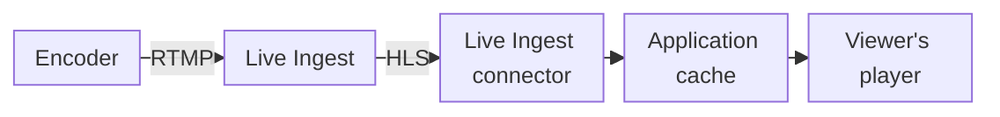

import FrameBox from '@aziontech/webkit/frame-box'
import ItemList from '@aziontech/webkit/item-list'
import DocItem from '@aziontech/webkit/doc-item'

A live broadcast is watched while it is produced. An encoder captures the audio and video and pushes the stream to an ingest point as it is captured. The ingest point packages the stream into files that a player fetches over HTTP, and a server delivers those files to every viewer. Live events, e-sports matches, and educational broadcasts reach their audience this way.

On Azion, [Live Ingest](/en/documentation/platform/connectors/#live-ingest) is the ingest point. Your encoder pushes the stream to it over RTMP, in the region of a connector of type `live_ingest`, and Live Ingest converts the stream to HLS. An [application](/en/documentation/platform/applications/) delivers the stream to viewers through that connector. For where Live Ingest acts on a viewer's request, refer to [How Connectors works](/en/documentation/platform/connectors/how-it-works/#live-ingest).

The sections cover ingestion, the region, delivery, and the billing metric.

---

## Ingestion

Ingestion is the leg from your encoder to Azion. Live Ingest receives the stream over RTMP, so the encoder must support RTMP with username and password authentication. Azion provides the credentials and the ingestion URLs of a primary and a backup endpoint. You configure the encoder with them, so only an encoder that holds the credentials publishes to the endpoint.

Live Ingest converts the RTMP stream to HLS for delivery. The encoder therefore needs no HLS output of its own, and the stream it pushes is the source of every file the viewers fetch.

Azion may require supported or approved encoders, configurations, and endpoints.

---

## Region

A connector of type `live_ingest` carries one attribute: the region where Live Ingest receives your stream. The encoder pushes the stream to that region. A region close to the encoder shortens the path the stream travels before Azion receives it, which lowers its latency.

The region is required. In Azion Console, **Region** is a required field of the _Live Ingest_ connector type. In the API, the field is `attributes.region`. Both take one of five values: `us-east-1`, `us-east-2`, `br-east-1`, `br-east-2`, and `br-east-3`.

The region decides where the stream enters Azion, not where viewers connect. Viewers reach the application through a workload hostname, on Azion's distributed infrastructure. The choice therefore weighs the location of the encoder, not the location of the audience. For example, when you stream an event from one venue to viewers on several continents, choose the region with the shortest path from the venue.

A `POST` to `/v4/workspace/connectors` with this body creates a connector of type `live_ingest` in `br-east-1`:

```json
{
  "name": "my-connector",
  "type": "live_ingest",
  "attributes": { "region": "br-east-1" }
}
```

The API answers `202` with `"state": "pending"`, and the connector reads back with `"attributes": {"region": "br-east-1"}`. For the errors that a missing or unknown region returns, refer to [Connector settings](/en/documentation/platform/connectors/settings/#live-ingest).

---

## Delivery

Viewers do not connect to the encoder, and they do not reach Live Ingest directly. A viewer's player requests the stream over HTTP from a hostname of a workload. The application behind that workload reaches the stream through a rule whose _Set Connector_ behavior names the connector of type `live_ingest`.

This diagram follows the stream from the encoder to a viewer's player:



1. The encoder pushes the stream over RTMP to Live Ingest, in the region of the connector.
2. Live Ingest converts the stream to HLS: a playlist and the segments it lists.
3. The application reaches the stream through the connector that a rule's _Set Connector_ behavior names.
4. The application caches each playlist and segment under the policy of the _Enforce HLS cache_ behavior.
5. The viewer's player fetches the playlist and its segments from the application.

An HLS stream is two kinds of file. The playlist, `.m3u8`, is rewritten as the stream advances, and a player reads it to find the segments the encoder has already written. Each segment, `.ts`, is written once and never changes.

When you select a Live Ingest source in a rule, Azion adds the _Enforce HLS cache_ behavior to that Request Phase rule. The behavior bypasses the cache rules of the application and applies the cache policy Azion defines for live HLS transmissions. That policy gives playlists a short cache time and segments a longer one. For the cache time of each file type, refer to [Rules Engine for Applications](/en/documentation/platform/applications/rules-engine/#enforce-hls-cache).

While a cached copy of a playlist or a segment is valid, the application answers viewers from that copy, and their requests do not reach the connector. One copy of a segment answers every viewer who requests it in that time. A large audience therefore does not send each of its requests to Live Ingest.

The short cache time of the playlist is the tradeoff. It keeps every viewer close to what the encoder has written, and it sends a new request for the playlist to the connector each time the copy expires. To apply the policy to a stream, refer to [Enforce HLS cache for live streaming](/en/documentation/guides/media-and-streaming/streaming/enforce-hls-cache/).

To count the viewers of your streams, the Real-Time Metrics GraphQL API carries the `connectedUsersMetrics` dataset, with aggregated data on the users connected to your live streams. For more information, refer to [Real-Time Metrics](/en/documentation/platform/real-time-metrics/).

---

## Billing metric

Live Ingest is billed on Data Ingestion, the volume of stream data that Azion ingests, measured per GB. For the rate, refer to [Pricing](/en/documentation/fundamentals/pricing/#live-ingest).

---

## Related resources

<FrameBox>
<ItemList>
  <DocItem title="Connector settings" href="/en/documentation/platform/connectors/settings/#live-ingest">The region field of a connector of type live_ingest, with the errors that a missing or unknown region returns.</DocItem>
  <DocItem title="Enforce HLS cache for live streaming" href="/en/documentation/guides/media-and-streaming/streaming/enforce-hls-cache/">Cache settings and rules that give the playlist and the segments of an HLS stream their own cache times.</DocItem>
  <DocItem title="Connectors best practices" href="/en/documentation/platform/connectors/best-practices/#live-ingest">Recommendations for running a connector, including the encoder, the endpoints, and the cache of a live stream.</DocItem>
  <DocItem title="Optimize Video Delivery with Live Streaming" href="/en/documentation/use-cases/deliver-media-and-streaming/live-streaming-delivery-with-hls/">The architecture that combines an ingest component, an application, and its cache to deliver a live stream.</DocItem>
</ItemList>
</FrameBox>
