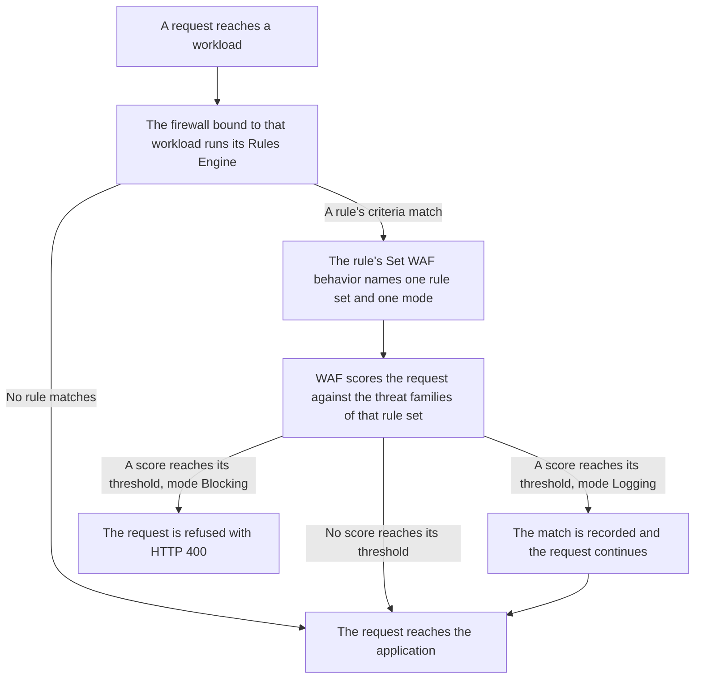

import FrameBox from '@aziontech/webkit/frame-box'
import ItemList from '@aziontech/webkit/item-list'
import DocItem from '@aziontech/webkit/doc-item'

A request can carry an attack in its query string, in a header, or in the body it posts. A web application firewall reads those parts before the application does and weighs what it finds against known attack patterns. When the evidence adds up, it refuses the request. When it does not, the request reaches the application unchanged.

On Azion, that inspection is [Web Application Firewall](/en/documentation/secure/waf/), a module of [Firewall](/en/documentation/platform/firewall/). What to detect lives in a rule set, which carries eight threat families and the sensitivity level chosen for each. When to apply it lives somewhere else: in a [Rules Engine for Firewall](/en/documentation/platform/firewall/rules-engine/) rule, whose `Set WAF` behavior names one rule set and the mode it runs in.

This page covers the mechanisms rather than the values. The fields of a rule set, the eight families, the five sensitivity levels, and the internal rules are on [WAF Rule Sets](/en/documentation/secure/waf/rules-set/). The fields of an exception and its match zones are on [WAF Exceptions](/en/documentation/secure/waf/custom-allowed-rules/), and the bound each mechanism operates within is on [WAF limits](/en/documentation/secure/waf/limits/). The sections below follow the path a request travels, the scoring model, and the two modes. They then cover what WAF parses in a request body, what an exception subtracts, the tuning loop, and where a match is reported.

---

## The path a request travels

Creating a rule set inspects nothing. A rule set is a configuration object that holds the threat families and their sensitivities, and it stays inert until something applies it to traffic. What applies it is a Rules Engine rule on a firewall. The rule selects requests by its own criteria, and its `Set WAF` behavior names the rule set and the mode. A rule carries at most one `Set WAF` behavior, so one rule decides one rule set and one mode for the requests it matches.

One switch sits in front of all of it. WAF is the module a firewall does not enable for itself: a firewall created without it carries the module disabled, and a rule set applied on such a firewall never runs. For where that switch is, refer to [How to configure Firewall main settings](/en/documentation/guides/application-security/firewall-and-waf/firewall-configure-main-settings/).

The diagram below follows one request, from the workload it arrives at to the application behind it:

1. A request reaches a [workload](/en/documentation/platform/workloads/), and the firewall bound to that workload runs its Rules Engine against the request.
2. A rule whose criteria match the request applies its behaviors. A rule that does not match applies nothing.
3. The `Set WAF` behavior on the matching rule names one rule set and one mode, `logging` or `blocking`.
4. WAF scores the request against the threat families configured in that rule set.
5. A score that reaches its family's threshold makes the request a match. `Blocking` refuses that request, and `Logging` records it and serves it.
6. A request that reached no threshold continues to the [application](/en/documentation/platform/applications/) behind the workload.

Keeping the two objects apart is what lets one rule set run in two ways. The mode belongs to the behavior rather than to the rule set. The same rule set therefore runs in `Logging` on one rule and in `Blocking` on another, over paths you choose. It costs an object and a step: a rule set that no rule references inspects nothing, however carefully its families are set.

---

## Scoring and sensitivity

WAF does not decide on a single rule match. It scores. Each internal rule that matches a request adds to the score of the threat family that rule belongs to. A request tripping one weak signal scores low, and a request tripping several scores high. The request is blocked when a score reaches the threshold of its family.

The score is one number per family rather than one number for the request. A request matching both a SQL injection signal and a cross-site scripting signal carries a score under each family. Each score is compared with its own threshold. For example, the query string `1' OR '1'='1` scores under both: Azion recorded `18` for SQL injection and `32` for cross-site scripting on one such request, from two internal rules matching the same argument.

The threshold is not written as a number. You choose a sensitivity level for each threat family, and the level fixes the score at which that family blocks. [WAF Rule Sets](/en/documentation/secure/waf/rules-set/#sensitivity-levels) carries the five levels and the score each one blocks at.

Every family starts at `medium`. The numbers run the opposite way to the word, which is the part of the product most often read backwards. A higher sensitivity is a lower threshold: at `highest` a score of 4 is enough, so less evidence blocks more requests. At `lowest` a request needs a score of 40, so it has to look very much like an attack before WAF refuses it.

The cost runs in both directions. Raising sensitivity catches attacks that carry less evidence. It also blocks legitimate requests that carry a little of the same evidence, such as an apostrophe in a search term. Lowering it keeps that traffic moving and lets through any request whose score stays under the threshold. Sensitivity is set per family, so you can raise the families your application has no legitimate reason to resemble and leave the rest. For what each family detects and where its level is set, refer to [WAF Rule Sets](/en/documentation/secure/waf/rules-set/#sensitivity-levels).

---

## Modes

A rule set is applied in one of two modes, and the mode belongs to the rule rather than to the rule set. In `Logging`, a request that reaches a threshold is scored and recorded, and the application receives it as though nothing had matched. In `Blocking`, the same request is refused before it reaches the application.

A blocked request receives `400` and Azion's default error page, headed **Bad Request**. Nothing in that response names WAF, the rule that matched, or the score: there is no WAF header, and the page carries no message of its own. The error page's own Status Code row reads `0`, which is the status of an origin the request never reached.

That is what each mode buys and what it costs. `Logging` produces the full record of what would have been blocked at no risk to a legitimate request, and it protects nothing while it runs. `Blocking` protects, and every false positive becomes a `400` that a user sees, with nothing in it to tell either of you why.

One internal rule is not fully held by the mode. Requests that fall under rule 13, invalid POST format, are blocked in some cases even when the rule set runs in `Logging`. For the internal rules and what each one matches, refer to [WAF Rule Sets](/en/documentation/secure/waf/rules-set/#internal-rules).

Other Azion surfaces spell this same mode `learning`: [Real-Time Events](/en/documentation/observe/real-time-events/) reports it in the `wafLearning` field, the [Data Stream](/en/documentation/observe/data-stream/) log payload carries `waf_learning`, and `azion.config.js` sets it as `wafMode`.

---

## Request body parsing

WAF reads a request body only in the formats it can take apart. On a `POST`, it parses the body when `Content-Type` is `application/x-www-form-urlencoded`, `multipart/form-data`, `application/json`, `application/vnd.api+json`, or `application/csp-report`. Parsing is what lets a rule address one field of that body, and what lets an exception name one field to leave alone.

A body in another format is not inspected the same way, and it does not pass unexamined either. An unknown or missing `Content-Type` on a `POST` is a finding for the protocol-compliance rules in its own right. A rule set can refuse such a request with the same `400`, with a benign body, before anything reads it.

Parsing also stops at a size. The ceiling is 131,072 bytes, which is 128 KiB, and a body above it is refused rather than allowed through uninspected. For that bound and the response past it, refer to [WAF limits](/en/documentation/secure/waf/limits/#default-limits).

Reading only those content types keeps the inspection precise on the formats an application posts. It costs coverage of the rest: a format WAF does not parse is never searched field by field, and the rule that catches it reads the `Content-Type` rather than the content.

---

## Exceptions

A rule set scores every request the same way, and some applications legitimately send what an internal rule was written to catch. A search box that accepts an apostrophe, a field that carries a pipe character, an API that posts a fragment of markup: each reaches a threshold with nothing wrong. An exception takes one of those out of the scoring without lowering the sensitivity for everyone else.

An exception names the part of a request to exempt and the internal rule to exempt it from. The part is a condition: a match zone such as a query string value or a specific header name. An operator, `contains` or `regex`, decides how the value in that condition is compared. The rule is a rule ID, and its default is `0`, which means every rule. Azion Console calls an exception an allowed rule and creates it on the **Allowed Rules** tab of a rule set.

An exception is a hole in the rule set, and it is the size you make it. Scoped to one rule, one path, and one named field, it stops one false positive. With the default rule ID and a generic match zone, it takes that whole zone out of scoring for every request the rule set sees. That costs what turning the sensitivity down costs, and it costs it everywhere rather than at the one request that needed it. Write the exception for the false positive you have, and remove it when the application stops producing that request. For every field an exception carries and every match zone it can name, refer to [WAF Exceptions](/en/documentation/secure/waf/custom-allowed-rules/#fields).

---

## Tuning

The modes and the exceptions work as one loop, and Tuning is the surface in the middle of it. A rule set goes into `Logging` first, so every request it would block is recorded and none is refused. Tuning lists those records, which internal rule matched which request, over a window of up to the last 3 days. You filter them by workload or domain, path, country, IP address, and [Network Lists](/en/documentation/secure/network-shield/network-lists/).

What you read there decides what happens next. A record that is a real attack is evidence the rule set is doing its job. A record that is a legitimate request is a false positive. Tuning turns selected records into allowed rules in bulk, so the exception comes from the request that produced it rather than from a guess. When the records stop carrying false positives, the rule changes to `Blocking`.

The loop costs time in two places. The window holds 3 days, so evidence nobody reads inside it is gone, and a traffic pattern that appears monthly is never in it. Bulk conversion is quick because it does not ask what to narrow: it creates a separate rule for each possible attack on each URI it was given, which is wider than the exception you would write by hand. For the procedure, refer to [Tune a WAF rule set](/en/documentation/guides/application-security/firewall-and-waf/tune-waf/).

---

## Observability

A WAF match leaves nothing in the response, so every question about one is answered from a reporting surface. Three of them answer different questions. [Real-Time Metrics](/en/documentation/platform/real-time-metrics/#waf) answers how much, in requests processed and requests blocked over time. [Real-Time Events](/en/documentation/observe/real-time-events/) answers which request, one row at a time, with the internal rules that matched and the score each family reached. [Data Stream](/en/documentation/observe/data-stream/) answers where else, by shipping those events to a system outside Azion.

Identifying a block starts from the request rather than from the response. A blocked request is a `400` whose upstream status is `0`, because it never reached an origin. The `x-azion-request-id` header on that response is what finds its row. That correlation is the cost of keeping the decision out of the response: a user who was blocked can report only a Bad Request page, and the rule and the score are looked up afterwards. For the query that returns the score of a blocked request, refer to [Find the WAF score of a blocked request](/en/documentation/guides/application-security/firewall-and-waf/how-to-find-waf-score/).

---

## Related resources

<FrameBox>
<ItemList>
  <DocItem title="WAF Rule Sets" href="/en/documentation/secure/waf/rules-set/">The fields, threat families, sensitivity levels, and internal rules behind the scoring on this page.</DocItem>
  <DocItem title="WAF Exceptions" href="/en/documentation/secure/waf/custom-allowed-rules/">Every field and match zone an exception carries, and the Tuning screen that creates them in bulk.</DocItem>
  <DocItem title="WAF quickstart" href="/en/documentation/secure/waf/quickstart/">The shortest path from a new rule set to a request being scored against it.</DocItem>
  <DocItem title="WAF limits" href="/en/documentation/secure/waf/limits/">The bounds these mechanisms operate within, and the usage each service plan includes.</DocItem>
  <DocItem title="Create and apply a WAF rule set" href="/en/documentation/guides/application-security/firewall-and-waf/create-waf-rule-set/">Creating a rule set and applying it to traffic with a Set WAF behavior.</DocItem>
  <DocItem title="Tune a WAF rule set" href="/en/documentation/guides/application-security/firewall-and-waf/tune-waf/">The procedure behind the tuning loop, from Logging to Blocking.</DocItem>
  <DocItem title="Glossary" href="/en/documentation/secure/waf/glossary/">What score, threshold, threat family, condition, and the rest of this page's vocabulary mean.</DocItem>
</ItemList>
</FrameBox>
