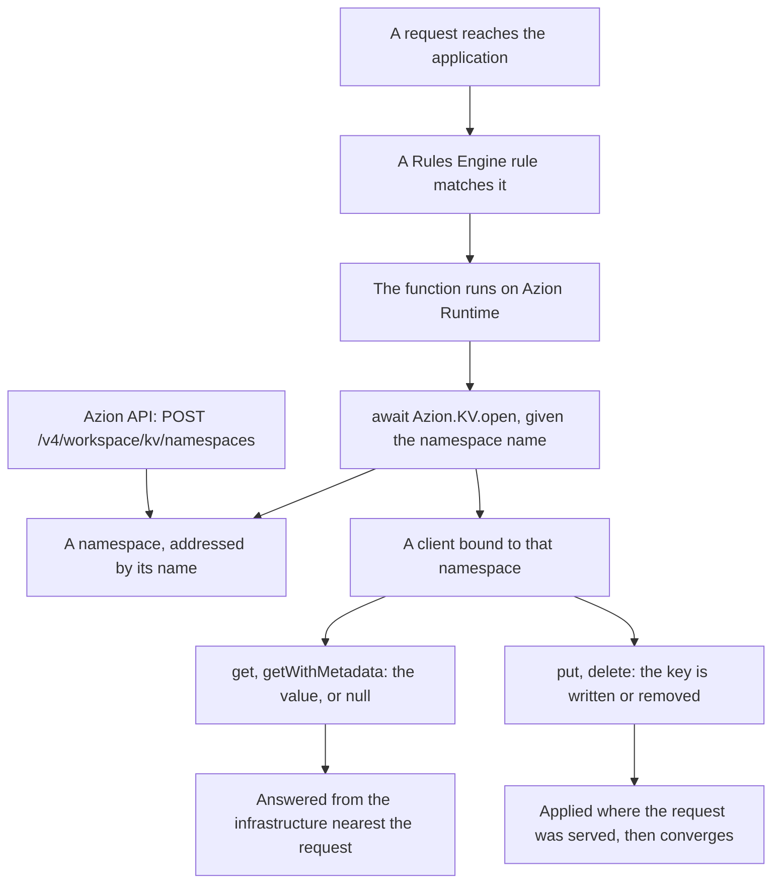

import FrameBox from '@aziontech/webkit/frame-box'
import ItemList from '@aziontech/webkit/item-list'
import DocItem from '@aziontech/webkit/doc-item'

A key-value store holds a value under a name and hands the value back when something asks for that name. There is no schema over the value and no query across the set of them: the name is the only way in, so a lookup is one addressed read rather than a search. That makes a read cheap and predictable, and it makes anything that is not an exact-name lookup impossible.

On Azion, those values live in KV Store, inside a namespace created through the Azion API. A [function](/en/documentation/build/functions/) running on Azion's distributed infrastructure opens that namespace by name and reads and writes keys inside it through `Azion.KV`, a global of [Azion Runtime](/en/documentation/devtools/runtime/). The API manages the namespace; the function reaches everything inside it.

This page covers the mechanisms rather than the values. The fields of a namespace, the three API operations on it, and the errors a rejected request returns are on [Namespaces](/en/documentation/store/kv-store/namespaces/). The methods, value types, return types, and options of the client are on [KV client](/en/documentation/store/kv-store/kv-client/). The bounds each mechanism operates within, and the usage an account includes, are on [KV Store limits](/en/documentation/store/kv-store/limits/), and the recommendations that follow from the mechanisms below are on [Best practices](/en/documentation/store/kv-store/best-practices/). The sections cover the data model, how a value reaches a function, what a read is guaranteed to return, why the two interfaces are split, and what the store is billed on.

---

## The namespace and the key

A namespace is an isolated key space. Its name identifies it, there is no separate identifier alongside the name, and every call addresses it by that name, from the Azion API and from a function alike. Two namespaces on the same account share nothing, so a key named `config` in one holds a value unrelated to the key named `config` in the other.

A key is a string, unique inside its namespace. The value under it is text, an object serialized to JSON, raw bytes, or a stream, and a write can attach metadata beside the value for a later read to return with it. For the shapes a value takes and the options a write accepts, refer to [KV client](/en/documentation/store/kv-store/kv-client/).

The model has two levels and no more: a namespace, and the keys inside it. There is no grouping tier between them, no index over the keys, and no operation that lists what a namespace holds. An application reads a key whose name it already knows or already builds, which is why the naming scheme for keys carries the weight a schema carries elsewhere. For the convention Azion recommends, refer to [Best practices](/en/documentation/store/kv-store/best-practices/).

A value stays under its key until something ends it. A `put` on the same key replaces the value, a `delete` removes the key, and an expiration set on the write removes the key when it comes due. A read after any of those returns `null`, exactly as it does for a key that was never written.

A namespace has no such ending. It cannot be renamed, deactivated, emptied, or deleted, on any interface, so an account keeps every namespace it creates and keeps it under the name it was created with. Making the name the identifier keeps every call addressable with no lookup step, and it costs the caller the ability to correct that name afterwards.

---

## How a value reaches a function

Nothing in KV Store runs on its own. A value moves only when a function asks for it, and the function runs only when a request reaches an application and a rule sends that request to the function. The chain below is what one request travels, from the namespace that has to exist first to the value the function reads.

1. A namespace is created with `POST https://api.azion.com/v4/workspace/kv/namespaces` carrying a name. The call answers `201` with that name, and it is synchronous: no status field to poll, no provisioning wait.
2. A function holding the `Azion.KV` calls is instantiated on an application.
3. A [Rules Engine](/en/documentation/platform/applications/rules-engine/) rule on that application runs the function for the requests it matches.
4. A request arrives, the rule matches it, and the function runs on Azion Runtime.
5. `await Azion.KV.open(name)` resolves the namespace by that name and returns a client bound to it. A name the account does not hold throws here.
6. `get`, `getWithMetadata`, `put`, and `delete` act on keys inside that namespace, and a read is answered from the infrastructure nearest the request that triggered it.

Two of those steps happen once and the rest happen per request. Creating the namespace, instantiating the function, and writing the rule are done in advance; opening the client and calling a method happen every time the function runs.

Resolving the namespace by name when the client opens keeps the function free of a binding and a credential, and it costs the caller a failure that arrives at run time. A name that matches no namespace on the account throws at `Azion.KV.open`, in the request that needed the value, rather than when the function deploys.

---

## Consistency

KV Store is eventually consistent. A write is applied where it arrives and is visible straight away to later requests served from that part of Azion's distributed infrastructure. Other parts converge on the new value afterwards, so for a window after a write, a read answered elsewhere returns the value that the write replaced.

What a read guarantees, therefore, is that it returns a value written to that key, not that it returns the most recent one. The window is bounded rather than open-ended, and it is not zero: a write becomes visible everywhere within 60 seconds, or within the value of `cacheTtl` when a read set one. Design for the convergence rather than for the number, because a workload that breaks on a value a minute old needs a different approach and not a shorter wait.

A read can widen that window itself. `cacheTtl` on `get` and `getWithMetadata` caches the result for the seconds it names, so every read of that key inside that span is answered from the cached result rather than from the store, including reads made after a newer write has already landed. The number set on `cacheTtl` is the staleness the caller accepts in exchange for the read.

A delete converges the same way. The key stops resolving where the delete was applied, and a read answered elsewhere returns the old value until the delete reaches it.

Concurrent writes to one key do not merge, and nothing orders them for you: the last write wins and the other value is gone. The client has no atomic increment and no compare-and-set, and no operation spans more than one key as a unit, so nothing groups several writes into one change that either lands whole or not at all. A value that several requests update at once, such as a counter or a running total, loses updates here rather than accumulating them.

One consequence is worth building into the code. A caller does not read a key back to confirm the write that just set it, because the write's own promise resolving is the confirmation and the read that follows it can be answered from a copy the write has not reached. A caller that treats that read as a failed write retries a write that already succeeded. Converging in the background keeps a read answerable near the request that made it, and it costs the caller the guarantee that what they read is what was last written.

---

## The two interfaces, and why they are split

KV Store has exactly two interfaces, and they do not overlap. The Azion API v4 manages namespaces at `https://api.azion.com/v4/workspace/kv/namespaces`, where it creates one, lists them, and retrieves one by name. The `Azion.KV` client manages keys from inside a function, where it reads them, writes them, and deletes them.

Neither reaches into the other half. The client creates no namespace: `Azion.KV.open` opens one that already exists, and a name the account does not hold throws `NotFound` rather than creating it. The API reads no key: the collection that would hold the keys of a namespace does not exist, so no API call returns a value.

The two sides see one namespace, not two copies of it. The namespace an API call created is the namespace a function opens under the same name, and a value written from a function is in that same namespace the API lists.

That split explains most of what surprises a reader here. A function cannot provision its own storage, so a namespace exists before the code that opens it deploys. A namespace cannot be removed from a function, because it cannot be removed at all. And there is no Azion Console screen, no Azion CLI command, and no Terraform resource for either half: the two interfaces above are the whole surface of the product.

Splitting them keeps a credential out of the function, since `Azion.KV` is a runtime global reached with no token and no import line, and it costs the caller a provisioning step the code cannot take for itself.

---

## What it costs

KV Store is billed on three meters. Storage counts the data the account holds in KV Store. Keys Read counts every key a read returns. Keys Written counts every key a write affects, which covers a `delete` and a metadata update as well as a `put`.

The meters count keys, not calls. A read that names an array of keys is one call and as many keys as come back from it, and a function that writes one key per request spends one write per request whatever the size of the value it stored.

Nothing in the response reports those counts. A read returns the value and a write resolves with nothing, so what a call spent is read from the account's consumption rather than from the call itself. Measuring a function against the meters therefore means watching the account, not parsing a return value.

Metering keys rather than calls keeps the price proportional to the data an application touches, and it costs the caller the saving they might expect from batching: reading ten keys in one call counts the same ten reads that ten separate calls would. For the storage and the keys an account includes on each meter, refer to [KV Store limits](/en/documentation/store/kv-store/limits/).

---

## Related resources

<FrameBox>
<ItemList>
  <DocItem title="Namespaces" href="/en/documentation/store/kv-store/namespaces/">Every field, operation, and error code behind the namespace described on this page.</DocItem>
  <DocItem title="KV client" href="/en/documentation/store/kv-store/kv-client/">The methods, value types, and options a function calls against the keys in a namespace.</DocItem>
  <DocItem title="KV Store quickstart" href="/en/documentation/store/kv-store/quickstart/">Creating a first namespace and reading a key from a function.</DocItem>
  <DocItem title="KV Store limits" href="/en/documentation/store/kv-store/limits/">The bounds these mechanisms operate within, and the usage each account includes.</DocItem>
  <DocItem title="Best practices" href="/en/documentation/store/kv-store/best-practices/">The recommendations that follow from eventual consistency and a permanent namespace.</DocItem>
  <DocItem title="Store and read data from a function" href="/en/documentation/guides/application-development/data/manage-with-functions/">The procedure that puts these mechanisms inside a running function.</DocItem>
</ItemList>
</FrameBox>
