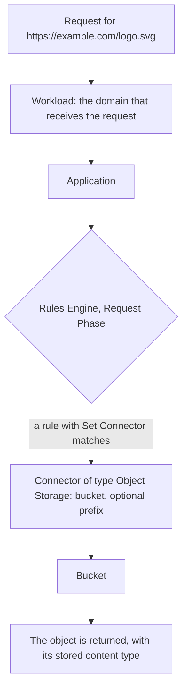

import FrameBox from '@aziontech/webkit/frame-box'
import ItemList from '@aziontech/webkit/item-list'
import DocItem from '@aziontech/webkit/doc-item'

Object storage keeps a file whole, under a name you choose, in a flat container. There are no directories and no partial writes: a file is written once, read as a unit, and replaced whole. The name is the only address it has, so everything that finds the file later finds it by that name.

On Azion, the container is a bucket and the file is an object. An object carries its key, its content, and the content type it is served with. A bucket holds objects directly, and a bucket does not nest inside another. The same objects are reachable through the Azion API, the Azion CLI, Azion Runtime, the `azion` library, and the S3 protocol, and through an application when a [Connector](/en/documentation/platform/connectors/) points at the bucket.

This page covers the mechanisms rather than the values. The fields and their bounds are on [Buckets and objects](/en/documentation/store/object-storage/buckets-and-objects/), and the S3 surface is on [S3 compatibility](/en/documentation/store/object-storage/s3-compatibility/). The sections below cover the object and its key, the request path, the access levels, object delivery, and deletion.

---

## The object and its key

An upload names the bucket and the key, and sends the content as the body. There is no create-then-write sequence: the object exists when the request succeeds, and it does not exist before.

The key is the whole address. It may contain the forward slash, and every interface reads a shared leading segment as a prefix, so `src/assets/logo.svg` appears grouped under `src` and `src/assets`. Those groupings are read from the keys that exist; nothing creates them, and nothing is left behind when the last key under a prefix is removed. The cost of that flatness is that a key cannot be renamed and an object cannot be moved. Changing where an object appears means writing it under the new key and deleting the old one, which is what a copy followed by a delete does.

Writing to a key that is already in use replaces the object whole. There is no version history and no partial update, so the previous content cannot be recovered. An object that must stay retrievable after a change is written under a new key, which is why a name that carries a version is the usual approach for content an application serves.

The content type is fixed at upload from the `Content-Type` header, and Azion detects it when the request sends none. It is stored with the object and returned on every read, so an object uploaded with the wrong content type keeps serving the wrong one until it is written again.

---

## The request path

Two paths lead to the same object, and they are authenticated differently.

The **management path** is the Azion API, the Azion CLI, the `azion` library, and the S3 protocol. It authenticates with a personal token, or with an S3 credential for the S3 protocol, and it reaches every bucket the account owns. It is how objects are created, listed, replaced, and removed.

The **delivery path** is an application, and it is how an end user reaches an object. A request arrives at a workload, which owns the domain. The workload hands it to an application, whose Rules Engine decides what answers it. A rule with the **Set Connector** behavior sends the request to a connector of type Object Storage, which names a bucket and, optionally, a prefix inside it:

The chain is what makes a bucket reachable, and none of it happens by default. Creating a bucket exposes nothing: until a connector names the bucket and a rule sends requests to it, the objects are reachable only through the management path. The prefix on the connector decides where the application's path starts, so a connector with the prefix `src/assets` serves the object `src/assets/logo.svg` at `/logo.svg`.

A function is a third way in, on either path. Code running in [Azion Runtime](/en/documentation/devtools/runtime/api-reference/storage/) reads and writes objects with `azion:storage` during a request, which is how an application serves an object it first has to decide about, such as one behind an authentication check.

---

## Access levels

A bucket carries `workloads_access`, and it decides what the Azion platform may do with the objects when an application serves them. It is a property of the bucket, not of a request.

| Value | The platform may |
| --- | --- |
| `read_only` | Read objects |
| `read_write` | Read and write objects |
| `restricted` | Neither, and the bucket cannot back an application |

The level governs the delivery path alone. It does not restrict the management path: a token or an S3 credential with write permission writes to a bucket set to `read_only`, because the account already proved who it is. That split is the point of the field. It lets a bucket be written by a deployment pipeline and only read by the public, which is what static content wants.

The cost of `read_write` is that the application inherits the permission. Any request that reaches a `read_write` bucket through an application can modify it, so a bucket set that way needs a function in front of it that decides which requests may write. `restricted` removes the delivery path entirely, for data that no application should serve.

---

## Object delivery

Objects reach end users through an application, not through the S3 endpoint.

The S3 endpoint is a management interface. It answers signed requests for the account that owns the credential, from wherever they come, and it is dimensioned for managing objects rather than for serving traffic. Sending end users to it, directly or through a pre-signed URL, bypasses the application entirely: the requests do not pass through Azion's distributed infrastructure, they are not cached, and they arrive at one management interface at whatever rate the audience produces.

Azion states the consequence contractually: reaching objects without going through an application is subject to rate limits. The [Terms of Service](/en/documentation/agreements/tos/) carry the clause, and no page states a value for it.

Serving the same objects through an application puts them behind a workload and a connector, where [Cache](/en/documentation/build/cache/) can keep a copy and the rules that already govern the application apply. The tradeoff is the setup: a connector and a rule have to exist before anything is served, which the S3 endpoint does not require. That setup is what the delivery path buys.

---

## Deletion and the grace period

Deleting an object is asynchronous and staged. The request is accepted, the key stops being listed, and a read of it returns an error at once. The object itself is retained for a 24-hour grace period before it is removed permanently.

The grace period is why an emptied bucket cannot be deleted immediately. A bucket is deleted only when it holds no objects and none was removed from it in the last 24 hours, and both cases return the same error. A bucket that never held an object is deleted at once, which is the only case where the wait does not apply.

Deleting an object does not change anything that points at it. A connector that names the bucket keeps naming it, and a request for the deleted key is answered by the application as a missing object rather than as a missing bucket.

---

## Related resources

<FrameBox>
<ItemList>
  <DocItem title="Buckets and objects" href="/en/documentation/store/object-storage/buckets-and-objects/">The fields behind every mechanism on this page, with the operations and the errors.</DocItem>
  <DocItem title="S3 compatibility" href="/en/documentation/store/object-storage/s3-compatibility/">The credential and the operations the management path exposes through the S3 protocol.</DocItem>
  <DocItem title="Best practices" href="/en/documentation/store/object-storage/best-practices/">What to do about replacement, access levels, and delivery, and what each choice costs.</DocItem>
  <DocItem title="Use a bucket as an application origin" href="/en/documentation/guides/application-development/data/use-bucket-as-origin/">The procedure that builds the delivery path, from the connector to the rule.</DocItem>
  <DocItem title="Connectors" href="/en/documentation/platform/connectors/">The resource that points an application at a bucket and its prefix.</DocItem>
  <DocItem title="Object Storage limits" href="/en/documentation/store/object-storage/limits/">The bounds these mechanisms operate within, and the usage each plan includes.</DocItem>
</ItemList>
</FrameBox>
