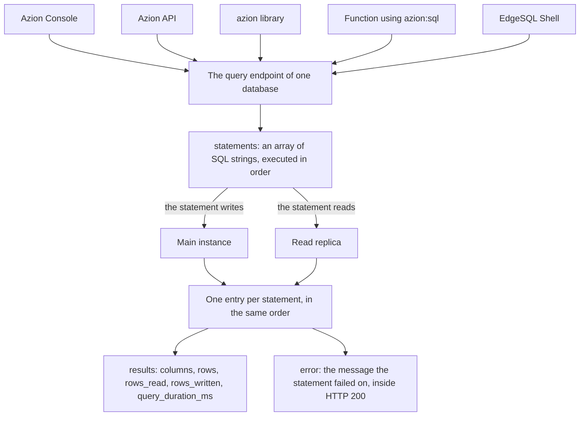

import FrameBox from '@aziontech/webkit/frame-box'
import ItemList from '@aziontech/webkit/item-list'
import DocItem from '@aziontech/webkit/doc-item'

A relational database holds data in tables of rows and columns. Every read of that data, and every change to it, is written as a SQL statement. The statement does not travel with the data: it is sent to where the data lives, runs there, and returns rows. One copy of the data takes the changes, and further copies of the same data answer the reads.

On Azion, that data lives in a database you create in SQL Database. The platform runs one main instance, which takes every write, and read replicas, which answer reads. Five interfaces reach the same database: Azion Console, the Azion API, the `azion` library, the `azion:sql` module inside a [function](/en/documentation/build/functions/), and the EdgeSQL Shell. Whichever one you use, reaching the data means sending SQL statements to the database.

This page covers the mechanisms rather than the values. The fields, the operations, and the error codes are on [Databases and queries](/en/documentation/store/sql-database/databases-and-queries/). The bounds and the usage each plan includes are on [SQL Database limits](/en/documentation/store/sql-database/limits/), and the vector types and functions are on [SQL Database Vector Search](/en/documentation/store/sql-database/vector-search/). The sections below cover the database and its instances, the lifecycle of a database, how a statement reaches the data, what a statement costs, and the SQL dialect.

---

## The database and its instances

A database is the artifact you create in SQL Database. Tables live inside it, and every statement is addressed to one database, by the identifier the platform assigns it.

Behind that single database, the platform keeps more than one copy of the data. The main instance takes every write, and it is the only instance a write is applied to. Read replicas hold copies of the same data and answer reads, which is what makes them read-only: nothing writes to a replica directly.

Reads and writes therefore scale apart. Readers are answered by the replicas, so read traffic does not compete for the instance that accepts the writes. A read is answered from a copy of the data rather than from the one place every write has to reach.

The cost is that a replica is a copy and not the database itself, and that every write still has a single destination. Replicas add capacity for reads and none for writes, so write throughput belongs to the main instance alone, however many replicas answer reads.

---

## The lifecycle of a database

Creating a database in SQL Database is asynchronous. `POST /databases` answers `202` at once, with `state` set to `pending` in the envelope and `status` set to `creating` on the database itself. The two fields describe two different things: `state` describes the request, and `status` describes the resource.

Provisioning takes about 15 seconds. The database becomes usable when its `status` reads `created`, and `GET /databases/{database_id}` is what reports that: a retrieve answers `200` and carries no `state` key at all. A client that creates a database and queries it on the next line has to poll `status` first. Until the status changes, a statement has nowhere to run.

Deletion is asynchronous in the same way, and it does not wait for creation to finish. `DELETE` answers `202` with `state` set to `pending`, and the platform accepts it even while the status is still `creating`. Within seconds the database answers `404`, so the identifier stops resolving almost immediately.

Nothing sits between those two ends. A name is fixed at creation, and `active` is accepted only there: `PATCH` and `PUT` answer `405`. For the fields, the envelopes, and the error codes, refer to [Databases and queries](/en/documentation/store/sql-database/databases-and-queries/).

Answering `202` and provisioning in the background keeps the create call short, and it costs the caller its confirmation. The create response proves that the request was accepted, never that the database is ready, and `status` is the only field that says so.

---

## How a statement reaches the data

The statements in one call to SQL Database are executed in the order the array lists them, and each one returns its own entry. A statement that fails therefore does not fail the request: the call still answers HTTP `200`, and that statement's entry carries `error` in place of `results`.

The chain below is what a single call travels, from the interface that sends it to the entry it comes back as:

1. A caller sends `POST /databases/{database_id}/query` with a `statements` array holding one or more SQL strings.
2. The platform executes the statements in the order the array lists them.
3. A statement that writes is applied to the main instance, and a statement that reads is answered from a read replica.
4. Each statement produces one entry in `data`, in the same order the statements were sent.
5. An entry carries `results`, with `columns`, `rows`, `rows_read`, `rows_written`, and `query_duration_ms`, or it carries `error` with the message the statement failed on.
6. The response carries `state` set to `executed` and HTTP `200`, whether every statement succeeded or one of them failed.

The same endpoint runs every kind of statement. `CREATE TABLE`, `INSERT`, and `SELECT` are all strings in that one array, so schema changes, writes, and reads share a single path and a single call can mix them.

One endpoint for every kind of statement keeps the surface small, and it costs the caller the failure signal it usually relies on. The HTTP status describes the request rather than the SQL, so a client reads `data[].error` on every entry before it reads `data[].results`.

---

## What a statement costs

Every statement that succeeds reports what it read and what it wrote. `rows_read` and `rows_written` come back inside the same entry as the `columns` and the `rows`, per statement rather than per call, and `query_duration_ms` reports how long that statement ran.

Those two counters are the metrics SQL Database is billed on, which makes the cost of a query readable from the response that returns it. Measuring a statement against a small table before it runs against a large one turns the price into something you check rather than something you discover.

One interface does not pass them on. The `azion` library drops `rows_read`, `rows_written`, and `query_duration_ms` from its query result, so an account that meters its own consumption takes those three from the API instead.

`rows_read` counts the rows the statement read, not the rows it returned. A `SELECT` that scans a large table to return a single row spends the read allowance for every row it touched. An unselective query therefore costs the same whether much comes back or nothing does. For the rows each plan includes, refer to [SQL Database limits](/en/documentation/store/sql-database/limits/).

---

## The SQL dialect

SQL Database uses SQLite's dialect, and its databases are fully ACID-compliant. The statements, the types, and the built-in functions are the ones SQLite defines. A schema and the queries over it are written as they would be for SQLite, so SQL you already know transfers without a translation step. For the syntax each statement accepts, refer to the [SQLite language reference](https://www.sqlite.org/lang.html).

Vector search extends that dialect rather than replacing it. A vector is stored in a column declared with a vector blob type, and the distance functions are called from an ordinary `SELECT`. The index over a vector column is created with `CREATE INDEX`, so a semantic search and a relational query run against the same tables, in the same call. For the types, the functions, and the index, refer to [Vector search](/en/documentation/store/sql-database/vector-search/).

Taking SQLite's dialect whole is what makes the SQL familiar, and it is also the boundary. SQL written against a server-based engine can use syntax that SQLite does not define, so a schema arriving from one is ported rather than pasted.

---

## Related resources

<FrameBox>
<ItemList>
  <DocItem title="Databases and queries" href="/en/documentation/store/sql-database/databases-and-queries/">Every field, operation, envelope, and error code behind the mechanisms on this page.</DocItem>
  <DocItem title="Vector search" href="/en/documentation/store/sql-database/vector-search/">The vector column types, the distance functions, and the index they need.</DocItem>
  <DocItem title="SQL Database limits" href="/en/documentation/store/sql-database/limits/">The bounds these mechanisms operate within, and the usage each plan includes.</DocItem>
  <DocItem title="Best practices" href="/en/documentation/store/sql-database/best-practices/">The recommendations that follow from these mechanisms, and what each one costs.</DocItem>
  <DocItem title="SQL Database quickstart using Azion Console" href="/en/documentation/store/sql-database/quickstart/">Creating a first database and running statements against it.</DocItem>
  <DocItem title="SQL Database API" href="/en/documentation/devtools/runtime/api-reference/sql-database/">Reaching the same database from inside a function, with `azion:sql`.</DocItem>
</ItemList>
</FrameBox>
