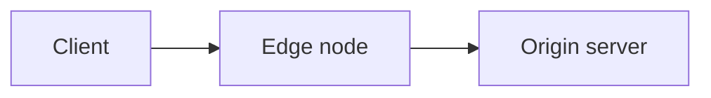

Documentation pages are MDX, and this page is the whole component vocabulary: every entry is a design system component from `@aziontech/webkit`, or a thin wrapper over one. A component absent from this page is not available: an import of it fails the build.

## Asides

No import needed. Asides are written as remark directives and render the design system's `DocCallout`; they are the most common construct after links.

```mdx
:::note
Bucket names must be unique across all existing buckets.
:::

:::tip
**Increase limits** <br></br>
Contact [technical support](/en/documentation/services/support/) to request a higher limit for your plan.
:::

:::caution[important]
You are viewing the latest version. For accounts that are not migrated, refer to the [legacy reference](/en/documentation/products/build/edge-application/v3/).
:::
```

Valid types: `note`, `tip`, `caution`, `danger`. `caution` renders as the callout's warning kind.

**`:::warning` is not valid** and does not render as intended. Use `:::caution`.

- A callout holds inline prose only: sentences, links, inline code. A list, a fence, or a table inside one breaks out of the box; put it before or after the aside.
- The callout has no title row. The bracket text is kept as a lead-in to the copy (`Did you know? — ...`), so use it only when the first words need it. In Portuguese pages, localize it: `:::note[nota]`, `:::tip[dica]`, `:::caution[Atenção]`.

## DocButton

The house call to action. A wrapper around the design system's Button that keeps the button styling inside the article body.

```mdx
import DocButton from '~/components/webkit/DocButton.vue'

<DocButton href="/en/documentation/products/build/applications/real-time-purge/" label="Real-Time Purge reference" kind="secondary" size="medium" />
```

- `href` and `label` are required. No client directive: the button is a static link.
- `kind`: omit it for the primary action, `secondary` for a reference link. `outlined`, `text`, and `danger` also exist.
- Always `size="medium"`.
- `icon` takes an icon class, always placed before the label. `target="_blank"` opens an external destination in a new tab.

## Code

Renders the design system's `CodeBlock`, with a language tab and a copy button. Fenced blocks render the same component.

```mdx
import Code from '~/components/Code/Code.astro'

<Code lang="bash" code={`azion deploy --local`} />
```

Accepts only `code` and `lang`.

**The value is a JavaScript template literal.** Backticks and `${` inside it must be escaped, and a line continuation needs a doubled backslash. When a snippet contains either, that is a reason to use `<Code>` rather than a fence, because you control the escaping.

Fenced blocks are also house style. Use a fence for output the reader reads, and `<Code>` for input the reader copies.

Language tags in use: `bash`, `sh`, `json`, `javascript`, `js`, `typescript`, `ts`, `hcl`, `graphql`, `shell`, `text`, `plaintext`. Terraform is `hcl`, not `terraform`.

---

## Tabs and Fragment

The multi-interface pattern: one task, one panel per interface. Renders the design system's `TabView`, with every panel kept in the HTML.

```mdx
import Tabs from '~/components/tabs/Tabs'
import Code from '~/components/Code/Code.astro'

<Tabs client:visible>
    <Fragment slot="tab.console">Console</Fragment>
    <Fragment slot="tab.api">API</Fragment>

<Fragment slot="panel.console">

1. Access [Azion Console](https://console.azion.com/) > **Object Storage**.
2. Select **+ Bucket**.

</Fragment>

<Fragment slot="panel.api">

<Code lang="bash" code={`curl ...`} />

</Fragment>

</Tabs>
```

- `client:visible` is mandatory. Without it the tabs render and do not switch.
- Every `tab.x` needs a matching `panel.x`.
- **Blank lines around markdown inside a Fragment are mandatory**, or the markdown renders as one literal paragraph.
- The first tab is the default, and panels are paired to tabs by key; put Console first unless there is a reason not to.
- Canonical keys: `tab.console`, `tab.api`, `tab.cli`, plus `tab.apiv3` / `tab.apiv4` for versioned APIs.
- Optional `sharedStore="package-managers"` syncs selection across tab groups on a page.

## Tag

Status badges.

```mdx
import Tag from '~/components/webkit/Tag.vue'

<Tag severity="info">Preview</Tag>
```

- No client directive: the badge is static HTML.
- `severity` is `success`, `info`, `warning`, or `danger`. `info` is the neutral label chip, used for "Preview" and product badges; the other three are status colors.
- The label goes in the children. `value="Preview"` is also accepted.

## Video

No import needed. Emits the iframe plus schema.org `VideoObject` metadata.

```mdx
<Video
  src="https://www.youtube.com/embed/BV4jRPpADw8"
  title="Local development with Azion CLI"
  description="How the CLI supports local debugging and faster workflows."
  uploadDate="2023-10-17"
/>
```

`src` must be a YouTube **embed** URL. `src` and `title` are required. For a screenshot or a clip file, use Figure.

## Mermaid diagrams

A diagram is a `mermaid` code fence, not an image. The text reaches an agent fetching the markdown twin; an image reference does not.

````md

````

Label every node and edge in words, and never rely on color alone to carry a distinction. A diagram never stands alone: architecture and use-case pages keep the numbered dataflow beneath it.

## Steps

A numbered walkthrough: each step is a title with an optional body, and the numbers come from the order on the page.

```mdx
import DocSteps from '@aziontech/webkit/doc-steps'
import DocStep from '@aziontech/webkit/doc-step'

<DocSteps>
  <DocStep title="Create the bucket">

  In [Azion Console](https://console.azion.com/), go to **Object Storage** and select **+ Bucket**.

  </DocStep>
  <DocStep title="Name it">

  Bucket names must be unique across all existing buckets.

  </DocStep>
</DocSteps>
```

- No client directive.
- Never write the number: reordering the steps renumbers them.
- A `DocStep` must sit inside a `DocSteps`; alone it throws. Blank lines around the markdown inside a step are mandatory.

## Figure

A framed screenshot, clip, or diagram, with an optional lead-in above and a caption below.

```mdx
import DocFrame from '@aziontech/webkit/doc-frame'

<DocFrame
  src="/assets/docs/images/uploads/real-time-metrics-overview.png"
  alt="Overview of a Real-Time Metrics query flow"
  caption="The query flow, from the console to the data source."
/>
```

- `src` takes an image or a clip (`.mp4`, `.webm`). Give an image an `alt`. Without `src`, the frame wraps its children, such as a `mermaid` fence.
- `caption` and `hint` are plain strings; the slots of the same name (`<Fragment slot="caption">`) carry a caption with a link or inline code.
- `autoplay` plays a clip muted, inline, and looping, with no controls.

## Cards

A grid of navigation cards, for a page that fans out into sections.

```mdx
import DocCardGroup from '@aziontech/webkit/doc-card-group'
import DocCard from '@aziontech/webkit/doc-card'

<DocCardGroup cols={2}>
  <DocCard title="Build" href="/en/documentation/products/build/" label="Applications, functions, and connectors." />
  <DocCard title="Secure" href="/en/documentation/products/secure/">Firewall, WAF, and DDoS protection.</DocCard>
</DocCardGroup>
```

- No client directive.
- `cols` is 2, 3, or 4; the grid collapses to one column on a phone.
- `href` makes the whole card the link. `label` is the copy; children replace it when the copy needs a link or inline code.
- Optional: `icon` takes a PrimeIcons class (`pi pi-bolt`), `overline` a small line above the title, `link` a call-to-action text on a closing row.

## Related items

A framed list of rows, each a name and one sentence, for a reader choosing what to read next.

```mdx
import ItemList from '@aziontech/webkit/item-list'
import DocItem from '@aziontech/webkit/doc-item'

<ItemList>
  <DocItem title="Cache Settings" href="/en/documentation/products/build/applications/cache-settings/">How an edge node decides what to keep and for how long.</DocItem>
  <DocItem title="Rules Engine" href="/en/documentation/products/build/applications/rules-engine/">Conditions and behaviors on the request and response phases.</DocItem>
</ItemList>
```

- No client directive. `ItemList` is the frame that rules between the rows.
- `href` makes the row the link; an external URL gets the outward arrow. Optional `icon` takes a PrimeIcons class.

## Changelog entry

One dated entry: label and version on the left, the notes on the right, with an anchor built from the label.

```mdx
import DocUpdate from '@aziontech/webkit/doc-update'

<DocUpdate label="July 10, 2026" description="Bot Manager 1.3.0" tags={['Marketplace']}>

**Bot Manager** now ships nine new static rules and two new arguments.

</DocUpdate>
```

- No client directive. Blank lines around the markdown inside are mandatory.
- `label` is the anchor, slugified. Two entries with the same label need distinct `anchor` values.
- `description` is the line under the label; `tags` is an array of short labels.

## Prompt

A block of literal text the reader hands to an agent, set in the mono face with a copy control. It is not a code block: no language, no highlighting.

```mdx
import DocPrompt from '@aziontech/webkit/doc-prompt'

<DocPrompt client:visible title="Try it">Create an application with caching enabled and deploy it.</DocPrompt>
```

- `client:visible` is mandatory: the copy control and the expand control need it.
- `kind="line"` makes one scrolling line instead of a paragraph capped at four lines. `title` and `icon` are optional.

## Inline gloss

A term in running prose that shows its definition on hover or focus, with an optional link.

```mdx
import DocTooltip from '@aziontech/webkit/doc-tooltip'

The <DocTooltip client:visible headline="Cache key" tip="The identifier an edge node builds from a request." cta="Read more" href="/en/documentation/products/build/applications/cache-settings/">cache key</DocTooltip> decides what matches.
```

- `client:visible` is mandatory; without it the term renders and never opens.
- `tip` is the definition, `headline` the bold lead-in, `cta` plus `href` the link.

## Supplied by the layout

`DocPageHeader` (from `title` and `description` in the frontmatter), `DocOnThisPage`, `DocPagination`, and the `DocProse` typography contract render around every page. Never author them.

---

## Shared snippets

Reusable blocks under `~/includes/snippets/`, each with an `en/` and a `pt/` variant. Note the Portuguese folder is `pt/`, not `pt-br/`.

```mdx
import Apiv4Rollout from '~/includes/snippets/apiv4Rollout/en/snippet.mdx'

<Apiv4Rollout />
```

Available: `apiv4Rollout`, `JourneyAPI`, `InterfaceNote`, `LetsEncryptExpiration`, `RulesEngineExecution`.

## SectionBasicContent

The header block of a template showcase page. Import it from `~/components/SectionBasicContent/SectionBasicContent.vue`. Takes `description` and a `buttons` array, with the rest of the page in a `<Fragment slot="content">`. Each button takes `label`, `link`, and optionally `severity: "secondary"`, `outlined: true`, `icon`, and `target`. A button without `link` renders nothing. Read an existing showcase page before using it.

## GuidesTable

Renders the Guides and tutorials hub as a table of name, last updated, and difficulty. Used on the hub page of a product section, and nowhere else.

```mdx
import GuidesTable from '~/components/GuidesTable.astro'

<GuidesTable
  lang="en"
  prefixes={['/documentation/build/cache/guides/', '/documentation/build/cache/tutorials/']}
  exclude={['/documentation/build/cache/guides/']}
/>
```

- `prefixes` — permalink prefixes whose pages fill the table. `exclude` drops the hub page itself.
- The date comes from the file's last git commit, read at build time. Never write it by hand. An uncommitted or shallow-cloned file shows a dash.
- Difficulty comes from the optional `difficulty` frontmatter field: `Beginner`, `Intermediate`, or `Advanced`. The value stays English on both language pages; the component localizes the label.
- Rows sort newest first, then by title.
- The same prefixes go in the menu row's `covers` field, so the pages pass the sidebar ownership check.

---

## GlossaryFilter

Client-side filter over a glossary table. Used on a product's Glossary page, and nowhere else.

```mdx
import GlossaryFilter from '~/components/GlossaryFilter.astro'

<GlossaryFilter lang="en">

| Term | Definition |
| --- | --- |
| cache key | The identifier an edge node builds from a request to decide whether two requests match the same cached object. |

</GlossaryFilter>
```

- The child is one GFM pipe table, `| Term | Definition |`. Blank lines around it are mandatory.
- `lang` localizes the filter placeholder and the empty-state message: `en` or `pt-br`.
- Each body row gets an anchor id from its term, ASCII-folded (`ação múltipla` → `#acao-multipla`), so a definition is deep-linkable. Ids are set at render time, so anchors work without JavaScript.
- Filtering is a progressive enhancement: without JavaScript the full table renders. Matching is case- and accent-insensitive, against the whole row.

## Tables and line breaks

Tables are plain GFM pipe tables. Horizontal scrolling is added automatically; do not wrap them yourself.

`<br />` or `<br></br>`. **Bare `<br>` breaks the build** — MDX requires every tag closed.

## MDX rules that break builds

- Bare `<` and `{` in prose are parsed as JSX. Escape them or use backticks.
- Every tag must be closed or self-closing.
- No H1 in the body; `title` renders it.
- `---` between major sections is house style, roughly three per page. Never immediately after the frontmatter block.
- Imports go directly after the frontmatter block, before any prose.

## Related resources

- [Code](/en/documentation/style-guide/formatting/code/) - when a fence carries output and a `<Code>` block carries input.
- [Text formatting](/en/documentation/style-guide/formatting/text/) - links, bold, italics, and monospace around the components.
- [Choose a content type](/en/documentation/style-guide/content/choose-a-content-type/) - the page kinds these components serve.
